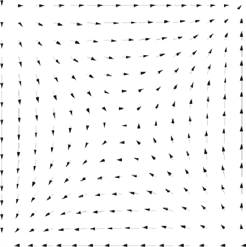
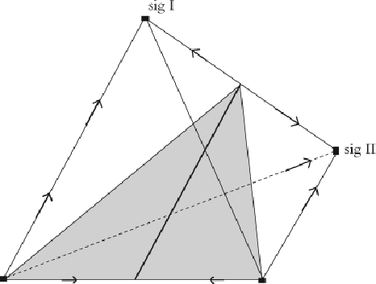

#### Signals: Evolution, Learning, and Information

Brian Skyrms https://doi.org/10.1093/acprof:oso/9780199580828.001.0001 Published: 08 April 2010 Online ISBN: 9780191722769 Print ISBN: 9780199580828

Search in this book

CHAPTER

## 1 1Signals

Brian Skyrms

https://doi.org/10.1093/acprof:oso/9780199580828.003.0002 Pages 5–19 Published: April 2010

### Abstract

Whateveronethinksofhumansignals,itmustbeacknowledgedthatinformationistransmittedby signalingsystemsatallevelsofbiologicalorganization.Monkeys,birds,bees,andevenbacteriahave signalingsystems.Multicelularorganismsareonlyposiblebecauseinternalsignalscoordinatethe actionsoftheirconstituents.Thischapteraddresestwomainquestions:Howcaninteractingindividuals spontaneouslylearntosignal?Howcanspeciesspontaneouslyevolvesignalingsystems?Itdiscuses howwecanbringcontemporarytheoreticaltoolstobearonthesequestions.

Keywords: signals, signaling systems, senders, receivers Subject: Philosophy of Science, Epistemology, Philosophy of Language Collection: Oxford Scholarship Online

“Twosavages,whohadneverbeentaughttospeak,buthadbeenbroughtupremotefromthe societiesofmen,wouldnaturalybegintoformthatlanguagebywhichtheywouldendeavortomake theirmutualwantsinteligibletoeachother…”

AdamSmith,ConsiderationsConcerningtheFirstFormationofLanguages

Whatistheoriginofsignalingsystems?AdamSmithsuggeststhatthereisnothingmysteriousaboutit.Two perfectlyordinarypeoplewhodidnothaveasignalingsystemwouldnaturalyinventone.Inthe rstcentury

C,Vitruviussaysmuchthesamething:

Inthattimeofmenwhenutteranceofasoundwaspurelyindividual,fromdailyhabitsthey xedon articulatewordsjustastheyhappenedtocome;then,fromindicatingbynamethingsinco mon use,theresultwasinthischancewaytheybegantotalk,andthusoriginatedconversationwithone another.

Downloaded from https://academic.oup.com/book/3092/chapter/143883583 by Canadian Institutes of Health Research - Institute of Population & Public Health user on 28 January 2026

VitruviusisechoingtheviewofthegreatatomistDemocritus,wholivedfourcenturiesearlier.Democritusheld thatsignalswereconventionalandthattheyarosebychance.1 Canitbetrue?Ifso,howcanitbetrue?

- p. 6 2

Whateveronethinksofhumansignals,itmustbeacknowledgedthatinformationistransmittedbysignaling systemsatallevelsofbiologicalorganization.Monkeys, birds, bees,andevenbacteriahavesignaling systems.Multicelularorganismsareonlyposiblebecauseinternalsignalscoordinatetheactionsoftheir constituents.WewilsurveysomeofthesignalingsystemsinnatureinChapter2.Someofthesesignaling systemsarei nateinthestrongestsense.Somearenot.

3 4 5

Wenowhavenotonebuttwoquestions:Howcaninteractingindividualsspontaneouslylearntosignal?Howcan speciesspontaneouslyevolvesignalingsystems?

Iwouldliketoindicatehowwecanbringcontemporarytheoreticaltoolstobearonthesequestions.

- p. 7 Sender‐receiver

In1969DavidLewisframedtheprobleminacleanandsimplewaybyintroducingsender‐receivergames. Therearetwoplayers,thesenderandthereceiver.Naturechoosesastateatrandomandthesenderobserves thestatechosen.Thesenderthensendsasignaltothereceiver,whocannotobservethestatedirectlybutdoes observethesignal.Thereceiverthenchoosesanact,theoutcomeofwhichaffectsthemboth,withthepayoff dependingonthestate.Bothhavepureco moninterest—theygetthesamepayoff—andthereisexactlyone “correct”actforeachstate.Inthecorrectact‐statecombinationtheybothgetpositivepayoff;otherwisepayoff iszero.Thesimplestcaseisonewheretherearethesamenumberofstates,acts,andsignals.Thisiswherewe wilbegin.

6

Signalsarenotendowedwithanyintrinsicmeaning.Iftheyaretoacquiremeaning,theplayersmustsomehow  ndtheirwaytoinformationtransmision.Lewiscon neshisanalysistoequilibriaofthegame,although moregeneralywewouldwanttoinvestigateinformationtransmisionoutofequilibriumaswel.When transmisionisperfect,sothattheactalwaysmatchesthestateandthepayoffisoptimal,Lewiscalsthe equilibriumasignalingsystem.ItisavirtueofLewis'sformulationthatwedonothavetoendowthesenderand receiverwithapre‐existingmentallanguageinordertode neasignalingsystem.

Thatisnottosaythatmentallanguageisprecluded.Thestatethatthesenderobservesmightbe“WhatIwant toco municate”andthereceiver'sactmightbeconcluding“Oh,sheintendedtoco municatethat.”Acounts framedintermsofmentallanguage, orideasorintentionscan tperfectlywelwithinsender‐receivergames. Buttheframeworkalsoaco modatessignalingwherenoplausibleacountofmentallifeisavailable.

7

Ifwestartwithapairofsenderandreceiverstrategies,andswitchthemesagesaroundthesamewayinboth, wegetthesamepayoffs.Inparticular,permutationofmesagestakesonesignaling‐systemequilibriuminto another.Thisfundamentalsy metryiswhatmakesLewissignalinggamesamodelinwhichthemeaningof signalsispurelyconventional. Italsoraisesinstarkformaquestionthatbotheredsomephilosophersfrom ancienttimesonward.Thereseemstobenosuf cientreasonwhyonesignalingsystemratherthananother shouldevolve.Ofcourse,theremaybemanysignalingsystemsinnaturewhichgotaninitialboostfromsome sortofnaturalsalience.Butitisworthconsidering,withLewis,theworstcasescenarioinwhichnatural salienceisabsentandsignalingsystemsarepurelyconventional.

- p. 8

Theleadingalternativeviewwasthatsomesignals,atleastoriginaly,hadtheirmeaning“bynature”—thatis, thattherewasani natesignalingsystem. Atthetimethismayhaveseemedlikeanaceptableexplanation, butafterDarwin,wemustsaythatitisnoexplanationatal.Barepostulationofanevolutionarymiracleisno moreexplanatorythanpostulationofamiraculousinvention.Eitherway,someworkneedstobedone.

8

Downloaded from https://academic.oup.com/book/3092/chapter/143883583 by Canadian Institutes of Health Research - Institute of Population & Public Health user on 28 January 2026

# Information in signals

- p. 9

Transmisionofinformationclearlyconsistsofmorethanthequantityofinformationinthesignal.Todeal withthisexample,youmightthinkthatwehavetobuildinmentalisticconceptofinformation—specifying whatthesenderintendedthesignaltomeanandwhatthereceivertookittomean.Withintheframeworkof Lewissignalinggamesthisisnotnecesary.Senderandreceiverhavepureco moninterest.Perfect informationaboutthestateistransmittedperfectlyifthereceiveractsjustashewouldifhehaddirect knowledgeofthestate.AsDemocritussaid,“Thewordistheshadowoftheact.”12

Ageneraltreatmentofinformationinsignalingrequiresalotmorethanthissimpleobservation.InChapter3,I wildevelopauni edframeworkforbothinformationalquantityandinformationalcontentofsignals.The notionofinformationalcontentwilbenew,andwilalowaresolutionofsomephilosophicalpuzzles.

Evolution

Asasimpleexplicitmodelofevolution,westartwiththereplicatordynamics. Thishasinterpretationsbothfor geneticevolutionandforculturalevolution.Thepopulationislarge,andeitherdifferentialreproductionor differentialimitationleadthepopulationproportionofstrategyA,p(A),tochangeas:

13

- p. 10

9

Signalscarryinformation. Thenaturalwaytomeasuretheinformationinasignalistomeasuretheextent thattheuseofthatparticularsignalchangesprobabilities. Acordingly,therearetwokindsofinformationin thesignalsinLewissender‐receivergames:informationaboutwhatstatethesenderhasobservedand informationaboutwhatactthereceiverwiltake.The rstkindofinformationmeasureseffectivenesofthe sender'suseofsignalstodiscriminatestates;thesecondkindmeasurestheeffectivenesofthesignalin changingthereceiver'sprobabilitiesofaction.

10

11

Bothkindsofinformationaremaximalinasignaling‐systemequilibrium.Butthisdoesnotuniquely characterizeasignalingsystem.Bothkindsofinformationcanalsobemaximalinastateinwhichtheplayers miscoordinate,andthereceiveralwaysdoesanactthatiswrongforthestate.Thenthereisplentyof informationofbothkinds,butitseemsnaturaltosaythatinformationhasnotbeensucesfulytransmitted (orperhapsthatmisinformationistransmitted.)

dp(A)/dt p(A)[U(A) U]

whereU(A)istheaveragepayofftostrategyAandUistheaveragepayoffinthepopulation.

Evolutionarydynamicscouldoperateononepopulationofsendersandanotherofreceiversasinsomecasesof interspeciesco munication,oritcouldoperateonasinglepopulation,whereindividualssometimes nd themselvesintheroleofsenderandsometimesintheroleofreceiver.

Considerthetwo-populationmodelforthesimplestLewissignalinggame—twostates,twosignals,twoacts. Naturechoosesastateby ippingafaircoin.Andforfurthersimpli cation,supposethepopulationhas senderswhoonlysenddifferentsignalsfordifferentstatesandreceiverswhoonlyperformdifferentactswhen theygetdifferentsignals.Therearethenonlytwosender'sstrategies:

- S1: State1=>Signal1 State2=>Signal2
- S2: State1=>Signal2

Downloaded from https://academic.oup.com/book/3092/chapter/143883583 by Canadian Institutes of Health Research - Institute of Population & Public Health user on 28 January 2026

- p. 11

Figure 1.1: Replicator dynamics, two populations.

Thereare5dynamicequilibria—thefourcornersandoneinthecenterofthesquare—butthreeofthemare dynamicalyunstable.Thetwosignalingsystemsaretheonlystableequilibria,andevolutioncarriesalmost everystateofthecombinationofpopulationstoeitheronesignalingsystemoranother.

Consideraone‐populationmodelwheretheagent'scontingencyplans,ifsender…andifreceiver…correspondto thefourcornersofthemodelwejustconsidered.Thedynamicslivesonatetrahedron.Itlookslikethis:

Theverticesaredynamicequilibria,andinadditionthereisalineofequilibriarunningthroughthecenterof thetetrahedron.Butagain,altheequilibriaareunstableexceptforthesignalingsystems.Alstatestooneside ofaplanecuttingthroughthetetrahedronarecarriedtoonesignalingsystem;altotheothersidetotheother signalingsystem. Almosteveryposiblestateofthepopulationiscarriedtoasignalingsystem.More complexcasesarediscusedinChapters4and5.

- p. 12

State2=>Signal1

andonlytworeceiver'sstrategies:

- R1: Signal1=>Act1 Signal2=>Act2
- R2: Signal1=>Act2 Signal2=>Act1

Thepairs<S1,R1>and<S2,R2>arethesignalingsystemequilibria.(Wewillconsidervaryingthenumbersof states,signalsandacts,andtheprobabilitiesofthestates,andthepayoffsinsubsequentchapters.)

Thepopulationdynamicslivesonasquare,withp(S2),theproportionofsendersplayingstrategyS2,onthey axisandp(R2),theproportionofreceiversplayingstrategyR2,onthexaxis.Itlookslikethis:

Downloaded from https://academic.oup.com/book/3092/chapter/143883583 by Canadian Institutes of Health Research - Institute of Population & Public Health user on 28 January 2026

Figure 1.2: Replicator dynamics, one population.

Weseeinthesesimplecaseshowaperfectlysy metricmodelcanbeexpectedtoyieldanasy metric outcome.Inourtwoexamples,theprincipleofsuf cientreasonisdefeatedbysy metrybreakinginthe evolutionarydynamics.Thepopulationmovestoasignalingsystemasif—onemightsay—guidedbyan unseenhand.

# Learning strategies

- p. 13

Asasimpleexplicitmodelofunsophisticatedlearning,westartwithreinforcementacordingtoRichard Herrnstein'smatchinglaw—theprobabilityofchoosinganactionisproportionaltoitsacumulatedrewards. Westartwithsomeinitialweights,perhapsequal, asignedtoeachaction.Anactischosenwithprobability proportionaltoitsweight.Thepayoffgainedisaddedtotheweightfortheactthatwaschosen,andtheproces repeats.Astheweightsbuildup,theprocesslowsdowninacordancewithwhatpsychologistscalthelawof practice.

14

Considerrepeatedinteractionsbetweentwoindividuals,onesenderandonereceiver,wholearnstrategiesby thiskindofreinforcement.Thisset‐upresemblesthetwo‐populationevolutionarymodel,exceptthatthe procesisnotdeterministic,butchancy.Foranicetractableexampleconsiderthetwo‐state,two‐signal,two‐ actsignalinggameofthelastsection.Computersimulationsshowagentsalwayslearningtosignal,and learningisreasonablyfast.

# Learning actions

Wehelpedtheemergenceofsignalingintheforegoingmodelbylettingreinforcementworkoncomplete strategiesinthesignalinggame—onfunctionsfrominputtooutput.Esentialy,themodelerhasdonesomeof theworkforthelearners.ItakethisascontrarytothespiritofDemocritus,acordingtowhichthelearners shouldnothavetoconceiveoftheproblemstrategicaly.Letusreconceptualizetheproblembyhaving reinforcementworkonsingleactionsandseeifwestilgetthesameresult.

ToimplementthisforthesimplestLewissignalinggame,thesenderhasseparatereinforcementsforeach state.Youcanthinkofitasanurnforstate1,withredbalsforsignal1andblackbalsforsignal2;andanother suchurnforstate2.Thereceiveralsohastwourns,oneforeachsignalreceived,andeachcontainingbalsfor thetwoacts.Nature ipsafaircointochoosethestate.Thesenderobservesthestateanddrawsabalfromthe correspondingurntochooseasignal.Thereceiverobservesthesignalanddrawsabalfromthecorresponding

Downloaded from https://academic.oup.com/book/3092/chapter/143883583 by Canadian Institutes of Health Research - Institute of Population & Public Health user on 28 January 2026

- p. 14

Thismodelappearstobemorechalengingthantheoneintheprevioussection.Therearenowfourinteracting reinforcementprocesesinsteadoftwo.Equilibriawherethesenderignoresthestateandthereceiverignores thesignalarenolongerruledoutbyappealtotheagents'inteligenceandgoodintentions.Nevertheles,there isnowananalyticproof thatreinforcementlearningconvergestoasignalingsystemwithprobabilityone. TherobustnesofthisresultoverarangeoflearningrulesisdiscusedinChapters6and7.

15

States, acts, and signals

InthesimplestLewissignalinggames,thenumberofstates,acts,andsignalsareasumedtobethesame.Why shouldthisbeso?Whatifthereisamismatch?Theremaybeextrasignals,ortoofewsignals,ornotenough acts.Altheseposibilitiesraisequestionsthatareinterestingbothphilosophicalyandm:mathematicaly.

Supposetherearetoomanysignals.Dosynonymspersist,ordosomesignalsfaloutofuseuntilonlythe numberrequiredtoidentifythestatesremaininuse?Supposetherearetoofewsignals.Thenthereis,of necesity,aninformationbottleneck.Doesef cientsignalingevolve;dotheplayerslearntodoaswelas posible?Supposetherearelotsofstates,butnotmanyacts.Howdotheactsaffecthowthesignalingsystem partitionsthestates?

Ifwehavetwostates,twoactsandthreesignals,wecouldimaginethatthethirdsignalgetsinthewayof ef cientsignaling,orthatonesignalfalsoutofuseandoneendsupwithesentialyatwo‐signalsystem,or thatonesignalcomestostandforonestateandtheothertwopersistassynonymsfortheotherstate. Simulationsofthe learningprocesofthelastsectionalwaysproduceef cientsignaling,oftenwiththe persistenceofsynonyms.Learningisaboutasfastasinthecasewherethereareonlytwosignals.

- p. 15

urntochooseanact.Theactiseithersucesful,inbeingtheactthatpaysoffinthatstate,ornot. Reinforcementforasucesfulactislikeaddingabalofthe colordrawntothesenderandreceiverurnjust sampled.Theindividualsarebeingreinforcedfor“whattodoonthissortofocasion.”Wecanthenaskwhat happenswhentheseocasions ttogethertoformasignalinggame.

Ifwehavethreestates,threeactsandonlytwosignals,thereisaninformationbottleneck.Thebestthatthe playerscoulddoistogetitright2/3ofthetime.Thiscouldbemanagedinvariousways.Thesendermightuse signalsdeterministicalytopartitionthestates—forexample,sendsignal1instate1andsignal2otherwise.An optimalreceiver'sstrategyinreplywouldbetodoact1whenreceivingsignal1,andtorandomizebetweenacts 2and3withanyprobability.Thisidenti esawholelineofequilibria,correspondingtotherandomizing probability.Alternatively,thereceivercouldbedeterministic—forexample,doingact1forsignal1andact2for signal2.Ifso,anoptimalsender'sstrategytopairwiththiswouldalwaysdosendingsignal1instate1and signal2instate2,butrandomizinginstate3.Thisidenti esanotherlineofef cientequilibria. Thereare,of course,alsolotsofinef cientequilibria.Simulationsalwaysdeliveref cientequilibria.Theyarealwaysofthe  rstkind,notthesecond.Thatistosaythesignalingsystemalwayspartitionsthestates.Learningisstillfast.

16

Ifwehavethreestates,butonlytwosignalsandtwoacts,wecanhaveact1rightforstate1,andact2rightfor state3,andthenvarythepayoffsforstate2:

Downloaded from https://academic.oup.com/book/3092/chapter/143883583 by Canadian Institutes of Health Research - Institute of Population & Public Health user on 28 January 2026

##### Payo s State 1 State 2 State 3

- Act 1 1 1‐e 0
- Act 2 0 e 1

- p. 16

Signaling networks

Signalingisnotrestrictedtothesimple1‐sender,1‐receivercasediscusedsofar.Alarmcalsusualyinvolve onesenderandmanyreceivers,perhapswithsomeofthereceiversbeingeavesdroppersfromotherspecies. Quorumsignalinginbacteriahasmanyindividualsplayingtheroleofbothsenderandreceiver.Thebrain continualyreceivesanddispatchesmultiplesignals,asdomanyofitsconstituents.Mostnaturalsignaling ocursinnetworks.Asignalingnetworkcanbethoughtofasadirectedgraph,withanedgedirectedfrom nodeAtonodeBsignifyingthatAsendssignalstoB.Alourexamplessofarhavebeeninstantiationsofthe simplestposiblecase;onesendersendssignalstoonereceiver.

•→•

Thereareothersimpletopologiesthatareofinterest.OnethatIdiscusedelsewhere involvedmultiple sendersandonereceiver.Iimaginedtwosenderswhoobserveddifferentpartitionsoftheposiblestates.

17

•→•←•

Inthecontextofalarmcals,ifonesenderobservesasnakeorleopardispresent,andanotherobservesthat thereisnosnake,areceivingmonkeymightbeweladvisedtotaketheactionappropriatetoevadealeopard. Multiplesenderswhotransmitdifferentinformationleavethereceiverwithaproblemoflogicalinference. It isnotsimplytheproblemofdrawingacorrectinference,butrathertheproblemofdrawingthecorrect inferencerelevanttohisdecisionproblem.Forinstance,supposesender1observesthetruthvalueofpand thensendssignalAorsignalB,andsender2observesthetruthvalueofqandsendsCorD.Maximum speci cityisrequiredwherethereceiverhasfouracts,onerightforeachcombinationoftruthvalues.Buta differentdecisionproblemmightrequirethereceivertocomputethetruthvalue(pexclusiveorq)andtodo oneactiftrueandanotheriffalse.

- p. 17

Ife<.5itisbesttohaveonesignal(whichelicitsact1)sentinbothstate1andstate2;andtheothersignal (whichelicitsact2)sentinstate3.Ife>.5anef cientequilibriumlumpsstates2and3together.Theoptimal payoffposibledependsone:2/3fore=.5and1fore=0ore=1.Forthewholerangeofvalues,optimal signalingemerges.ThesegeneralizedsignalinggamesarediscusedinChapter8.Thesignalinggameitself maynotbe xed.Thegamestructureitselfmayevolve.Amodelofsignalingwithinventionofnewsignalsis introducedinChapter9.ThecombinationofsimplesignalstoformcomplexsignalsisdiscusedinChapter 1.

Sendersmayobservedifferentaspectsofnaturebychance,buttheymightalsobeabletochoosewhatthey observe.Naturemaypresentreceiverswithdifferentdecisionproblems.Thus,areceivermightbeinasituation wherehewouldliketoaskasendertomaketherightobservation.Thiscalsforadialogue,whereinformation  owsinbothdirections.

•↔•

Downloaded from https://academic.oup.com/book/3092/chapter/143883583 by Canadian Institutes of Health Research - Institute of Population & Public Health user on 28 January 2026

Nature ipsacoinandpresentsplayer2withoneoranotherdecisionproblem.Player2sendsoneoftwo signalstoplayer1.Player1selectsoneoftwopartitionsofthestateofnaturetoobserve.Nature ipsacoinand presentsplayer1withthetruestate.Player1sendsoneoftwosignalstoplayer2.Player2choosesoneoftwo acts.Hereaquestionandanswersignalingsystemcanguaranteethatplayer2alwaysdoestherightthing.

Asendermaydistributeinformationtoseveralreceivers.

•←•→•

Oneinstanceisthecaseofeavesdropping,whereathirdindividuallistensintoatwo‐personsender‐receiver game,withtheactofthethirdpersonhavingpayoffconsequencesforhimself,butnotfortheothertwo. Ina somewhatmoredemandingsetup,thesendersendsseparatesignalstomultiplereceiverswhothenhaveto performcomplementaryactsforeveryonetogetpaid.Forinstance,eachreceivermustchooseoneoftwoacts, andthesenderobservesoneoffourstatesofnatureandsendsoneoftwosignalstoeachreceiver.Each combinationofactspaysoffinexactlyonestate.

18

- p. 18

Signalersmayformchains,whereinformationispasedalong.

•→•→•

Inonescenario,the rstindividualobservesthestateandsignalsthestate,andthesecondobservesthesignal andsignalsthethird,whichmustperformtherightacttoensureaco monpayoff.Thereisnorequirement thatthesecondindividualsendsthesamesignalthatshereceives.Shemightfunctionasatranslatorfromone signalingsystemtoanother.

WhenweextendthebasicLewisgametoeachofthesenetworks,computersimulationsshowreinforcement learningconvergingtosignalingsystems—althoughafulm:mathematicalanalysisofthesecasesremainsto bedone.Itisremarkablethatsuchanunsophisticatedformoflearningcanarriveatoptimalsolutionstothese variousproblems.SimplesignalingnetworksarediscusedasalocusofinformationprocesinginChapter10 andasacomponentofteamworkinChapter13.

Thesenetworksarethesimplestexamplesoflargeclasesonphenomenaofgeneralinterest.Theyalsocanbe thoughtofasmodules,whichappearasconstituentsofmorecomplexandinterestingnetworksthatproces andtransmitinformation.Itisposibleformodulestobelearnedinsimplesignalinginteractions,andthen asembledintocomplexnetworksbyeitherreinforcementorsomemoresophisticatedformoflearning.The analogousprocesoperatesinevolution.Thedynamicsofformationofasimplesignalingnetworkisdiscused inChapter14.

- p. 19 Conclusion

Howdotheseresultsgeneralize?Thisisnotsomuchasinglequestionasaninvitationtoexploreanemerging  eld.EventhesimplestextensionsofthemodelsIhaveshownherearefulofsurprisingandinteresting phenomena.Wehaveseentheimportanceoffocusingonadaptivedynamics.Thedynamicscanbevaried.On theevolutionaryside,wecanaddmutationtodifferentialreproduction.Inaddition,wemightmovefromthe largepopulation,deterministicmodelofthereplicatordynamicstoasmalpopulationstochasticmodel.The m:mathematicalstructureofonenaturalstochasticmodelofdifferentialreproductionisremarkablysimilarto ourmodelofreinforcementlearning. Onthelearningside,weshouldalsoconsidermoresophisticatedtypes oflearning.Fromconsideringevolutionina xedsignalinggamewemightmovetoevolutionofthegame structureitself.Weshouldexplorebothsignalingonvariouskindsofnetworks,butalsothedynamicsof formationofsignalingnetworks.Therestofthisbookisanintroductiontothesetopics.

19

Downloaded from https://academic.oup.com/book/3092/chapter/143883583 by Canadian Institutes of Health Research - Institute of Population & Public Health user on 28 January 2026

Westartedwithafundamentalquestion.Supposewestartwithoutpre‐existingmeaning.Isitposiblethat, underfavorableconditions,unsophisticatedlearningdynamicscanspontaneouslygeneratemeaningful signaling?Theanswerisaf rmative.Theparalelquestionforevolutionturnsouttobenotsodifferent,andis answeredinthesameway.Theadaptivedynamicsachievesmeaningbybreakingsy metry.Democrituswas right.Itremainstoexplorealthewaysinwhichhewasright.

# Notes

- 1 Another echo is to be found in Diodorus of Sicily:

“The sounds they made had no sense and were confused; but gradually they articulated their expressions, and by establishing symbols among themselves for every sort of object they came to express themselves on all matters in a way intelligible to one another. Such groups came into existence throughout the inhabited world, and not all men had the same language, since each group organized their expressions as chance had it.”

Translation from Barnes 2001: 221. See also Verlinski 2005 and Barnes 2001: 223. Proclus says:

“Both Pythagoras and Epicurus were of Cratylus' opinion. Democritus and Aristotle were of Hermongenes” (5,25–26).

and:

“Democritus who said that names are conventional formulated this principle in four dialectical proofs… Therefore names are arbitrary, not natural.” (6,20–7,1)

Translation from Duvick 2007.

- 2 I am, of necessity, drastically oversimplifying the ancient debate here. See van den Berg 2008.
- 3 Cheney and Seyfarth 1990.
- 4 See Charrier and Sturdy 2005 for an avian signaling system with syntactical rules, and Marler 1999 for shadings of “innateness” in sparrow songs.
- 5 See the review article of Taga and Bassler 2003.
- 6 Russell 1921 is a precursor to Lewis. In an important paper, Crawford and Sobel 1982 analyze a model that generalizes signaling games in a di erent direction from that pursued here.
- 7 Such as Hurford 1989 and Komarova, Niyogi, and Nowak 2001.
- 8 Some signaling interactions may not have this strong symmetry and then signals may not be perfectly conventional. There may be some natural salience for a particular signaling system. Here we are addressing the worst case for the spontaneous emergence of signaling.
- 9 I follow Dretske 1981 in taking the transmission of information as one of the fundamental issues of epistemology.
- 10 This can be measured in a principled way using the discrimination information of Kullback and Leibler 1951; Kullback

1959. We will look at this more closely in Chapter 3.

- 11 Corresponding to these two types of information, we can talk about two types of content of a signal. See Russell 1921; Millikan 1984; Harms 2004.
- 12 Barnes 1982: 468.
- 13 For a canonical reference, see Hofbauer and Sigmund 1998.
- 14 First proposed in Herrnstein 1970 as a quantification of Thorndike's law of e ect, later used by Roth and Erev 1995 to model experimental human data on learning in games, by Othmer and Stevens 1997 to model chemotaxis in social bacteria, and by Skyrms and Pemantle 2000 to model social network formation.
- 15 Argiento, Pemantle, Skyrms, and Volkov 2009.
- 16 Notice that these two lines share a point. If we consider all the lines of e icient equilibria, we have a cycle.
- 17 Skyrms 2000, 2004.
- 18 There are also more complicated forms of eavesdropping, where the third party's actions have consequences for the signalers and there is conflict of interest. For a fascinating instance, where plants eavesdrop on bacteria, see Bauer and Mathesius 2004.

Downloaded from https://academic.oup.com/book/3092/chapter/143883583 by Canadian Institutes of Health Research - Institute of Population & Public Health user on 28 January 2026

- 19 Schreiber 2001.

Downloaded from https://academic.oup.com/book/3092/chapter/143883583 by Canadian Institutes of Health Research - Institute of Population & Public Health user on 28 January 2026

