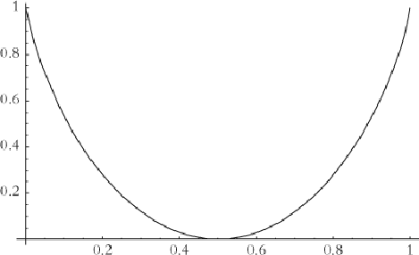
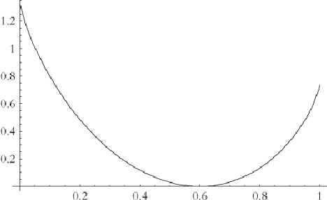
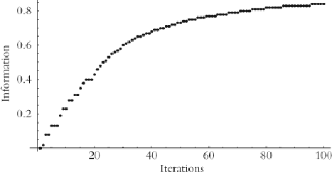
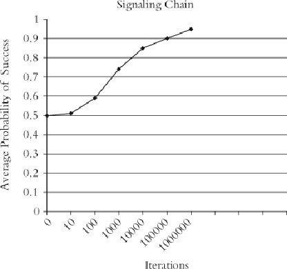

#### Signals: Evolution, Learning, and Information

Brian Skyrms https://doi.org/10.1093/acprof:oso/9780199580828.001.0001 Published: 08 April 2010 Online ISBN: 9780191722769 Print ISBN: 9780199580828

Search in this book

CHAPTER

## 3 3Information

Brian Skyrms

https://doi.org/10.1093/acprof:oso/9780199580828.003.0004 Pages 33–47 Published: April 2010

### Abstract

Thischaptershowsthatinformationiscarriedbysignals.It owsthroughsignalingnetworksthatnot onlytransmitit,butalso lter,combine,andprocesitinvariousways.Wecaninvestigatethe owof informationusingaframeworkofgeneralizedsignalinggames.Thedynamicsofevolutionandlearning inthesegamesiluminatethecreationand owofinformation.

Keywords: signals, signaling games, information flow Subject: Philosophy of Science, Epistemology, Philosophy of Language Collection: Oxford Scholarship Online

“Inthebegi ningwasinformation.Thewordcamelater.”

FredDretske,KnowledgeandtheFlowofInformation(1981)

# Epistemology

Dretskewascalingforareorientationinepistemology.Hedidnotthinkthatepistemologistsshouldspend theirtimeonlittlepuzzlesoronrehashingancientargumentsaboutskepticism.Rather,heheldthat epistemologywouldbebetterservedbystudyingthe owofinformation.Althoughwemaydifferonsome speci cs,IaminfundamentalagreementwithDretske.

1

Informationiscarriedbysignals.It owsthroughsignalingnetworksthatnotonlytransmitit,butalso lter, combine,andprocesitinvariousways.Wecaninvestigatethe owofinformationusingaframeworkof generalizedsignalinggames.Thedynamicsofevolutionandlearninginthesegamesilluminatethecreation and owofinformation.

Downloaded from https://academic.oup.com/book/3092/chapter/143885991 by Canadian Institutes of Health Research - Institute of Population & Public Health user on 28 January 2026

# p. 34 Information

###### p. 35

Whatistheinformationinasignal?Therearerealytwoquestions:Whatistheinformationalcontentofasignal? andWhatisthequantityofinformationinasignal?

Somephilosophershavelookedatinformationtheoryandhaveseenonlyananswertothequestionof quantity.Theydonotseeananswertothequestionofcontent—or,touseadangerousword,meaning—ofa signal.Asaresulttheymovetoasemanticnotionofinformation,wheretheinformationalcontentinasignalis conceivedasaproposition.Theinformationinasignalistobeexpresibleas“thepropositionthat —.”Signals then,inandoutofequilibrium,arethoughtofasthesortsofthingsthatareeithertrueorfalse.Dretsketakes thatroadand,ashehimselfsays,itreducestheroleofinformationtheorytothatofasuggestivemetaphor. Othershavefolowedhislead.

Ibelievethatwecandobetterbyusingamoregeneralconceptofinformationalcontent.Anewde nitionof informationalcontentwilbeintroducedhere.Informationalcontent,soconceived, tsnaturalyintothe m:mathematicaltheoryofco municationandisageneralizationofstandardphilosophicalnotionsof propositionalcontent.

Theinformationalcontentofasignalconsistsinhowthesignalaffectsprobabilities.Thequantityofinformation inasignalismeasuredbyhowfaritmovesprobabilities.Itiseasytoseethedifference.Suppose,forinstance, thattherearetwostates,initialyequiprobable.SupposethatsignalAmovestheprobabilitiesto9/10forstate1 and1/10forstate2,andthatsignalBmovestheprobabilitiesinexactlytheoppositeway:1/10forstate1and 9/10forstate2.Evenwithoutknowingexactlyhowwearegoingtomeasurequantityofinformation,weknow byconsiderationsofsy metrythatthesetwosignalscontainthesameamountofinformation.Theymovethe initialprobabilitiesbythesameamount.Buttheydonothavethesameinformationalcontent,becausethey movetheinitialprobabilitiesindifferentdirections. SignalAmovestheprobabilityofstate1up;signalB movesitdown.

Thekeytoinformationismovingprobabilities.Whatprobabilities?Weusetheframeworkofasender‐receiver signalinggamewithevolvingstrategies. Thatmeansthatweareinterestedininformationnotonlyin equilibrium,butalsobeforeinteractionshavereachedequilibrium.Itispartofthestructureofthegamethat thestatesocurwithcertainprobabilities.Theprobabilitiesofsenderandreceiverstrategieschangeovertime. Inlearningdynamics,theseprobabilitiesaremodi edbythelearningrule;inevolutiontheyareinterpretedas populationfrequencieschangingbydifferentialreproduction.Atanygiventime,inoroutofequilibrium,al theseprobabilitiesarewelde ned.Takentogether,theygiveusaltheprobabilitiesthatweneedtoasesthe contentandthequantityofinformationinasignalatthattime. Informationalcontentevolvesasstrategies evolve.

2

3

Howshouldwemeasurethequantityofinformationinasignal?Theinformationinthesignalaboutastate dependsonacomparisonoftheprobabilityofthestategiventhatthissignalwassentandtheunconditional probabilityofthestate.Wemightaswellookattheratio:

prsig(state)/pr(state)

###### p. 36

4

whereprsigistheprobabilityconditionalongettingthesignal.Thisisakeyquantity. Thewaythatthesignal movestheprobabilityofthestateisjustbymultiplicationbythisquantity.

Butwhenasignaldoesnotmovetheprobabilityofastateatal—forinstanceifthesendersendsthesame signalinalstates—theratio isequaltoone,butwewouldliketosaythatthequantityofinformationis zero.Wecanachievethisbytakingthelogarithmtode nethequantityofinformationas:

Downloaded from https://academic.oup.com/book/3092/chapter/143885991 by Canadian Institutes of Health Research - Institute of Population & Public Health user on 28 January 2026

log [prsig(state)/pr(state)]

Thisistheinformationinthesignalinfavorofthatstate.Ifwetakethelogarithmtothebase2,weare measuringtheinformationinbits.

Asignalcarriesinformationaboutmanystates,sotogetanoveralmeasureofinformationinthesignalwecan takeaweightedaverage,withtheweightsbeingtheprobabilitiesofthestatesconditionalongettingthesignal:

Istates(signal) = ∑iprsig(state i)log[prsig(state i)/pr(state i)]

5 6

Thisistheaverageinformationaboutstatesinthesignal.ItissometimescaledtheKulback–Leiblerdistance, ortheinformationgained.Althiswasworkedoutover50yearsago, shortlyafterClaudeShanonpublished hisoriginalpaperoninformationtheory.Itgoesunderaslightlydifferentname,theinformationprovidedbyan

7

experiment,inafamousarticlebyDenisLindley. Receivingasignalislikelookingattheresultofan experiment.AlanTuringusedalmostthesameconceptinhisworkbreakingtheGermanEnigmacodeduring WorldWarI.

8

Forexample,consideroursimplestsignalinggamefromChapter1,wheretherearetwostates,twosignalsand twoacts,withthestatesequiprobable.Asignalmovestheprobabilitiesofthestates,andhowitmovesthe probabilityofthesecondstateisdeterminedbyhowmuchitmovestheprobabilityofthe rst,sowecanplot theaverageinformationinthesignalasafunctionoftheprobabilityofthe rststategiventhesignal.Thisis shownin gure3.1:

- Figure 3.1: Information as a function of probability of state 1 given signal, state initially equiprobable.

- p. 37 Ifthesignaldoesnotmovetheprobabilityoffone‐half,theinformationis0;ifitmovestheprobabilityalittle, thereisalittleinformation;ifitmovestheprobabilityalthewaytooneortozero,theinformationinthe signalisonebit.Inasignaling‐systemequilibrium,onesignalmovestheprobabilitytooneandtheother movesittozero,soeachofthetwosignalscarriesonebitofinformation.

Thesituationisdifferentifthestatesarenotinitialyequiprobable.Supposethattheprobabilityofstate1is 6/10andthatofstate2is4/10.Thenasignalthatwassentonlyinstatetwowouldcarrymoreinformationthan onethatonlycameinstateonebecauseitwouldmovetheinitialprobabilitiesmore,asshownin gure3.2:

Downloaded from https://academic.oup.com/book/3092/chapter/143885991 by Canadian Institutes of Health Research - Institute of Population & Public Health user on 28 January 2026

- Figure 3.2: Information as a function of probability of state 1 given signal, state 1 initially at probability of .6.

Inagamewithfourequiprobablestatesasignalthatgivesoneofthestatesprobabilityonecarriestwobitsof informationaboutthestate.CompareasomewhatmoreinterestingcasefromChapter1,wherenaturechooses oneoffourstatesbyindependently ippingtwofaircoins.Coin1determinesupordown—letussay—and coin2determinesleftorright.Thefourstates,up‐leftandsoon,areequiprobable.Therearenowtwosenders. Sender1canobserveonlywhethernaturehaschosenupordown;sender2observeswhetheritisleftorright. Eachsendsoneoftwosignalstothereceiver.

- p. 38 •→•←•

Thereceiverchoosesamongfouracts,onerightforeachstate.

Inanoptimalsignalingsystemequilibriumforthislittlesignalingnetwork,pairsofsendersignalsidentify eachofthefourstateswithprobabilityone—andthereceivermakesthemostoftheinformationinthesignals. Insuchasignalingsystemeachsignalcarriesonebitofinformation.Onebitfromeachofthesendersaddsup tothetwobitswehadwithonesenderandfoursignals.Thisisam:mathematicalconvenienceofhavingtaken thelogarithmstothebase2.

Information about the act

Aloftheinformationdiscusedsofarisde nedbytheprobabilitieswithwhichnaturechoosesactsandthe probabilitiesofthesenderstrategies.Butthereisalsoadifferentkindofinformationinthesignals.Wehave beendiscusinginformationaboutthestateofnature,butthereisalsoinformationabouttheactthatwilbe chosen.Thede nitionsareentirelyanalogoustothoseofinformationaboutthestate.

Takentogether,probabilitiesofthestates,probabilitiesofsender'sstrategies,andprobabilitiesofreceiver's strategiesgiveusunconditionalprobabilitiesoftheacts.Justadduptheprobabilitiesofalcombinationsthat givetheactinquestionitsinitialprobability.Probabilitiesofreceiver'sstrategiesalonegiveusprobabilitiesof actsgivenacertainsignal.Theinformationinthesignalisnowmeasuredbyhowmuchthesignalmovesthe probabilitiesoftheacts.Theaverageinformationabouttheactinasignalis:

- p. 39

Iacts(signal) = ∑iprsig(act i) log [prsig(act i)/pr(act i)]

Thede nitionhasjustthesameformandrationaleasthede nitionofinformationaboutthestate.Thereare thustwokindsofinformationinasignal,andtwoquantitiessu marizingamountsofinformationinasignal.

Downloaded from https://academic.oup.com/book/3092/chapter/143885991 by Canadian Institutes of Health Research - Institute of Population & Public Health user on 28 January 2026

Thetwoquantitiesneednotbethesame.Forinstance,supposethatthesenderchoosesadifferentsignalfor eachstatebutthereceiverisn'tpayingattentionandalwaysdoesthesameact.Thenthereisplentyof informationaboutthestatesinthesignals,butzeroinformationabouttheacts.Conversely,supposethatthe senderchoosessignalsatrandombutthereceiverusesthesignalstodiscriminatebetweenacts.Thenthereis zeroinformationaboutthestatesinthesignals,butthereisinformationabouttheacts.Theremaybemore statesthanactsormoreactsthanstates.Itisonlyinspecialcaseswherethetwoquantitiesofinformationare thesame.

# Creation of information in a signal

- p. 40

Figure 3.3: Creation of information ex nihilo by reinforcement learning.

Informational content

Nowthatweknowhowtomeasurethequantityofinformationinasignal,letusreturntoinformational content.Thisissometimessupposedtobeveryproblematic,butIthinkthatitisremarkablystraightforward. Quantityofinformationisjustasu marynumber—onebit,twobits,etc.Informationalcontentmustbea vector.9

Considertheinformationinasignalaboutstates,wheretherearefourstates.Theinformationalcontentofa signaltelsushowthesignalaffectstheprobabilitiesofeachofthefourstates.Itisavectorwithfour components,oneforeachstate.Eachcomponenttelsushowtheprobabilityofthatstatemoves.Sowecan taketheinformationalcontentofasignaltobethevector:

- p. 41

Letusre ectonwhatwasshowninChapter1.Evolutioncancreateinformation.Itisnotsimplyaquestionof learningtouseinformationthatislyingaround,asisthecasewhenweobservea xednature.Withnatural signs—smokemeans re—theinformationaboutstatesisjustthere,andweneedtolearnhowtoutilizeit. Natureisnotplayingagameanddoesnothavealternative strategies.Informationaboutactsarrivesonthe scenewhenwelearntoreactappropriatelytotheinformationaboutstatescontainedinthesmoke.Butin signalinggames,theremaybenoinitialinformationaboutactsorstatesinthesignals.Sendersandreceivers mayjustbeactingrandomly.Whenevolution(orlearning)leadstoasignalingsystem,informationiscreated. Sy metry‐breakingshowshowinformationcanbecreatedoutofnothing.Figure3.3showsthecreationof informationaboutstatesbyreinforcementlearninginatwo‐state,two‐signal,two‐actsignalinggame.

< log[prsig(state 1)/pr(state 1)],log[prsig(state 2)/pr(state 2)],‥‥ >

Theinformationalcontentaboutactsinthesignalisanothervectorofthesameform.

Downloaded from https://academic.oup.com/book/3092/chapter/143885991 by Canadian Institutes of Health Research - Institute of Population & Public Health user on 28 January 2026

Supposethattherearefourstates,initialyequiprobable,andsignal2issentonlyinstate2.Thenthe informationalcontentaboutstatesofsignal2is:

IStates(Signal 2) =< −∞,2,−∞,−∞ >

The−∞ componentstelyouthatthosestatesendupwithprobabilityzero.(The−∞ isjustduetotakingthe logarithm—nocauseforalarm.)Theentryforstate2telsyouhowmuchitsprobabilityhasmoved.Ifthe startingprobabilitieshadbeendifferent,thisentrycouldhavebeendifferent.Forinstance,iftheinitial probabilityofthisstatehadbeen1/16witheverythingelsethesame,theinformationaboutstatesinsignal2 wouldhavebeen:

IStates(Signal 2) =< −∞,4,−∞,−∞ >

- p. 42

“Waitaminute,”someoneissuretosayatthispoint.“Somethingveryimportanthasbenleftout!”Whatisit? “Butshouldn'tthecontent—atleastthedeclarativecontent—ofasignalbeaproposition?Andisn'tapropositionaset ofposibleworldsorsituations?”

Supposeapropositionistakentobeasetofstates.(Statescanbeindividuated nely,andtherecanbelotsof statesifyouplease.)Itasertsthatthetruestateisamemberofthatset.Apropositioncanjustaswelbe speci edbygivingthesetofstatesthatthetruestateisnotin.Thatiswhatthe−∞ componentsofthe informationvectordo.Ifasignalcarriespropositionalinformation,thatinformationcanbereadoffthe informationalcontentvector.Forinstance,ifthe signal“telsyou”thatitis“state2orstate4”inour example,thenthecontentvectorwilhavetheform:

IStates(Signal 2) =< −∞,_,−∞,_>

withtheminusin nitycomponentsrulingoutstates1and3,andtheblanksbeing ledbynumbers specifyinghowtheprobabilitiesofstate2and4havemoved.

Thatistosaythatthefamiliarnotionofpropositionalcontentasasetofposiblesituationsisaratherspecial caseofthemuchricherinformation‐theoreticacountofcontent.Thisvectorspeci esmorethanthe propositionalcontent.Furthermore,somesignalswilnothavepropositionalcontentatal.Thiswilbetypical inout‐of‐equilibriumstatesofthesignalinggame.Itisthetraditionalacountthathasleftsomethingout.

Noticethatthequantityofinformationinasignal—asmeasuredbyKulbackandLeibler—isjustgottenby averagingoverthecomponentsoftheinformationalcontentvector.Itisakindofsu maryobtainedfrom informationalcontent.

Ifweaverageagainwegettheaveragequantityofinformationinthesignals.Thisquantityiscaledmutual information.Ifwetakethemaximumofthisoversignalingsystemequilibria,wegetameasureofthe informationtransfercapacityinthesignalinggame.Thereisaseamlesintegrationofthisconceptionof contentwithclasicalinformationtheory.

Downloaded from https://academic.oup.com/book/3092/chapter/143885991 by Canadian Institutes of Health Research - Institute of Population & Public Health user on 28 January 2026

# Intentionality and teleosemantics

- p. 43

Thephilosophicalhistoryoftheconceptofintentionalitytelsusmore.ItstartswithFranzBrentano, who heldthatintentionalitywaswhatdistinguishedthementalfromthephysical.Ifwhatisbeingleftoutisa modelofthementallifeoftheagents,thenIwouldsaythatitshouldbeleftoutwhentheagentslackamental lifeandputinwhentheydo.Iwouldnotspeculateonthementallifeofbees;totalkofthementallifeof bacteriaseemsabsurd;andyetsignalingplaysavitalbiologicalroleinbothcases.Somemaywanttode ne signalssothatthesearenot“real”signals,butIfailtoseethepointofsuchmaneuvers.Rather,Iwouldtreat thecasewhereagentshaveamentallifeasaspecialcase.Ifwehaveareasonablemodeloftherelevantaspects ofmentallife,wecanputtheminthemodel.Wemovesomewayinthisdirectioninthenextsection,wherewe considersubjectiveinformation.

10

Somehaveswalowedtherequirementofintentionalityorsomethingquitelikeit,buthavetriedtoletMother Nature(intheformofevolution)supplytheintentionality.AsJohnMaynardSmithputsit:“Inbiology,theuse ofinformationaltermsimpliesintentionality,inthatboththeformofthesignal,andtheresponsetoit,have evolvedbyselection.Whereanengineerseesdesign,abiologistseesnaturalselection.” Thisisroughlythe ideabehindRuthMilikan'steleosemantics.Anevolvedsignalhasadirectednes,orintentionality,invirtueof theDarwinian tnesacruedbyitsuse.

11

12

IsayaboutteleosemanticintentionalitythesamethingIsaidaboutmentalisticintentionality.Ifwehavea goodmodelwhereitapplies,itcanbeaddedtothetheory.Butneitherintentionalitynor teleosemanticsis requiredtogiveanadequateacountoftheinformationalcontentofsignals.HereIstandwithDretske.The informationisjustthere.Atthispointsomephilosopherswilsay“YoumightaswelsaythatSmokecarries informationabout re.”Wel,doesn'tit?Don'tfosilscarryinformationaboutpastlifeforms?Doesn'tthe cosmicbackgroundradiationcarryinformationabouttheearlystagesoftheuniverse?Theworldisfulof information.Itisnotthesoleprovinceofbiologicalsystems.Whatisspecialaboutbiologyisthattheformof informationtransferisdrivenbyadaptivedynamics.

- p. 44

Somephilosopherstaketheviewthatrealinformationpresupposesintentionalityandthatconsequentlythe m:mathematicaltheoryofinformationisirrelevanttoinformationalcontent.Thesemanticnotionof informationiscon atedwiththequestionofintentionality.Whatisintentionality?Itisasaidtobeakindof directednestowardsanobject.Thatdoesn'ttelusmuch,anddoesn'texplainwhyanyoneshouldthinkitwas notpartofm:mathematical informationtheory.Signals,afteral,docarryinformationdirectedtowardthe statesandinformationdirectedtowardtheacts.

# Objective and subjective information

Noneoftheprobabilitiesusedsofararedegreesofbeliefofsenderandreceiver.Theyareobjective probabilities,determinedbynatureandtheevolutionaryorlearningproces.Organisms(ororgans)playing theroleofsenderandreceiverneedhavenocognitivecapacities.

Butsupposethattheydo.Supposethatasenderandreceiverarehumanandthattheytrytothinkrationaly aboutthesignalinggame.Supposethatthesenderhassubjectiveprobabilitiesoverthereceiver'sstrategies andthereceiverhassubjectiveprobabilitiesoverthesender'sstrategies,andthatbothhavesubjective probabilitiesoverthestates.Thesesubjectiveprobabilitiesarejustdegreesofbelief;theymaynotbeinline withtheobjectiveprobabilitiesatall.Theneachsignalcarriestwoaditionalkindsofsubjectiveinformation. Thereissubjectiveinformationabouthowthereceiverwilreact,whichlivesinthesender'sdegreesofbelief.This isofinteresttoasenderwhowantstogetareceivertodosomething.Thereissubjectiveinformationaboutwhat statethesenderobserved,whichlivesinthereceiver'sdegreesofbelief.Thisisofinteresttoareceiverwho

Downloaded from https://academic.oup.com/book/3092/chapter/143885991 by Canadian Institutes of Health Research - Institute of Population & Public Health user on 28 January 2026

wantstousethesenderasasourceofinformationaboutthestates.Bothsenderandreceiverusethesekindsof informationindecisionmaking.Bothsenderandreceiverstrive(1)toactoptimalygiven theirsubjective probabilities,and(2)tolearntobringsubjectiveprobabilitiesinconcordancewiththeobjectiveprobabilitiesin theworld.Theymayormaynotsuceed.Whenweareapplyingtheacounttobeingsthatcanreasonablybe thoughttohavesubjectiveprobabilities,suchasperhapsourselves, wenowhaveatleastfourtypesof informationalcontent—twoobjectiveandtwosubjective.Ifthesignalinggameismorecomplex,forinstanceif thereisaneavesdropper,theinformationalstructurebecomesricher.

- p. 45

13

The flow of information

InthesignalingequilibriumofaLewissender‐receivergame,informationistransmittedfromsenderto receiver,butitisonlyinthemosttrivialsensethatwecanbesaidtohavea owofinformation.Asapreviewof comingattractions(Chapters1,13,14)andasanexampleof ow,letusconsideralittlesignalingchain.

•→•→•

Thereareasender,anintermediary,andareceiver.Naturechoosesoneoftwostateswithequalprobability.The senderobservesthestate,choosesoneoftwosignals,andsendsittotheintermediary;theintermediary observesthesender'ssignal,choosesoneofherowntwosignals,andsendsittothereceiver.(The intermediary'ssetofsignalsmayormaynotmatchthatofthesender.)Thereceiverobservesthe intermediary'ssignalandchoosesoneoftwoacts.Iftheactmatchesthestate,sender,intermediaryand receiveralgetapayoffofone,otherwiseapayoffofzero.

Itistemptingtoasumethattheseagentsalreadyhavesignalingforsimplersender‐receiverinteractionsto buildupon.Buteveniftheydonot,adaptivedynamicscancarrythemtoasignalingsystem,asshownin gure 3.4:

Figure 3.4: Emergence of a signaling chain ex nihilo by reinforcement learning.

- p. 46 Althoughreinforcementlearningsuceedsincreatingasignalingchainwithoutapre‐existingsignaling background,noticethatittakesamuchlongertimethaninthesimplertwo‐agentmodel.

Thespeedwithwhichthechainsignalingsystemcanbelearnedismuchimprovedifthesenderandreceiver havepre‐existingsignalingsystems.Theyneednotevenbethesamesignalingsystem.Senderandreceiver canhavedifferent“languages”sothattheintermediaryhastoactasa“translator”,orsignaltransducer.One

Downloaded from https://academic.oup.com/book/3092/chapter/143885991 by Canadian Institutes of Health Research - Institute of Population & Public Health user on 28 January 2026

couldevenconsideranextremecaseinwhichthesenderandreceiverusedthesametokensassignalsbutwith oppositemeanings.“Forexample,sender'sandreceiver'sstrategiesare:

##### SENDER RECEIVER

- State 1 ⇒ red red ⇒ Act 2
- State 2 ⇒ blue blue ⇒ Act 1

- p. 47

Asucesfultranslatormustlearntoreceiveonesignalandsendanother,sothatthechainleadstoasucesful outcome.

SENDER TRANSLATOR RECEIVER

- State 1 ⇒ red see red ⇒ send blue blue ⇒ Act 1
- State 2 ⇒ blue see blue ⇒ send red red ⇒ Act 2

Thetranslator'slearningproblemisrealyquitesimple,andshecanlearntocompletethechainveryquickly.”

Inthissignalingchainequilibrium,thesender'ssignaltothetranslatorcontainsonebitofinformationabout thestateandthetranslator'ssignaltothereceivercontainsonebitofinformationaboutthestate.Andonany play,thetranslator'ssignaltothereceiverhasthesameinformationalcontentasthesender'ssignaltoher. Information owsfromsenderthroughtranslatortoreceiver.Thereceiverthenactsjustasshewouldhaveifshe hadobservedthestatedirectly.

Thatis,ofcourse,theidealcase.Someinformationcangetlostalongthewaybecauseofnoiseorerror.14

Usingournotionofthecontentofasignal,thereisnodif cultyinalowingforgradualdegradationofcontent. Informationcan owthroughlongersignalingchainsandthroughmorecomplexsignalingnetworks.Some informationalcontentmaygetlost.Thismayevenbebene cialifextraneousinformationneedstobe ltered out.Wewilseehowinformationfromdifferentsourcesmaybeintegratedinwaysthatincludelogical inferenceandcomputationoftruthvaluesasspecialcases.Signalingnetworksofdifferentkindsarethelocus ofinformationtransmisionandprocesingatallevelsofbiologicalandsocialorganization.Thestudyof informationprocesinginsignalingnetworksisanewdirectionfornaturalisticepistemology.

# Notes

- 1 I must admit to having done some of this, before I knew better.
- 2 As always, there is the question of whether the framework is being correctly applied to model the situation of interest. We assume here that it is.
- 3 The probabilities never really hit zero or one, although they may converge towards them. So conditional probabilities are well defined. We don't have to worry about dividing by zero. If it appears in an example that we are dividing by zero, throw in a little epsilon.
- 4 By Bayes' theorem, the same quantity can be expressed as:

Downloaded from https://academic.oup.com/book/3092/chapter/143885991 by Canadian Institutes of Health Research - Institute of Population & Public Health user on 28 January 2026

pr(signal given state)/pr(signal).

- 5 Although not technically a metric because it is not symmetric.
- 6 Kullback and Leibler 1951, and Kullback 1959.
- 7 Lindley 1956.
- 8 See I. J. Good's preface to Good Thinking 1983.
- 9 This is information content within a given signaling game. It is implicit that this vector applies to the states or acts of this game. For a di erent game, the content vector shows how the signal moves probabilities of di erent states, or di erent acts. Content depends on the context of the signaling interaction. It is a modeling decision as to which game is best used to analyze a real situation.
- 10 Brentano 1874.
- 11 Maynard Smith 2000.
- 12 See Millikan 1984. For other teleosemantic theories that do not share Millikan's basic commitment to a picture theory of meaning see Papineau 1984, 1987.
- 13 Modern psychology details systematic departures from this idealized picture.
- 14 Here I part company with Dretske 1981: 57–8. Downloaded from https://academic.oup.com/book/3092/chapter/143885991 by Canadian Institutes of Health Research - Institute of Population & Public Health user on 28 January 2026

