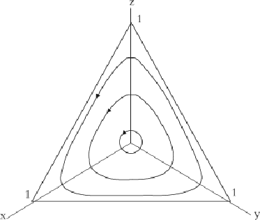

#### Signals: Evolution, Learning, and Information

Brian Skyrms https://doi.org/10.1093/acprof:oso/9780199580828.001.0001 Published: 08 April 2010 Online ISBN: 9780191722769 Print ISBN: 9780199580828

Search in this book

CHAPTER

## 4 4Evolution

Brian Skyrms

https://doi.org/10.1093/acprof:oso/9780199580828.003.0005 Pages 48–62 Published: April 2010

### Abstract

Darwinwasrightaboutthebroadoutlinesofthetheoryofevolution.Traitsareinheritedbysome unknownmechanism.Thereissomeprocesthatproducesnaturalvariationinthesetraits.Thetraits mayaffecttheabilityoftheorganismtoreproduce,andthustheaveragenumberofindividualsbearing thetraitsinthenextgeneration.Therefore,thosetraitsthatenhancereproductivesucesincreasein frequencyinthepopulation,andthosethatleadtoreproductivesucesbelowtheaveragedecreasein frequency.ThischapterdiscusesthethreeesentialfactorsinDarwin'sacount:(i)naturalvariation,(i) differentialreproduction,and(i)inheritance.

Keywords: evolution, Darwin, natural variation, di erential reproduction, inheritance Subject: Philosophy of Science, Epistemology, Philosophy of Language Collection: Oxford Scholarship Online

“suchthingssurvived,beingorganizedspontaneouslyina ttingway;whereasthosewhichgrew otherwiseperishedandcontinuetoperish.…”

Aristotle,Physics1

Downloaded from https://academic.oup.com/book/3092/chapter/143887737 by Canadian Institutes of Health Research - Institute of Population & Public Health user on 28 January 2026

# Evolution

- p. 49

Perforcethereperishedmanyastock,unable:

Bypropagationtoforgeaprogeny.

Empedoclesevenhadatheoryofhowtraitsaretransmittedfromgenerationtogeneration.Smalcopiesof organsforminthemaleandfemale,andinreproductionsomefromthefatherandsomefromthemother combinetoformtheneworganism.

Hethushasinhandarudimentarytheoryofrecombination.Empedoclesin uencedHippocrates(probably bothdirectlyandthroughDemocritus).Hippocrates'theoryofinheritanceisremarkablysimilartothatput forwardbyDarwininTheVariationofPlantsandAnimalsunderDomesticationnineyearsafterthepublicationof

TheOriginofSpecies. DarwindidnotknowaboutHippocratesatthetime,butinalettertoWilliamOglein 1868,Darwinwrites:

3

Ithankyoumostsincerelyforyourletter,whichisveryinterestingtome.IwishIhadknownofthese viewsofHippocratesbeforeIhadpublished,fortheyseemalmostidenticalwithmine—merelya changeofterms—andanapplicationofthemtoclasesoffactsnecesarilyunknowntotheold philosopher.Thewholecaseisagoodilustrationofhowrarelyanythingisnew.

DarwinandHippocrateswerewrongaboutinheritance.ButDarwinwasrightaboutthebroadoutlinesofthe theoryofevolution.Traitsareinheritedbysomeunknownmechanism.Thereissomeprocesthatproduces naturalvariationinthesetraits.Thetraitsmayaffecttheabilityoftheorganismtoreproduce,andthusthe averagenumberofindividualsbearingthetraitsinthenextgeneration.Therefore,thosetraitsthatenhance reproductivesucesincreaseinfrequencyinthepopulation,andthosethatleadtoreproductivesucesbelow theaverage decreaseinfrequency.ThethreeesentialfactorsinDarwin'sacountare(i)naturalvariation,(i) diferentialreproduction,and(i)inheritance.

- p. 50

Theideasofnaturalselectionandsurvivalofthe ttestexistedalreadyinGreekphilosophy.Aristotleisnot describinghisownview—hebelievedinthe xityofthespecies—butratherarivaltheoryacordingtowhich unsucesfulspeciesgotoextinction.AristotleisreferringtoEmpedoclesofSicily. Empedocleswasa statesmanandaphysicianaswelasamystic,philosopher,andpoet.Histheorywasputforwardinalong poem,OnNature.Empedocles'acountoftheoriginofspeciesbeginswithahaphazardcombinationofparts intoagreatvarietyoforganisms,onlythe ttestofwhichsurvived.Empedoclesin uencedDemocritus,and bothEmpedoclesandDemocritusin uencedLucretius.AsLucretiusputsitinhisownpoem,OntheNatureof Things:

2

# Evolutionarily stable strategies

Darwinianprocesesleadtoadaptationtoa xedenvironment,atleastwherethegeneticmechanismdoesn't getintheway. Thestoryismorecomplicatedwhen tnesdependsonthefrequenciesofdifferenttypeswho interactwithoneanother.Herethe tneslandscapemaybeconstantlychanging,alongwiththepopulation proportions.JohnMaynardSmith,folowingtheleadofWiliamHamilton, realizedthatthiskindofinteractive evolutionisabiologicalversionofvonNeumannandMorgenstern'sTheoryofGames.

4

5

6

In1973,JohnMaynardSmithandGeorgePriceintroducedastrengtheningoftheNashequilibriumconceptof gametheory—theconceptofanevolutionarilystablestrategy.Thecontextwastheexplanationof“limitedwar” inanimalcontests.Sincehyper‐aggresivetypes,Hawks,defeatpeacefultypes,Doves,towinresources,why don'ttheytakeoverthepopulation?Thegeneralansweristhatselectionhereisfrequency‐dependent.Ifmost

Downloaded from https://academic.oup.com/book/3092/chapter/143887737 by Canadian Institutes of Health Research - Institute of Population & Public Health user on 28 January 2026

ofthepopulationisocupiedbyHawks,theyusualyinteractwitheachotherin ghtsthatleadtoserious injuryordeath.ItisonlygoodtobeaHawkifthereareenoughDovesaroundtoexploit.

Hawk‐Doveinteractionsaremodeledasagame.Payoffsforatypicalexampleareshowninthefolowingtable,

- p. 51 withthenumbers beingpayoffs(inDarwinian tnes)ofrowstrategyagainstcolumnstrategy:

Hawk Dove

Hawk 0 3

Dove 1 2

(Inourevolutionarycontext,payoffsonlydependonstrategies,notonwhoisrowandwhoiscolumn.The wholepayofftablelistingrowpayof,columnpayofineachcellookslikethis:

Hawk Dove

Hawk 0, 0 3, 1

Dove 1, 3 2, 2

Inwhatfolowswewilusethe rst,simplerformofgivingevolutionarygames.)

ItisevidentthatwhereyouaremeetingHawks,itisbettertobeaDove(column1)andwhereyouaremeeting Doves(column2)itisbettertobeaHawk.Consequently,apopulationofAlHawkscannotbeevolutionarily stableinthatinsuchapopulationafewmutantDoveswoulddobetterthanthenatives.Likewiseapopulation ofAlDoveswouldbevulnerabletoinvasionbyafewHawks.

Anevolutionarilystablestrategyinonesuchthatifthewholepopulationplayedit,afewmutantswouldalways doworseagainsttheresultingpopulation(includingthemutants)thanthenativeswould.Thusthemutants wouldfadeaway.Ifthepopulationislargeandindividualsarerandomlypairedtohaveaninteractionthereisa simpletestforevolutionarystabilityintermsofthepayoffstothegame.Astrategy,S,isevolutionarilystableif

- p. 52 foranyotherstrategy,M,either:

(i) Fitnes(SplayedagainstS)>Fitnes(MplayedagainstS) or:

(i) FitnesesareequalagainstS,butFitnes(SagainstM)>Fitnes(MagainstM)

Thisishowevolutionarystabilityisde nedbyMaynardSmithandPrice.7

Forinstance,intheHawk‐DovegameHawkisnotevolutionarilystablebecauseFitnes(HawkagainstHawk)is lesthanFitnes(DoveagainstHawk).DoveisnotevolutionarilystablebecauseFitnes(DoveagainstDove)is lesthanFitnes(HawkagainstDove).

TheMaynardSmith–Pricetestiseasilyappliedtootherfamiliarsimplegames.Forinstance,considertheStag Huntgame.PlayerscaneitherhuntStagorhuntHare.HuntingStagisacooperativeenterprise.Itfailsifboth

Downloaded from https://academic.oup.com/book/3092/chapter/143887737 by Canadian Institutes of Health Research - Institute of Population & Public Health user on 28 January 2026

playersdonothuntStag,butitpaysoffweliftheydo.Harehuntingisasolitaryenterprise.Harehuntersdo equalyweliftheotherhuntsHareorStag,butworsethansucesfulStaghunters.TheStagHunthasthis kindofpayoffstructure:

##### Hare Stag

Hare 3 3

Stag 0 4

ApplyingthetestofMaynardSmithandPrice,weseethatbothStagandHareareevolutionarilystable strategies.StagagainstHaredoesworsethanHareagainstHare;HareagainstStagdoesworsethanStag againstStag.Apopulationofeachtypeisstableagainstinvasionbyafewmutantsoftheothertype.

Foranexamplewherethereisexactlyoneevolutionarilystablestrategy,considerthemostwidelydiscused gametheorymodelinthesocialsciences,thePrisoner'sDile ma:

- p. 53

Cooperate Defect

Cooperate 3 1

Defect 4 2

Defectisanevolutionarilystablestrategy;cooperateisnot.

Butwhataboutalthemodelsthatexplaintheevolutionofaltruism,whichisusualytakenascooperationin thePrisoner'sDile ma?Altheseacounts,inonewayoranother,explaintheevolutionofcooperationby somecorrelationmechanism. Cooperatorstendtomeetcooperators;defectorstendtomeetdefectors.Pairing isnotrandom.IfpairingisnotrandomtheMaynardSmith–Pricetestofevolutionarystabilityiswrong.Thisis transparentifcorrelationisperfect.Thenapopulationofdefectorscouldbeinvadedbyafewmutant cooperators.Thecooperatorsmeeteachotherforapayoffof3,whilethenativedefectorshaveapayoffof2. Correlationcanchangeeverything.

8

Di erential reproduction

Stabilityisrealyadynamicconcept.Areststateisstronglystableifalstatesneartoitarecarriedtoitbythe dynamics.Youcouldthinkofamarbleatthebottomofabowl.Itisjuststableifstatesneartoitarenotcarried awaybythedynamics.Thinkofthemarblesittingontabletopasbeingstablebutnotstronglystable. Otherwiseitisunstable,likeamarblebalancedatthetopofaninvertedbowl.MaynardSmithandPriceclearly haveinmindsomethinglikedynamicstability.Whereisthedynamics?

Tobuildadynamicfoundationforthenotionofanevolutionarilystablestrategy,TaylorandJonkerintroduced

- p. 54 thereplicatordynamics.9 Thisisamodelofdifferentialreproductioninalarge population,wheretypesare

Downloaded from https://academic.oup.com/book/3092/chapter/143887737 by Canadian Institutes of Health Research - Institute of Population & Public Health user on 28 January 2026

inheritedwithcomplete delity.Forsimplicity,Mendeliangeneticsisleftoutofthepicture.Reproduction proceedsasifbycloning.

ReplicatordynamicsisdrivenbyDarwinian tnes—expectednumberofprogeny.Iftheexpectednumberof progenyofatypeisforinstancetwo,thensomeindividualsmighthavefourandsomethreeandsomeoneor zero.Butinalargeenoughpopulationthesedifferenceswilalmostsurelyaverageout,andtheaveragenumber ofprogenywilequaltheexpectation.Onaverage,yougetwhatyouexpect.Thisgivesusreplicatordynamics asintroducedbyTaylorandJonkertoprovideadynamicalfoundationforevolutionarygametheory.

Supposethatreproductiontakesplaceindiscretetime—forinstance,everyspring.Whatproportionxnew(S)of thenewgenerationwilplayagivenstrategy,S?ItisjustthenumberwhoplaySinthenewpopulationdivided bytotalnumberinthepopulation.ThenumberwhoplaySinthenewpopulationisequaltothetotalnumber intheoldpopulation,N,multipliedbytheproportionwhohadstrategyS,xold(S),multipliedbytheaverage numberforoffspringofthosewhohadstrategyS,Fitnes(S).Wehavetodividethisbythetotalnumberofthe newpopulationwhichisjustthenumberoftheoldpopulation,N,multipliedbytheaveragenumberof offspringthroughouttheoldpopulation,AverageFitnes.

xnew [N xold(S)Fitness(S)]/[N Average Fitness]

Ndropsoutandwegetx fromx bymultiplyingbyaDarwiniansucesfactor:

xnew = xold[Fitness(S)/Average Fitness]

Thisisdiscretetimereplicatordynamics.Thereisanasociated(idealized)continuoustimereplicator dynamicsthatgivestherateofchangeofpopulationproportions,dx/dtatapointintime:

dx/dt = x[Fitness(S)—Average Fitness]

- p. 55 ThisiswhatTaylorandJonkergaveusasasimplemodelofdifferentialreproduction.

Whataboutculturalevolution?Wewanttodiscusdynamicsofsignalingforculturalevolutionaswelasfor biologicalevolution.Therearecasesofeach,andmixedcases,thatarealofinterest.Wewouldlikeatheoryof culturalevolutiontobemorethanjustastoryabouthowcultureevolved.Inalhonesty,afulltheoryatthis pointisoutofthequestion;thecognitiveprocesesinvolvedaretoovarious,complexandpoorlyunderstood. Thebestwecandoistostartwithasimplebasicmodelthatwehavesomehopeofunderstanding.

Onebasicprocesisimitation.Supposethatindividualslookaroundthemandseewhichbehaviorsor strategiesarepayingoffforothers,andimitatethosestrategieswithprobabilityproportionaltotheirsuces. Thisprocesandanumberofvariationsonithavebeenanalyzed. Whatweget,whenthepopulationislarge andchance uctuationsaverageout,isjustoursimplemodelofdifferentialreproduction—thereplicator dynamics.

10

11

Butwhatisthecurrencyhere,inwhichpayoffsaremeasured?Ithastobewhateverdrivesdifferential imitation.Thishastobeempiricalydeterminedforthecontextofapplication.Thespeci capplicationofthe theoryderivesitscontentfromthisdetermination.Therelevantpayoffsforculturalevolutionmayormaynot correlatewelwithDarwinian tnes.Inconditionsofhardship,bothmaycorrelatewitheatingweland survivingattacksofpredators;inconditionsofaf uencetheymaybedecoupled.Eveniftheformofthe

Downloaded from https://academic.oup.com/book/3092/chapter/143887737 by Canadian Institutes of Health Research - Institute of Population & Public Health user on 28 January 2026

- p. 56

(i) thedynamicscarryingonestrategyto xation,nomatterwhattheinteriorstartingpoint:

∘→→→→→→→→→→→→→→→•

(i) thedynamicscarryingthepopulationtoamixedstate,nomatterwhatthestartingpoint:

∘→→→→→→•←←←←←←←←←∘

(i) thedynamicscarryingoneortheotherstrategyto xation,dependingonthestartingpoint:

•←←←←←←←←←←∘→→→→→•

(iv) thedynamicsnotmovingatal:

….

Case(i)isexempli edbythePrisoner'sDile ma.Alcooperateisarestpointofthedynamicsbecausedefectors arealextinct. Butitisdynamicalyunstable.Wemarkanunstablerestpointwithahollowpoint.Alother pointsarecarriedtoAlDefect,whichisdynamicalystronglystable.Wemarkastronglystablerestpointwitha  ledcircle.WithHawk‐Dove,wehavecase(i).AlHawkandAlDovearedynamicalyunstable.The dynamicalystableequilibriumisamixed(orpolymorphic)stateofthepopulationwithsomeHawksandsome Doves.TheStagHuntiscase(i).Herethepolymorphicreststateisanunstable“knife‐edge.”Anymovement offitcarriesthepopulationtooneofthestronglystableequilibria—AlStagorAlHare.

12

Forcase(iv)considerthegameofinconsequentialactions.Heretheavailableactionshavenopayoff consequenceswhatever.Ibelievethatmuchoflifehasthisstructure.

- p. 57

dynamicsisthesameforbiologicalandculturalevolutionthesubstantiveconclusionsmaybedifferent.Carein interpretationisrequired.

Thereplicatordynamicsmayormaynotleadtoadynamicalequilibrium(arestpointofthedynamics).If individualsarepairedatrandomandtherearejusttwostrategies,itmustdoso.Wecan visualizethe situationbyplottingtheproportionofoneofthestrategiesonanintervalfrom0to1.Wecouldhave:

##### Do This Do That

Do This 0 0

Do That 0 0

Replicatordynamicsdoesnotmoveanypoint.(Wecan'trealydrawit.)AllpointsareStableinthatnearby pointsstaynearby,butnostateisstronglystable.

Downloaded from https://academic.oup.com/book/3092/chapter/143887737 by Canadian Institutes of Health Research - Institute of Population & Public Health user on 28 January 2026

# The Red Queen

Whenwehavethreestrategies,however,replicatordynamicsmaynotleadtoequilibriumatal!Considerthe familiargameofrock‐scisors‐paper.Rockbreaksscisors,scisorscutspaper,papercoversrock,sowegetthe folowingsortofpayoffs:

Rock-scissors-paper

R S P

- R 1 2 0
- S 0 1 2

P 2 0 1

- p. 58

BarrySinervoandCurtisLively ndrock‐scisors‐paperstructureinmatingstrategiesofside‐blotchedlizards inCalifornia. Therearethreetypesofmales,whichexhibitdifferentcoloration.Orange‐throatedmalesare veryaggresiveandguardlargeterritories.Blue‐throatedmalesguardsmalerterritoriesandareabletoguard theirmates.Yelow‐throatedmalesresemblefemales,andmatewithfemalesonthesly.Inapopulationof mate‐guardingbluethroats,theultra‐dominantorangethroatsdobetter.Buttheycanbeinvadedbyyelow‐ throatedsneakers.Andthesecanbeinvadedinturnbythebluethroats.Fieldstudiescon rmthepresenceof cycles.

14

BenjaminKirkupandMargaretRiley ndrock‐paper‐scisorsbeingplayedbybacteriainthegutofaliving mouse. OnestrainofE.colibothproducesapoisonandmaintainsi munitytothispoison.Therearetwo metaboliccosts,oneforthepoisonandoneforthei munity,whichreducereproductivepotential.These poisonersbeatnormalE.coli,whicharenoti mune,inthe spatialinteractionsinthegut.Athirdstrain maintainsi munitytothepoison,butdoesnotproduceit.Itfree‐rides,sotospeak,onthespiteofthe poisoners.

15

- p. 59

Thisstructureisalsofoundoutsidechildren'sgames.ChristofHauert,SilviadeMonte,JosefHofbauer,andKarl Sigmund ndrock‐scisors‐paperstructureinasocialdile mawiththeposibilityofoptingout.13

Thepuresocialdile maisageneralizationofthePrisoner'sDile matomanyplayers.Individualscaneither choosetocontributetothepublicgoodortofreeride.Contributionsare multipliedbythesynergyofthe jointproject,andthejointpublicgoodisdividedamongeveryone.Ifeveryonecontributeseveryonedoeswel. Butthemultiplierissmalerthanthegroupnumber,soyourdolarcontributiongetsyoupersonalylesthana dolarinreturnalthoughitcangetthegroupmuchmore.Thus,whateverothersdo,itisinanagent'sown sel shinteresttofree‐rideandsharethebene tsofothers'contributions.Ifeveryonefreerides,thepublic goodprojectfails.Thereisnothingtodistribute,andaldoverypoorly.Thuswehavethen‐PersonPrisoner's dile ma.Tothisbasicsetupisaddedtheposibilityofoptingoutandbeingaloner.Lonersarelessucesful thanthoseincooperativegroups,butmoresucesfulthanthoseinfailedpublic‐goodsprojects.Ina populationofcooperators,free‐ridersdobetterthannatives.Inapopulationoffree‐riders,lonersdobetter.Ina populationofloners,cooperatorsdobetter.

Thesefree‐riders ourishinapopulationofpoisoners,becauseofthelowermetabolicload.Butinapopulation ofsuchfree‐riders,thenormalswildobest.Herethereisnopoison,andthecostofmaintainingi munityisa dragonthefreeriders.Thisrock‐scisors–papertypeofinteractionstructureexplainsthemaintenanceofal

Downloaded from https://academic.oup.com/book/3092/chapter/143887737 by Canadian Institutes of Health Research - Institute of Population & Public Health user on 28 January 2026

threetypesinthewild.AstheRedQueensaidtoAlice,“Now,here,youse,ittakesaltheruningyoucando,to kepinthesameplace.”

Thereplicatordynamicsforrock‐scisors‐paperisshownin gure4.1.

Figure 4.1: Cycles in rock‐scissors‐paper.

Rock‐scisors‐paperhasfourrestpoints(orequilibria)ofthereplicatordynamics.Thethreeposiblepure populations(alrock,alscisors,alpaper)arealdynamicalyunstable.Theotherequilibriumisthemixedstate whereone‐thirdofthepopulationplayseachstrategy.Thisisstable,sincepointsnearitstaynearit,butnot stronglystable.Theequilibriaarenotsoimportanthere.Noinitialpopulationstatethatisnotalreadyan equilibriumconvergestoanyoftheequilibria.

- p. 60 Thischangesifwemodifythepayoffsslightly:16

Rock‐scisors‐paperI

Forsmalpositiveε,trajectoriesofthereplicatordynamicsspiralinwardtothepointwherethepopulation proportionsareequal.

##### R S P

- R 1‐ε 2 0
- S 0 1‐ε 2

P 2 0 1‐ε

Thisequilibriumhaschangedcharacter.Itisnotonlystable;itisstronglystable.Populationstatesnearitget carriedtoit.Moreimpresively,itisglobalystable.Everystateinwhichnoneofthestrategiesisextinct convergestoit.

Theexampleilustratesanotherconceptthatwilbeimportanttous.Thetiniestchangeinthedynamics changedtheequilibriumstructureradicaly.(Anegativeε ratherthanapositiveonewouldhavecausedthe trajectoriestospiraloutward,changingthecentralequilibriumfromstabletounstable.)Ouroriginalrock‐ scisors‐papergamewithreplicatordynamicsissaidtobestructuralyunstable.Inastructuralyunstable

Downloaded from https://academic.oup.com/book/3092/chapter/143887737 by Canadian Institutes of Health Research - Institute of Population & Public Health user on 28 January 2026

situation,smallocalchangesintheratesofchangeofpopulationproportionscanleadtoaradicalydifferent globaldynamicstructure.Ourgameofinconsequentialactionswasalsostructuralyunstable.Thelittlest consequencecouldchangeeverything.Althoughstructuralinstabilityinthereplicatordynamicsisrareinthe spaceofgamesingeneral,insignalinggamesithappensalthetime!

# p. 61 Natural variation

LetusnowaddDarwin'sthirdprinciple—naturalvariation.InaMendeliansetting,sexualreproductionaddsa lotofnaturalvariationthroughgeneticrecombinationofcontributionsfrombothparents—justasEmpedocles shrewdlyhypothesized.Butinlinewithourminimalistapproachsofar,preservingcompatibilitywithboth biologicalandculturalevolution,wewiljustaddmutation.

Withhighprobabilitytypesorstrategiesareinherited,butwithsomesmalprobabilityanytypemaymutate intoanyother.Ontheculturalsidethesemutationsmaybeviewedasimperfectimitation,leavenedbyerror, whichkeepsalstrategiesinplayandpreventsanabsolutelymonomorphicculture.Inprincipleitmightbe easierforagiventypetomutateintoasecondthanintoathird.However,wewillconcentrateonthecaseof uniformmutation.Everytypehasthesameprobabilityofmutatingintoanyothertype,sothereisonlyone mutationrate.Weagainasumealargepopulation,sochance uctuationsaverageout.Thisgivesusreplicator‐ mutatordynamics.17

Thosepopulationstatesthatweredynamicequilibriaonlybyvirtueofallothertypesbeingextinctdonot survivemutation.ConsideronepopulationplayingPrisoner'sDile ma:

Cooperate Defect

Cooperate 3 1

Defect 4 2

###### p. 62

Withreplicatordynamicstherearetwoequilibria,AlCooperateandAlDefect.Theformerisunstable,since introductionofanydefectorswouldleadtothemtakingoverthepopulation.Withreplicator‐mutator dynamics,defectorsareautomaticalyintroducedbymutationandonlyoneequilibriumsurvives.ThisistheAl Defect equilibriumperturbedslightlybymutation.ForasmalmutationrateitisanAlmost‐AlDefect equilibrium.

Letusreturntoouroriginalrock‐scisors‐papergame.Insteadofchangingthepayoffsalittle,aswedidearlier, wecankeepthepayoffsthesamebutintroducemutation.Wechangethedynamicstoreplicator‐mutatorwitha smalmutationrate.Sincewearestartingwithastructuralyunstablesituation,weexpectthatthissmal changemighthavelargeconsequences.Indeed,itisso.Asbefore,alcyclesvanishandtheonlysurviving equilibriumisthepopulationstatewhereeachofrock,scisors,andpaperisplayedwithprobability1/3.Thisis aglobalattractor—altrajectoriesleadtoit.Sincemutantsfrommorefrequentstrategiestolesfrequentones aremorenumerousthanthoseintheconversedirection,mutationgivesthedynamicsalittlenudgeinthe directionofequality.Thatisalittakestodestabilizethecyclesandturnthemintoinwardspirals.

Rock‐scisors‐paperhasalottoteachusaboutevolutionarygames.The rstbiglesonistheimportanceof dynamicalanalysis.Ifwelookforevolutionarilystablestrategies—strategiesthatifestablishedcouldrepelany invaders—therearen'tany.Ifweconcentrateonequilibriumanalysis,wemisthecycles.Thesecondbigleson

Downloaded from https://academic.oup.com/book/3092/chapter/143887737 by Canadian Institutes of Health Research - Institute of Population & Public Health user on 28 January 2026

istheimportanceofattentiontostructuralstability.Ifthemodelisstructuralyunstable,asmalchangeinthe modelmaymakeabigchangeinitsdynamics.

# Notes

- 1 Aristotle, Physics II 8, 198b29.
- 2 There are secondary sources, such as Simplicius' commentary on the foregoing passage in Aristotle's Physics, and Lucretius' poem. See Sedley 2003b and Campbell 2003 on the connections between Empedocles and Lucretius.
- 3 I owe my knowledge of Darwin's theory to my colleague P. Kyle Stanford. See Stanford 2007.
- 4 As it does in the case of heterozygote superiority.
- 5 “In the way in which the success of a chosen sex ratio depends on choices made by the co‐parasitizing females, this problem resembles certain problems discussed in the ʻtheory of games.ʼ In the foregoing analysis a game‐like element, of a kind, was present and made necessary the use of the word unbeatable to describe the ratio finally established. This word was applied in just the same sense in which it could be applied to the ʻminimaxʼ strategy of a zero‐sum two‐person game” (Hamilton 1967).
- 6 von Neumann and Morgenstern 1944.
- 7 If the first condition is satisfied, mutants are driven out rapidly. If the second condition holds, mutants fade away more slowly.
- 8 See Bergstrom 2002; Skyrms 1996, 2004.
- 9 Taylor and Jonker 1978.
- 10 Björnerstedt and Weibull 1995; Weibull 1995; Schlag 1998.
- 11 Or some slight variant. This route to the replicator dynamics is even more straightforward, because there is no diploid genetics being suppressed.
- 12 Di erential reproduction by itself does not introduce new types.
- 13 Hauert et al. 2002.
- 14 Sinervo and Lively 1996.
- 15 Kirkup and Riley 2004.
- 16 Zeeman 1980; Hofbauer and Sigmund 1998.
- 17 Introduced by Hadeler 1981 and analyzed by Hofbauer 1985.

Downloaded from https://academic.oup.com/book/3092/chapter/143887737 by Canadian Institutes of Health Research - Institute of Population & Public Health user on 28 January 2026

