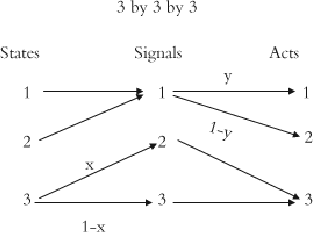
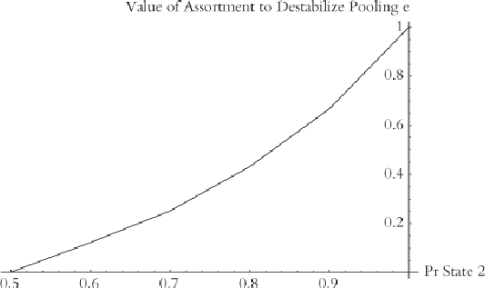

#### Signals: Evolution, Learning, and Information

Brian Skyrms https://doi.org/10.1093/acprof:oso/9780199580828.001.0001 Published: 08 April 2010 Online ISBN: 9780191722769 Print ISBN: 9780199580828

Search in this book

CHAPTER

## 5 5EvolutioninLewisSignalingGames

Brian Skyrms

https://doi.org/10.1093/acprof:oso/9780199580828.003.0006 Pages 63–72 Published: April 2010

### Abstract

Signalingsystemshadbeenshowntobetheonlyevolutionarilystablestrategiesinn-state,n-signal,and n-actsignalinggames.Theyweretheonlyattractorsinthereplicatordynamics.Insimplecases,itwas clearwhyalmosteveryposiblestartingpointwascarriedtoasignalingsystem.Thischapterconsiders howfarthesepositiveresultsgeneralize.

Keywords: signals, signaling system, evolution, signaling games Subject: Philosophy of Science, Epistemology, Philosophy of Language Collection: Oxford Scholarship Online

“Theemergenceofmeaningisamoralcertainty”

BrianSkyrms,EvolutionoftheSocialContract

“Somethingismoralycertainifitsprobabilitycomessoclosetocompletecertaintythatthe differencecanotbeperceived.”

JacobBernouli,TheArtofConjecture

ThatwastheboldclaimImadein196abouttheevolutionofsignalingsystems.Signalingsystemshadbeen showntobetheonlyevolutionarilystablestrategiesinn‐state,n‐signal,(andhere)n‐actsignalinggames.They weretheonlyattractorsinthereplicatordynamics.Insimplecases,likethosediscusedinChapter1,itwas clearwhyalmosteveryposiblestartingpointwascarriedtoasignalingsystem.Howfardothesepositive resultsgeneralize?

Downloaded from https://academic.oup.com/book/3092/chapter/143889560 by Canadian Institutes of Health Research - Institute of Population & Public Health user on 28 January 2026

# The good news

- p. 64

Sendersnowhavetwoadditionalstrategies:Alwayssendsignal1,alwayssendsignal2.Receiversalsohavetwo additionalstrategies:Alwaysdoact1,alwaysdoact2.

Thesender'sstrategiesignorethestateandthereceiver'sstrategiesignorethesignal.Whynot?Wemayhavea populationofsendersandapopulationofreceivers.Inthiscasetherearefourposiblestrategiesrepresented ineachpopulation.Alternatively,theremaybeasinglepopulationwhereanindividualissometimesintherole ofsenderandsometimesintheroleofreceiver.Astrategyforanindividualspeci eswhattodowheninthe roleofsenderandwhattodointheroleofreceiver.Thereare16posiblestrategies.Whathappens?

Everythingstilworks ne.Signalingalwaysevolves,bothinone‐populationandtwo‐populationcontexts.We can'tdrawpictureswithalthestrategiesincluded,butitisstilposibletoestablishthatalmosteveryinitial pointiscarriedtoasignalingsystem. Itcanbeshownthataveragepayoffincreasesalongeverytrajectoryof thedynamics.Thentherecan'tbecycleslikethoseinrock‐scisors‐paper.Evolutionarydynamicshastogoto anequilibrium.Buttherearelotsofnewequilibriawhenweincludealstrategies.Notably,therearepooling

equilibria,inwhichthesenderignoresthestateandthereceiverignoresthesignal.However,itcanbeshown thataltheequilibriaotherthansignalingsystemsaredynamicalyunstable.Evolutionwon'thitthem.There arenopictures,butthestoryisjustlikethatinChapter1.

1

Bad news: states with unequal probabilities

Theforegoingisinthecontextwherenaturechoosesstateswithequalprobability.Thatisthesimplestcase, butthereisnoreason whynaturemaynotchoosestateswithunequalprobability:60%–40%,90%–10%,or

9%–1%.Thenthepoolingequilibriataketheformwheresenderstransmitnoinformationandreceivers ignorethesignalandalwaysdotheactsuitedtothemostlikelystate.

- p. 65

Considerthetwo‐state,two‐signal,two‐act,signalinggamewherenaturechoosesthestateswithequal probability.InChapter1,werestrictedthestrategiestothosethatmightbeusedbythosewhohavesignalingin mind.Thesendersentadifferentsignalineachstate.Thereceiverpickedadifferentactforeachsignal.They knew attheonsetthatstatesandsignalswereimportant,theyjusthadn'tsettledonasignalingsystem. Thisismakingthingstooeasy.Let'sputinalposiblestrategies.

Ifthemorelikelystateisverylikely,playersinsuchanequilibriummaydoquitewel.Wecannolongermake thecasethatthemutantsignalerswildoaswelagainstthenativesasthenativesdoagainsteachother.If bothsignalsaresentatrandom(butignoredbyreceivers)inthenativepopulation,thenmutantspursuinga signalingsystemstrategywilbeledtodothewrongacthalfthetime,whentheyreceiveanative'ssignal.They wildoperfectlyagainsteachother,butmostoftheirinteractionsarewithnatives.Sotheymakelotsof mistakes,whilethenativesusualydotherightthing.Theywildoworsethanthenatives.

Foratwo‐populationsetting,consideracasewherestate1ocurs90%ofthetimeandstate210%.Thena receiverwhoalwaysdoesact1,nomatterwhatthesignal,gainsaveragepayoffof.9.Hedoestherightactforthe state90%ofthetimeandmises10%ofthetime.Sohedoesreasonablywelwithoutanyinformation transmision.Considersuchapopulationofreceiverspairedwithapolymorphicpopulationofsenders,halfof whomalwayssendsignal1andhalfofwhomalwayssendsignal2.Everyonegetsanaveragepayoffof.9. Introduceafewsenderswhodiscriminatestates,andtheywildonobetterandnoworsethanthenatives.But ifweintroduceafewreceiverswhodiscriminatebetweensignalstocoordinatewiththefewsenders,theywil doverybadlyagainstthenatives.Againstthenativestheywilgetanaveragepayoffofonly.5.Thatwasgood enoughtogetafootinthedoorwhenthestateswereequiprobableandthenativesweremaking.5,butitisnot goodenoughwhenthestatesarenotequiprobable.Nowevolutionarydynamicswilsometimeshitsignaling

Downloaded from https://academic.oup.com/book/3092/chapter/143889560 by Canadian Institutes of Health Research - Institute of Population & Public Health user on 28 January 2026

- p. 66

Some good news

Ourpoolingequilibria,wherenoinformationistransferredarecharacterizedby(i)thereceiversignoringthe signalandalwaysdoingtherightthingforthemostprobablestateandsendersignoringthestate,eitherby(a) alwayssendingsignal1or(b)alwayssendingsignal2.Anymixofsendersoftypes(a)and(b)givesusapooling equilibrium.Thusthereisalineofsuchequilibria,correspondingtotheproportionofthetwotypesofsender. Theendpoints,representingalonetypeofsenderoraltheothertype,areunstable.Eachendpointcanbe destabilizedbyafewsignalingsystemmutants,ofanappropriatekind.Butevolutioncanleadtoanyofthe otherpointscorrespondingtoamixedpopulationofdifferenttypesofsenders.

Alineofequilibriaisstructuralyunstable,liketheconcentricorbitsintherock‐scisors‐paperexampleofthe lastchapter.Asmalchangeinthedynamicscanmakeabigchangeinthesetofequilibria.Sofarthedynamics havebeenpuredifferentialreproduction.Wecanmodifythedynamicsalittlebitbyputtinginalittlenatural variationintheformofmutation.

TheanalysisfortwopopulationshasbeencarriedoutbyJosefHofbauerandSimonHuttegger.Thereplicator dynamicsisreplacedwithitsnaturalgeneralization,thereplicator‐mutatordynamics. Eachgeneration reproducesacordingtoreplicatordynamicsbut(1‐ε)oftheprogenyofeachtypebreedtrueandε ofthe progenymutatetoaltypeswithequalprobability.(Self‐mutation isalowed.)Takingthecontinuoustime limitgivesthereplicator‐mutatordynamics.

2

- p. 67

systemsandsometimeshitpoolingequilibria,withthelikelihoodofthelatterincreasingwiththedisparityin probabilitybetweenthestates.Thebottomlineinboththeone‐ andtwo‐populationcasesisthatevolutionof signalingisnolongerguaranted.Howseriousisthisproblem?

Evolutioncanleadtopoolingequilibriawherenoinformationistransmittedwheneverstateshaveunequal probability.Itcanalsoleadtosignalingsystems.Itismorelikelythatwegetpoolingthelargerthedisparityin probabilitiesofthestates,buttheimpactonthewelfareoftheplayersissmaler.

Alittleuniformmutation(nomatterhowlittle)colapsesthelineofpoolingequilibriatoasinglepoint.(Thisis intuitivelyreasonable.Ifthereceiversaredisregardingthesignals,thereisnoselectionpresureonthe senders.Ifonetypeofsender,(a)or(b),ismorenumerous,moremutateoutthanmutatein.)Thebigquestion concernsthecharacterofthisonepoint.Isitanattractorthatpulsnearbystatestoit?Isitdynamicalyunstable, sothatforalpracticalpurposesweneedn'tworryaboutit?

Itdepends.Forstateswhoseprobabilitiesarenottoounequal,thispoolingpointisunstable.Thenouroriginal positiveresultisrestored.Signalingalwaysevolves!That'sthegoodnews.Butforwhenonestateismuchmore probablethantheother,thepoolingpointisanattractor.Signalingsometimesevolves,sometimesnot.That's thenotsogoodnews.Forequalandsmalmutationratesforbothsendersandreceivers,Hofbauerand Hutteggercalculatetheprobabilitywheretheswitchtakesplace.3 Itisbetween.78and.79.

That'snottoobad.Uptoprobability3/4,alittlemutationasuresthatalmostalinitialpointsevolveto signalingsystems.Thingsareevenmorefavorable,ifthereceivershaveahighermutationratethanthe senders.Ifreceiversexperimenttwiceasoftenassenders,paradiseisregained.Thebadequilibriumwithno informationtransferisalwaysdynamicalyunstable,forany(positive)stateprobabilities.Butwecannot asumethatsuchfavorablemutationratesarealwaysinplace.

Inaddition,weshouldnoticethattheseareresultsforpayoffsthatareal0forfailuresandal1forsuceses. Forveryinfrequentstateswherethepayoffsaremuchmoreimportant—suchasthepresenceofapredatorthedisparityinpayoffscanbalancethedisparityinprobabilities.Predatorsmayberare,butitdoesnotpayto disregardthem.

Downloaded from https://academic.oup.com/book/3092/chapter/143889560 by Canadian Institutes of Health Research - Institute of Population & Public Health user on 28 January 2026

Thisconsiderationcanrestorealmostsureevolutionofsignalingforrareevents.

# p. 68 More bad news: partial pooling

Whathappenswhenwemovetothreestates,threesignals,andthreeacts?Wegobacktothefavorable asumptionthatalstatesarechosenwithequalprobability.Nevertheles,awholenewclasofequilibria appears.Supposethatasendersendssignal1inbothstates1and2,andinstate3sendseithersignal2or3 withprobabilitiesxand(1–x)respectively.Andsupposethatthereceiver,ongettingsignals2or3alwaysdoes act3,butongettingsignal1doeseitheract1oract2withprobabilitiesyand(1‐y)respectively.Thisisshownin  gure5.1

Figure 5.1: Partial pooling equilibria.

##### p. 69

Foranycombinationofvaluesofxandyaspopulationproportions,including0and1,wehaveapopulation statethatisadynamicequilibrium.Wethushaveanin nitesetofequilibriumcomponents.Consideringx goingfrom0to1andygoingfrom0to1,wecanvisualizethissetasasquareofequilibria.Theseequilibria poolstates1and2together,butdonotpoolalstatestogether—sotheyarecaledpartialpoolingequilibria. Becauseinformationisimperfectlytransmitted,senderandreceiversuceed2/3ofthetime.Incomparison, totalpoolingwouldgiveapayoffofonly1/3,andperfectsignalingwouldgiveapayoffof1.

4

Intotalpoolingequilibria,wherealstatesarelumpedtogether,noinformationistransmitted.Inpartial poolingequilibria,someinformationistransmitted,butnotasmuchaswouldbeinasignalingsystem.

Ifwerunsimulationsofevolutionarydynamicsin3state,3signal,3actLewissignalinggameswith equiprobablestates,weneverobservetotalpoolingequilibria,butwedoseepartialpoolingbetween4%and 5%ofthetime.5 Howisthisposible?Arethesesimulationstobetrusted?

Therearefourposiblepairsofpurepopulationscorrespondingtovaluesof0or1forxandy.Eachofthese populationstatesisadynamicalyunstableequilibrium. Butmixedpopulations,correspondingtonon‐ extremevaluesofxandy,arealstableequilibria.Noticethatinanyofthesestates,signaling‐systeminvaders woulddoworseagainstthenativesthanthenativesdoagainstthemselves.Likewiseforanyotherinvaders. Youcangothroughaloftheotherposibleothersenderandreceiverstrategies,andnoneofthemdoaswel againstamixedpoolingpopulationasthepoolersdoagainstthemselves.Ifyouarecloseenoughtotheinterior oftheplaneofpartialpoolingequilibria,thedynamicswilleadyourightintoit.Thesimulationswerea reliableguide.Anon‐trivialsetofpopulationproportionsevolvesbyreplicatordynamicstopartialpooling ratherthansignalingsystems. InaperfectlyordinaryLewissignalinggame,evolutioncansometimes spontaneouslycreatethesynonymsandinformationbottlenecksthatwearti cialypostulatedinChapter1!

6

7

8

Downloaded from https://academic.oup.com/book/3092/chapter/143889560 by Canadian Institutes of Health Research - Institute of Population & Public Health user on 28 January 2026

# p. 70 Mutation one more time

Thesetofpartialpoolingequilibriaintheforegoingdiscusionisagainanindicationofstructuralinstability.As before,letustryalittlemutation.Itishardtodoafulanalysisofthisgame,butindicationsarethatalittle mutationdestroyspartialpoolingandalwaysgetsussignaling.Partialpoolingsquarescolapsetosinglepoints andmovealittlebitinwardtoaco modateafewmutantsofothertypes.Althoughtheseequilibriaofpartial informationtransfersurvive,theyaredynamicalyunstable.Perturbedsignalingsystems,incontrast,are asymptoticalystableattractors.Simulationsusingdiscrete‐timereplicator‐mutatordynamicswithboth1% and0.1%mutationratesfoundthatthesystemalwaysconvergedtoa(perturbed)signalingsystem equilibrium.

Correlation

##### p. 71

Inthelastchapter,asortmentofencountersmadeacameoappearance.Asortmentofencounters—thatis, positivecorrelationoftypesinencounters—playsthemajorroleinexplanationsoftheevolutionofaltruism. Altruism,modeledascooperationinthePrisoner'sDile ma,cannotevolvewithrandompairing.Butitcan whenthereissuf cientpositivecorrelationoftypes,sothatcooperatorstendtomeetcooperatorsand defectorstendtomeetdefectors. Mechanismsexistinnaturetopromoteanasortmentofencounters.There isnoreasontobelievethattheyshouldoperateonlyinPrisoner'sDile masituations.

9

Theycanmakeadifferenceinevolutionofsignaling.LetusgobacktoaLewissignalinggamewithtwostates, twosignals,andtwoacts,wherenaturechoosesstate1withprobability.2andstate2with probability.8. Hereweconsideraone‐populationmodel,inwhichnatureasignsrolesofsenderorreceiveron ipofafair coin.Wefocusonfourstrategies,writtenasavectorwhosecomponentsare:signalsentinstate1,signalsentin state2,actdoneaftersignal1,actdoneaftersignal2.

- s1=<1,2,1,2>
- s2=<2,1,2,1>
- s3=<1,1,2,2>
- s4=<2,2,2,2>

The rsttwostrategiesaresignalingsystems,theothersarepoolingstrategies.(Otherstrategiesneglected herearelosersthatrapidlygoextinct.)

Considerthefolowingmodelofasortment(dueoriginalytoSewalWright):

Probability(simeets si) = p(si) + e[1 p(si)]

Probability(simeets different sj) p(sj) e p(sj)

wherepdenotespopulationproportion.Theprobabilityofencounteringyourowntypeisaugmentedandthat ofencounteringadifferenttypeisdecremented.Ife=1,asortmentisperfect;ife=0encountersarerandom.

Nowconsiderthepoint,z,inthelineofpoolingequilibriawherep(s3)=p(s4)=.5.

Downloaded from https://academic.oup.com/book/3092/chapter/143889560 by Canadian Institutes of Health Research - Institute of Population & Public Health user on 28 January 2026

Thispointisstable.(Itis,infact,thepointonthelinewithstrongestresistancetoinvasionbysignalers.)We feedinasortment.Betweene=.4ande=.5,zchangesfrombeingstabletounstable.Thishappensatabout e=.45.Ifprobabilitiesofstatesaremoreunequal,ittakesgreatercorrelationtodestabilizepoolingand guaranteetheevolutionofsignaling.Thisisshownin gure5.2.Butifneitherstateiscertain,thereisalways somedegreeofcorrelationthatwildothetrick.

Figure 5.2: Assortment destabilizes pooling.

- p. 72 Thisshowsthepowerofcorrelationintheabstract.Itremainstoinvestigatetheeffectofspeci ccorrelation devicesontheevolutionofsignaling.10

# Eating crow

Evenafteralthegoodnewsisin,thereremainsarealposibilityofevolutionfalingshortofasignaling system.Theemergenceofasignalingsystemisnotalwaysamoralcertainty.Iwaswrong.Butsignalingcan stiloftenemergespontaneously,eventhoughperfectsignalingisnotguaranteedtoalwaysemerge. Democritusisstilright,butwecanbegintoseethenuanceinhowheisright.

# Notes

- 1 Huttegger 2007a; Hofbauer and Huttegger 2008.
- 2 Hadeler 1981; Hofbauer 1985.
- 3 Technically, this is called a “bifurcation.”
- 4 There is likewise a square of partial pooling equilibria that lumps states 2 and 3 together, and one that pools states 1 and 3.
- 5 Simulations using discrete time replicator dynamics by Kevin Zollman led to partial pooling in 4.7% of the trials, and to signaling systems the rest of the time.
- 6 The instability stems from the fact that if a small number of senders and receivers that form the right signaling system were added they would out‐compete the natives. They would do equally well against the natives, but better against each other. But each of these partial‐pooling type populations requires a di erent signaling system to destabilize it, and each of these signaling systems does badly against the other type of partial‐pooling.
- 7 There are proofs of this in Huttegger 2007a and in Pawlowitsch 2008.
- 8 Signals 2 and 3 function as synonyms, leaving only one signal for the remaining two states and two acts.
- 9 See Hamilton 1964; Skyrms 1996; Bergstrom 2002.
- 10 One correlation mechanism found widely in nature is local interaction in space, or in some social network structure. Wagner 2009 shows how network topology influences evolution of signaling systems.

Downloaded from https://academic.oup.com/book/3092/chapter/143889560 by Canadian Institutes of Health Research - Institute of Population & Public Health user on 28 January 2026

