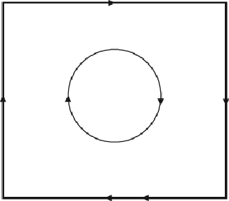

#### Signals: Evolution, Learning, and Information

Brian Skyrms https://doi.org/10.1093/acprof:oso/9780199580828.001.0001 Published: 08 April 2010 Online ISBN: 9780191722769 Print ISBN: 9780199580828

Search in this book

CHAPTER

## 6 6Deception

Brian Skyrms

https://doi.org/10.1093/acprof:oso/9780199580828.003.0007 Pages 73–82 Published: April 2010

### Abstract

Thischaptershowsthatinalkindsofsignalingsystemsinnaturethereisinformationtransmision whichissuf cienttomaintainsignaling,butthereisalsomisinformationandevendeception. Misinformationisstraightforward.Ifreceiptofasignalmovesprobabilitiesofstatesitcontains informationaboutthestate.Ifitmovestheprobabilityofastateinthewrongdirection—eitherby diminishingtheprobabilityofthestateinwhichitissent,orraisingtheprobabilityofastateotherthan theoneinwhichitissent—thenitismisleadinginformation,ormisinformation.Ifmisinformationis sentsystematicalyandbene tsthesenderattheexpenseofthereceiver,thenitisdeception.

Keywords: deception, signals, signaling system, misinformation Subject: Philosophy of Science, Epistemology, Philosophy of Language Collection: Oxford Scholarship Online

“Icanbynomeanswilthatlyingshouldbeauniversallaw.Forwithsuchalawtherewouldbeno promisesatal,sinceitwouldbeinvaintoalegemyintentioninregardtomyfutureactionstothose whowouldnotbelievethisalegation…”

I manuelKant,FundamentalPrinciplesoftheMetaphysicsofMorals1

“thetruth,thewholetruthandnothingbutthetruth.”

TraditionalinEnglishCo monLaw

Downloaded from https://academic.oup.com/book/3092/chapter/143890445 by Canadian Institutes of Health Research - Institute of Population & Public Health user on 28 January 2026

# Is deception possible?

- p. 74

Nevertheles,biologistsmayworryaboutthestabilityofsignalingsystemsinthepresenceofdeceptionand philosopherssometimeswonderwhetherdeceptionevenmakessenseinthecontextofanaturalistictheoryof meaning.Thephilosophers,asusual,aremoreskeptical.Acordingtotheirargument,asignalsimply“means conditionsaresuchastocausethissignaltobesent.Asignalcanotbefalse.Deceptionisimposible.

Systematic deception

OnemightbetemptedtotreatKituiasananomaly,anindividualwithnon‐standardpayoffswhohappensto wanderintoawel‐establishedsignalingsystem.Ifso,notmuchmoreneedstobesaid.Buttheuseof systematicdeceptivealarmcalshasbeendocumentedinmanyspecies,bothtodriveothersawayfroma newlydiscoveredfoodsourceand—likeKitui—todetersexualrivals. Theseincludebirdsandsquirrels,who poselesofatemptationtoanthropomorphismthanmonkeys.Fortwospeciesofbirds,great titsandshrike tanagers,frequencyoffalsealarmsignalsseemstobegreaterthanthatoftrueones.

3

- p. 75

Itseemslikeasilyquestion.Anytheorythatsaysthatdeceptionisimposibleisanon‐starter.Deceptionis widespreadenoughinhumanaffairs,butitisnotcon nedtoourownspecies.Considerthecaseofalow‐ rankingmalevervetmonkey,Kitui,reportedbyCheneyandSeyfarth. Inintergroupencounters,Kituigave falseleopardalarmcalswhenanewmaleattemptedtotransfertohisgroup.Butbothgroupsbecameexcited, ranuptrees,andthe transfernevertookplace.YoumightwonderwhetherKituiwasjustnervous,terribly afraidofleopardsandpronetomistakes.IfKituiwerejustmakingmistakes,thenhisalarmcalswere misinformation,butnotdeception.Theyweremisinformationbecausethestatewasnoleopard,andthe

2

probabilityofaleopardbeingpresentgoesupgivenaleopardalarmcal.RecalingChapter3,thereisapositive quantityofinformationinthesignalbecauseitmovestheprobabilitiesofthestate,butthisuseofthesignalis misinformationbecauseitdecreasestheprobabilityofthetruestateandincreasestheprobabilityofthefalse

state.Wesuspect,however,thatthesearenotsimplymistakesbecauseKituidoesthisrepeatedlyandthe resultsaretohisowninterestandagainsttheinterestsofthereceivers.Ifso,weappeartohaveacaseof deception.

Or,ifthetemptationtoimagineamentallifeisstiltherewithbirdsandsquirrels,considerasomewhat differentcaseofdeception.Fire iesusetheirlightforsexualsignaling.Inthewesternhemisphere,males y overmeadows, ashingasignal.Ifafemaleonthegroundgivesthepropersortofanswering ashes,themale descendsandtheymate.The ashing“code”isspecies‐speci c.Femalesandmalesingeneraluseandrespond tothepatternof ashesonlyoftheirownspecies.

Thereis,however,anexception.Afemale re yofthegenusPhoturis,whensheobservesamaleofthegenus Photinus,maymimicthefemalesignalsofthemale'sspecies,lurehimin,andeathim.Shegetsnotonlyanice meal,butalsosomeusefulprotectivechemicalsthatshecannotgetinanyotherway.Onespecies,Photuris versicolor,isaremarkablyacomplishedmimic—capableofsendingtheappropriate ashpatternsof1 Photinusspecies.Iwouldsaythatthisquali esasdeception,wouldn'tyou?

Letusthinkaboutthis,notintermsofsomepropositionalcontentimputedtothesignal,butintermsofits informationalcontent.Weconsidertheprobabilitiesofthestates,andtheprobabilitiesofthestatesconditional onthesignalbeingsent. Inthecaseofthefalsealarmcal,theprobabilityoftherebeingapredatorpresent conditionalonthealarmcalbeingsentishigherthantheunconditionalprobability.Itisnotequaltoone,and maynotevenbeclosetoone,duetowhatwehavecaledsystematicdeception.Butthesignalstilraisesthis probability.

4

Downloaded from https://academic.oup.com/book/3092/chapter/143890445 by Canadian Institutes of Health Research - Institute of Population & Public Health user on 28 January 2026

- p. 76

Thesignalcarriesmisinformation.

Signalscarryingmisinformationmightsometimesresultfrommistakes.Forinstance,wemightsupposethat ocasionalyasexualyreceptivefemaleofanotherspeciesgetsher ashpatternmixedupandsendsthe appropriatesignalforPhotinus.ButPhoturisisnotmakingamistake;sheisgettingdinner.Thisisa systematicuseofmisinformationtomanipulatethebehaviorofthereceiverfortheadvantageofthesender.

Thisisdeception.

Half‐truth

Butthe re ymatingsignalalsoincreasestheprobabilityofthepresenceofapredator.Itsinformational contentismixed.Letuslookatthematteralittlemoreclosely.WhenacruisingPhotinus looksforan opportunitytomate,naturechoosesamongthreestates:sexualyreceptivePhotinuspresent,hungryPhoturis present,nothinghappening.Photinuscanreceiveoneoftwosignals,thematingsignalorthenulsignal(that is,norealsignal).

- p. 77

Thisisalittledifferentfromthemodelswehaveconsidered,butthesamewayofthinkingofinformation aboutstatescanbeapplied.Thereisabaselinefrequencyforeachofthestates.Therearefrequencieswhenthe signalissent.Wecanasumeforsimplicitythatinthe rsttwostatesthematingsignalisalwayssentandthe thirdalwaysleadstothenulsignal.Thenthematingsignalbeingsentraisestheprobabilityofbothkindsof partner,butleavestheratiounchanged.Ifyouwanttothinkofitassaying“Iamthekindwhosendsthis signal,”youcanthinkofitastelingthetruth.Butitisonlyahalf‐truth.

Whensentbythepredatoritcontainsmisinformationinthatitraisestheprobabilitythatasexualyreceptive partnerisavailable.Whensentbythepotentialmate,italsocontainsmisinformation,becauseitraisesthe probabilityofapredator.Butonlythe rstcasecountsasdeceptionbecauseonlyinthiscasedoesthesender pro tattheexpenseofthereceiver.Ahalf‐truthcanbeaformofdeception.

Where deception is impossible

Let'sjustchangethepayoffstructurefromco moninteresttodiametricalyopposedinterestinoursimplest signalinggame.Naturechoosesbetweentwostateswithequalprobability;thesenderchoosesbetweentwo signals;thereceiverchoosesbetweentwoacts.Butnowthereceivergetspaidwhentheactmatchesthestate, andthesendergetspaidwhenitdoesn't.

Theonlyequilibriainthisgamearepoolingequilibria.Ifthesignalsgavethereceiverinformationaboutthe state,thereceivercouldexploitthesender.Ifthereceiveralteredherbehaviorinresponsetothesignalshe couldbemanipulatedbythesender. Deceptionisimposiblebecausethesignalscarrynoinformationatal. Theprobabilityofeachstate(andofeachact)beinggivenasignalisequaltoitsunconditionalprobability.The

- p. 78

Ifthesignalissentinasituationwherethesenderobservesnopredator,itismisinformation.If,inaddition,itis systematicalysenttothebene tofthesenderandthedetrimentofthereceiver,itisdeception.5

Likewise,thesexualpredatorPhoturissendsasignalthatraisestheprobabilityofthestateofasexualy receptivefemalebeingpresentwhenthatisnotthetruestate.Thisisjustaquestionofactualfrequencies. Thereisafrequencyofreceptivefemalesbeingpresentandthereisafrequencyofreceptivefemalesin situationswherethematingsignalisgiven.Thesecondfrequencyishigherthanthe rst.Asaconsequence, thereceivingmalesareledtoactionsthattheywouldnottakeiftheycoulddirectlyobservethestate.

Downloaded from https://academic.oup.com/book/3092/chapter/143890445 by Canadian Institutes of Health Research - Institute of Population & Public Health user on 28 January 2026

informationalcontentvectorsareallfulofzeros;thequantityofinformationaboutstates(andaboutacts)in eachsignaliszero;theinformation owisnonexistent.

Thatisonlyinequilibrium.Alotoflifeislivedoutofequilibrium.Ifreceiverstendtodoactoneforsignalone andacttwoforsignaltwo,thensenderscanpro tbydeceivingreceivers.Ifsenderstendtosendsignaltwoin state1andconversely,thenreceiverscanimprovetheirlotbylearningtoreadtheinformationinsenders' signals—thatis,byadjustingtheirstrategiestoturnmisinformationintousefulinformation.Deceptionisone oftheforcesthatdrivethesystemtoequilibrium.

Thatis,ifthesystemgoestoequilibrium.Itmaynot.Considerourgamewithstrategiesrestrictedtosignaling strategies.Thesendersendsadifferentsignalineachstate,andthereceiverdoesadifferentactforeachsignal. Therearenowonlytwosender'sstrategiesandtworeceiver'sstrategies.Payoffsare:

##### Receiver 1 Receiver 2

Sender 2 1, 0 0, 1

Sender 1 0, 1 1, 0

Withtwopopulations,thepopulationproportionsliveonasquare,withthexaxisbeingtheproportionof receiversplayingtheirstrategytwo,andtheyaxisbeingtheproportionofsendersplayingtheirstrategy2. Withthereplicatordynamicsweseecycles,ratherthanconvergencetoequilibrium,asshownin gure6.1.

Figure 6.1: Cycles with opposed interests.

- p. 79

Inthetophalfofthesquarethesenderstrategy1conveysmisinformation.Ineachstate,itssignalsmovethe probabilityofthestateoff1/2inthewrongdirectionbecauseoftheprevalenceinsenderstrategy2.Likewise, inthebottomhalfofthe square,strategy2conveysmisinformation.Senderstrategy1pro tsatthe expenseofreceivers,onaverage,intherighthalfofthesquareandsenderstrategy2issystematicaly pro tableinthelefthalf.So,acordingtoourde nition,deceptionpredominatesintheupperrightandlower leftquadrants.Sender'sdeceptionandreceiver'sadaptationsdrivethecycleroundandround.(Thesame phenomenoncanberealizedinasinglepopulation,wherethepayoffshavearock‐scisors‐paperstructure.)

Downloaded from https://academic.oup.com/book/3092/chapter/143890445 by Canadian Institutes of Health Research - Institute of Population & Public Health user on 28 January 2026

# Prevalence of deception

Considerstandardsender‐receiversignalinggameswithalsortsofpayoffs.Casesofpureco moninterest andofpurecon ictaretheextremes.Asthenumberofstates,signalsandactsgrows,andasdyadic interactionsgivewaytonetworks,thepureextremecasesbecomelesandleslikely.Whatistypicalisacase ofmixedinterests,insomecombinationofpartialalignmentandpartialdivergence.Frompurelyabstract considerations,whatweshould expecttopredominateissomecombinationofinformationand misinformation.

- p. 80 6

Thatiswhatwe nd.Inalkindsofsignalingsystemsinnaturethereisinformationtransmisionwhichis suf cienttomaintainsignaling,butwealso ndmisinformationandevendeception.Afteranextensivereview ofmodelsofanimalsignalsandoftherelevantempiricalevidencebearingonthesemodels,Searcyand Nowickiconclude“Evidencesupportingtheocurrenceofdeceptionhasbeenfoundinalthemajorcategories ofsignalingsystemsthatwehavediscused,includingbegging,alarming,matingsignalsandaggresive signals.”7

How is deception possible?

Wehavebeenabletocharacterizemisinformationanddeceptioninbehavioralterms.Despitesomemisgivings inthephilosophicalliterature, misinformationisstraightforward.Ifreceiptofasignalmovesprobabilitiesof statesitcontainsinformationaboutthestate.Ifitmovestheprobabilityofastateinthewrongdirectioneitherbydiminishingtheprobabilityofthestateinwhichitissent,orraisingtheprobabilityofastateother thantheoneinwhichitissent—thenitismisleadinginformation,ormisinformation.Ifmisinformationissent systematicalyandbene tsthesenderattheexpenseofthereceiver,wewillnotshrinkfromfolowingthe biologicalliteratureincalingitdeception.

8

Incertaincasesofdiametricalyopposedinterestsitisimposible,asKantsays,foreveryonetopractice deception,atleastinequilibrium.Thatisbecause,inequilibrium,thereisnoinformationatalinthesignals. Inagamewithpartialyalignedinterestsitmaybeintheinterestofasendertorestrictinformationto manipulatea receiveranditmayneverthelesbeintheinterestofareceivertoactontheinformationthat shegets.Considerthefolowingpayoffs(forequiprobablestates):

- p. 81

##### Act 1 Act 2 Act 3

- State 1 2, 10 0, 0 10, 8
- State 2 0, 0 2, 10 10, 8
- State 3 0, 0 10, 10 0, 0

Ifeveryoneusesthestrategy,Ifsendersendsignal1instates1and2andsignal2instate3;ifreceiverdoact3on receiptofsignal1andact2onreceiptofsignal,2thesituationisanequilibrium.Inthisequilibrium,theocupant ofthesender'srolealwaysmanipulatestheocupantofthereceiver'srole.Instateone,thesender'ssignalisa half‐truthinthatitraisestheprobabilityofstate2.Instate2thesender'ssignalisahalf‐truthinthatitraises theprobabilityofstate1.Thesehalf‐truthsinducethereceivertochooseact3instates1and2,whereas acurateknowledgeofthestatewouldleadhertochooseeitheract1oract2.Themanipulationleadstoa

Downloaded from https://academic.oup.com/book/3092/chapter/143890445 by Canadian Institutes of Health Research - Institute of Population & Public Health user on 28 January 2026

greaterpayoffforthesenderandasmaleroneforthereceiver.Inthissense,universaldeceptionin equilibriumisindeedposible.

Itmightbeobjectedthatthisisnotuniversaldeceptionbecauseifnaturechoosesstate3,thesignalsentisnot deceptive.Wehaveuniversalstrategiesthatincorporatedeception,butnotuniversaldeception.Theobjection canbemetbysimplyexpandingthegamesothereisanequilibriuminwhichstate3ispooledwithanewstate 4:

##### Act 1 Act 2 Act 3 Act 4

- State 1 2, 10 0, 0 10, 8 0, 0
- State 2 0, 0 2, 10 10, 8 0, 0
- State 3 2, 10 0, 0 0, 0 10, 8
- State 4 0, 0 2, 10 0, 0 10, 8

- p. 82

Nowitwouldbeinthereceiver'sbestadvantagetodoact1instates1and3andact2instates2and4.Butthere isanequilibriuminwhichthesendersendsonesignalinbothstates1and2andanotherinbothstates3and4, andthereceiverdoesact3uponreceivingthe rstsignalandact4onreceivingthesecond.Giventhe informationsupplied,thereceiverbehavesoptimaly,preferringasurepayoffof8toa50%chanceof10.The senderhasmanipulatedthereceivertoasureherselfapayoffof10.Everysignalsentinthisequilibriumis deceptive.

Universaldeceptioninthisstrongsenseisnotonlylogicalyconsistentinthesenseofinvolvingno contradiction,butalsoevolutionarilyconsistentinthesenseofbeinganequilibrium.Iwouldremindthosewho wouldinsistthatdeceptionisamatterofintentions,thattheequilibriumisalsoconsistentwithrationalchoice. Senderandreceivermaybeperfectlyawareofwhatisgoingonandbeperfectlyrationalandstilintendtodo whattheyaredoing.

Kantwaswrong,wasn'the?(Atleastifhalf‐truthscountasdeceptions.)Wel,youmightsay,hewaswrongto thinkthattherewasanactualinconsistencyinvolvedbutrightthatyoucannotwilldeceptiontobeauniversal law.Forwouldn'tourplayerspreferasysteminwhichthesignalscarryperfectinformationaboutthestates? Theywouldnot.

Ifitwereauniversallawthatthesenders'signalsidentifythestatesandthatthereceiverschoosetheactthatis bestresponsetothatinformation,theoutcomesarethoseitalicizedinthepayofftable.Comparethesewiththe deceptiveequilibrium,whoseoutcomesareshowninboldface.Ifoneisintheroleofsenderhalfthetimeand thatofreceiverhalfthetime,theaveragepayoffwithhonestsignalingis6andthatfordeceptionis9. Deceptionisgoodforyou.Youwouldchoosethedeceptiveequilibriumasuniversallaw.

Wel,perhapsKantisnottalkingaboutthisgame,butaboutalgames.Youcannot(rationaly)wildeceptionto beuniversallawinalgames.Fairenough.Butourexampleshowsthatonecannotrationalywillhonest signalingtobeauniversallaweither.Thatismypoint.Ifweconcentrateonafewextremecases,wemisalot ofwhatisimportantinco munication.

# Notes

Downloaded from https://academic.oup.com/book/3092/chapter/143890445 by Canadian Institutes of Health Research - Institute of Population & Public Health user on 28 January 2026

- 1 Here is the full quotation, in the translation of Thomas Kingsmill Abbott: “I can by no means will that lying should be a universal law. For with such a law there would be no promises at all, since it would be in vain to allege my intention in regard to my future actions to those who would not believe this allegation, or if they over hastily did so, would pay me back in my own coin. Hence my maxim, as soon as it should be made a universal law, would necessarily destroy itself” (Kant 1785).
- 2 Cheney and Seyfarth 1990.
- 3 See Searcy and Nowicki 2005: ch. 6 for review and references.
- 4 As in Chapter 3.

- 5 One could argue over whether the clause about the detriment of the receiver should be included. Searcy and Nowicki 2005: 5 leave it out:

we will define deception as occurring when:

- 1. A receiver registers something Y from a signaler;
- 2. The receiver responds in such a way that

- a. Benefits the signaler and
- b. Is appropriate if Y means X; and

- 3. It is not true that X is the case.”

Maynard Smith and Harper 2003: 86 put it in. I do not think that much hangs on the choice; we could talk about strong and weak deception. What is important is that our definition is information‐based, rather than depending on imputed propositional content that is false. Imputation of propositional content to animal signals is always problematic. It might make a limited amount of sense in a favorable equilibrium. The information‐based concept, however, always makes sense—both in and out of equilibrium.

- 6 See Crawford and Sobel 1982.
- 7 Searcy and Nowicki 2005: 223.
- 8 For a review of the philosophical literature on this subject and commentary see Godfrey‐Smith 1989.

Downloaded from https://academic.oup.com/book/3092/chapter/143890445 by Canadian Institutes of Health Research - Institute of Population & Public Health user on 28 January 2026

