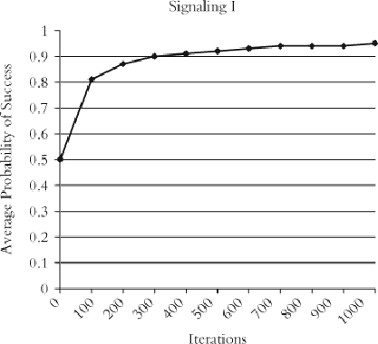
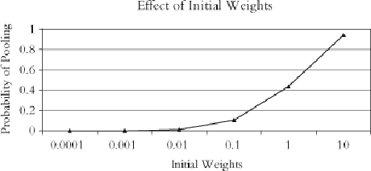
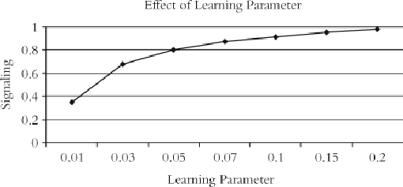

#### Signals: Evolution, Learning, and Information

Brian Skyrms https://doi.org/10.1093/acprof:oso/9780199580828.001.0001 Published: 08 April 2010 Online ISBN: 9780191722769 Print ISBN: 9780199580828

Search in this book

CHAPTER

## 8 8LearninginLewisSignalingGames

Brian Skyrms

https://doi.org/10.1093/acprof:oso/9780199580828.003.0009 Pages 93–105 Published: April 2010

### Abstract

Thischapterarguesthatwecananddolearntosignal.Wearenottheonlyspeciesabletodothis, althoughothersmaynotdoitsowel.Therealquestioniswhatisrequiredtobeabletolearntosignal.Or, better,whatkindoflearningiscapableofspontaneouslygeneratingsignaling?Ifthelearningsomehow hasthesignalingsystempreprogramedin,thenlearningtosignalisnotveryinteresting.Ifthelearning mechanismisgeneralpurposeandlowlevel,learningtosignalisquiteinteresting.

Keywords: signals, signaling, learning Subject: Philosophy of Science, Epistemology, Philosophy of Language Collection: Oxford Scholarship Online

Canwelearntosignal?Obviouslywecananddo.Wearenottheonlyspeciesabletodothis,althoughothersmay notdoitsowel.Therealquestioniswhatisrequiredtobeabletolearntosignal.Or,better,whatkindof learningiscapableofspontaneouslygeneratingsignaling?Ifthelearningsomehowhasthesignalingsystem preprogramedin,thenlearningtosignalisnotveryinteresting.Ifthelearningmechanismisgeneralpurpose andlowlevel,learningtosignalisquiteinteresting.InChapter1,wesawthatforonekindofsignalinggame, lowlevelreinforcementlearningcouldlearntosignal.Ifmanykindsoflowlevellearningalowthe spontaneousemergenceofsignalinginmanysituations,weareonthewaytoarobustexplanation.

# Roth–Erev reinforcement

- p. 94

Wereturntotwo‐state,two‐signal,andtwo‐actgameswithstatesequiprobable,andputinalposible strategies.Therearenowanin nitenumberofpoolingequilibria,aswelasthesignalingsystems.Wewould mostlikeananalysisofthiscasewherereinforcementoperatesnotonwholestrategies,butratheron individualacts.Thenagentswouldnotevenneedtoseethesituationsthey ndthemselvesinaspartofa singlegame.

Downloaded from https://academic.oup.com/book/3092/chapter/143891802 by Canadian Institutes of Health Research - Institute of Population & Public Health user on 28 January 2026

Supposethatthesenderhasaseparatesetofinclinationweights—ofacumulatedpastreinforcements—for eachstateoftheworld.Youcanthinkofeachstateascomingequippedwithitsownurn,withbalsofdifferent colorsfordifferentsignalstosend.Thereceiverhasaseparatesetofacumulatedreinforcementsforeach signal.Youcanthinkofthereceiverashavingadifferenturnforeachsignalreceived,withbalsofdifferent colorsfordifferentactstochoose.

Spontaneousemergenceofsignalinginthismorechalengingset‐upwouldbefullyconsonantwiththespirit ofDemocritus,“whosetstheworldatchance.”Itrequiresnostrategicreasoning,justchanceand reinforcement.Thisis,infact,justwhathappens.Individualsalwayslearntosignalinthelongrun.Thisisnot onlycon rmedbyextensivesimulations,itisalsoatheorem. Inthissituationindividualsconvergetoa signalingsystemwithprobabilityone,withthetwoposiblesignalingsystemsbeingequalylikely. Spontaneousemergenceofsignalingisvirtualyguaranteed.

1

2

Thatislimitingbehavior,butwhatoftheshortrun?Figure8.1showstheresultsofsimulationsstartingwith initialweightsalequalto1.Learningisfast.Onaverage,after100trialsindividualshavean80%sucesrate.

- p. 95 After300trialstheyareright90%ofthetime.

Figure 8.1: Learning to signal with 2 states, 2 signals, 2 acts with states equiprobable. Initial weights =1. Reinforcements for success=1.

Harder cases

Doesthebadnewsaboutthereplicatordynamicscarryoveraswelasthegoodnews?Doesreinforcement learningsometimeslearnpartial‐pooling(withonlypartialinformationtransfer)inLewisgameswiththree states,threesignals,andthreeacts?Anddoesitsometimesendupintotalpooling(withnoinformation transfer)wherethereareonlytwostates,signalsandacts,andthestateshaveunequalprobabilities?

Afulanalytictreatmentofthesequestionsisnotavailable.Buttheycanbeinvestigatedbysimulation.Wewill concentrateonreinforcingacts.Thereisonlyoneparameterofthereinforcement,theinitialweightswith whichwestarttheproces.Forthepurposeofinitialsimulations,westarteachplayerwithaninitialweightof oneforeachposiblechoice,playerschoosewithprobabilityproportionaltotheirweights,andweaugment

weightsbyadingapayofofoneforasuces.InLewissignalinggameswiththreeequiprobable states, threesignalsandthreeacts,reinforcementlearninglearnstosignalinalittlemorethan90%oftrials,but landsonpartialpoolingintherest.Asthenumberofstates,signalsandactsincreasesthesucesrategoes

- p. 96

Downloaded from https://academic.oup.com/book/3092/chapter/143891802 by Canadian Institutes of Health Research - Institute of Population & Public Health user on 28 January 2026

down.Ifthenumberis4,simulationshitsignalingalittlelesthan80%;ifthenumberis8,perfectsignaling emergeslesthanhalfthetime.3

Andeveninthebasicgamewherethenumberofstates,signalsandactsis2,unequalprobabilityofthestates cansometimesleadtosignalsthatcontainnoinformationatal.Howoftendependsonthemagnitudeofthe inequality.Whenonestatehasprobability.6,suboptimaloutcomeshardlyeverhappen,atprobability.7they happen5%ofthetime.Thisnumberrisesto 2%forprobability.8,and 4%forprobability.9. Suboptimal equilibriaarestilthere.

- 4

RothandErevfoundtheirlearningrelativelyinsensitivetoinitialchoiceofweights,buttheywereconsidering adifferentclasofgames.Soweshouldtryvaryingtheweightparameter.Wesettheprobabilitiesofstates quiteunequal,at90%–10%andrunreinforcementdynamicswithinitialweightsofdifferentordersof magnitude.Theprobabilityofendingupinpoolingequilibriuminsteadofasignalingsystemisshowninthe  gure8.2.

Figure 8.2: E ect of initial weights where state probabilities are 90%–10%.

Initialweightsmakeanenormousdifference!Ifweraisethemto10,thentheprobabilityofgettingtrappedina poolingequilibriumgoesupto94%.Ifwelowerthemto.01probabilityofpoolinggoesdownto1%.Andatthe minusculeinitialweightsof.0001,wesawnopoolingatal;eachtrialledtoasignalingsystem. Theone i nocuousparameterofRoth–Erevlearningbecomescrucial.Smalinitialweightsalsoleadtosignalingin largerLewissignalinggames.

- 5

- p. 97

Bush–Mosteller reinforcement

InthesimplestLewissignalinggamewithequiprobablestates,itwasprovedthatRoth–Erevlearnerswould learntosignalwithprobabilityone.Intheproof,itiscrucialthatRoth–Erevlearnersdonotlearntoofastor tooslowly.Theyareneithertoohotnortoocold.Thisisnolongertrueforreinforcementlearnerswholearn acordingtothebasicdynamicsofBushandMosteler.ThebasicBush–Mostelerlearningdynamicsistoo cold.Sometimesitfreezesintosuboptimalstates. Thisisnottosay,however,thatBush–Mostelerlearners neverlearntosignal.Togetanindicationofhowoftentheylearnsucesfully,andhowfast,weturnto simulations.

6

Thesurprisingresultisthat,despitethetheoreticalposibilitiesforunhappyoutcomes,Bush–Mosteler learnersareverysucesfulindeed.Theonlyparameterofthelearningdynamicsisthelearningrate,whichis

- p. 98

Howaretheyperformingtheirmagic?Theexplanationcannotcomeneartheendofthelearningproces. Theretheinitial weights,whethergreatorsmal,havebeenswampedbyreinforcement.Rather,smal initialweightsmusthavetheirimpactatthebeginningofthelearningproces,wheretheymaketheinitial probabilitieseasytomodify.Perhapstheexplanationisthattheybothfacilitateinitialexplorationandenhance sensitivitytosuces.

Downloaded from https://academic.oup.com/book/3092/chapter/143891802 by Canadian Institutes of Health Research - Institute of Population & Public Health user on 28 January 2026

betweenzeroandone.Inourbasicsignalinggame,forawiderangeoflearningratesbetween.05and.5, individualslearnedtosignalinatleast 9.9%ofthetrials.Theseresultsarefromrunningsimulationsoutto 10,000iterationsofthelearningproces.Fortheshortrun,considerjust300iterationsoflearning.Withthe learningparameterat.1,thenin95%ofthetrialsindividualshadalreadylearnedtosignalwithasucesrate ofmorethan98%.Learningtosignalisnolongerguaranteed,butitisstiltobestronglyexpected.

Whatofthemoreproblematiccases,inwhichstateshaveunequalprobabilities?

Here,variationsinthelearningparametercanmakeabigdifference,justasvariationsinthemagnitudesofthe initialweightsdidinRoth–Erevreinforcement.Forcomparisonwith gure8.2,wereconsiderthecasein whichthestateprobabilitiesare90%–10%.usingBush–Mosteler.7

Withahighenoughlearningparameter,wereliablylearntosignalevenwithhighlyunequalstateprobabilities. Ifweconcentrateontheshortandmediumrun,thesituationwith Bush–Mostelerreinforcementdoesn't lookmuchdifferentfromthatofRoth–Erevreinforcement.

- p. 99

Figure 8.3: E ect of learning parameter with state probabilities 90%–10%.

Exponential response

ConsiderRoth–Erevmodi edbyusinganexponentialresponserule.Choiceprobabilitiesarenolongersimply proportionaltoweights,butratherto:

Exp[λ*weight].

Theconstantλ controlsthenoiseintheresponseprobabilities.Whenλ=0,noisewashesoutalother considerations,andalposiblechoicesareequalyprobable.Whenλ ishigh,therulealmostalwayspicksthe alternativewiththehighestweight.

Theexponentialresponseruleinteractswithcumulativereinforcementsofpropensitiesinaninterestingway. Aspropensitiesgrow,thelearnermovesmoreandmoretowardsasurepickofthealternativewiththehighest propensity.Ifwestartwithaverysmalλ,westartwithlotsofrandomexplorationthatgradualymoves towardsdeterministicchoice.8

Intwo‐stateLewissignalinggameswithunequalstateprobabilities(probabilityofstateoneat.6,.7,.8,.9), simulationsofthislearningmodelwithsmalλ (.0001to.01)alwaysconvergetosignalingsystems. Similar resultsaregottenforthree‐stateLewisgames. Therangeofvaluesisnotimplausibleforhumanlearning. Thisformofreinforcementlearningalowsindividualstoavoidsuboptimalequilibriaandtoarriveatef cient informationtransfer.

9

- p. 100 10

Downloaded from https://academic.oup.com/book/3092/chapter/143891802 by Canadian Institutes of Health Research - Institute of Population & Public Health user on 28 January 2026

# More Complex Reinforcement

- p. 101

Neural Nets

PatrickGrim,PaulSt.Denis,andTrinaKokalis considerspontaneousemergenceofsignalinginneuralnets. Thereisaspatialarrayofagents,eachequippedwithaneuralnet.Bothfoodsourcesandpredatorsmigrate throughspace.Therearedifferentoptimalactions—feedorhide—inthepresenceofafoodsourceora predator.Individualscanutterpotentialsignalsthatarereceived(takenasinputs)bytheirneighbors.

14

Periodicaly,individualshavetheirneuralnets“trainedup”bytheirmostsucesfulneighbors.Simulations showspontaneousemergenceofsucesfulsignalinginwhichindividuals“warn”ofpredatorsinthe neighborhoodand“advertise”wanderingfoodsources.

Imitating neighbors

KevinZolmanalsoinvestigateslearningtosignalbyinteractionwithneighborsonaspatialgrid,using imitationdynamics. Eachindividuallooksateightneighbors,totheN,NE,E,SE,S,SW,W,NW,andimitates themostsucesfulneighborifthatneighbordoesbetterthanshedoes.Tiesarebrokenatrandom.He considerstwogames.The rstisaLewissignalinggamewithtwostates,acts,andsignals.Signalingevolves. In10,000simulations,startingwitharandomasignmentofstrategies,signalingsystemsalwaysemerged. However,alternativesignalingsystemscoexisted,eachocupying differentareas.Weseespontaneous generationofregionalsignalingdialects.

15

- p. 102

11

Therearealsortsofre nementsandvariationsoftheforegoingmodels.YoelaBereby‐MeyerandIdoErev comparemodelsandconcludethatamodi cationofRoth–Erevlearning,whichtheycaltheARPmodel,best  tsthedata.Thismodelincorporatesnegativepayoffs,whichresultinbalsbeingtakenoutoftheurn,anda  oatingreferencepoint,whichdetermineswhichpayoffsarepositiveornegative.Payoffsabovethereference pointarepositive,thosebelowarenegative,andthereferencepointitselfadjustsinresponsetopast experience.Ingoodtimesyourreference oatsup,inbadtimesitsettlesdown.Whatyouareusedto eventualytendstobecomeyourreferencepoint.Negativepayoffsaresubtractedfromweightsuntiltheyare almostequaltozero.

Thepointwherewestopsubtractingiscaledthetruncationpoint.Thereisalittlediscountingofthepast. Thereareerrors.Alofthesemodi cationshavepsychologicalcurrency.Thisisamodelwithalotof parameters.ErevandBereby‐Meyer ttheparameterstothedata.

JeffreyBarretthastakentheARPmodel,togetherwiththeparametervaluesgottenfromthedatabyErevand Bereby‐Meyer,andshownhowthistypeoflearningalowsonetolearntosignal. Barrett ndsthatthebasic modi cationsintroducedintothemodelforpsychologicalreasonstendtomakeiteasiertolearntosignal. I believethatatthispointwecanconcludethatthe posibilityoflearningtosignalbysimplereinforcementis areasonablyrobust nding.

12

13

Hissecondgameisevenmoreinteresting.Signalingisposiblepriortoplayinganothergame—theStagHunt

—withneighbors.PlayintheStagHuntcanbeconditionalonthesignalreceived.Astrategynowconsistsofa signaltosendandanactintheStagHuntforeachposiblesignalreceived.Justasbefore,signalshaveno preexistingmeaning.Meaningnowmustco‐evolvewithbehaviorintheStagHunt.

IntheStagHuntgame,eachplayerhastwoposibleacts:HuntStag,HuntHare.PayoffsinonecanonicalStag Huntare:

Downloaded from https://academic.oup.com/book/3092/chapter/143891802 by Canadian Institutes of Health Research - Institute of Population & Public Health user on 28 January 2026

##### Stag Hare

Stag 4,4 0,3

Hare 3,0 3,3

Therearetwoequilibria,oneinwhichbothplayershuntStagandoneinwhichtheybothhuntHare.The formerisbetterforbothplayers,buteachrunsariskbyhuntingStag.IftheotherhuntsHare,theStaghunter getsnothing.Harehuntersrunnosuchrisk.Forthisreason,conventionalevolutionarydynamicsfavorsthe Harehuntingequilibrium.

Zolman ndsthatwithinteractionswithneighborsonaspatialgridandimitate‐the‐bestlearning,pre‐play signalingevolvessuchthatalplayersenduphuntingStag.Thishappenseventhoughthesignalingsystems arenotalthesame.Weendupwithaheterogeneouspopulationthathasspontaneouslylearnedbothtosignal andtousethosesignalstocooperate.(Grim,Kokalis,Tafti,andKilbhadalreadyusedimitationdynamicsona spatialgridintheirsignalinggamewithfoodsourcesandpredators.16)

Theforegoingpapersarecon nedtointeractionswithneighborsonaspecialkindofstructure—aspatialgrid withedgeswrappedto formatorus.EliottWagnerextendstheanalysistoarbitraryinteractionnetworks. Healsoconsidersnotonlythenicecaseoftwostates,signalsandacts,statesequiprobable,butalsoour problemcaseswithunequalprobabilitiesandbiggergames.

- p. 103 17

He ndsthatthenetworkstructureisveryimportantforwhetherindividualslearntosignal,andforwhether theylearnthesamesignalingsystemsorevolveregionaldialects.Smalworldnetworksarehighlyconducive toarrivingatuniformsignalingacrosthepopulation,andtheyareremarkablyeffectiveinpromotingef cient signalingeveninourproblemcases.

Belief learning

Letusmoveuptothesimplestformofbelieflearning,andseewhatdifferenceitmakes.Wenowasumethat theagentsinvolvedknowthepayoffstructureofthegame,butdonotdirectlyobservewhattheotherplayer did.Whathappenswithbestresponsedynamics?Ingeneral,playersmaynotknowwhatabestresponseis. Theyknowwhattheydid,theyknowwhetherornottheygotapayoff,andtheyknowthestructureofthe game.Soiftheydidgetapayoffsignalingworked,andthebestresponsetotheotherplayer'slastactistodo thesamethinginthesamesituation.Inthespecialcasewhereeachplayeronlyhastwochoices,iftheydidnot getapayoffthebestresponseisclearlytotrytheotherthing.

Butinthegeneralcase,wheretherearemorethantwostates,acts,andconsequences,playswhichleadtono payoffleavetheplayerssomewhatinthedark.Thereceiverknowswhatshedid,andwhatsignalshegot,but notwhichofthestatesthesendersaw.Thesenderknowswhatthestatewasandwhichsignalwassent,but notwhichoftheinappropriateactswasdone.Neitherknowsenoughtodeterminethebestresponse.Insucha case,wemightconsideraweakversionoftheruleinwhichshechoosesatrandom betweenalternatives whichmightbeabestresponseconsistentwhichwhatsheknows.Calthisbestresponseforalweknow.

- p. 104

Thespecialcaseoftwostates,signalsandactsisdifferent.Ifsignalingdoesnotsuceed,eachplayercan gure outwhattheotherdidsincetheotherhadonlytwochoices.Bestresponsedynamicshereiswelde ned.How doesitdo?ThefolowinganalysisisduetoKevinZolman.

Downloaded from https://academic.oup.com/book/3092/chapter/143891802 by Canadian Institutes of Health Research - Institute of Population & Public Health user on 28 January 2026

- p. 105

18

Purebestresponsedynamicscangettrappedincyclesandneverlearntosignal. Ourprimitivebelieflearners areoutsmartingeachother!Letustrymakingthemalittleleseagertoberational.Everyonceandawhilea playerbest‐respondstotheother'spreviousaction,butmostofthetimehejustkeepsdoingthesamething mindlesly.Thisisbestresponsewithinertia.Youcanthinkofeachas ippingherowncointodecidewhetherto bestrespondonthisroundornot.(Thecoinscanbebiased.)Actinginacordwithbestresponsewithinertia, ouragentsnowalwayslearntosignal.Withprobabilityone,theysoonerorlaterhitonasignalingsystem,and thenstickwithitforever.

WhataboutsignalinggameswithNsignals,statesandacts?Nowtheclosestourplayerscancometobest responseisbestresponseforalweknow.Ongettingapayoff,theyknowthattheydidabestresponsetothe other'sact,sotheystickwithit.Onafailurealtheyknowisthattheydidn'tdoabestresponse,buttheydon't knowwhichoftheotherposibleactionswasthebestresponse—sotheychooseatrandombetweenthose alternatives.AlreadyinthecasewhereN=2,thatwehavealreadyconsidered,thiskindoflearninggetstrapped incycles.So,forthegeneralcase,weareledtoconsiderbestresponseforalweknowwithinertia.Individuals eitherjustkeepdoingwhattheyweredoing,or—atrandomtimes—bestrespondforaltheyknow.Thisisan exceedinglymodestformofbelieflearning,butZolmanshowsthathere(numbersofstates,signalsandacts areequal),italwayslearnstosignal.Itlocksonto sucesfulpiecesofasignalingsystemwhenit nds them,anditexploresenoughtosurely ndthemal.

Nowletusthinkaboutwherealthisthinkingaboutbelieflearninghasled.Bestresponseforalyouknowwith inertiajustcomestothis:Kepdoingwhatyouhavebendoingexceptonceinawhilepayattentionandifyoufail trysomethingdiferent(atrandom).Soredescribed,thislearningruledoesnotrequirebeliefsorstrategic thinkingatal!Thecognitiveresourcesrequiredareevenmoremodestthanthoserequiredforreinforcement learning,sinceoneneednotkeeptrackofacumulatedpayoffs—anditalwaysworks.

# Learning to signal

Howhardisittolearntosignal?Thisdependsonourcriterionofsucesforthelearningrule.Ifsucesmeans spontaneousgenerationofsignalinginmanysituations,thenalthekindsoflearningthatwehavesurveyed pasthetest.Inparticular,alformsofreinforcementlearningwork,althoughsomeworkbetterthanothers.If itmeanslearningtosignalwithprobabilityoneinalLewissignalinggames,asimplepayoff‐basedlearning rulewildothetrick.Itiseasytolearntosignal.

# Notes

- 1 As Dante has him in the Divine Comedy, Canto IV:

Then when a little more I rais'd my brow, I spied the master of the sapient throng, Seated amid the philosophic train. Him (Aristotle) all admire, all pay him rev'rence due. There Socrates and Plato both I mark'd, Nearest to him in rank; Democritus, Who sets the world at chance, Diogenes, With Heraclitus, and Empedocles, And Anaxagoras, and Thales sage, Zeno, and Dioscorides well read In nature's secret lore.

Downloaded from https://academic.oup.com/book/3092/chapter/143891802 by Canadian Institutes of Health Research - Institute of Population & Public Health user on 28 January 2026

I would put Democritus higher.

- 2 Argiento et al. 2009.
- 3 Barrett 2006.
- 4 These simulations are for 1000 trials, with 100,000 iterations of reinforcement learning on each trial.
- 5 At state one probabilities of .8, .7, and .6 we always get signaling for initial propensities .0001, and .001.
- 6 Hopkins and Posch 2005; Borgers and Sarin 1997; Izquierdo et al. 2007.
- 7 1,000 trials, 100,000 iterations per trial.
- 8 For example, suppose the choice is between two acts, A and B and that A is reinforced three times for every two times B is reinforced. Let lambda in the exponential response rule be .001, the propensity for A be 3n, and the propensity for B, 2n. Then for n=10 the probability to choose A would be .5025 — just a little more than one half. But for n=100 this probability would be .5250; for n=1000, .7311; for n=10,000, .999955. Since the ratio of the responses has been kept constant at three to two in this example, the linear response rule would have kept probability of A at 2/3.
- 9 This is not true for larger values of λ.
- 10 The mechanism is somewhat di erent from that in win‐stay, lose‐randomize.
- 11 Bereby‐Meyer and Erev 1998.
- 12 Barrett 2006, 2007a, 2007b. Barrett and Zollman 2007.
- 13 There are other competing complex models with their own parameters to estimate from the data. It would be nice to have a definitive realistic model to apply to signaling. At this time there seems to be no clear winner. The models all fit the data reasonably well. Salmon 2001; Feltovich 2000; Erev and Haruvy 2005.
- 14 Grim et al. 2002.
- 15 Zollman 2005.
- 16 Grim et al. 2000; See also the review in Grim et al. 2004.
- 17 Wagner 2009.
- 18 Try working out the possibilities yourself.

Downloaded from https://academic.oup.com/book/3092/chapter/143891802 by Canadian Institutes of Health Research - Institute of Population & Public Health user on 28 January 2026

