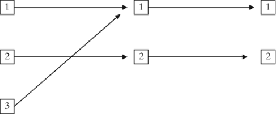
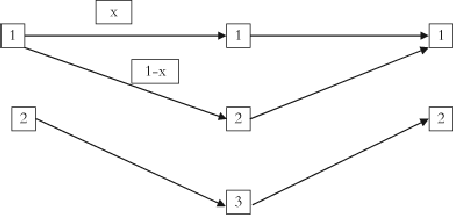
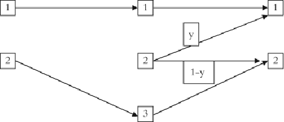
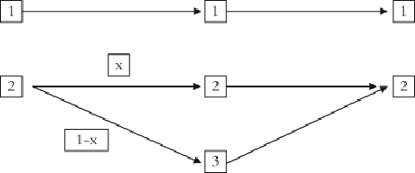
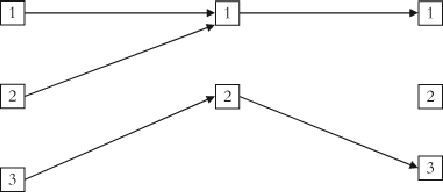
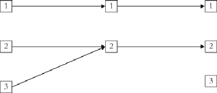

#### Signals: Evolution, Learning, and Information

Brian Skyrms https://doi.org/10.1093/acprof:oso/9780199580828.001.0001 Published: 08 April 2010 Online ISBN: 9780191722769 Print ISBN: 9780199580828

Search in this book

CHAPTER

## 9 9GeneralizingSignalingGames:Synonyms,Bottlenecks, CategoryFormation

Brian Skyrms

https://doi.org/10.1093/acprof:oso/9780199580828.003.0010 Pages 106–117 Published: April 2010

### Abstract

Thischapterpresentsamodelofsignalingwithinventionofnewsignals.Itmaintainstheasumption thatinalcontingenciessenderandreceivergetthesamepayoff.Butevenwheresenderandreceiver continuetohavepureco moninterest,relaxingthestrictasumptionsonpayoffsimposedsofarmay leadtonewphenomena.

Keywords: signals, signaling systems, signaling games Subject: Philosophy of Science, Epistemology, Philosophy of Language Collection: Oxford Scholarship Online

# Generalizing Sender‐Receiver

Torequirethatthenumberofstates,actsandsignalsareequalisadrasticrestriction.Itmaymakesenseto loadupthemodelwithalposiblesy metriesinordertodemonstratethepowerofspontaneoussy metry‐ breaking,butforanaturalisticacountofsignalingweneedtomovebeyondtheseveryspecialcases.Some organismsmayhaveaquitelimitedrepertoireofsignals,whileothers—inparticularourselves—mayseemto haveanembarrasmentofriches.Sowehavecasesoftoofewsignalsandtoomanysignals. Other mismatchesareposible.Theremaynotbeenoughactstorespondeffectivelytoalthestates.

1

Inoursimplestmodel,wealsoimposedanextremesy metryonpayoffs.Ifanactwas“right”forastate,both senderandreceivergotapayoffofone,otherwiseapayoffofzero.Ingeneral,weshouldconsideralsortsof payoffsinincludingoneswheresenderandreceiverareinfulorpartialcon ict.Wewilldiscussuchcasesin alaterchapter.Herewemaintaintheasumptionthatinalcontingenciessenderandreceivergetthesame payoff.Butevenwheresenderandreceivercontinuetohavepureco moninterest,relaxing thestrict asumptionsonpayoffsimposedsofarmayleadtonewphenomena.

- p. 107 2

Downloaded from https://academic.oup.com/book/3092/chapter/143892470 by Canadian Institutes of Health Research - Institute of Population & Public Health user on 28 January 2026

# Many states

Ifstatesoftheworldarewhatevertheorganismcandiscriminate,thenforalbutthemostperceptualylimited organismsthereareverymanystatesindeed.Evenfororganismswithrichsignalingsystems,suchas ourselves,therearemorestatesthanwil tcomfortablywithinoursignalingsystems.Theevolutionofsignals mustsomehowdealwiththisfact.Wecanconsiderminiatureversionsbylookingatsignalinggameswith morestatesthansignalsoracts.

Supposewehavethreestates,butonlytwosignalsandtwoacts.Letussaythatact1istherightactforstate1 andact2istherightactforstate2.Ifweignorestate3,payoffsarejustastheywouldbeinatwo‐state signalinggame,butwhataboutstate3?

##### Act 1 Act 2

- State 1 1, 1 0, 0
- State 2 0, 0 1, 1
- State 3 ?, ? ?, ?

Therearevariousalternatives.Itcouldbethatoneoftheseactsisalso“right”forstate3.Forexample,act1 mightberightforstate3.Signalingsystemequilibriaarenotyetde nedforsuchgames,butthereseemstobe anobviouscandidate.Thatisonecomposedofasender'sstrategythatmapsstates1and3ontothesame signal,whichelicitsact1fromthereceiver,andwhichmapsstate2ontotheothersignal,whichthereceiver's strategymapstoact2.Arealizationisshownin gure9.1:

Figure 9.1: A signaling system where there are many states.

- p. 108

##### Act 1 Act 2

- State 1 1, 1 0, 0
- State 2 0, 0 1, 1
- State 3 1, 1 0, 0

Downloaded from https://academic.oup.com/book/3092/chapter/143892470 by Canadian Institutes of Health Research - Institute of Population & Public Health user on 28 January 2026

Thesesignalingsystemsareoptimalforsenderandreceiver,andtheyareevolutionarilystablestrategies,just asintheoriginalsignalinggames.Intheequilibriumshown,wecouldsaythatsignal1carriesdisjunctive information.Itindicates“state1orstate3.”Alternatively,fromthepointofviewofthesignalingsystem,states 1and3aretreatedasiftheywereasinglestate.So,asDavidLewispointedoutinConvention,wecouldcal states1and3asinglestateandasimilatethiscasetotheoriginal2state,2signal,2actmodel.

Attheotherextreme,itmightbethatneitheractisanygoodforstate3.Perhapsstate3istheproximityofa predatorthatwilgetyouwhetheryoudoact1oract2.Thepayoffsmightlooklikethis:

##### Act 1 Act 2

- State 1 1, 1 0, 0
- State 2 0, 0 1, 1
- State 3 0, 0 0, 0

- p. 109

Nowtherearenoevolutionarilystablestrategies.Thereasonisthatitdoesn'tmatterwhatsignalissentinstate 3.Theonlyactsavailableareineffectual.Nomatterwhatnativesdoinstate3,mutantswhodosomething differentinstate3wildoaswelasnatives.Anyequilibriumthatdoestherightthinginstates1and2isas goodasitgets.

Welookedattwoextremecases,butitisplausibletosupposethatmanycasesareintermediatebetweenthe two.Consider:

##### Act 1 Act 2

- State 1 1, 1 0, 0
- State 2 0, 0 1, 1
- State 3 a, a b, b

whereaisgreaterthanb.Thenasignalingsystemthatusesonesignalwhichelicitsact1inbothstates1and3 isevolutionarilystablejustasbefore.Itgivestheparticipantsthebestposiblepayoff.Theintermediatecases looklike gure1.Simulationsshowreinforcementlearnersrapidlylearningtousesuchasignalingsystem.

Theexampleilustratesageneralpoint.Ingeneral,wheretherearemanystates,asignalingsystempartitions thestates.Evolutionofasignalingsystemisevolutionofasystemofcategoriesusedbythatsystem.That evolutionisdrivenbypragmatics—bytheavailableactsandpayoffs.

Downloaded from https://academic.oup.com/book/3092/chapter/143892470 by Canadian Institutes of Health Research - Institute of Population & Public Health user on 28 January 2026

# Many signals

- p. 110

Supposethatthereisanabundanceofsignals,relativetotheavailablestatesandacts.Thenifalthesignalsare used,anef cientsystemofsignalswilincludefunctionalsynonyms,whichareusedinthesamestatesand leadtothesameacts.Ontheotherhand,thereareef cientequilibriawheresomesignalsareneverused.As recentlyshownbyMatinaDonaldson,MichaelLachmannand CarlBergstrom, theconceptofevolutionary stabilityherehasnoteeth.Noequilibriumisevolutionarilystable.

3

Thereare,nevertheles,manyequilibriawherecompleteinformationaboutthestateistransmitted,and playersalwaysgetpaid.Considerthesimplestcasewithtwostates,threesignals,andtwoacts,withoneact beingrightforeachstateandthestatesequiprobable.Payoffsarejust:

##### State 1 State 2

- Act 1 1,1 0,0
- Act 2 0,0 1,1

- Figure9.2showssomecasesofsynonyms:

- Figure 9.2: Synonyms.

Signals1and2areusedwithprobabilityxand(1–x)respectively.Theybothindicatestate1andleadtoact1, andsomayberegardedasfunctionalsynonyms.Everyvalueofxgivesoneequilibrium,sowehaveawhole lineofequilibriahere.

Figure9.3showsasignalingequilibriumwheresynonymshavediedout.

- Figure 9.3: No synonyms.

Downloaded from https://academic.oup.com/book/3092/chapter/143892470 by Canadian Institutes of Health Research - Institute of Population & Public Health user on 28 January 2026

- p. 111 Inthisequilibriumthesendersendssignal1exclusivelyinstate1,signal3exclusivelyinstate2,andnever sendssignal2.Thereceivermayhavepropensitiestorespondinsignal2invariousways,butthesearenever exercised.Everyvalueofygivesanequilibrium,sowehaveawholelineofequilibriahere.

Nownoticethatthelineofequilibriain gure2andthelineofequilibriain gure3areconnected—theyshare apoint.Ifx=1andy=1,weareinbothpictures.Butnowitshouldbeapparentthatify=0in gure3,wehave apointthatissharedwithanotherlineofsynonymequilibria—asshownin gure9.4.

Figure 9.4: More synonyms.

Altheseequilibriaareperfectlygoodforsignaling,andtheyarealconnectedinonebigcomponentof signalingsystems.Thereisonecontinuouspaththroughalofthem.

Withsucharichsetofsignalingsystems,whichwilyouget?Thatisaquestionthatcannotbeansweredby equilibriumanalysis,butmustbeaddresedintermsofthedynamics.Theanswermaydependonthedynamic law,andonthestartingpoint.Oneposibilitywouldbetousereinforcementlearningonactsoperatingon repeatedencountersbetweenasenderandreceiver.Westartwitheverythingsy metrical—onebalofeach color,sotospeak,ineachsender'sandreceiver'surn.

- p. 112

Onemightexpectthatwiththisdynamicsandthisstartingpointreinforcementwouldeliminatesynonyms. Oneofthesynonymswouldbeusedalittlemore,getreinforcedmore,usedevenmore,andtakeover—sothe thoughtgoes.4 Butthisverbalyplausibleargumentisincorrect.Synonymsareformedandtheypersist.

Adifferentdynamicscouldgivequiteadifferentresult.Inreplicatordynamics,ourbasicmodelofdifferential reproductioninalargepopulation,thissituationisstructuralyunstable.Addingalittleuniformmutationto thelargepopulationmodelwiltendtocolapsecomponentstopoints,andtostabilizesynonyms.Finite populationmodelsmayalowthestatetodriftaroundthecomponentofequilibria.Afulanalysisremainstobe done.

Few signals

Someagentsmayhaveappropriateactsforthestates,buttoofewsignalstocoordinatestateswithacts.Thisis thecaseofaninformationalbottleneck.Informationalbottlenecksaffecthumansaswelasotherorganisms because,althoughwehavearichrepertoireofsignals,wemaynothavethetimeormeanstoutilizeitina speci csituation.

Signalinggameswithinformationbottleneckspresentquiteadifferentpicture.Bottleneckscancreate suboptimalevolutionarilystablestrategies,asshownbythefolowingexampleofMatinaDonaldson,Michael Lachman,andCarlBergstrom.

- p. 113

Downloaded from https://academic.oup.com/book/3092/chapter/143892470 by Canadian Institutes of Health Research - Institute of Population & Public Health user on 28 January 2026

##### Act 1 Act 2 Act 3

- State 1 7, 7 0, 0 2, 2
- State 2 4, 4 6, 6 0, 0
- State 3 0, 0 5, 5 10, 10

Wesupposethatthestatesareequiprobable.Iftherewerethreesignals,thenagentscouldalwaysbehave optimaly,foranaveragepayoffof72/3.Butthereareonlytwosignals.Thentheymightsettleintothe signalingsystemshownin gure9.5.

- Figure 9.5: An e icient solution to a bottleneck.

Thisisanevolutionarilystablestrategy.Itisnotabadwayofdealingwiththeinformationalbottleneck,with anaveragepayoffof7.

Butthisisnottheonlyevolutionarilystablestrategy.Anotherisshownin gure9.6.

- Figure 9.6: An ine icient solution to the same bottleneck.

Thisequilibriumissuboptimal,withanaveragepayoffof6.Butitisstillastrictequilibriumofthetwo‐person

- p. 114 game,andan evolutionarilystablestrategy.5 Areasonableadaptivedynamicscanfalintothisstate.

Thesetwoequilibriarepresenttwodifferentwaysinwhichasignalingsystemcancategorizetheworld.But, unliketheexamplesofthe rstsectionofthischapter,weseethatthesystemofcategoriesthatevolvesmay notbeoptimal.

Downloaded from https://academic.oup.com/book/3092/chapter/143892470 by Canadian Institutes of Health Research - Institute of Population & Public Health user on 28 January 2026

# Systems of categories

Inagivensignalinggame,wehaveseenhowthesignalsevolvesoastoembodyasystemofcategories.States thatthesendermapsontothesamesignalbelongtothesamecategoryacordingtothesignalingsystem.But signalsmaybeusedindifferentsituations.Theymaybecome“decoupled”fromaparticularsignalinggame,at leastinthequiterigidsensewhichwehavegiventosignalinggames. Howshouldwethinkaboutthis proces?

6

Wecanmovepartofthewaytoananswerbybroadeningourmodelofasignalinggame.Supposethesender sometimesisinapositiontoobservethestateexactly,butsometimescanonlydeterminethememberofsome coarsersystemofcategories.Forexample,supposethatsometimesamonkeymaybeableto determine whetheraleopard,eagle,orsnakeispresent;sometimesonlywhetherthereisanaerialorterrestrialpredator. Wecanincorporatethisinourmodelbylettingnaturenotonlychooseastate,butalsochooseanobservational partition.Sometimesnaturemaychoosethe nestpartitionwhosemembersarethestatesthemselves, sometimesacoarserpartition.Thesenderseesonlythememberofthepartitioninwhichthetruestate resides.Asender'sstrategynowmapsmembersofobservationalpartitionstosignals.

- p. 115

Theremaybeactsoptimalforsomecoarse‐grainedinformationthataredifferentfromtheactsoptimalforany speci cstate.Wecanputtheminthemodelaswel.Thenitisquiteposibletoevolveasignalingsystemwhere somesignalsrepresentdisjunctionsofstates. Moregeneraly,wecanevolveasignalingsystemthat incorporatesasystemofcategoriesofdifferentspeci city.

7

Consideragamewiththreeequiprobablestates.Therearethreeacts,onerightforeachstate,justasinthe simplestsignalinggame:

Act 1 Act 2 Act 3

- State 1 1,1 0,0 0,0
- State 2 0,0 1,1 0,0
- State 3 0,0 0,0 1,1

buttherearealsothreeotheractsthatarelesthanoptimalineachstate,butalsolesrisky:

Act 1 Act 2 Act 3 Act 4 Act 5 Act 6

- State 1 1,1 0,0 0,0 .6,.6 0,0 .8,.8
- State 2 0,0 1,1 0,0 .6,.6 .8,.8 0,0
- State 3 0,0 0,0 1,1 0,0 .8,.8 .8,.8

- p. 116 Usingthefactthatstatesareequiprobable,wegettheaveragepayoffforsetsofstates:

Downloaded from https://academic.oup.com/book/3092/chapter/143892470 by Canadian Institutes of Health Research - Institute of Population & Public Health user on 28 January 2026

##### Act 1 Act 2 Act 3 Act 4 Act 5 Act 6

- State 1 1,1 0,0 0,0 .6,.6 0,0 .8,.8
- State 2 0,0 1,1 0,0 .6,.6 .8,.8 0,0
- State 3 0,0 0,0 1,1 0,0 .8,.8 .8,.8

- 1 or 2 .5,.5 .5,.5 0,0 .6,.6 .4,.4 .4,.4
- 2 or 3 0,0 .5,.5 .5,.5 .3,.3 .8,.8 .4,.4

1 or 3 .5,.5 0,0 .5,.5 .3,.3 .4,.4 .8,.8

- p. 117

Asender'sstrategyinthisextendedgamemapssender'sobservationalstatestosignalssent,andasignaling systemequilibriumisanequilibriumthatgivesoptimalpayoffstotheplayers.Forinstance:

- State1=>Signal1=>Act1
- State2=>Signal2=>Act2
- State3=>Signal3=>Act3

- S1orS2=>Signal4=>Act4
- S2orS3=>Signal5=>Act5

S1orS3=>Signal6=>Act6

8

Thisisevolutionarilystableinourextendedsignalinggame. Signals4,5,and6mightbethoughtofashaving aproto‐truth‐functionalcontentrelativetosignals1,2,and3.

Considerthealternativeobservationalpartitionsofstatesimplicitinthislittleexample.Thereisthe nest partition,wheretheobserverseesthestateexactly.Therearethreecoarseningsofthispartition,{S1‐or‐S2,not‐ (S1‐or‐S2)},{S2‐or‐S3,not‐(S2‐or‐S3)},{S1‐or‐S3,not‐(S1‐or‐S3)}.Itshouldbeobvioushowtoconstructmore complexexamples.Wehaveanacountoftheevolutionofsystemsofcategories.Itcanhappenwithoutany complexrationalthought,simplyasaconsequenceoftheactionofadaptivedynamics.

# Conclusion

Oncewealowmodestgeneralizationsofsignalinggames,interestingnewphenomenaappear.Wehave synonymsandbottlenecks.Wehavethepragmaticsofsignalinginducingsystemsofcategoriesintowhich statesaresorted.Thesenewphenomenaraisenewquestions.Dosynonymspersistordotheyfadeaway?Are bottleneckspermanentoristhereaplausibleacountofhowadaptivedynamicscaneliminatethem?Howcan agentscombinetheinformationfromvariouslevelsofcategories?Wehaveseenthatforatleastoneplausible dynamicssynonymspersist.Wewiltrytoshedalittlelightonthetworemainingquestionsinsubsequent chapters.

Downloaded from https://academic.oup.com/book/3092/chapter/143892470 by Canadian Institutes of Health Research - Institute of Population & Public Health user on 28 January 2026

# Notes

- 1 Wärneryd 1993 considers the case where there are too many signals. Donaldson, Lachmann, and Bergstrom 2007 discuss mismatches in general.
- 2 Lewis 1969 allows this, but does not go very far in exploring its consequences.
- 3 Donaldson, Lachmann, and Bergstrom 2007. This is the first systematic treatment of the equilibrium structure in these signaling games.
- 4 The thought is based on a misconception. Once the players have learned to treat two signals as synonyms, the relative reinforcement between them is a Pólya urn process. Then the synonyms may end up being used with any kind of relative frequency. This is what we see in the simulations.
- 5 In both one and two population settings.
- 6 Compare Sterelny 2003 on decoupled representations.
- 7 I first floated this idea in a discussion of the evolution of logical inference in Skyrms 2000.
- 8 There is no guarantee that this will always happen.

Downloaded from https://academic.oup.com/book/3092/chapter/143892470 by Canadian Institutes of Health Research - Institute of Population & Public Health user on 28 January 2026

