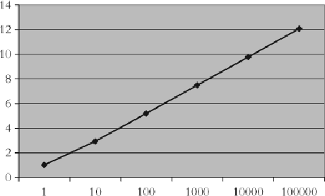
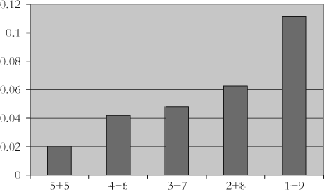
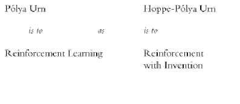
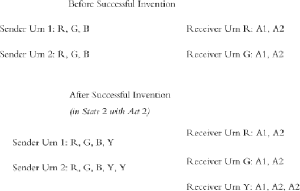
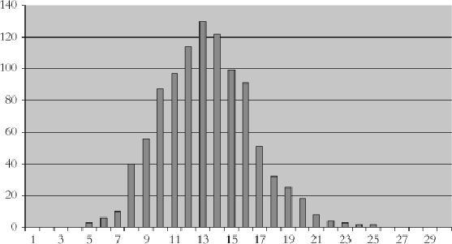

#### Signals: Evolution, Learning, and Information

Brian Skyrms https://doi.org/10.1093/acprof:oso/9780199580828.001.0001 Published: 08 April 2010 Online ISBN: 9780191722769 Print ISBN: 9780199580828

Search in this book

CHAPTER

## 1010InventingNewSignals

Brian Skyrms

https://doi.org/10.1093/acprof:oso/9780199580828.003.0011 Pages 118–135 Published: April 2010

### Abstract

Thischapterpresentsasimple,tractablemodelfortheinventionofnewsignals.Itcanbeeasilystudied bysimulation,andconectionswithwel-studiedprocesesfrompopulationgeneticssuggestthat analyticresultsarenotcompletelyoutofreach.

Keywords: signalling, new signals, communication Subject: Philosophy of Science, Epistemology, Philosophy of Language Collection: Oxford Scholarship Online

# New signals?

Agentsmaynothaveenoughsignalstoconveytheinformationthattheyneedtoco municate.Whycan'tthe agentssimplyinventnewsignalstoremedythesituation?Wewouldliketohaveasimple,easilystudiedmodel ofthisproces.Thatistosay,wewanttomovebeyondtheclosedmodelsthatwehavestudiedsofar,wherethe theorist xesthesignals,toanopenmodelinwhichthespaceofsignalsitselfcanevolve.Ican ndnosuch acountintheliterature.Iwouldliketosuggestonehere.

# Invention in nature: genetic evolution

The xednumberofsignalsinaLewissignalinggameis,afteral,anarti ciallimitation.Innaturethose signalshadtobeinvented.Iftheywereinvented,newsignalscouldbeinventedaswel.Therangeofpotential newsignalsishighlydependentonthenatureofthesignalers.Theavailabilityofnewsignalsforbacteria,for instance,isconstrainedbymolecularbiology.Evenso,overevolutionarytime,differentspeciesofgram‐ negativebacteriahavemanagedto inventdifferentquorum‐sensingsignalingsystemsbyevolvingwaysto makesmalside‐chainmodi cationstoabasicsignalingmolecule.

- p. 119 2 3

Downloaded from https://academic.oup.com/book/3092/chapter/143893564 by Canadian Institutes of Health Research - Institute of Population & Public Health user on 28 January 2026

- p. 120

Quorum‐sensingwasdiscoveredinbacterium,Vibrio sherithatinhabitsthelightorganoftheHawaiansquid, Euprymnascolopes.Euprymnaisanocturnalhunter.Ifthereisafulmoon,itcanbehighlyvisibleagainstthe iluminatedsurfaceofthewaterandbecomepreyitself.Itusesitslightorgantocounterthisandrenderitself lesconspicuoustoitspredators.Thelight,itself,ismadebythebacterialivinginthelightorgan.Thesquid suppliesthebacteriawithnutrientsandthebacteriaprovidethesquidwithcamou age.

Thebacteriaregulatelightproductionbyquorum‐sensing.Theyproduceasmal,diffusible(AHL)signaling molecule.Itisauto‐inducing—whenitsconcentrationintheambientenvironmentincreases,thebacteria producemoreofit.Thishappensinsidethelightorgan.Highenoughconcentrations,aquorum,triggergene expresionthatturnsonthelight.(Thesquidturnsthelightsoffbysimplyexpelingbacteriafromtheorgan andreplacingthemwithseawater.)

Subsequently,quorum‐sensingsignalingbasedonslightmodi cationoftheAHLmoleculehasbeenfoundin othergramnegativebacteria.Psuedomonasaeruginosausesquorum‐sensingtoturnonvirulenceandbio lm formationinthelungsofcystic brosispatients.Abacterium(Erwiniacarotovora) thatrotsplantsusesAHL‐ basedquorum‐sensingtoturnonbothvirulenceagainsttheplantandproductionofantibioticsagainst competitorbacteriathatcouldalsoexploitthedamagedhost.Anancestralsignalingsystemhasbeenmodi ed foravarietyofdifferentuses.

4

5

Grampositivebacteria—includingsuchsometimesnastycustomersasStaphylococusaureus—haveparalel signalingsystemsbasedondifferentsignalingmolecules.Inareviewofquorum‐sensing,MelisaMilerand BonieBaslerconclude:

Bacteriaocupyingdiversenicheshavebroadlyadaptedquorumsensingsystemstooptimizethem forregulatingavarietyofactivities.Ineverycasequorumsensingconfersonbacteriatheabilityto co municateandtoalterbehaviorinresponsetothepresenceofotherbacteria.Quorumsensing alowsapopulationofindividualstocoordinateglobalbehaviorandthusactasamulti‐celularunit. Althoughthestudyofquorumsensingisonlyatitsbeginning,wearenowinapositiontogain fundamentalinsightintohowbacteriabuildco munitynetworks.6

Evolutioncreatesandmodi essignalsineventhemostprimitiveorganisms.

# Invention in nature: cultural evolution

Inventioningeneticevolutionmaybehighlyconstrainedandtakealongtime.Inculturalevolutionandin individuallearningthereismorelatitudefornewsignals,andevolutionofthesignalingspaceisongoing.

Forinstance,thevocalcapabilitiesofmonkeysalowforarangeofpotentialsignalsthat,whenrequired,canbe tappedbylearning.Vervetmonkeyswhohaveencounteredanewpredatorhavelearnedbothanewsignaland anewevasiveaction:

VervetsontheCameroonsavanaaresometimesattackedbyferaldogs.Whentheyseeadog,they respondmuchasAmboselivervetsrespondtoaleopard;theygiveloudalarmcalsandrunintotrees. ElsewhereintheCameroon,however,vervetsliveinforestswheretheyarehuntedbyarmedhumans whotrackthemdownwiththeaidofdogs.Inthesecircumstances,whereloudalarmcalsand conspicuous ightintotreeswouldonlyincreasethemonkeys'likelihoodofbeingshot,thevervets' alarmcalstodogsareshort,quietandcauseothersto eesilentlyintodensebusheswherehumans canotfolow.7

Downloaded from https://academic.oup.com/book/3092/chapter/143893564 by Canadian Institutes of Health Research - Institute of Population & Public Health user on 28 January 2026

- p. 121

General principles

Thereisnothingrealymysteriousaboutthemodi cationofthevervets'signalingsystemdescribedabove. First,naturepresentsthemonkeyswithanewstate—onedifferentfrom“alclear”orfromthepresenceofany ofthefamiliarpredators.Thesalienceofthisnewstate,“dogsandhunters,”isestablishedwhenthe rst monkeyisshot.Anappropriatenewescapeactionisdiscovered.Inprincipleitmightbediscoveredjustby grouptrialanderror,althoughwedonotwanttoselthevervetsshortoncognitiveability.

Oncewehavethenewstateandtheappropriatenewactionweareinthekindofinformationbottleneckthat wedescribedinChapter1.Wehaveseenthatsuchbottleneckscansometimesspontaneouslyarisefrom dynamicsofevolutionandlearning.Whatisrequiredistheinventionofanewsignal.Sendershavelotsof potentialsignalsavailabletothem.Thesearejustactions—inthiscase,vocalizations—thatreceiversareliable tonotice.Senderstrypotentialsignals,receiverstryactions,andhappycoincidencesarerewarded.

Generalprinciplesofinventionemerge.Wecansupposethatthereareactsthatthesendercantakewhichthe receiverwilnotice.Thesecouldbetriedoutassignals—eitheronashorttimescaleoraverylongone.The potentialsignalsmaybesounds,ormovements,orsecretionsofsomechemical.Theymaybearsome resemblancetoothersignals,ortootherfeaturesoftheenvironmentthatreceiversalreadytendtomonitor. Withsomeprobabilityanewsignalcanbeactualized—asenderwilsenditandareceiverwillpayattentionto it.

Verbalstatementofgeneralprinciplesisnothard,butwestillackasimplemodelthatcanserveasafocal pointforanalysis.HowshouldweincorporatetheinventionofnewsignalsintheLewis modelofsignaling games?Wewouldliketoretainasmuchasposiblethesimplicityandanalyticaltractabilityoftheoriginal model,whilehavinganopenratherthanaclosedsetofsignals.

- p. 122

The Chinese restaurant process

Webeginwithanexamplethatmayappearoverlyfanciful,butwhichwilneverthelesturnouttoberelevant. ImagineaChineserestaurant,withanin nitenumberoftables,eachofwhichcanholdanin nitenumberof guests.Peopleenteroneatatimeandsitdownacordingtothefolowingrule.IfNguestsarealreadyseated, thenextguestsitstotheleftofeachoftheNguestsalreadyseatedwithprobability1/(N+1),andgoestoan unocupiedtablewithprobability1/(N+1).[Onecouldimagineaghostsittingatthe rstunocupiedtable,and thentherulewouldbetosittotheleftofsomeone—includingthephantomguest—withequalprobability.]8

The rstpersontoentersitsatthe rstunocupiedtable,sincenoonebutthephantomguestisthere.The phantomguestmovestothe rstunocupiedtable.Thesecondpersontoenternowhasequalprobabilityof sittingwiththe rst,oratanunocupiedtable.Shouldthesecondjointhe rst,thethirdhasa2/3chanceof sittingattheirtableanda1/3chanceofstartinganewone.Shouldthesecondstartanewtable,thephantom guestmoveson,andthethirdwiljoinoneortheotherorstartathirdtablewithequalprobability.Thisisthe Chineserestaurantproces,whichhasasurprisingnumberofapplications,andwhichhasbeenwellstudiedasa probleminabstractprobabilitytheory.9

Sincethereisonlyonephantom,theprobabilityofanewtablebeingselectedgoesdownasthenumberof

- p. 123 guestsgoesup.Butifthereisanin nitestreamofguests,atanypointintheprocesthe probabilitythatno

Thedynamicsoflearning,whentheneedarises,isabletomodifythesignalingsysteminahighlyef cient way.

Downloaded from https://academic.oup.com/book/3092/chapter/143893564 by Canadian Institutes of Health Research - Institute of Population & Public Health user on 28 January 2026

newtablewileverbeselectedisalwayszero.Inthelimitanin nitenumberoftableswilbeocupied. Nevertheles,forlong nitestretchesoftimethenumberofocupiedtablesmaybesmal.

Togetafeelfortheproces,supposethatfourguestshaveentered.Wecouldhavefourtablesocupied(1+1+1+1), orthree(2+1+1)ortwo{(2+2)or(3+1)}orone(4).Thelastposibility,thatalguestssitatthe rsttableissix timesasprobableasthe rstalternativeinwhicheachguestchoosesadifferenttable. Theposibilityofthree guestsatonetableandoneattheothercanberealizedinfourdifferentways.Numberingtheguestsinorderof appearance,theyare:{1,2,3}{4},{2,3,4}{1},{1,3,4}{2},and{1,2,4}{3}.Eachhasequalprobability—whichguests areatwhichtablesdoesnotmatter.

10

Addinguptheprobabilitiesofthewaysofgettingthe(3+1)patternweget(8/24).Likewise,we ndthe probabilityofthe(2+2)patternas(3/24).Theprobabilitythattwotablesareocupiedisthesumofthese,or (1/24).Wemaynoticeinpasingthattheprobabilityofunequalocupationoftwotables(3+1)ismuchmore likelythanthatofequalocupation(2+2).Theprobabilitiesofdifferentnumbersoftablesbeingocupiedare:

One Table: (6/24)

Two Tables: (11/24)

Three Tables: (6/24)

Four Tables: (1/24)

Asmoreandmoreguestscomein,theexpectednumberofocupiedtablesgrowsasthelogarithmofthe numberofguests.

# p. 124 Hoppe's urn

Ifweneglecttheseatingorderofguestsatatable,andjustkeeptrackofthenumberofguestsateachtable,the procesisequivalenttoasimpleurnmodel.In1984Hoppeintroducedwhathecaled“Pólya‐likeurns”in conectionwith“neutral”evolution—evolutionintheabsenceofselectionpresure.InaclasicalPólyaurn proces,westartwithanurncontainingvariouscoloredbals.Thenweproceedasfollows:Abalisdrawnat random.Itisreturnedtotheurnwithanotherbalofthesamecolor.Alcolorsaretreatedinexactlythesame way.WecanrecognizethePólyaurnprocesasaspecialcaseofreinforcementlearninginwhichthereisno distinctionworthlearning—alchoices(colors)arereinforcedequaly.TheprobabilitiesinaPólyaurnproces convergetoarandomlimit.Theyareguaranteedtoconvergetosomething,butthatsomethingcanbe anything.

11

TothePólyaurn,Hoppeaddsablackbal—themutator. Themutatordoesnotmutateinthesenseexploredin earlierchapters,wherecolorsintheurnmutatetooneanother.Rather,itbringsnewcolorsintothegame.Ifthe blackbalisdrawn,itisreturnedtotheurnandabalofanentirelynewcolorisaddedtotheurn.(Thereare,of course,lotsofvariationsposible.Theremightbemorethanoneblackbalinitialy,andHoppeconsideredthis posibility.Thenumberofblackbalsmightnotbe xed,butmightitselfevolveinvariousways.Here, however,wewilsticktothesimplestcase.)TheHoppe‐Pólyaurnmodelwasmeantasamodelforneutral selection,wherethereareavastnumberofpotentialmutationswhichconveynoselectiveadvantage.

(ItalsohasanalternativelifeintheBayesiantheoryofinduction,havingesentialybeeninventedin1838by thelogicianAugustusdeMorgantodealwiththepredictionoftheemergenceofnovelcategories.)12

Downloaded from https://academic.oup.com/book/3092/chapter/143893564 by Canadian Institutes of Health Research - Institute of Population & Public Health user on 28 January 2026

- p. 125

Wealsosawinourexamplethatalwaysofrealizingthepatternofonetablewiththreeguestsandonetable withonewereequalylikely.Thisisgeneralytrueoftheproces.Althataffectstheprobabilityisa speci cationofthenumberoftablesthathaveagivennumberofguests.Thisspeci cationiscaledthe partitionvector.Inourexampleisit1tablewithoneguest,0tableswith2guests,1tablewith3guests,0tales withfourguests:<1,0,1,0>?Thefactthatanyarrangementofguestswiththesamepartitionvectorhasthe sameprobabilityiscaledpartitionexchangeability,anditisthekeytom:mathematicalanalysisoftheproces.

Thereareexplicitformulastocalculateprobabilitiesandexpectationsofclasesofoutcomesaftera nite numberoftrials.Theexpectednumberofcategories—ofcolorsofbalinHoppe'surnortheexpectednumber oftablesintheChineserestaurant—wilbeofparticularinteresttous,becausethenumberofcolorsina sender'surnwilcorrespondtothenumberofsignalsinuse.Thisisgivenbyaverysimpleformula. Results areplottedin gure10.1:

13

- Figure 10.1: Expected number of categories.

- p. 126 Forevenquitelargenumbersoftrials,theexpectednumberofcategoriesisquitemodest.Thereissomething elsethatIwouldliketoemphasize.Foragivennumberofcategories,thedistributionoftrialsamongthose categoriesisnotuniform.Wecanilustratethiswithanexamplethatissimpleenoughtograph.Supposewe havetentrialsandthenumberofcategoriesturnsouttobetwo(twocolorsofbal,twotablesintherestaurant) whichwilhappenabout28%ofthetime.Thiscanberealizedin vedifferentwaysofpartitioning10:5+5,4

ItisevidentthattheHoppe‐PólyaurnprocesandtheChineserestaurantprocesarethesamething.Hoppe's colorscorrespondtothetablesintheChineserestaurant;themutatorbalcorrespondstothephantomguest. Aftera nitenumber,N,ofiterationstheNguestsintherestaurant,ortheNbalsinHoppe'surn,are partitionedintosomenumberofcategories.Thecategoriesarecolorsfortheurn,tablesfortherestaurant.But thepartitionsweendupwithcanbedifferenteachtime;theydependontheluckofthedraw.Wehaverandom partitions,whichmayhaveadifferentnumberofcategories,differentnumbersofindividualsineachcategory, anddifferentindividuals lingoutthenumbers—alofwhichwehaveseeninourlittleexamplewithfour guests.

+6,3+7,2+8,1+9.Thereisasimplewayofcalculatingtheprobabilityofeach—theEwenssamplingformula. Theresultsaregraphedin gure10.2.

Downloaded from https://academic.oup.com/book/3092/chapter/143893564 by Canadian Institutes of Health Research - Institute of Population & Public Health user on 28 January 2026

- Figure 10.2: Probability of partitions of 10 into two categories.

Themoreunequaladivisionisbetweenthecategories,themorelikelyitistoocur.Somecolorsarenumerous, somearerare.Sometablesaremuchfulerthanothers.Finaly,letusnoticethattheHoppeurncanbe redescribedinasuggestiveway.YoucanthinkofitasawayofmovingbetweenPólyaurns.Themutator procesiskepttrackofontheside,saywithanurnofoneblackandmanywhitebals.Pickawhitebalfrom theauxiliaryurnandyouaddanotherwhitebal,andsamplefromyourcurrentPólyaurn.Picktheblackbal fromtheauxiliaryurnandyoumovetoadifferentPólyaurnwithaltheoldbalsandwithonemorebalofone

- p. 127 more color.Thisisalittlelikemovingbetweengames,andwewilmakeitthebasisofdoingjustthat.

Reinforcement with invention

WeremarkedthatPólyaurnprocescanbethoughtofasreinforcementlearningwhenthereisnodistinction worthlearning—alchoices(colors)arereinforcedequaly.TheHoppe‐Pólyaurn,then,isamodelthatadds uselesinventiontouseleslearning.Thatwasitsoriginalmotivation,wheredifferentalelesconferno selectiveadvantage.

IfwemodifythePólyaurnbyaddingdifferentialreinforcement—wherechoicesarereinforcedacordingto differentpayoffs—wegettheHerrnstein–Roth–Erevmodelofreinforcementlearningoftheforegoing chapters.IfwemodifytheHoppe‐Pólyamodelbyaddingdifferentialreinforcement,wecangetreinforcement

- p. 128 learningthatiscapableofinvention.14

Figure 10.3: Urn models.

Downloaded from https://academic.oup.com/book/3092/chapter/143893564 by Canadian Institutes of Health Research - Institute of Population & Public Health user on 28 January 2026

# Inventing new signals

15

WeusetheHoppe‐Pólyaurnasabasisforamodelofinventingnewsignalsinsignalinggames.Foreachstate oftheworld,thesenderhasanadditionalchoice:sendanewsignal.Anewsignalisalwaysavailable.Thesender caneithersendoneoftheexistingsignalsorsendanewone.Receiversalwayspayattentiontoanewsignal.(A newsignalmeansnewsignalthatisnoticed,failuresbeingtakenacountofbymakingtheprobabilityofa sucesfulnewsignalsmaler.)Receivers,whenconfrontedwithanewsignal,justactatrandom.Weequip themwithequalinitialpropensitiesfortheacts.

Nowweneedtospecifyexactlyhowlearningproceeds.Naturechoosesastateandthesendereitherchoosesa newsignal,oroneoftheoldsignals.Ifthereisnonewsignalthemodelworksjustasbefore.Ifanewsignalis introduced,iteitherleadstoasucesfulactionornot.Whenthereisnosuces,thesystemreturnstothestate itwasinbeforetheexperimentwithanewsignalwastried.

- p. 129
- p. 130 16

Butifthenewsignalleadstoasucesfulaction,bothsenderandreceiverarereinforced.Thereinforcement nowconstitutesthesender'snewinitialpropensitytosendthesignalinthestateinwhichitwasjustsent.The receivernowbeginskeepingtrackofthesucesofactstakenuponreceivingthenewsignal.Intermsofthe urnmodel,thereceiveractivatesanurnforthesignal,withonebalforeachposibleact,andaddstothaturn thereinforcementforthesucesfulactjusttaken.Thesendernowconsidersthenewsignalnotonlyinthe statesinwhichitwastriedout,butalsoconsidersitaposibilityinotherstates.So,intermsoftheurnmodel,a balforthenewsignalisaddedtoeachsender'surn,inadditiontothereinforcementbaladdedtotheurnfor thestatethathasjustocurred. Thenewsignalhasnowestablisheditself.Wehave movedfromaLewis signalinggamewithNsignalstoonewithN+1signals.

Figure 10.4: In state 2 a black ball is drawn, act 2 is tried and is successful. A yellow ball is added to both senders' urns and a reinforcement yellow ball is added to the urn for state 2.The receiver adds an urn for the signal yellow, and adds an extra ball to that urn for act 2.

Insu mary,oneofthreethingscanhappen:

- 1. Nonewsignaltried,andthegameisunchanged.Reinforcementproceedsasinagamewitha xed numberofsignals.
- 2. Anewsignalistriedbutwithoutsuces,andthegameisunchanged.
- 3. Anewsignalistriedwithsuces,andthegamechangesfromonewithnstates,msignalsandoactsto onewithnstates,m+1signals,oacts.

Downloaded from https://academic.oup.com/book/3092/chapter/143893564 by Canadian Institutes of Health Research - Institute of Population & Public Health user on 28 January 2026

# Starting with nothing

- p. 131

Ifwerantheprocesforever,wewouldendupwithanin nitenumberofsignals.Butifwerunalarge nite numberofiterations,wewouldexpectanot‐so‐largenumberofsignals.Insimulationsofourmodelof invention,startingwithnosignalsatal,thenumberofsignalsafter100,000iterationsrangedfrom5to25.(A histogramofthe nalnumberofsignalsin1,000trialsisshownin gure10.5.)

Figure 10.5: Number of signals a er 100,000 iterations of reinforcement with invention. Frequency in 1,000 trials.

Avoiding pooling traps

Recalthatinaversionofthisgamewiththenumberofsignals xedat3,clasicalreinforcementlearning sometimesfalsintoapartialpoolingequilibrium.InbasicRoth–Erevreinforcementlearningwithinitial propensitiesof1,about9%ofthetrialsledtoimperfectinformationtransmision.Usingreinforcementwith invention,startingwithnosignals,1,000trialsalendedupwithef cientsignaling.Signalerswentbeyond inventingthethreerequisitesignals.Lotsofsynonymswerecreated.Byinventingmoresignals,theyavoided thetrapsofpartialpoolingequilibria.

Andrecalthatinthegamewithtwostates,twoacts,andthenumberofsignals xedat2,ifthestateshad unequalprobabilitiesagentssometimesfelintoatotalpoolingequilibrium—inwhichnoinformationatalis transmitted.Insuchanequilibriumthereceiverwouldsimplydotheactsuitedforthemostprobablestateand ignorethesignalandthesenderwouldsendsignalswithprobabilitiesthatwerenotsensitivetothestate.The probabilityoffalingintototalpoolingincreasedasthedisparityinprobabilitiesbecamegreater.Whenone statehasprobability.6,failureofinformationtransferhardlyeverhappens.Atprobability.7ithappens5%of thetime.Thisnumberrisesto 2%forprobability.8,and 4% forprobability.9.Highlyunequalstate probabilitiesappeartobeamajorobstacletotheevolutionofef cientsignaling.

- p. 132

Ifwecaninventnewsignals,wecanstartwithnosignalsatal,andseehowtheprocesevolves.Considerthe three‐state,three‐actLewissignalinggamewithstatesequiprobable.Asbefore,exactlyoneactisrightforeach state.Wecangainsomeinsightintothis complicatedprocesfromourunderstandingoftheHoppeurn.In fact,oncesenderslearntosignalsucesfulyinagivenstate,thesender'surnforthatstateisaHoppeurn.

Ifwetaketheextremecaseinwhichonestatehasprobability.9,startwithnosignalsatal,andlettheplayers inventsignalsasabovetheyreliablylearntosignal.In1,000trialstheyneverfelintoapoolingtrap;they alwayslearnedasignalingsystem.Theyinventedtheirwayoutofthetrap.Theinventionofnewsignalsmakes ef cientsignalingamuchmorerobustphenomenon.

Downloaded from https://academic.oup.com/book/3092/chapter/143893564 by Canadian Institutes of Health Research - Institute of Population & Public Health user on 28 January 2026

# Synonyms

Letuslookatourresultsalittlemoreclosely.Typicalywegetef cientsignalingwithlotsofsynonyms.How muchworkarethesynonymsdoing?Considerthefolowingtrialofthree‐state,three‐actsignalinggame, startingwithnosignalsandproceedingwith100,000iterationsoflearningwithinvention.

##### Trial 2:

- signal 1 probabilities in states 0,1,2 0.00006, 0.71670, 0.00006
- signal 2 probabilities in states 0,1,2 0.00006, 0.28192, 0.00006
- signal 3 probabilities in states 0,1,2 0.09661, 0.00006, 0.00080
- signal 4 probabilities in states 0,1,2 0.00946, 0.00042, 0.00012
- signal 5 probabilities in states 0,1,2 0.86867, 0.00012, 0.00006
- signal 6 probabilities in states 0,1,2 0.00006, 0.00006, 0.81005
- signal 7 probabilities in states 0,1,2 0.02393, 0.00006, 0.00012
- signal 8 probabilities in states 0,1,2 0.00006, 0.00006, 0.14338
- signal 9 probabilities in states 0,1,2 0.00006, 0.00018, 0.04449
- signal 10 probabilities in states 0,1,2 0.00012, 0.00006, 0.00043
- signal 11 probabilities in states 0,1,2 0.00012, 0.00012, 0.00006
- signal 12 probabilities in states 0,1,2 0.00054, 0.00012, 0.00018
- signal 13 probabilities in states 0,1,2 0.00018, 0.00006, 0.00012

- p. 133

Noticethatafewofthesignals(showninboldface)aredoingmostofthework.Instate1,signal5issent87% ofthetime.Signals1and2functionassigni cantsynonymsforstate2,beingsentmorethan 9.5%ofthe time.Signals6and8arethemajorsynonymsforstate3.Thepatternisfairlytypical.Veryoften,manyofthe signalsthathavebeeninventedenduplittleused.Thisisjustwhatweshouldexpectfromwhatweknow abouttheHoppeurn.Evenwithoutanyselectiveadvantage,thedistributionofreinforcementsamong categoriestendstobehighlyunequal,aswasshownin gure10.2.Mightnotinfrequentlyusedsignalssimply faloutofuseentirely?

# Noisy forgetting

Natureforgetsthingsbyhavingindividualsdie.Somestrategies(phenotypes)simplygoextinct.Thiscannot realyhappeninthereplicatordynamics—anidealizationwhereunsucesfultypesgetrarerandrarerbut neveractualyvanish.AnditcanothappeninRoth–Erevreinforcementwhereunsucesfulactsaredealt withinmuchthesameway.

17

Evolutionina nitepopulationisdifferent.InthemodelsofSebastianShreiber, a nitepopulationof differentphenotypesismodeledasanurnofbalsofdifferentcolors.Sucesfulreproductionofaphenotype

Downloaded from https://academic.oup.com/book/3092/chapter/143893564 by Canadian Institutes of Health Research - Institute of Population & Public Health user on 28 January 2026

correspondstotheadditionofbalsofthesamecolor.Sofarthisisidenticaltothebasicmodelof reinforcementlearning.Butindividualsalsodie.Wetransposetheideatolearningdynamicstogetamodelof reinforcementlearningwithnoisyforgetting.

Forindividuallearning,thismodelmaybemorerealisticthantheusualmodelofgeometricaldiscounting. Thatmodel,whichdiscountsthepastbykeepingsome xedfractionofeachbalateachupdate,maybebest suitedforaggregatelearning—whereindividual uctuationsareaveragedout.Butindividuallearningis noisy,anditmaybeworthlookingatanurnmodelofindividualreinforcementwithnoisyforgetting.

- p. 134

Inventing and forgetting signals

Weputtogethertheseideastogetlearningwithinventionandwithnoisyforgetting,andapplyittosignaling. Itisjustlikethemodelofinventingnewsignalsexceptfortherandomdying‐outofoldreinforcement, implementedbyrandomremovalofbalsfromthesender'surns.

Theideamaybeimplementedinvariousways.Naturemight,withsomeprobability,pickanurnatrandom, pickabalfromitatrandomandthrowitaway.(Theprobabilityistheforgettingrate.)Oralternatively,Jason McKenzieAlexandersuggeststhatnaturepickanurnatrandom,pickacolorinthaturnatrandom,andthrow abalofthatcoloraway.Eitherway,thereisonelesbalinthaturnandthetrialisover.

Now,itisposiblethatthenumberofbalsofonecolor,orevenbalsofallcolorscouldhitzeroinasender's urn.Shouldwealowthistohappen,aslongasthecolor(thesignal)isrepresentedinotherurnsforother states?Thereisanotherchoicetobemadehere.Ifthenumberofbalsofacertaincoloriszeroinalsender's urns,thenthecorrespondingsignalisextinctandthereceiver'surncorrespondingtothatsignaldiesout.

Thereisalotofterritorytoexploreintheseforgettingmodels.Preliminarysimulationssuggestthefollowing. The rstkindofforgettingthatwetookfrom nitepopulationevolution(balsremovedwithequal probability)doesn'tchangethedistributionofsignalsmuchatal.Usageofsynonymscontinuestofollowa kindofpowerlawdistribution,withlittle‐usedsignalspersisting.Thismakessense,becausemostlyitisthe frequentlyusedsignalsthataredying.ButAlexander'skindofforgettingcanberemarkablyeffectivein pruninglittle‐usedsignalswithoutdisruptingtheevolutionofef cientsignaling.Often,inlongsimulation

- p. 135 runs,wegetcloseto theminimumnumberofsignalsneededforanef cientsignalingsystem.

# Inventing new signals

Wenowhaveasimple,tractablemodelfortheinventionofnewsignals.Itcanbeeasilystudiedbysimulation, andconectionswithwel‐studiedprocesesfrompopulationgeneticssuggestthatanalyticresultsarenot completelyoutofreach.Itinvitesalsortsofinterestingvariations.Eventhemostbasicmodelhasinteresting properties,bothbyitselfandincombinationwithforgetting.

# Notes

- 1 For more analysis of this model of inventing new signals, see Skyrms and Zabell forthcoming.
- 2 So called, because they do not take up the violet stain in Gram's test. Gram negative bacteria tend to be pathogens.
- 3 Taga and Bassler 2003; Miller and Bassler 2001.
- 4 See Miller and Bassler 2001.
- 5 So called, because they do take up the dye in Gram's stain test.
- 6 Miller and Bassler 2001.

Downloaded from https://academic.oup.com/book/3092/chapter/143893564 by Canadian Institutes of Health Research - Institute of Population & Public Health user on 28 January 2026

- 7 Cheney and Seyfarth 1990, 169 who refer to Kavanaugh 1980.
- 8 Variations place some number of phantom guests at the first unoccupied table.
- 9 Aldous 1985; Pitman 1995.
- 10 (1)(1/2)(2/3)(3/4) = (6/24) vs. (1)(1/2)(1/3)(1/4) = (1/24).
- 11 Hoppe 1984.
- 12 I owe my knowledge of this to Sandy Zabell. For both history and analytical discussion see Zabell 1992, 2005.
- 13 SUM (from i=0 to i=N‐1) 1/(1+i).
- 14 Alternatively, we can interpret this as a model of evolution in a finite, growing population.
- 15 We note that the same kind of urn model could be used for inventing new actions on the part of the receiver. But if this were done, we would need to specify the payo s of potential new actions in each state. There is no general principled way to do this, although in specific applications there might be some plausible approach.
- 16 We could add a fractional ball, and make fraction a parameter to adjust the strength of the sender's generalization of the new signal from one situation to another. Here we just stick to the simplest formulation where strength of generalization is one.
- 17 Shreiber 2001.

Downloaded from https://academic.oup.com/book/3092/chapter/143893564 by Canadian Institutes of Health Research - Institute of Population & Public Health user on 28 January 2026

