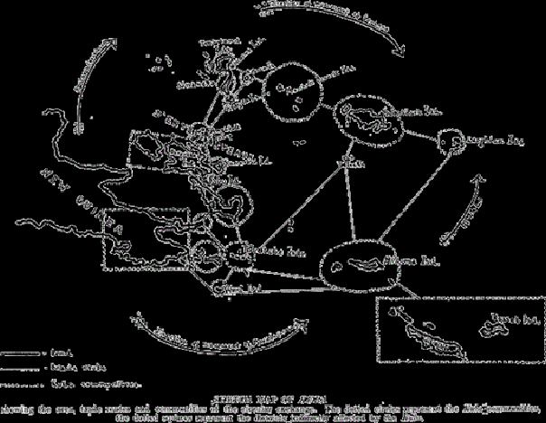
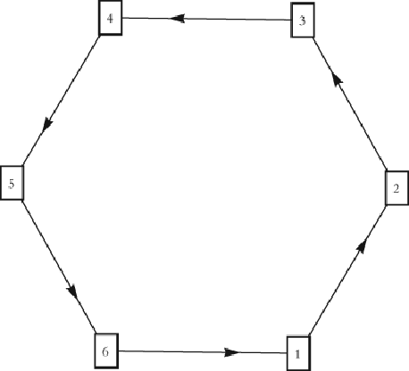
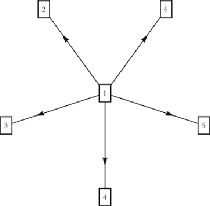
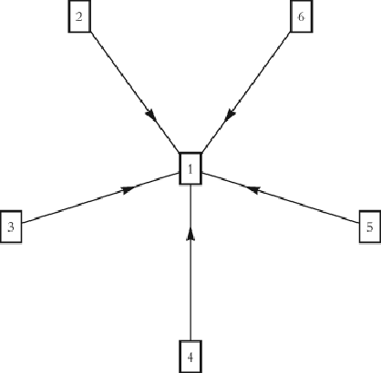

#### Signals: Evolution, Learning, and Information

Brian Skyrms https://doi.org/10.1093/acprof:oso/9780199580828.001.0001 Published: 08 April 2010 Online ISBN: 9780191722769 Print ISBN: 9780199580828

Search in this book

CHAPTER

## 14 14LearningtoNetwork

Brian Skyrms

https://doi.org/10.1093/acprof:oso/9780199580828.003.0015 Pages 161–176 Published: April 2010

### Abstract

Thischapterintroducesalow-rationalityprobeandadjustdynamicstoapproximatehigherrationality learninginthebasicBala–Goyalmodels.Bothbestresponsedynamicsandprobeandadjustlearned networksthatreinforcementlearningdidnot.Ingeneral,probeandadjustlearnsanetworkstructureif bestresponsewithinertiadoes.

Keywords: signals, signaling systems, signaling networks Subject: Philosophy of Science, Epistemology, Philosophy of Language Collection: Oxford Scholarship Online

Wenowsupposethat,inoneofthewaysinvestigatedinprecedingchapters,individualshavelearnedtosignal. Buildingonthisbasis,howcantheylearntocombinethesesignalinginteractionstoformsignalingnetworks? Thisisthenextquestionforanaturalistictheoryofsignaling.Itistoolargeaquestionforasinglechapter,or evenasinglebook.HereIwilgiveanintroductiontothisgrowingareaofresearch.Ihopethatyouwil nd thesimpleexamplestreatedhereinterestingandsuggestive.

Thespiritoftheenterpriseisintendedtobeconsonantwiththerestofthisbook:startwiththesimplestand mostnaiveformsoftrial‐and‐errorlearningandseewhattheycando.Iftheyfailtosolveaproblem,climbup theladderofcognitivesophisticationtoseewhatittakes.Westartinasomewhatroundaboutwaybynoting theimportanceofringstructuresofsymbolicexchangeinprimitivesocieties.

Downloaded from https://academic.oup.com/book/3092/chapter/143896244 by Canadian Institutes of Health Research - Institute of Population & Public Health user on 28 January 2026

# Rings in primitive societies

In1920,BronislawMalinowskipublishedanarticleentitled“Kula”inMan,thejournaloftheRoyal AnthropologicalSociety.Init,hedescribedtheKulaRing,latermadefamous

- p. 162
- p. 163 1

isbasedprimarilyuponthecirculationoftwoarticlesofhighvalue,butofnorealuse,—theseare armshelsmadeoftheConusmileounctatus,andneckletsofredshel‐discs,bothintendedfor ornaments,buthardlyeverused,evenforthispurpose.Thesetwoarticlestravel,inamannertobe describedlaterindetail,onacircularroutewhichcoversmanymilesandextendsovermanyislands. Onthiscircuit,thenecklacestravelinthedirectionoftheclockhandsandthearmshelsinthe oppositedirection.Botharticlesneverstopforanylengthoftimeinthehandsofanyowner;they constantlymove,constantlymeetingandbeingexchanged.2

Thenecklacesandarmshelshavesocial,symbolic,andevenmagicalvalue.Theybecomemorevaluableas theycirculate.Eachsubsequentowneraddstothehistory,powerandvalueofanitem.

Computer LAN rings

Beforecomputernetworkingpowerwasalmostfree,computersweresometimesorganizedinlocalarea networks(LAN)withthestructureofaring.Eachnodepasesinformationtoani mediateneighborina speci eddirection—sayclockwise—alongthering.Informationthen owstoalnodesaroundthering.One disadvantageofaringnetworkisthatitisnotrobust.Ifonenodeisdisabled,information owisdisrupted.As insurance,sometimesringnetworksalsoaddcounter‐rotation,pasinginformationtoneighboringnodesin bothclockwiseandcounter‐clockwisedirections,justliketheKularing.

Someoftheresemblanceismisleading.Rotationcombinedwithcounter‐rotationintheKulahasmoretodo withreciprocitythanwithrobustnes.Butsomeresemblancesmaybesigni cant.Inparticular,notethatthe goodbeingpasedondoesnotdegradeasitpasesalong.Theinformationispasedalongreliablywithout

- p. 164

byhisbookArgonautsoftheWesternPaci c. Thering,inMalinowski'swords:

Downloaded from https://academic.oup.com/book/3092/chapter/143896244 by Canadian Institutes of Health Research - Institute of Population & Public Health user on 28 January 2026

appreciabledecayinthecomputerLAN.ThearticlesintheKularingalsohaveavaluethatdoesnotdecay.It actualyincreasesastheyarepasedalong.Thiswilprovetobeanimportantconsiderationingametheoretic analysisofnetworkformation.

# The Bala–Goyal ring game

- p. 165

Theringstructureinthisgameisspecialintwoways.The rstisthatitisstrict,thesecondthatitisef cient.It isastrictequilibriuminthatsomeonewhounilateralydeviatesfromsuchastructure ndsherselfworseoff.It isParetoef cientinthatthereisnowaytochangeittomakesomeonebetteroffwithoutmakingsomeone worseoff.Itisef cientinanevenstrongersense.Thereissimplynowayataltomakeanyonebetteroff. Everyonehasthehighestposiblepayoffthattheycouldgetinanynetworkstructure.Thekeytoboththese propertiesisthatinformation owsfreelyaroundthering,sothatforthepriceofoneconnectionaplayergets altheinformationthatthereis.

Consideraplayerinsucharingwhochangesherstrategy.Shecouldestablishadditionallinks,inwhichcase shepaysmoreand getsnomoreinformation.Shecouldbreakherlink,inwhichcaseshewouldforegothe costbutgetnoinformation.Shecouldbreakthelinkandestablishoneormorenewones,buteverywaytodo thatwoulddeliverlesthantotalinformation.Everydeviationleavesherworstoff.Thatistosaythatthering isastrictNashequilibriumofthegame.

- p. 166

3 4

VenkateshBalaandSanjeevGoyal introduceaninformationalnetworkgameinwhicharingstructurehasa specialequilibriumstatus.Individualsgetprivateinformationbyobservingtheworld.Eachgetsadifferent pieceofinformation.Informationisvaluable.Anindividualcanpaytoconnecttoanotherandgether information.Theindividualwhopaysdoesnotgiveanyinformation;itonlygoesfrompayeetopayer.The payergetsnotonlytheinformationfromprivateobservationsofthosewhomshepays,butalsothatwhich theyhavegottenfromsubscribingtoothersfortheirinformation.Information owsfreelyinthisco munity, andwithoutdegradation,alongthelinkssoestablished.It owsinonedirection,frompayeetopayer.We asumethatinformation owisfast,relativetoanyadjustmentofthenetworkstructure.

Ifthecostofsubscribingtosomeone'sinformationistoohigh,thenitwon'tpayforanyonetodoit.Butlet's supposethatthecostofestablishingaconnectionislesthanthevalueofeachpieceofinformation.Then conectionscertainlymakesense.Weasumethatanyindividualcanmakeasmanyconnectionsasshe wishes.Thismodelcanbeviewedasagame,withanindividual'sstrategy beingadecisionofwhat conectionstomake.Itcouldbenone,al,orsome.Thegamehasmultipleequilibria,butoneisspecial.Thisis thering(orcircle).Thereisanexamplein gure14.1.

Downloaded from https://academic.oup.com/book/3092/chapter/143896244 by Canadian Institutes of Health Research - Institute of Population & Public Health user on 28 January 2026

Figure 14.1: An information ring.

Nowletusaskadifferentquestion.Supposethat,startingfromthering,thereissomeluckyguythateveryone elsewouldliketomakebetteroff,eveniftheyhavetosacri cesomethingtodoit.Thereisnothingtheycan do!Heisalreadygettingaltheinformationatthecostofonelink.Theycannotaltertheirlinkssoastogive himmoreinformation,sinceheisalreadygettingital.Onlyhecanavoidthecostofthelinkbybreakingitthatis,notvisitinganyone—butthenhegetsnoinformationatal.Theringisstronglyef cient.

Giventheseratherstrongoptimalitypropertiesofthering,itisofinteresttoseeifindividualsplayingthis gamecanlearntoformasignalingnetworkwiththestructureofthering.Experimentalevidenceisthatin smalgroupinteractionswiththisgamestructure,individualsdospontaneouslylearntoformrings. Dowe haveaplausiblemodelofnetworkdynamicsthatcanacountforthis?

5 6

# A dynamic model of network formation

- p. 167

RobinPemantleandIadvancedalowrationality,trial‐and‐errormodelofnetworkformationin2000.Theidea wastheindividualsstartoutbyinteractingatrandomandthenlearnwithwhomtointeractbythekindof reinforcementlearningwithwhichwearefamiliar.Hereisasimplemodeloftheproces.Eachindividualstarts outwithanurnwithonebalofonecolorforeachposible choice.Eachdayeachindividualchoosesabal fromhisurn,visitstheindicatedindividualandhasaninteraction.Visitsarealwaysreceived.Visitorandvisitee takenumbersofbalsofthepartner'scolorproportionaltothepayoffreceivedandaddthemtotheirrespective urns.Thisisjustlearningwhomtovisitbythekindofreinforcementlearningwehavealreadystudiedin conectionwithlearningtosignal.

TheBala–Goyalgame tswithinthisframework.Wesubstitutealteringconnectionsforvisiting,asumethat informationtransferisfastbetweenchangesinconnections,andkeepthereinforcementlearning.Thenwe canjustifythepayofffunctionusedbyBalaandGoyal,andtheequilibriumanalysisisunchanged.However, networkformationbyreinforcementdoesnotlearnthering.Ratherextensivesimulationsshowindividuals maintainingprobabilisticlinkswithavarietyofcontacts.Thestructureisdifferenteachtime.Wejustdon'tsee theringcrystalizingout.7

Thereisnoreasonataltobelievethatreinforcementlearningshouldleadtoanoptimalsolutiontoevery problem.Thisisasituationwherealittlemoresophisticationinlearningmightbeuseful.

Downloaded from https://academic.oup.com/book/3092/chapter/143896244 by Canadian Institutes of Health Research - Institute of Population & Public Health user on 28 January 2026

# Simple inductive learning

8

Supposewemoveuptosimpleinductivelearning.Individualsobserveothers'acts,formpredictive probabilitiesbytakingtheaverageoftheiractsinthepast,andchooseabestresponsetothoseacts.Ifthereare tiesforbestresponse,theplayers ipacoin.Insteadofkeepingtrackofrewards,individualsseehowothers' actsaffecttheirpayoffs,attempttopredictthoseactsinasimpleway,andchoosestrategicaly.Nowindividuals

- p. 168 oftenlearn thering,butnotalways.Itisstilposible(butnotlikely)togetstuckinasub‐optimalstate.

Slightmodi cationstothisproces,however,leadtouniformsuces.Ifplayerstreatapproximatetiesasties

—forinstancebycomputingexpectedpayoffjusttotwodecimalplaces—theyalwayslearntheringnetwork. Thelittlebitofnoisegeneratedbyapproximatetiesgetsthemoutofthesub‐optimalstates.Herealittle decreaseinrationalityhelps.Canwereduceitmoreandstilsuceed?

Best response with inertia

Supposewedecreaseouragent'ssophisticationalittlemore.Let'sgetridoftheinductivelogicandjustkeep thebestresponse.Mostofthetimeplayersjustkeepondoingwhattheydidlasttime,butonceinawhile someonewakesupandchoosesabestresponsetowhatothersdidlasttime.Sheremembersthewhole networkstructureasitwas,asumesthatnooneelsewilchange,andaltershernetworkconnectionsinthe optimalwaygiventhatasumption.Thisiscaledbestresponsewithinertia.BalaandGoyalprovethatthis dynamicsalwayslearnsthering.

Low information—low rationality

Thelevelofrationalityhasbeenloweredtorathermodestlevels.Butourplayersstilhavetoknowsomethings inordertobest‐respond.Theyneedtoknowthestructureofthegame:thatis,howtheactionsofothersaffect theirpayoffs.Andtheyneedtoknowtheexistingnetworkstructure—whateveryonedidlasttime.Thereare circumstancesinwhichtheserequirementsarenotplausible.ConsiderMalinowski'sownobservationabout theKula:

Yetitmustberememberedthatwhatappearstousanextensive,complicated,andyetwelordered institutionistheoutcomeofsomanydoingsandpursuits,carriedonbysavages,whohavenolawsor aimsorchartersde nitivelylaiddown.Theyhavenoknowledgeofthetotaloutlineofany oftheir socialstructure.Theyknowtheirownmotives,knowthepurposeofindividualactionsandtherules whichapplytothem,buthow,outofthese,thewholecolectiveinstitutionshapes,thisisbeyond theirmentalrange.NoteventhemostinteligentnativehasanyclearideaoftheKulaasabig, organizedsocialconstruction…

- p. 169

9

Soweareledtoaskwhetherthereisaplausiblelow‐information,low‐rationalitylearningthatsuceedshere wherereinforcementlearningfails.

Downloaded from https://academic.oup.com/book/3092/chapter/143896244 by Canadian Institutes of Health Research - Institute of Population & Public Health user on 28 January 2026

# Probe and adjust

- p. 170

10

- 11

Breakdown of the ring

Manyprimitivesocietieshaveringexchangesofonesortoranother.SusanMcKinnon nds“male”and “female”gifts owinginoppositedirectionsinaringstructureintheTanimbarislands. Ceremonial exchangecyclesareoftenacompaniedwithrealeconomicexchange—withtrade.Theyofteninteractwith kinship.ExchangeringshavebeenstudiedamongaboriginalsinAustraliaandBantuinAfrica.Sometakeplace onland,soonecanotsimplyasumethattheringfolowsfromthegeographyofasetofislands.

- 12

Butringstructuresarenottobefoundineverysociety.Associetiesbecomemorecomplex,ringsgivewayto othertopologies.ClaudeLévi‐Strausandothersasociateringswithegalitarianexchange,andthebreakdown oftheringwiththedevelopmentofinegalitarianarrangements.Whetherthisgeneralizationholdsgoodor not,itisofinteresttoseewhyringsmaynotpersist.Inordertounderstandthebreakdownofthering,we mightbeginby investigatingwhathappenswhentheasumptionsbehindtheBala–Goyalringmodelare relaxed.

- p. 171

Supposeourindividualsdon'tknowthepayoffstructureofthegame,anddon'tknowwhatothershavedone. Theyonlyknowwhatactionsareopentothem,whattheyhavedone,andwhatpayoffstheygot.Wearealmost backwherewestarted.Againwesupposethatindividualsusualyjustkeepdoingwhattheyareusedto,but ocasionalyanindividualchoosestoexplore.Thesechoicesareinfrequentandindependent,justlikeinthe Bala–Goyalbest‐responsedynamics.Calthemprobes.Whenanindividualprobes,shenotesherpayoffand comparesitwithwhatsheisusedto.Ifitisbettershestickswiththeprobestrategy.Ifitisworse,shegoes backtoheroldstrategy.Tiesarebrokenbyacoin ip.

Ifprobesareinfrequentandindependent,thenitisveryunlikelythatmultipleindividualsprobeatthesame time,orsubsequenttimes.Mostindividualprobesocurinacontextwhereeveryonehasbeendoingthesame thing,asingleindividualtriesanalternativewhileothersstaythesame,andtheindividualadjuststothenew strategywhileothersremainthesameifitgivesanincreasedpayoff.Ifprobesareveryinfrequent,thenalmost alprobeswilhavethischaracter.Wecananalyzeasimpli edproceswheretheyaldo.

Inthesimpli edproces,nothinghappensunlesthereisaprobe.Wecanthenfocusonthestatesbeforeand afteraprobe,withthe transitionprobabilitiesbeinggovernedbytheprobabilitiesofprobes(uniform)and theirresults.ThisgivesusanembeddedMarkovchain.Theringsareabsorbingstates,andtheonlyones.From anyotherstatewecangettoaringwithpositiveprobability. ItfolowsthattheembeddedMarkovproces alwayslearnsthering.Thatmeansthattheoriginalprobeandadjustlearning,learnstheringandstayscloseto itexceptforlittle uctuationscausedbyongoingprobes.Wehaveshownthatitisposiblefordecentralized agentswithoutglobalknowledgeorstrategicsophisticationtolearntheringstructure.

# Relaxing assumptions

Informationmaydecay(e.g.becorruptedbynoise)asitpasesformonenodetoanother.Thiswouldbe increasinglyimportantwhentheringgrowslargeenoughsothatinformationpasingthroughmanylinks becomeshighlydegraded.Information owmaybetwo‐way,ratherthanone‐way.Ifso,costsofconnection mightbesharedinvariousways—perhapswithindividualsbargainingoverhowthecostsareshared.The itemsofinformationoriginatingwithdifferentindividualsmightnotbeindependent,ormaynotbeequaly valuable.Eachofthesevariations,takeneitherseparatelyorincombination,canmakeadifference.Theyare beingactivelyexploredinagrowingliterature.13

Downloaded from https://academic.oup.com/book/3092/chapter/143896244 by Canadian Institutes of Health Research - Institute of Population & Public Health user on 28 January 2026

- p. 172

Butnowsupposethatoneplayer,thecenter,paystoconnecttoeachoftheotherplayers,andthatisal.They arenowinastartopology,asshownin gure14.2.

Sincethecenterispayingforalconnections,itiscaledacenter‐sponsoredstar.Supposethatvalueofaunitof informationis1andcost

Figure 14.2: A star network with six players.

ofestablishingalinkis0.1.Thenthecentergetsaltheinformation,6.0,lesthecostofmaintaining5links,for anetpayoffof5.5.Eachoftheotherplayersfree‐ridesonthelinksforanetpayoffof6.0.

YoucanverifythatthisisastrictNashequilibrium.Anyplayerswouldbeworseoffbydeviating.Ifthecenter brokealinkhewouldsave0.1andlose1.0.Ifaperipheralplayermadealinkhewouldhavetopayforit, whereashenowgetsaltheinformationwithoutpaying.Ifhebrokealinkhewouldsimplyloseinformation.

BalaandGoyalestablishthatinthecaseoftwo‐way owofinformationwithoutdecay,thecentersponsored staristheunique strictNashequilibrium.(Providingthevalueofaunitofinformationisgreaterthanthe costofmakingalink.)Theyalsoshowthattheprocesofbestresponsewithinertialearnsthisstar con gurationwithprobabilityone.Foralowrationality,payoff‐basedapproach,we ndthatprobeandadjust dynamicshereapproximatesthestarinthesamewaythatitapproximatedtheringintheearliermodel.

- p. 173

Togetalittlefeelingforthesefactors,supposewehavearingasintheBala–Goyalgame,andinformation  owswithoutdecayintwodirections.Thenanymemberoftheringwouldbehappytodropherconnection, savingtheconectioncostandstilgettingaltheinformation.Theresultanttopologyisaline:

•→•→•→•→•→•

Theindividualatthefootofthelinenowfree‐ridesontheothers.Heisnotcutoffbecausehisinformationis worthmorethanthecosthisneighborpaystoconnecttohim.

Thisarrangementisanequilibrium,inthatnoonecannowdobetterbychanging.Buttherearechangesin whichothersdonoworse.Forinstance,theindividualattheheadofthelinemightjustaswelbreakhis conectionandconecttosomeoneelse.Hestilpaysthecostofoneconnectionandgetsalofthe information. Thisisalsoanequilibrium.Therearenowlotsofposibleequilibria,andthepopulationcould driftamongthem.

Downloaded from https://academic.oup.com/book/3092/chapter/143896244 by Canadian Institutes of Health Research - Institute of Population & Public Health user on 28 January 2026

Laboratoryexperiments,however,showthathumansubjectsperformquitedifferentlyinthetwoBala–Goyal games.InexperimentsbyArminFalkandMichaelKosfeld subjectslearnedtheringquitewel,butnever learnedthecenter‐sponsoredstar.Explanationsthathavebeen oatedfocusonthedif cultyofdecidingwho wouldbeinthecenter,anddistasteforbeingtheoneplayerwhopaysforaltheconnections.

14

Everythingischangedifthereisinformationdecay.Supposethat10%oftheinformationislostasitpases throughalink.Thevalueofabitofinformationistakenas1andthecostofconnectionas.1.

Figure 14.3: A star network with six players.

- p. 174

Theluckycenterpaysnocostsandisonelinkawayfromeveryoneelse,forapayoffof5.5.Theplayersonthe periphery,aftercost,haveapayoffof5.04.Thisisastrictequilibrium.Itisn'tworthitforplayersonthe peripherytopay.1foradirectconectiontooneanothertoreplacesecond‐handinformationthatpased throughthecenter(value.81)with rst‐handinformation(value.9).Theycertainlydon'twanttobreakthe conectiontothecenter,whoprovideslotsofsecond‐handinformation.Hiscentralityisanaset.Butnotethat withthesevaluesforcostoflinkformationandinformationdecay,thecenter‐sponsoredstarthatwe consideredearlierisalsoastrictNashequilibrium.Ifweraisethecostofconnectionupto1.1,thecenter‐ sponsoredstarisnotviable.Thecenterwouldhavetopaymoreforeachconnectionthanitisworth.Butthe periphery‐sponsoredstarisviableiftheplayerscangettoit.Eachperipheralplayerpays1.1,whichiswel worthitgivenaltheinformationshegetsfromthecenter.

DanielHojmanandAdamSzeidl havetakeninformationdecayfurther.Theyhaveconstructedaclasof modelsinwhichtheperiphery‐sponsoredstarplaysaspecialrole.Thereistwo‐way owofinformation,with strongdecayinthevalueofinformationreceived,andwithsome“cut‐off”distancesuchthatinformation  owingfrommoredistantsourcesisworthles.Inthebasicmodel,theinitiatorofalinkbearsitsfulcosts, andalindividualsarethesame,althoughmodi cationsoftheseasumptionsarealsoexplored.

15

Inonerealizationofthebasicmodel,eachindividualobservesthestateoftheworldwithsomeerror,errors beingindependentacrosindividualsanderrorprobabilitiesbeingthesameforeachindividual.Increasing informationexhibitsdecreasingreturns—whenyouknowwithhighprobabilitythestate,further

- p. 175 con rmationisnotworthsomuch.Whenobservationsareco municated fromonetoanother,further

Nowconsideraperiphery‐sponsoredstar,where veplayersontheperipherypaytoconnecttotheoneinthe center.

Downloaded from https://academic.oup.com/book/3092/chapter/143896244 by Canadian Institutes of Health Research - Institute of Population & Public Health user on 28 January 2026

errorsareintroduced.Forthisbasicmodel,HojmanandSzeidlprovethattheuniqueNashequilibriumofthe networkformationgameisaperiphery‐sponsoredstar.

TherearelaboratoryexperimentsonagamerelatedtoHojmanandSzeidel'smodel,butnotquitethesame. SeigfreidBerninghaus,Karl‐MartinEhrhart,MarionOtt,andBodoVogt. consideragamewhereyougetal yourconection'sinformationandifyoupaidforthelink,yougetalhisconnection'sinformationaswel,and that'sal.Thereisnoinformationdecayperse,butthesharpcutoffsputasimilarpremiumonshortpath length.WherethestrictNashequilibriumisaperiphery‐sponsoredstar,they ndexperimentalsubjects learningthisstarstructure.However,wheninsuchastarsubjectssometimes uctuateoutandendupbackin astarwithadifferentindividualascenter.

16

Itisremarkablehowwenowseebreakdownoftheringandevolutionofhierarchy,eventhoughthepopulation isperfectlyhomogeneous.Realpopulationsarenothomogeneous,ofcourse,andsomeindividualshavemore valuableinformationthanothers.Thismaybebecausetheyaredeeperthinkers,orbettersituatedobservers, orsomecombinationofsuchfactors.HojmanandSzeidlconsidertheeffectofmodifyingtheirbasicmodelto takeacountofsuchheterogeneity.

Theequilibriumresultisapopulationstructureofinterlinkedstars,wherethecentral gureofonestar establishesalinktothecentral gureofanother,eitherdirectlyorthroughanintermediary.Ifthereisalittle noiseoperating,thecentral guresaretheoneswiththehigh‐valueinformation.

# Conclusion

- p. 176

Whatarewetomakeoftheparalelsbetweendynamicsofinformationnetworksandthenetworksofsymbolic exchange discusedbyanthropologists?Idon'tknowtheanswer,butthequestionmeritsexamination.The transitionfromringstostars,linkedstars,andmorecomplicatedstructuresisclearlyoffundamental importance.Themodelsdiscusedherealreadytelusveryinterestingthings,butthereisclearlyalotmoreto learn.

Inthischapter,weintroducedalow‐rationalityprobeandadjustdynamicstoapproximatehigherrationality learninginthebasicBala–Goyalmodels.Bothbestresponsedynamicsandprobeandadjustlearnednetworks thatreinforcementlearningdidnot.Mostofthedynamicmodelsofnetworkformationintheliteratureare eitherbasedonsimplereinforcementlearning, oronsomekindofbest‐responsedynamics.Thekindofbest responsewithinertiausedbyBalaandGoyalisalsousedbyothergametheorists. Wewouldthereforeliketo knowhowfarourresultsgeneralize.

17

18

Itshouldbeevidentthat,ingeneral,probeandadjustlearnsanetworkstructureifbestresponsewithinertia does.Intheliteratureonbestresponsewithinertia,itisalwaysasumedthatresponsesarerareenoughthatwe canasumethatplayersdon'trespondsimultaneously.Thissimpleridealizedprocesisanalyzed,justaswe didwithprobeandadjust.Ifthereisabestresponsemove,thenwithpositiveprobabilityprobeandadjustwil makeit.Thensupposethat,foreverystate,thereisapositiveprobabilitybestresponsepathtoanabsorbing networkstate.Itfolowsthat,foreverystate,thereisalsoapositiveprobabilityprobeandadjustpathtothat state.Ifhighrationalitybestresponselearnsthenetwork,thelowrationalityprobeandadjustdoessoaswel.19

# Notes

- 1 Malinowski 1922.
- 2 Malinowski 1920.
- 3 Bala and Goyal 2000.

Downloaded from https://academic.oup.com/book/3092/chapter/143896244 by Canadian Institutes of Health Research - Institute of Population & Public Health user on 28 January 2026

- 4 They call it a “wheel.”
- 5 Callander and Plott 2005.
- 6 The interested reader should consult modeling specifically directed at the Kula ring by Rolf Ziegler, which takes a somewhat di erent approach. See Ziegler 2007, 2008.
- 7 One might think of trying alternative forms of reinforcement learning, but—if anything—they tend to do worse.
- 8 See Huttegger and Skyrms 2008.
- 9 Malinowski 1922.
- 10 This follows from the analysis given by Bala and Goyal for best response dynamics. [Theorem 3.1].
- 11 This “Probe and Adjust” dynamics is similar to, but not identical with, the dynamics studied by Marden et al. 2009. For more on low rationality, payo ‐based dynamics see Young 2009.
- 12 McKinnon 1991.
- 13 Bloch and Jackson 2007; Galeotti et al. 2006; Jackson 2008; Goyal 2007.
- 14 Falk and Kosfeld 2003.
- 15 Hojman and Szeidl 2008.
- 16 Berninghaus et al. 2007.
- 17 Skyrms and Pemantle 2000; Liggett and Rolles 2004; Pemantle and Skyrms 2004a, 2004b.
- 18 For instance, Watts 2001; Jackson and Watts 2002, apply this to network formation.
- 19 There are network games in which these dynamics do not learn the optimal network, such as the case of the Bala–Goyal peripheral sponsored star with high cost of connection discussed above. Starting without connections, any connection costs more than it is worth. It is only when the structure is in place that it pays everyone to maintain it.

Downloaded from https://academic.oup.com/book/3092/chapter/143896244 by Canadian Institutes of Health Research - Institute of Population & Public Health user on 28 January 2026

