The Evolution of Conventions Author(s): H. Peyton Young Source: Econometrica, Jan., 1993, Vol. 61, No. 1 (Jan., 1993), pp. 57-84 Published by: The Econometric Society Stable URL: https://www.jstor.org/stable/2951778

JSTOR is a not-for-profit service that helps scholars, researchers, and students discover, use, and build upon a wide range of content in a trusted digital archive. We use information technology and tools to increase productivity and facilitate new forms of scholarship. For more information about JSTOR, please contact support@jstor.org.

Your use of the JSTOR archive indicates your acceptance of the Terms & Conditions of Use, available at https://about.jstor.org/terms

The Econometric Society is collaborating with JSTOR to digitize, preserve and extend access to Econometrica

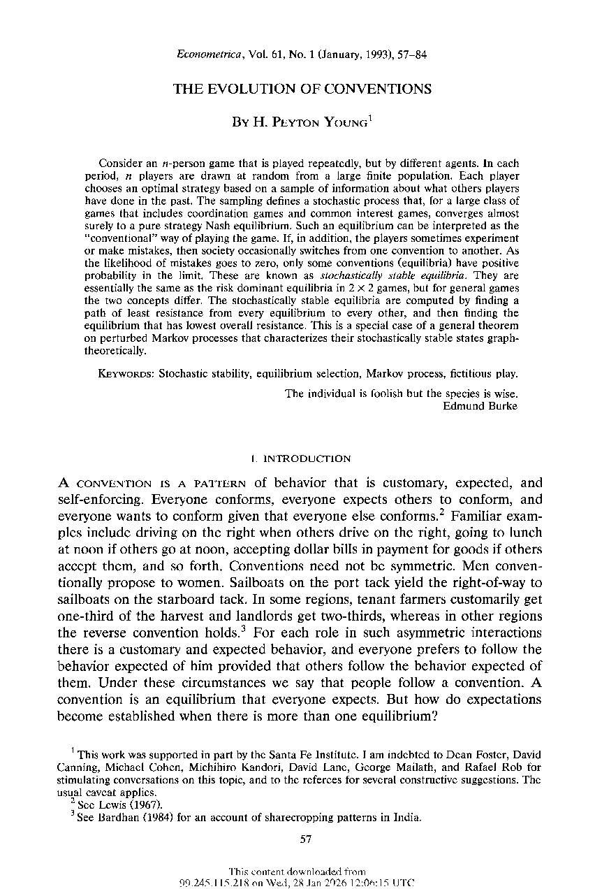

Econometrica, Vol. 61, No. 1 (January, 1993), 57-84

THE EVOLUTION OF CONVENTIONS

BY H. PEYTON YOUNG1

Consider an n-person game that is played repeatedly, but by different agents. In each

period, n players are drawn at random from a large finite population. Each player

chooses an optimal strategy based on a sample of information about what others players

have done in the past. The sampling defines a stochastic process that, for a large class of

games that includes coordination games and common interest games, converges almost

surely to a pure strategy Nash equilibrium. Such an equilibrium can be interpreted as the "conventional" way of playing the game. If, in addition, the players sometimes experiment

or make mistakes, then society occasionally switches from one convention to another. As

the likelihood of mistakes goes to zero, only some conventions (equilibria) have positive

probability in the limit. These are known as stochastically stable equilibria. They are

essentially the same as the risk dominant equilibria in 2 x 2 games, but for general games the two concepts differ. The stochastically stable equilibria are computed by finding a path of least resistance from every equilibrium to every other, and then finding the equilibrium that has lowest overall resistance. This is a special case of a general theorem on perturbed Markov processes that characterizes their stochastically stable states graphtheoretically.

KEYWORDS: Stochastic stability, equilibrium selection, Markov process, fictitious play.

The individual is foolish but the species is wise.

Edmund Burke

1. INTRODUCTION

A CONVENTION IS A PATTERN of behavior that is customary, expected, and

self-enforcing. Everyone conforms, everyone expects others to conform, and

everyone wants to conform given that everyone else conforms.2 Familiar exam-

ples include driving on the right when others drive on the right, going to lunch

at noon if others go at noon, accepting dollar bills in payment for goods if others accept them, and so forth. Conventions need not be symmetric. Men conventionally propose to women. Sailboats on the port tack yield the right-of-way to sailboats on the starboard tack. In some regions, tenant farmers customarily get one-third of the harvest and landlords get two-thirds, whereas in other regions the reverse convention holds.3 For each role in such asymmetric interactions there is a customary and expected behavior, and everyone prefers to follow the behavior expected of him provided that others follow the behavior expected of

- them. Under these circumstances we say that people follow a convention. A convention is an equilibrium that everyone expects. But how do expectations become established when there is more than one equilibrium?

'This work was supported in part by the Santa Fe Institute. I am indebted to Dean Foster, David

Canning, Michael Cohen, Michihiro Kandori, David Lane, George Mailath, and Rafael Rob for stimulating conversations on this topic, and to the referees for several constructive suggestions. The

usual caveat applies.

- 2 See Lewis (1967).
- 3See Bardhan (1984) for an account of sharecropping patterns in India.

57

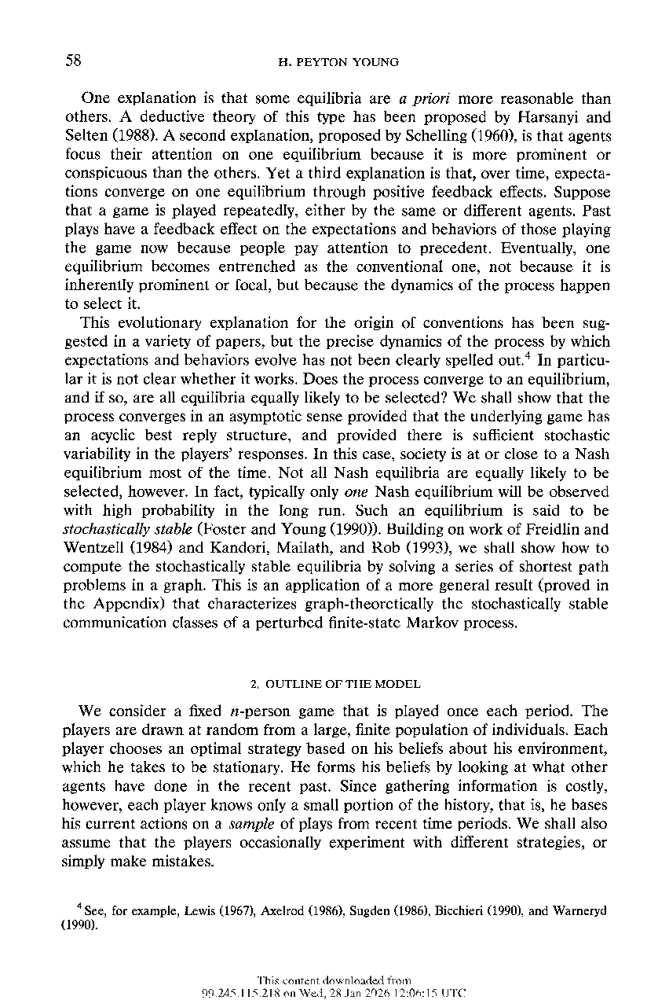

58 PEYTON YOUNG

One explanation is that some equilibria are a priori more reasonable than others. A deductive theory of this type has been proposed by Harsanyi and

Selten (1988). A second explanation, proposed by Schelling (1960), is that agents

focus their attention on one equilibrium because it is more prominent or conspicuous than the others. Yet a third explanation is that, over time, expecta-

tions converge on one equilibrium through positive feedback effects. Suppose

that a game is played repeatedly, either by the same or different agents. Past plays have a feedback effect on the expectations and behaviors of those playing the game now because people pay attention to precedent. Eventually, one equilibrium becomes entrenched as the conventional one, not because it is

inherently prominent or focal, but because the dynamics of the process happen to select it.

This evolutionary explanation for the origin of conventions has been sug-

gested in a variety of papers, but the precise dynamics of the process by which expectations and behaviors evolve has not been clearly spelled out.4 In particu-

lar it is not clear whether it works. Does the process converge to an equilibrium, and if so, are all equilibria equally likely to be selected? We shall show that the

process converges in an asymptotic sense provided that the underlying game has

an acyclic best reply structure, and provided there is sufficient stochastic variability in the players' responses. In this case, society is at or close to a Nash equilibrium most of the time. Not all Nash equilibria are equally likely to be selected, however. In fact, typically only one Nash equilibrium will be observed with high probability in the long run. Such an equilibrium is said to be stochastically stable (Foster and Young (1990)). Building on work of Freidlin and Wentzell (1984) and Kandori, Mailath, and Rob (1993), we shall show how to compute the stochastically stable equilibria by solving a series of shortest path

problems in a graph. This is an application of a more general result (proved in

the Appendix) that characterizes graph-theoretically the stochastically stable

communication classes of a perturbed finite-state Markov process.

2. OUTLINE OF THE MODEL

We consider a fixed n-person game that is played once each period. The players are drawn at random from a large, finite population of individuals. Each

player chooses an optimal strategy based on his beliefs about his environment,

which he takes to be stationary. He forms his beliefs by looking at what other

agents have done in the recent past. Since gathering information is costly,

however, each player knows only a small portion of the history, that is, he bases his current actions on a sample of plays from recent time periods. We shall also

assume that the players occasionally experiment with different strategies, or

simply make mistakes.

4 See, for example, Lewis (1967), Axelrod (1986), Sugden (1986), Bicchieri (1990), and Warneryd

(1990).

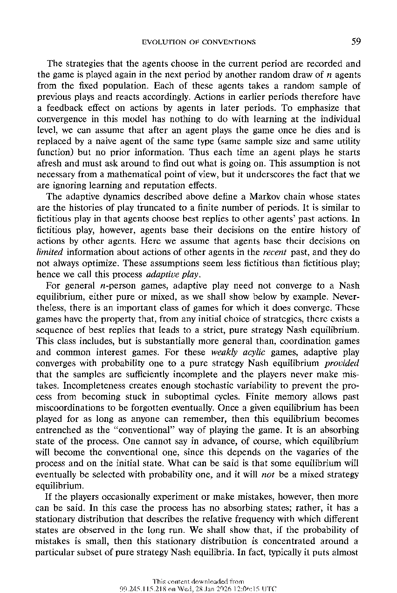

EVOLUTION OF CONVENTIONS 59

The strategies that the agents choose in the current period are recorded and the game is played again in the next period by another random draw of n agents from the fixed population. Each of these agents takes a random sample of previous plays and reacts accordingly. Actions in earlier periods therefore have a feedback effect on actions by agents in later periods. To emphasize that

convergence in this model has nothing to do with learning at the individual

level, we can assume that after an agent plays the game once he dies and is replaced by a naive agent of the same type (same sample size and same utility

function) but no prior information. Thus each time an agent plays he starts afresh and must ask around to find out what is going on. This assumption is not

necessary from a mathematical point of view, but it underscores the fact that we

are ignoring learning and reputation effects. The adaptive dynamics described above define a Markov chain whose states

are the histories of play truncated to a finite number of periods. It is similar to

fictitious play in that agents choose best replies to other agents' past actions. In

fictitious play, however, agents base their decisions on the entire history of

actions by other agents. Here we assume that agents base their decisions on

limited information about actions of other agents in the recent past, and they do

not always optimize. These assumptions seem less fictitious than fictitious play; hence we call this process adaptive play.

For general n-person games, adaptive play need not converge to a Nash

equilibrium, either pure or mixed, as we shall show below by example. Never-

theless, there is an important class of games for which it does converge. These

games have the property that, from any initial choice of strategies, there exists a sequence of best replies that leads to a strict, pure strategy Nash equilibrium. This class includes, but is substantially more general than, coordination games and common interest games. For these weakly acylic games, adaptive play

converges with probability one to a pure strategy Nash equilibrium provided that the samples are sufficiently incomplete and the players never make mistakes. Incompleteness creates enough stochastic variability to prevent the pro-

cess from becoming stuck in suboptimal cycles. Finite memory allows past

miscoordinations to be forgotten eventually. Once a given equilibrium has been played for as long as anyone can remember, then this equilibrium becomes entrenched as the "conventional" way of playing the game. It is an absorbing

state of the process. One cannot say in advance, of course, which equilibrium will become the conventional one, since this depends on the vagaries of the

process and on the initial state. What can be said is that some equilibrium will

eventually be selected with probability one, and it will not be a mixed strategy

equilibrium. If the players occasionally experiment or make mistakes, however, then more

can be said. In this case the process has no absorbing states; rather, it has a stationary distribution that describes the relative frequency with which different

states are observed in the long run. We shall show that, if the probability of mistakes is small, then this stationary distribution is concentrated around a particular subset of pure strategy Nash equilibria. In fact, typically it puts almost

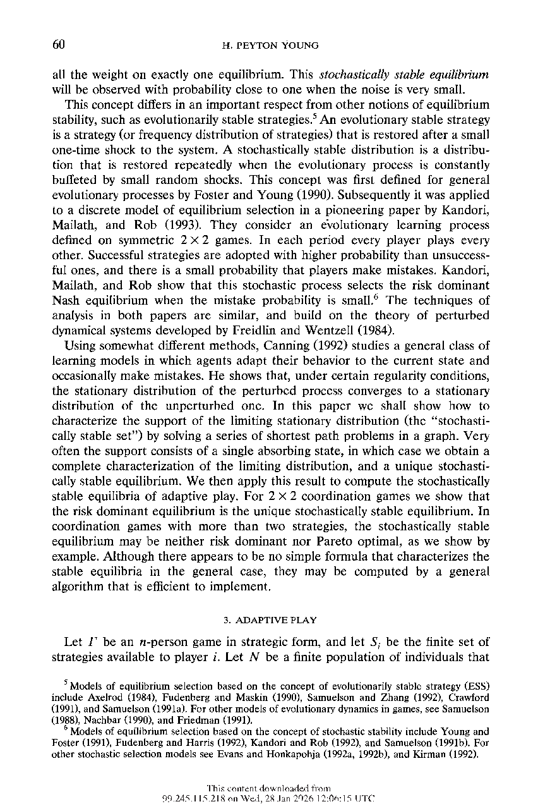

60 PEYTON YOUNG

all the weight on exactly one equilibrium. This stochastically stable equilibrium

will be observed with probability close to one when the noise is very small.

This concept differs in an important respect from other notions of equilibrium stability, such as evolutionarily stable strategies.5 An evolutionary stable strategy

is a strategy (or frequency distribution of strategies) that is restored after a small

one-time shock to the system. A stochastically stable distribution is a distribu-

tion that is restored repeatedly when the evolutionary process is constantly

buffeted by small random shocks. This concept was first defined for general evolutionary processes by Foster and Young (1990). Subsequently it was applied to a discrete model of equilibrium selection in a pioneering paper by Kandori, Mailath, and Rob (1993). They consider an evolutionary learning process defined on symmetric 2 x 2 games. In each period every player plays every

other. Successful strategies are adopted with higher probability than unsuccess-

ful ones, and there is a small probability that players make mistakes. Kandori,

Mailath, and Rob show that this stochastic process selects the risk dominant

Nash equilibrium when the mistake probability is small.6 The techniques of

analysis in both papers are similar, and build on the theory of perturbed dynamical systems developed by Freidlin and Wentzell (1984).

Using somewhat different methods, Canning (1992) studies a general class of learning models in which agents adapt their behavior to the current state and occasionally make mistakes. He shows that, under certain regularity conditions,

the stationary distribution of the perturbed process converges to a stationary

distribution of the unperturbed one. In this paper we shall show how to

characterize the support of the limiting stationary distribution (the "stochasti-

cally stable set") by solving a series of shortest path problems in a graph. Very often the support consists of a single absorbing state, in which case we obtain a complete characterization of the limiting distribution, and a unique stochastically stable equilibrium. We then apply this result to compute the stochastically stable equilibria of adaptive play. For 2 x 2 coordination games we show that the risk dominant equilibrium is the unique stochastically stable equilibrium. In coordination games with more than two strategies, the stochastically stable equilibrium may be neither risk dominant nor Pareto optimal, as we show by example. Although there appears to be no simple formula that characterizes the stable equilibria in the general case, they may be computed by a general algorithm that is efficient to implement.

3. ADAPTIVE PLAY

Let F be an n-person game in strategic form, and let Si be the finite set of

strategies available to player i. Let N be a finite population of individuals that

5Models of equilibrium selection based on the concept of evolutionarily stable strategy (ESS)

include Axelrod (1984), Fudenberg and Maskin (1990), Samuelson and Zhang (1992), Crawford

(1991), and Samuelson (1991a). For other models of evolutionary dynamics in games, see Samuelson

(1988), Nachbar (1990), and Friedman (1991).

6 Models of equilibrium selection based on the concept of stochastic stability include Young and

Foster (1991), Fudenberg and Harris (1992), Kandori and Rob (1992), and Samuelson (1991b). For

other stochastic selection models see Evans and Honkapohja (1992a, 1992b), and Kirman (1992).

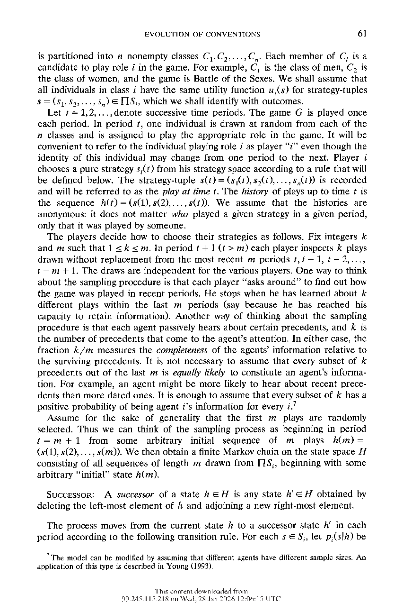

EVOLUTION OF CONVENTIONS 61

is partitioned into n nonempty classes C1, C2,..., Cn. Each member of Ci is a

candidate to play role i in the game. For example, C1 is the class of men, C2 is

the class of women, and the game is Battle of the Sexes. We shall assume that

all individuals in class i have the same utility function ui(s) for strategy-tuples

S = (511 S21 ... , Sn) E rI Si, which we shall identify with outcomes.

Let t = 1,2, .. ., denote successive time periods. The game G is played once

each period. In period t, one individual is drawn at random from each of the

n classes and is assigned to play the appropriate role in the game. It will be

convenient to refer to the individual playing role i as player "i" even though the

identity of this individual may change from one period to the next. Player i

chooses a pure strategy si(t) from his strategy space according to a rule that will

be defined below. The strategy-tuple s(t) = (sl(t), s2(t),..., sn(t)) is recorded

and will be referred to as the play at time t. The history of plays up to time t is

the sequence h(t) = (s(1), s(2), .. ., s(t)). We assume that the histories are

anonymous: it does not matter who played a given strategy in a given period,

only that it was played by someone.

The players decide how to choose their strategies as follows. Fix integers k and m such that 1 < k < m. In period t + 1 (t 2 m) each player inspects k plays drawn without replacement from the most recent m periods t, t - 1, t - 2,..., t - m + 1. The draws are independent for the various players. One way to think about the sampling procedure is that each player "asks around" to find out how the game was played in recent periods. He stops when he has learned about k different plays within the last m periods (say because he has reached his

capacity to retain information). Another way of thinking about the sampling

procedure is that each agent passively hears about certain precedents, and k is

the number of precedents that come to the agent's attention. In either case, the fraction k/m measures the completeness of the agents' information relative to

the surviving precedents. It is not necessary to assume that every subset of k

precedents out of the last m is equally likely to constitute an agent's informa-

tion. For example, an agent might be more likely to hear about recent prece-

dents than more dated ones. It is enough to assume that every subset of k has a

positive probability of being agent i's information for every i

Assume for the sake of generality that the first m plays are randomly

selected. Thus we can think of the sampling process as beginning in period

t = m + 1 from some arbitrary initial sequence of m plays h(m) =

(s(1), s(2), .. ., s(m)). We then obtain a finite Markov chain on the state space H

consisting of all sequences of length m drawn from HlSi, beginning with some

arbitrary "initial" state h(m).

SUCCESSOR: A successor of a state h E H is any state h' E H obtained by

deleting the left-most element of h and adjoining a new right-most element.

The process moves from the current state h to a successor state h' in each

period according to the following transition rule. For each s E Si, let pi(slh) be

7The model can be modified by assuming that different agents have different sample sizes. An

application of this type is described in Young (1993).

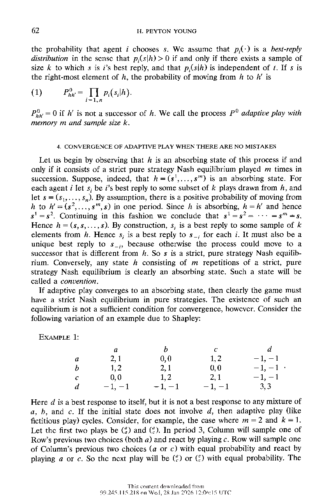

62 PEYTON YOUNG

the probability that agent i chooses s. We assume that pi(-) is a best-reply distribution in the sense that pi(slh) > 0 if and only if there exists a sample of size k to which s is i's best reply, and that pi(slh) is independent of t. If s is

the right-most element of h, the probability of moving from h to h' is

(1) Phh' =11 pi(siIh).

i=l,n

Phh, = 0 if h' is not a successor of h. We call the process Po adaptive play with

memory m and sample size k.

4. CONVERGENCE OF ADAPTIVE PLAY WHEN THERE ARE NO MISTAKES

Let us begin by observing that h is an absorbing state of this process if and

only if it consists of a strict pure strategy Nash equilibrium played m times in

succession. Suppose, indeed, that h = (s',... , Sm) is an absorbing state. For

each agent i let si be i's best reply to some subset of k plays drawn from h, and

let s = (s,,..., sn). By assumption, there is a positive probability of moving from h to h' = (S2, .. .M, S) in one period. Since h is absorbing, h = h' and hence S1=S 2. Continuing in this fashion we conclude that Si=S2= = Sm =S.

Hence h = (s, S, .. ., s). By construction, si is a best reply to some sample of k

elements from h. Hence si is a best reply to s-i for each i. It must also be a unique best reply to s-i, because otherwise the process could move to a

successor that is different from h. So s is a strict, pure strategy Nash equilib-

rium. Conversely, any state h consisting of m repetitions of a strict, pure strategy Nash equilibrium is clearly an absorbing state. Such a state will be

called a convention.

If adaptive play converges to an absorbing state, then clearly the game must have a strict Nash equilibrium in pure strategies. The existence of such an

equilibrium is not a sufficient condition for convergence, however. Consider the

following variation of an example due to Shapley:

EXAMPLE 1:

b c d

2,1 0,0 1,2 -1,-i

1,2 2,1 0,0 -1,-i

0,0 1,2 2,1 -1,-i

-1,-i -1,-i -1,-i 3,3

Here d is a best response to but it is not a best response to any mixture of a, b, and c. If the initial state does not involve d, then adaptive play (like

fictitious play) cycles. Consider, for example, the case where m = 2 and k = 1.

Let the first two plays be (a) and (a). In period 3, Column will sample one of

Row's previous two choices (both a) and react by playing c. Row will sample one

of Column's previous two choices (a or c) with equal probability and react by

playing a or c. So the next play will be (a) or (C) with equal probability. The

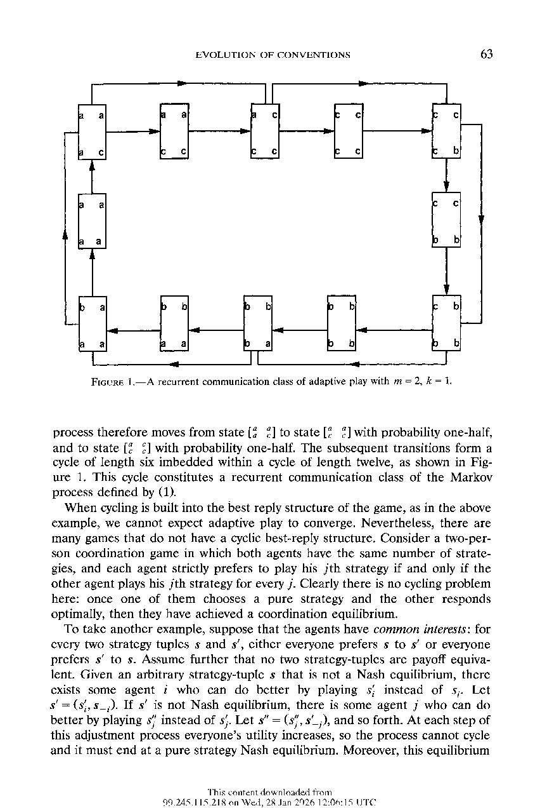

EVOLUTION OF CONVENTIONS 63

a ca of c

b

bi

ba b b cb

~ ~a aba bb

FIGURE 1.-A recurrent communication class of adaptive play with m =2, k = 1.

process therefore moves from state [a' c] to state [' 'I with probability one-half,

and to state [a c] with probability one-half. The subsequent transitions form a cycle of length six imbedded within a cycle of length twelve, as shown in Fig-

ure 1. This cycle constitutes a recurrent communication class of the Markov

process defined by (1).

When cycling is built into the best reply structure of the game, as in the above

example, we cannot expect adaptive play to converge. Nevertheless, there are

many games that do not have a cyclic best-reply structure. Consider a two-person coordination game in which both agents have the same number of strategies, and each agent strictly prefers to play his jth strategy if and only if the

other agent plays his jth strategy for every j. Clearly there is no cycling problem

here: once one of them chooses a pure strategy and the other responds optimally, then they have achieved a coordination equilibrium.

To take another example, suppose that the agents have common interests: for

every two strategy tuples s and s', either everyone prefers s to s' or everyone

prefers s' to s. Assume further that no two strategy-tuples are payoff equiva-

lent. Given an arbitrary strategy-tuple s that is not a Nash equilibrium, there

exists some agent i who can do better by playing s' instead of si. Let

- s= (si, s-). If s' is not Nash equilibrium, there is some agent j who can do better by playing s' instead of sj. Let s" = (sj', s' j), and so forth. At each step of this adjustment process everyone's utility increases, so the process cannot cycle and it must end at a pure strategy Nash equilibrium. Moreover, this equilibrium

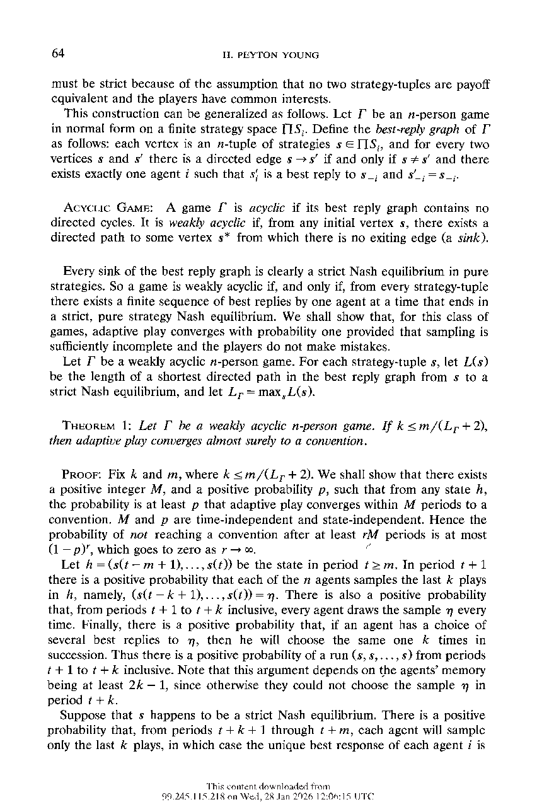

64 PEYTON YOUNG

must be strict because of the assumption that no two strategy-tuples are payoff equivalent and the players have common interests.

This construction can be generalized as follows. Let F be an n-person game

in normal form on a finite strategy space HSi. Define the best-reply graph of F

as follows: each vertex is an n-tuple of strategies s E HISi, and for every two

vertices s and s' there is a directed edge s -> s' if and only if s # s' and there

exists exactly one agent i such that s' is a best reply to s and s'_i = s- .

ACYCLIC GAME: A game F is acyclic if its best reply graph contains no

directed cycles. It is weakly acyclic if, from any initial vertex s, there exists a directed path to some vertex s* from which there is no exiting edge (a sink).

Every sink of the best reply graph is clearly a strict Nash equilibrium in pure

strategies. So a game is weakly acyclic if, and only if, from every strategy-tuple there exists a finite sequence of best replies by one agent at a time that ends in a strict, pure strategy Nash equilibrium. We shall show that, for this class of

games, adaptive play converges with probability one provided that sampling is

sufficiently incomplete and the players do not make mistakes.

Let F be a weakly acyclic n-person game. For each strategy-tuple s, let L(s)

be the length of a shortest directed path in the best reply graph from s to a

strict Nash equilibrium, and let L. = maxsL(s).

THEOREM 1: Let F be a weakly acyclic n-person game. If k < m/(Lr + 2),

- then adaptive play converges almost surely to a convention.

PROOF: Fix k and m, where k < m/(LF + 2). We shall show that there exists

a positive integer M, and a positive probability p, such that from any state h,

the probability is at least p that adaptive play converges within M periods to a

convention. M and p are time-independent and state-independent. Hence the

probability of not reaching a convention after at least rM periods is at most

(1 -p)r, which goes to zero as r - oo. ).

Let h = (s(t - m +.1.... , s(t)) be the state in period t > m. In period t + 1

there is a positive probability that each of the n agents samples the last k plays

in h, namely, (s(t - k + ...,s(t)) = -q. There is also a positive probability

that, from periods t + 1 to t + k inclusive, every agent draws the sample 7- every

time. Finally, there is a positive probability that, if an agent has a choice of several best replies to -q, then he will choose the same one k times in

succession. Thus there is a positive probability of a run (s, s, . . . , s) from periods

- t + 1 to t + k inclusive. Note that this argument depends on the agents' memory being at least 2k - 1, since otherwise they could not choose the sample -q in period t + k.

Suppose that s happens to be a strict Nash equilibrium. There is a positive

probability that, from periods t + k + 1 through t + m, each agent will sample

only the last k plays, in which case the unique best response of each agent i is

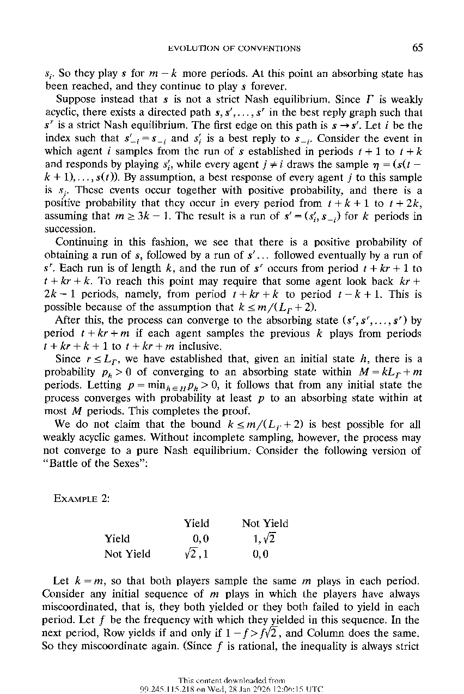

EVOLUTION OF CONVENTIONS 65

si. So they play s for m - k more periods. At this point an absorbing state has

been reached, and they continue to play s forever.

Suppose instead that s is not a strict Nash equilibrium. Since F is weakly

acyclic, there exists a directed path s, s', . . . , sr in the best reply graph such that

S' is a strict Nash equilibrium. The first edge on this path is s -> s'. Let i be the

index such that s' =s_ and s' is a best reply to s _. Consider the event in

which agent i samples from the run of s established in periods t + 1 to t + k

and responds by playing s', while every agent j # i draws the sample Y7 = (s(t -

k + 1) ... ., s(t)). By assumption, a best response of every agent j to this sample

is si. These events occur together with positive probability, and there is a

positive probability that they occur in every period from t + k + 1 to t + 2k,

assuming that m ? 3k - 1. The result is a run of s' = (s, s-i) for k periods in

succession.

Continuing in this fashion, we see that there is a positive probability of

obtaining a run of s, followed by a run of s'... followed eventually by a run of

Sr. Each run is of length k, and the run of Sr occurs from period t + kr + 1 to

t + kr + k. To reach this point may require that some agent look back kr +

2k - 1 periods, namely, from period t + kr + k to period t - k + 1. This is

possible because of the assumption that k < m/(LF + 2).

After this, the process can converge to the absorbing state (sr, Sr'..., Sr) by

period t + kr + m if each agent samples the previous k plays from periods

t+kr+k+ 1 to t+kr+m inclusive.

Since r < Lr, we have established that, given an initial state h, there is a

probability Ph > 0 of converging to an absorbing state within M = kLr + m

periods. Letting p = minh HPh > 0, it follows that from any initial state the

process converges with probability at least p to an absorbing state within at

most M periods. This completes the proof.

We do not claim that the bound k < m/(L + 2) is best possible for all weakly acyclic games. Without incomplete sampling, however, the process may

not converge to a pure Nash equilibrium. Consider the following version of

"Battle of the Sexes":

EXAMPLE 2:

Yield Not Yield

Yield 0,0 F

Not Yield FI, 1 0,0

Let k = m, so that both players sample the same m plays in each period.

Consider any initial sequence of m plays in which the players have always miscoordinated, that is, they both yielded or they both failed to yield in each period. Let f be the frequency with which they yielded in this sequence. In the

next period, Row yields if and only if 1 - f > fF2, and Column does the same.

So they miscoordinate again. (Since f is rational, the inequality is always strict

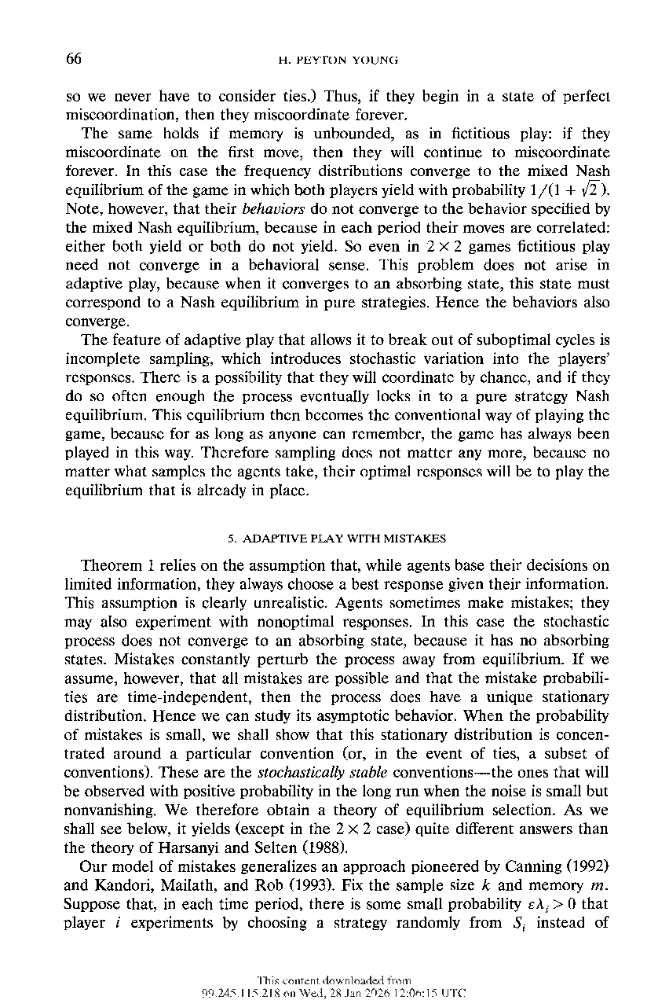

66 PEYTON YOUNG

so we never have to consider ties.) Thus, if they begin in a state of perfect

miscoordination, then they miscoordinate forever. The same holds if memory is unbounded, as in fictitious play: if they

miscoordinate on the first move, then they will continue to miscoordinate forever. In this case the frequency distributions converge to the mixed Nash

equilibrium of the game in which both players yield with probability 1/(1 + 2).

Note, however, that their behaviors do not converge to the behavior specified by the mixed Nash equilibrium, because in each period their moves are correlated:

either both yield or both do not yield. So even in 2 x 2 games fictitious play

need not converge in a behavioral sense. This problem does not arise in

adaptive play, because when it converges to an absorbing state, this state must

correspond to a Nash equilibrium in pure strategies. Hence the behaviors also

converge.

The feature of adaptive play that allows it to break out of suboptimal cycles is

incomplete sampling, which introduces stochastic variation into the players' responses. There is a possibility that they will coordinate by chance, and if they

do so often enough the process eventually locks in to a pure strategy Nash

equilibrium. This equilibrium then becomes the conventional way of playing the

game, because for as long as anyone can remember, the game has always been

played in this way. Therefore sampling does not matter any more, because no matter what samples the agents take, their optimal responses will be to play the

equilibrium that is already in place.

5. ADAPTIVE PLAY WITH MISTAKES

Theorem 1 relies on the assumption that, while agents base their decisions on

limited information, they always choose a best response given their information.

This assumption is clearly unrealistic. Agents sometimes make mistakes; they may also experiment with nonoptimal responses. In this case the stochastic process does not converge to an absorbing state, because it has no absorbing

states. Mistakes constantly perturb the process away from equilibrium. If we assume, however, that all mistakes are possible and that the mistake probabili-

ties are time-independent, then the process does have a unique stationary

distribution. Hence we can study its asymptotic behavior. When the probability of mistakes is small, we shall show that this stationary distribution is concen-

trated around a particular convention (or, in the event of ties, a subset of

conventions). These are the stochastically stable conventions-the ones that will

be observed with positive probability in the long run when the noise is small but

nonvanishing. We therefore obtain a theory of equilibrium selection. As we

shall see below, it yields (except in the 2 x 2 case) quite different answers than the theory of Harsanyi and Selten (1988).

Our model of mistakes generalizes an approach pioneered by Canning (1992) and Kandori, Mailath, and Rob (1993). Fix the sample size k and memory m.

Suppose that, in each time period, there is some small probability cAi > 0 that

player i experiments by choosing a strategy randomly from Si instead of

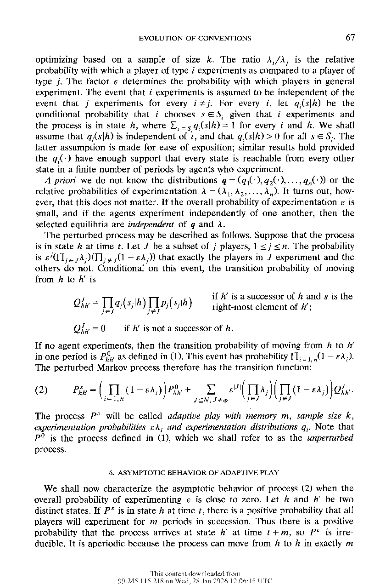

EVOLUTION OF CONVENTIONS 67

optimizing based on a sample of k. The ratio Ai/Ai is the relative

probability with which a player of type i experiments as compared to a player of

type j. The factor E determines the probability with which players in general

experiment. The event that i experiments is assumed to be independent of the

event that j experiments for every i oj. For every i, let qi(sIh) be the

conditional probability that i chooses s e Si given that i experiments and

the process is in state h, where EseSiqi(sIh) = 1 for every i and h. We shall

assume that qi(s I h) is independent of t, and that qi(s I h) > 0 for all s E Si. The

latter assumption is made for ease of exposition; similar results hold provided

the qi( ) have enough support that every state is reachable from every other

state in a finite number of periods by agents who experiment.

A priori we do not know the distributions q = (q1( ), q2( ), , q,( )) or the

relative probabilities of experimentation A = (A1, A2 ... ., A"). It turns out, how-

ever, that this does not matter. If the overall probability of experimentation E is

small, and if the agents experiment independently of one another, then the

selected equilibria are independent of q and A. The perturbed process may be described as follows. Suppose that the process

is in state h at time t. Let J be a subset of j players, 1 < ? < n. The probability

is Ej(Hj E= jAj)(Hlj 0 j(1 - cA1)) that exactly the players in J experiment and the

others do not. Conditional on this event, the transition probability of moving from h to h' is

Qih' = Hq1(sjlh) Hpj(s.lh) if h' is a successor of h and s is thehh'= flqj( right-most element of h';

Qhh' = 0 if h' is not a successor of h.

If no agent experiments, then the transition probability of moving from h to h'

in one period is P2h' as defined in (1). This event has probability fl1 n(l - EA d.

The perturbed Markov process therefore has the transition function:

# (2) hh' ( 1 r 1 EAJPhh, + hh E I(1A1) (1(1cA)i=(),n JcN, J#c ]EJ 0J ))

The process Pe will be called adaptive play with memory m, sample size k,

experimentation probabilities cAi and experimentation distributions qi. Note that

Po is the process defined in (1), which we shall refer to as the unperturbed

process.

6. ASYMPTOTIC BEHAVIOR OF ADAPTIVE PLAY

We shall now characterize the asymptotic behavior of process (2) when the

overall probability of experimenting e is close to zero. Let h and h' be two distinct states. If Pe is in state h at time t, there is a positive probability that all players will experiment for m periods in succession. Thus there is a positive probability that the process arrives at state h' at time t + m, so Pe is irreducible. It is aperiodic because the process can move from h to h in exactly m

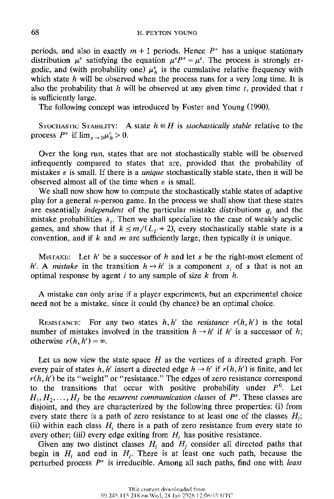

68 PEYTON YOUNG

periods, and also in exactly m + 1 periods. Hence Pe has a unique stationary

distribution p/6 satisfying the equation AuYP' = A'. The process is strongly ergodic, and (with probability one) A4 is the cumulative relative frequency with

which state h will be observed when the process runs for a very long time. It is also the probability that h will be observed at any given time t, provided that t

is sufficiently large.

The following concept was introduced by Foster and Young (1990).

STOCHASTIC STABILITY: A state h E H is stochastically stable relative to the

process Pe if lim e OA > 0.

Over the long run, states that are not stochastically stable will be observed

infrequently compared to states that are, provided that the probability of

mistakes E is small. If there is a unique stochastically stable state, then it will be

observed almost all of the time when E is small.

We shall now show how to compute the stochastically stable states of adaptive

play for a general n-person game. In the process we shall show that these states

are essentially independent of the particular mistake distributions qi and the

mistake probabilities Ai. Then we shall specialize to the case of weakly acyclic

games, and show that if k < m/(LF + 2), every stochastically stable state is a

convention, and if k and m are sufficiently large, then typically it is unique.

MISTAKE: Let h' be a successor of h and let s be the right-most element of

h'. A mistake in the transition h -* h' is a component si of s that is not an

optimal response by agent i to any sample of size k from h.

A mistake can only arise if a player experiments, but an experimental choice

need not be a mistake, since it could (by chance) be an optimal choice.

RESISTANCE: For any two states h, h' the resistance r(h, h') is the total

number of mistakes involved in the transition h -- h' if h' is a successor of h;

otherwise r(h, h') = oo.

Let us now view the state space H as the vertices of a directed graph. For

every pair of states h, h' insert a directed edge h -* h' if r(h, h') is finite, and let

r(h, h') be its "weight" or "resistance." The edges of zero resistance correspond

- to the transitions that occur with positive probability under Po. Let

H1, H2,..., HJ be the recurrent communication classes of Pe. These classes are

disjoint, and they are characterized by the following three properties: (i) from

every state there is a path of zero resistance to at least one of the classes Hi; (ii) within each class Hi there is a path of zero resistance from every state to

every other; (iii) every edge exiting from Hi has positive resistance.

Given any two distinct classes Hi and Hj consider all directed paths that

begin in Hi and end in Hj. There is at least one such path, because the

perturbed process Pe is irreducible. Among all such paths, find one with least

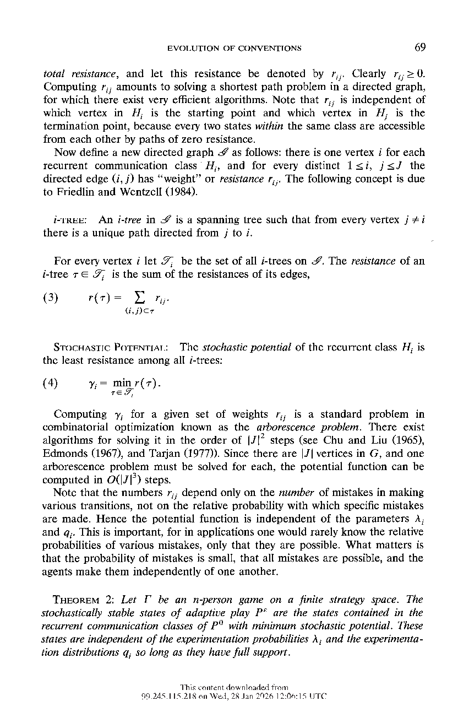

EVOLUTION OF CONVENTIONS 69

total resistance, and let this resistance denoted by rij. Clearly rij2 O.

Computing ri1 amounts to solving a shortest path problem in a directed graph,

for which there exist very efficient algorithms. Note that ri is independent of

which vertex in Hi is the starting point and which vertex in Hj is the

termination point, because every two states within the same class are accessible

from each other by paths of zero resistance.

Now define a new directed graph a as follows: there is one vertex i for each

recurrent communication class Hi, and for every distinct 1 <i, j < J the

directed edge (i, j) has "weight" or resistance rij. The following concept is due

to Friedlin and Wentzell (1984).

i-TREE: An i-tree in 9 is a spanning tree such that from every vertex j # i

there is a unique path directed from j to i.

For every vertex i let Y7 be the set of all i-trees on S. The resistance of an

i-tree r E Y7 is the sum of the resistances of its edges,

### (3) r(r) = E rij.

(i, j)Er

STOCHASTIC POTENTIAL: The stochastic potential of the recurrent class Hi is

the least resistance among all i-trees:

##### (4) Yi = min r (r) .

Computing yi for a given set of weights rij is a standard problem in

combinatorial optimization known as the arborescence problem. There exist

algorithms for solving it in the order of Ij12 steps (see Chu and Liu (1965),

Edmonds (1967), and Tarjan (1977)). Since there are IJI vertices in G, and one

arborescence problem must be solved for each, the potential function can be

computed in O(IJI3) steps.

Note that the numbers rij depend only on the number of mistakes in making

various transitions, not on the relative probability with which specific mistakes

are made. Hence the potential function is independent of the parameters Ai

and qi. This is important, for in applications one would rarely know the relative

probabilities of various mistakes, only that they are possible. What matters is that the probability of mistakes is small, that all mistakes are possible, and the agents make them independently of one another.

THEOREM 2: Let F be an n-person game on a finite strategy space. The stochastically stable states of adaptive play PC are the states contained in the

recurrent communication classes of Po with minimum stochastic potential. These

states are independent of the experimentation probabilities Ai and the experimentation distributions qi so long as they have full support.

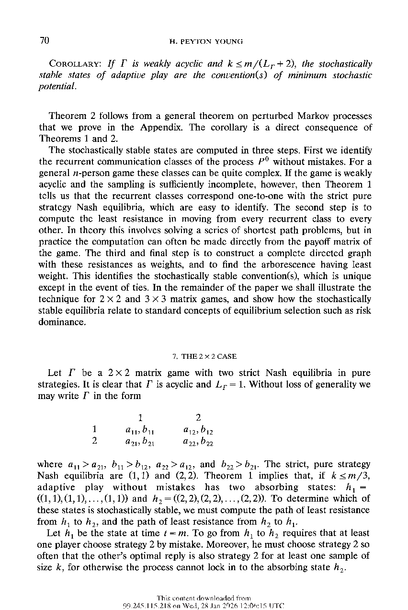

70 PEYTON YOUNG

COROLLARY: If F is weakly acyclic and k < m/(LF + 2), the stochastically

stable states of adaptive play are the convention(s) of minimum stochastic

potential.

Theorem 2 follows from a general theorem on perturbed Markov processes

that we prove in the Appendix. The corollary is a direct consequence of Theorems 1 and 2.

The stochastically stable states are computed in three steps. First we identify

the recurrent communication classes of the process Po without mistakes. For a

general n-person game these classes can be quite complex. If the game is weakly

acyclic and the sampling is sufficiently incomplete, however, then Theorem 1

tells us that the recurrent classes correspond one-to-one with the strict pure

strategy Nash equilibria, which are easy to identify. The second step is to

compute the least resistance in moving from every recurrent class to every

other. In theory this involves solving a series of shortest path problems, but in

practice the computation can often be made directly from the payoff matrix of

the game. The third and final step is to construct a complete directed graph with these resistances as weights, and to find the arborescence having least

weight. This identifies the stochastically stable convention(s), which is unique

except in the event of ties. In the remainder of the paper we shall illustrate the technique for 2 x 2 and 3 x 3 matrix games, and show how the stochastically stable equilibria relate to standard concepts of equilibrium selection such as risk dominance.

7. THE2x2CASE

Let F be a 2 x 2 matrix game with two strict Nash equilibria in pure

strategies. It is clear that F is acyclic and L. = 1. Without loss of generality we

may write F in the form

2

- 1 all, bl, a12,
- 2 a21, b21 a22 b22

where a1l >a21, b1l >b12, a22 >a12, and b22>b21. The strict, pure strategy

Nash equilibria are (1, 1) and (2, 2). Theorem 1 implies that, if k < m/3,

adaptive play without mistakes has two absorbing states: h1 =

((1, 1), (1, 1), ... , (1, 1)) and h2 = ((2, 2), (2, 2), ... , (2, 2)). To determine which of

these states is stochastically stable, we must compute the path of least resistance from h1 to h2, and the path of least resistance from h2 to h1.

Let h1 be the state at time t = m. To go from h1 to h2 requires that at least

one player choose strategy 2 by mistake. Moreover, he must choose strategy 2 so often that the other's optimal reply is also strategy 2 for at least one sample of size k, for otherwise the process cannot lock in to the absorbing state h2.

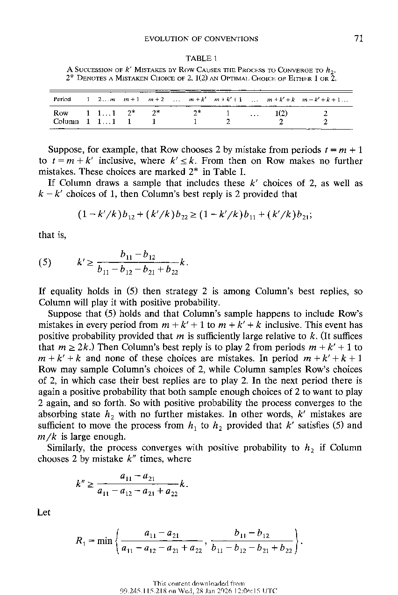

EVOLUTION OF CONVENTIONS 71

TABLE 1

A SUCCESSION OF k' MISTAKES BY Row CAUSES THE PROCESS TO CONVERGE TO h2. 2* DENOTES A MISTAKEN CHOICE OF 2, 1(2) AN OPTIMAL CHOICE OF EITHER 1 OR 2.

Period 2 ... m m+1 m+2 m+k' m+k'+l m+k'+k m+k'+k+ 1...

Row 1 1...1 2* 2* 1 1(2) 2

Column 1 1...1 2 2

Suppose, for example, that Row chooses 2 by mistake from periods t = m + 1

to t = m + k' inclusive, where k' < k. From then on Row makes no further

mistakes. These choices are mnarked 2* in Table I.

If Column draws a sample that includes these k' choices of 2, as well as

k - k' choices of 1, then Column's best reply is 2 provided that

(1 - kf/k)bl2 + (k'/k)b22 ? (1 - k'/k)bll + (k'/k)b2l;

that is,

#### (5) k'? > 1-1 k. k bl l- b 12-b2l

If equality holds in (5) then strategy 2 is among Column's best replies, so

Column will play it with positive probability.

Suppose that (5) holds and that Column's sample happens to include Row's

mistakes in every period from m + k' + 1 to m + k' + k inclusive. This event has

positive probability provided that m is sufficiently large relative to k. (It suffices that m ? 2k.) Then Column's best reply is to play 2 from periods m + k' + 1 to m + k' + k and none of these choices are mistakes. In period m + k' + k + 1

Row may sample Column's choices of 2, while Column samples Row's choices

of 2, in which case their best replies are to play 2. In the next period there is again a positive probability that both sample enough choices of 2 to want to play

2 again, and so forth. So with positive probability the process converges to the

absorbing state h2 with no further mistakes. In other words, k' mistakes are sufficient to move the process from h1 to h2 provided that k' satisfies (5) and

m/k is large enough.

Similarly, the process converges with positive probability to h2 if Column

chooses 2 by mistake k" times, where

k" > all - a2l k.

all - a12 - a2l + a22

Let

R, min all - a2l bl - b12

all - a12 - a2l + a22 bl' - b12 - b2l + b22 J

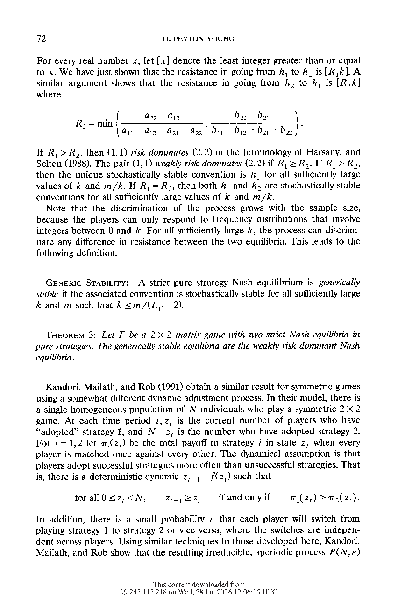

72 YOUNG

For every real number x, let [x] denote the least integer greater than or equal to x. We have just shown that the resistance in going from h1 to h2 is [R1k]. A

similar argument shows that the resistance in going from h2 to h1 is [R2k]

where

R2=mi / a22-a12 b22-b2l

Xa11 -a12-- a21 + a22 12- b21 + b22

If R1 > R2, then (1, 1) risk dominates (2,2) in the terminology of Harsanyi and

Selten (1988). The pair (1, 1) weakly risk dominates (2,2) if R1 ? R2. If R1 > R2,

then the unique stochastically stable convention is h1 for all sufficiently large values of k and m/k. If R1 = R2, then both h1 and h2 are stochastically stable conventions for all sufficiently large values of k and m/k.

Note that the discrimination of the process grows with the sample size,

because the players can only respond to frequency distributions that involve

integers between 0 and k. For all sufficiently large k, the process can discriminate any difference in resistance between the two equilibria. This leads to the

following definition.

GENERIC STABILITY: A strict pure strategy Nash equilibrium is generically stable if the associated convention is stochastically stable for all sufficiently large

k and m such that k < m/(LF + 2).

THEOREM 3: Let F be a 2 x 2 matrix game with two strict Nash equilibria in

pure strategies. The generically stable equilibria are the weakly risk dominant Nash

equilibria.

Kandori, Mailath, and Rob (1991) obtain a similar result for symmetric games using a somewhat different dynamic adjustment process. In their model, there is a single homogeneous population of N individuals who play a symmetric 2 x 2

game. At each time period t, zt is the current number of players who have

"adopted" strategy 1, and N - zt is the number who have adopted strategy 2.

For i = 1,2 let r7i(zt) be the total payoff to strategy i in state zt when every

player is matched once against every other. The dynamical assumption is that players adopt successful strategies more often than unsuccessful strategies. That

is, there is a deterministic dynamic zt+1 = f(zt) such that

for allO<z <N zt Zt if and only if -1(Zt) 2 72(zt)v

In addition, there is a small probability E that each player will switch from -playing strategy 1 to strategy 2 or vice versa, where the switches are independent across players. Using similar techniques to those developed here, Kandori,

Mailath, and Rob show that the resulting irreducible, aperiodic process P(N, E)

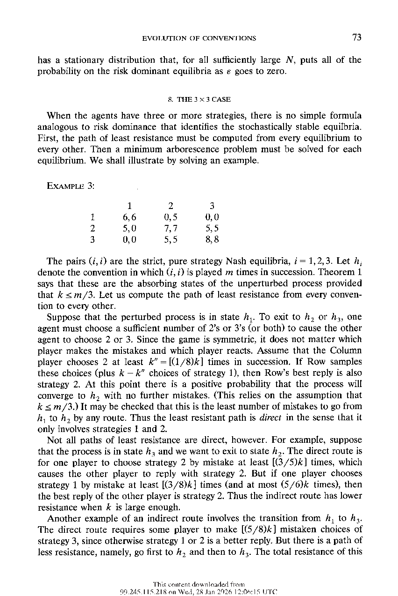

EVOLUTION OF CONVENTIONS 73

has a stationary distribution that, for all sufficiently large N, puts all of the

probability on the risk dominant equilibria as E goes to zero.

8. THE 3 x 3 CASE

When the agents have three or more strategies, there is no simple formula analogous to risk dominance that identifies the stochastically stable equilbria.

First, the path of least resistance must be computed from every equilibrium to

every other. Then a minimum arborescence problem must be solved for each

equilibrium. We shall illustrate by solving an example.

EXAMPLE 3:

2 3

6,6 0,5 0,0 5,0 7,7 5,5 0,0 5,5 8,8

The pairs (i, i) are the strict, strategy Nash equilibria, i = 1, 2,3. Let hi

denote the convention in which (i, i) is played m times in succession. Theorem 1 says that these are the absorbing states of the unperturbed process provided

that k < m/3. Let us compute the path of least resistance from every conven-

tion to every other.

Suppose that the perturbed process is in state h1. To exit to h2 or h3, one

agent must choose a sufficient number of 2's or 3's (or both) to cause the other

agent to choose 2 or 3. Since the game is symmetric, it does not matter which

player makes the mistakes and which player reacts. Assume that the Column

player chooses 2 at least k" = [(1/8)k] times in succession. If Row samples these choices (plus k - k" choices of strategy 1), then Row's best reply is also strategy 2. At this point there is a positive probability that the process will converge to h2 with no further mistakes. (This relies on the assumption that k < m/3.) It may be checked that this is the least number of mistakes to go from h1 to h2 by any route. Thus the least resistant path is direct in the sense that it

only involves strategies 1 and 2.

Not all paths of least resistance are direct, however. For example, suppose

that the process is in state h3 and we want to exit to state h2. The direct route is for one player to choose strategy 2 by mistake at least [(3/5)k] times, which causes the other player to reply with strategy 2. But if one player chooses

- strategy 1 by mistake at least [(3/8)k] times (and at most (5/6)k times), then the best reply of the other player is strategy 2. Thus the indirect route has lower resistance when k is large enough.

Another example of an indirect route involves the transition from h1 to h3. The direct route requires some player to make [(5/8)k] mistaken choices of strategy 3, since otherwise strategy 1 or 2 is a better reply. But there is a path of less resistance, namely, go first to h2 and then to h3. The total resistance of this

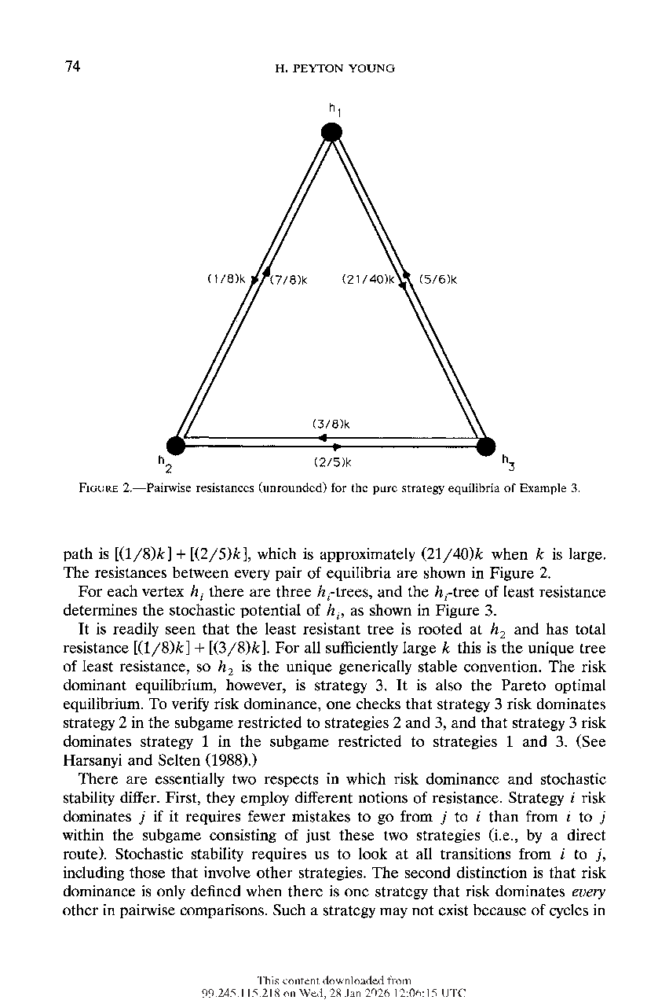

74 PEYTON YOUNG

hI

(1/8)k (7/8)k (21/40) (5/6)k

(3/8)k

(2/5)k h3

FIGURE 2.-Pairwise resistances (unrounded) for the pure strategy equilibria of Example 3.

path is [(1/8)k] + [(2/5)k], which is approximately (21/40)k when k is large.

The resistances between every pair of equilibria are shown in Figure 2.

For each vertex hi there are three hi-trees, and the hi-tree of least resistance determines the stochastic potential of hi, as shown in Figure 3.

It is readily seen that the least resistant tree is rooted at h2 and has total

resistance [(1/8)k] + [(3/8)k]. For all sufficiently large k this is the unique tree

of least resistance, so h2 is the unique generically stable convention. The risk dominant equilibrium, however, is strategy 3. It is also the Pareto optimal equilibrium. To verify risk dominance, one checks that strategy 3 risk dominates

- strategy 2 in the subgame restricted to strategies 2 and 3, and that strategy 3 risk dominates strategy 1 in the subgame restricted to strategies 1 and 3. (See Harsanyi and Selten (1988).)

There are essentially two respects in which risk dominance and stochastic

stability differ. First, they employ different notions of resistance. Strategy i risk

dominates j if it requires fewer mistakes to go from j to i than from i to j

within the subgame consisting of just these two strategies (i.e., by a direct

route). Stochastic stability requires us to look at all transitions from i to j,

including those that involve other strategies. The second distinction is that risk

dominance is only defined when there is one strategy that risk dominates every

other in pairwise comparisons. Such a strategy may not exist because of cycles in

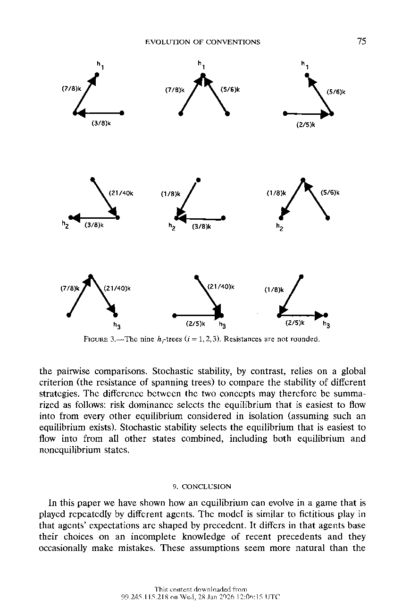

###### EVOLUTION OF CONVENTIONS 75

~~~~~~h h

(3/8)k (2/5)k

h2 (3/8)k h2 (3/8)k

(2/5)k h3 (2/5)k h3

FIGURE 3.-The nine hi-trees Resistances are not rounded.

the pairwise comparisons. Stochastic stability, by contrast, relies on a global

criterion (the resistance of spanning trees) to compare the stability of different

strategies. The difference between the two concepts may therefore be summarized as follows: risk dominance selects the equilibrium that is easiest to flow

into from every other equilibrium considered in isolation (assuming such an equilibrium exists). Stochastic stability selects the equilibrium that is easiest to

flow into from all other states combined, including both equilibrium and

nonequilibrium states.

9. CONCLUSION

In this paper we have shown how an equilibrium can evolve in a game that is

played repeatedly by different agents-. The model is similar to fictitious play in that agents' expectations are shaped by precedent. It differs in that agents base their choices on an incomplete knowledge of recent precedents and they occasionally make mistakes. These assumptions seem more natural than the

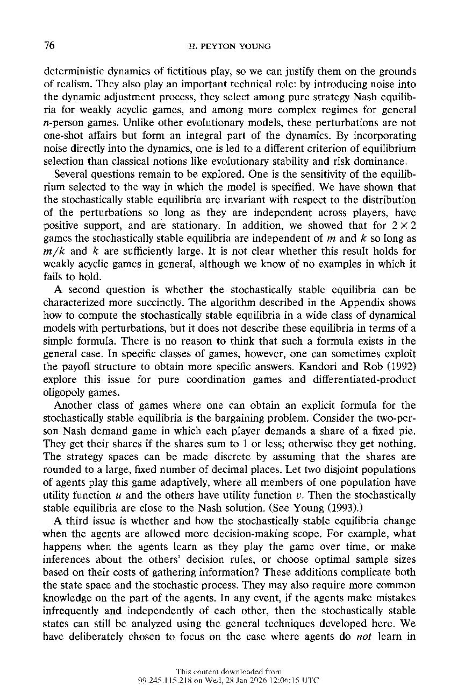

76 PEYTON YOUNG

deterministic dynamics of fictitious play, so we can justify them on the grounds of realism. They also play an important technical role: by introducing noise into the dynamic adjustment process, they select among pure strategy Nash equilibria for weakly acyclic games, and among more complex regimes for general

n-person games. Unlike other evolutionary models, these perturbations are not one-shot affairs but form an integral part of the dynamics. By incorporating

noise directly into the dynamics, one is led to a different criterion of equilibrium

selection than classical notions like evolutionary stability and risk dominance.

Several questions remain to be explored. One is the sensitivity of the equilib-

rium selected to the way in which the model is specified. We have shown that

the stochastically stable equilibria are invariant with respect to the distribution

of the perturbations so long as they are independent across players, have positive support, and are stationary. In addition, we showed that for 2 x 2

games the stochastically stable equilibria are independent of m and k so long as

m/k and k are sufficiently large. It is not clear whether this result holds for weakly acyclic games in general, although we know of no examples in which it

fails to hold.

A second question is whether the stochastically stable equilibria can be characterized more succinctly. The algorithm described in the Appendix shows

how to compute the stochastically stable equilibria in a wide class of dynamical models with perturbations, but it does not describe these equilibria in terms of a

simple formula. There is no reason to think that such a formula exists in the

general case. In specific classes of games, however, one can sometimes exploit the payoff structure to obtain more specific answers. Kandori and Rob (1992) explore this issue for pure coordination games and differentiated-product oligopoly games.

Another class of games where one can obtain an explicit formula for the

stochastically stable equilibria is the bargaining problem. Consider the two-person Nash demand game in which each player demands a share of a fixed pie. They get their shares if the shares sum to 1 or less; otherwise they get nothing. The strategy spaces can be made discrete by assuming that the shares are

rounded to a large, fixed number of decimal places. Let two disjoint populations

of agents play this game adaptively, where all members of one population have utility function u and the others have utility function v. Then the stochastically

stable equilibria are close to the Nash solution. (See Young (1993).)

A third issue is whether and how the stochastically stable equilibria change

when the agents are allowed more decision-making scope. For example, what happens when the agents learn as they play the game over time, or make inferences about the others' decision rules, or choose optimal sample sizes

based on their costs of gathering information? These additions complicate both

the state space and the stochastic process. They may also require more common knowledge on the part of the agents. In any event, if the agents make mistakes

infrequently and independently of each other, then the stochastically stable states can still be analyzed using the general techniques developed here. We

have deliberately chosen to focus on the case where agents do not learn in

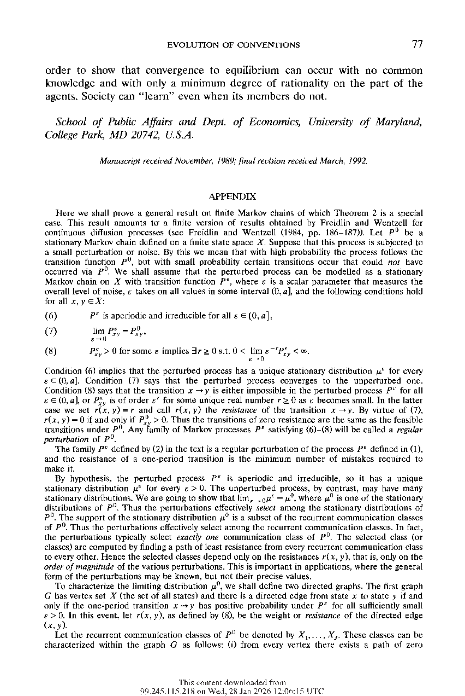

EVOLUTION OF CONVENTIONS 77

order to show that convergence to equilibrium can occur with no common

knowledge and with only a minimum degree of rationality on the part of the

agents. Society can "learn" even when its members do not.

School of Public Affairs and Dept. of Economics, University of Maryland,

College Park, MD 20742, U.S.A.

Manuscript received November, 1989; final revision received March, 1992.

APPENDIX

Here we shall prove a general result on finite Markov chains of which Theorem 2 is a special

case. This result amounts to' a finite version of results obtained by Freidlin and Wentzell for

continuous diffusion processes (see Freidlin and Wentzell (1984, pp. 186-187)). Let Po be a

stationary Markov chain defined on a finite state space X. Suppose that this process is subjected to a small perturbation or noise. By this we mean that with high probability the process follows the

transition function Po, but with small probability certain transitions occur that could not have

occurred via Po. We shall assume that the perturbed process can be modelled as a stationary

Markov chain on X with transition function P?, where E is a scalar parameter that measures the

overall level of noise, E takes on all values in some interval (0, a], and the following conditions hold

for all x, y E X:

- (6) P? is aperiodic and irreducible for all E E (0, a],
- (7) lim PXY = PO xy xy,
- (8) Px'y > 0 for some E implies 3r ? 0 s.t. 0 < lim E-rPxey < o.

Condition (6) implies that the perturbed process has a unique stationary distribution A' for every

E E (0, a]. Condition (7) says that the perturbed process converges to the unperturbed one.

Condition (8) says that the transition x -- y is either impossible in the perturbed process P? for all

E E (0, a], or P., is of order Er for some unique real number r 2 0 as E becomes small. In the latter

case we set r(x, y) = r and call r(x, y) the resistance of the transition x -- y. By virtue of (7),

r(x, y) = 0 if and only if Po% > 0. Thus the transitions of zero resistance are the same as the feasible

transitions under P0. Any family of Markov processes P? satisfying (6)-(8) will be called a regular

perturbation of Po.

The family P? defined by (2) in the text is a regular perturbation of the process P? defined in (1),

and the resistance of a one-period transition is the minimum number of mistakes required to

make it.

By hypothesis, the perturbed process P? is aperiodic and irreducible, so it has a unique

stationary distribution A' for every E > 0. The unperturbed process, by contrast, may have many stationary distributions. We are going to show that lim6 = ,u?, where AO is one of the stationary

distributions of Po. Thus the perturbations effectively select among the stationary distributions of Po. The support of the stationary distribution AO is a subset of the recurrent communication classes

of P0. Thus the perturbations effectively select among the recurrent communication classes. In fact,

the perturbations typically select exactly one communication class of P0. The selected class (or classes) are computed by finding a path of least resistance from every recurrent communication class to every other. Hence the selected classes depend only on the resistances r(x, y), that is, only on the

order of magnitude of the various perturbations. This is important in applications, where the general

form of the perturbations may be known, but not their precise values.

To characterize the limiting distribution A,u we shall define two directed graphs. The first graph

G has vertex set X (the set of all states) and there is a directed edge from state x to state y if and

only if the one-period transition x -- y has positive probability under P6 for all sufficiently small E > 0. In this event, let r(x, y), as defined by (8), be the weight or resistance of the directed edge

(x, y).

Let the recurrent communication classes of P0 be denoted by X,,..., XJ. These classes can be

characterized within the graph G as follows: (i) from every vertex there exists a path of zero

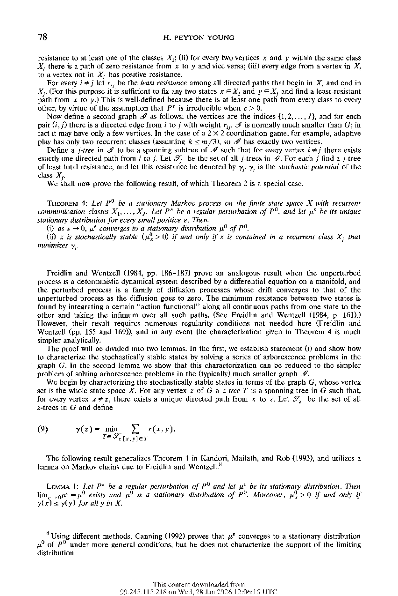

78 PEYTON YOUNG

resistance to at least one of the Xi; (ii) for every two vertices x and y within the same class Xi there is a path of zero resistance from x to y and vice versa; (iii) every edge from a vertex in Xi to a vertex not

For every i =kj let rij be the least among all directed paths that begin in Xi and end in Xj. (For this purpose it is sufficient to fix any two states x E Xi and y E X. and find a least-resistant

path from x to y.) This is well-defined because there is at least one path from every class to every other, by virtue of the assumption that P? is irreducible when E > 0.

Now define a second graph 9 as follows: the vertices are the indices (1, 2,. .., J}, and for each

pair (i, j) there is a directed edge from i to j with weight rij. 9 is normally much smaller than G; in

fact it may have only a few vertices. In the case of a 2 X 2 coordination game, for example, adaptive

play has only two recurrent classes (assuming k < m/3), so 9 has exactly two vertices.

Define a j-tree in 9 to be a spanning subtree of 9 such that for every vertex i = j there exists

exactly one directed path from i to j. Let 57j be the set of all I-trees in i9. For each j find a j-tree

of least total resistance, and let this resistance be denoted by yj. yj is the stochastic potential of the

class Xj.

We shall now prove the following result, of which Theorem 2 is a special case.

THEOREM 4: Let Po be a stationary Markov process on the finite state space X with recurrent

communication classes X1,..., XJ. Let P? be a regular perturbation of Po, and let A' be its unique

stationary distribution for every small positive 6. Then:

- (i) as E -o 0, A' converges to a stationary distribution AO of Po.
- (ii) x is stochastically stable (AOLx > 0) if and only if x is contained in a recurrent class Xj that

minimizes yj.

Freidlin and Wentzell (1984, pp. 186-187) prove an analogous result when the unperturbed

process is a deterministic dynamical system described by a differential equation on a manifold, and the perturbed process is a family of diffusion processes whose drift converges to that of the unperturbed process as the diffusion goes to zero. The minimum resistance between two states is found by integrating a certain "action functional" along all continuous paths from one state to the

other and taking the infimum over all such paths. (See Freidlin and Wentzell (1984, p. 161).) However, their result requires numerous regularity conditions not needed here (Freidlin and

Wentzell (pp. 155 and 169)), and in any event the characterization given in Theorem 4 is much

simpler analytically.

The proof will be divided into two lemmas. In the first, we establish statement (i) and show how

to characterize the stochastically stable states by solving a series of arborescence problems in the graph G. In the second lemma we show that this characterization can be reduced to the simpler

problem of solving arborescence problems in the (typically) much smaller graph 9.

We begin by characterizing the stochastically stable states in terms of the graph G, whose vertex

set is the whole state space X. For any vertex z of G a z-tree T is a spanning tree in G such that,

for every vertex x * z, there exists a unique directed path from x to z. Let 1T be the set of all

z-trees in G and define

(9) y(z) = min E r(x, y).

TE z [x,y]ET

The following result generalizes Theorem 1 in Kandori, Mailath, and Rob (1993), and utilizes a

lemma on Markov chains due to Freidlin and Wentzell.8

LEMMA 1: Let P6 be a regular perturbation of P0 and let A' be its stationary distribution. Then

lim6 Ej = 0 exists and juto is a stationary distribution of Po. Moreover, /uo > 0 if and only if

y(x) < y(y) for all y in X.

8 Using different methods, Canning (1992) proves that A converges to a stationary distribution

Au of P0 under more general conditions, but he does not characterize the support of the limiting

distribution.

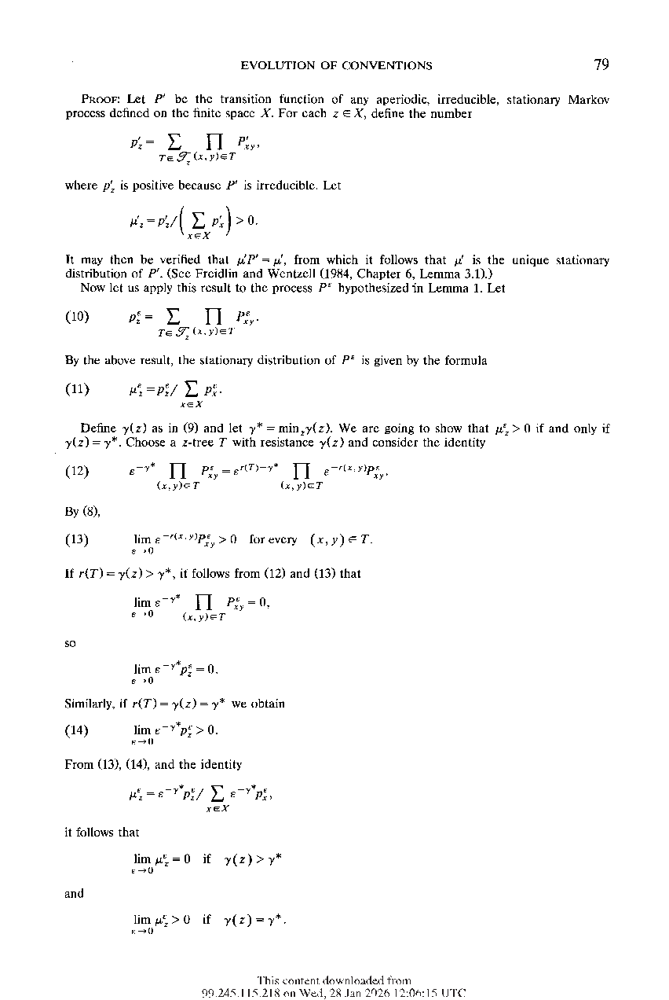

EVOLUTION OF CONVENTIONS 79

PROOF: Let P' be the transition function of any aperiodic, irreducible, stationary Markov process defined on the finite space X. For each z E X, define the number

PZ'= E H PI,y

Te - (x, y)e T

where p' is positive because P' is irreducible. Let

,utz = pz/ Px ) > ?

xeX

It may then be verified that siP'=,p', from which it follows that ,u' is the unique stationary distribution of P'. (See Freidlin and Wentzell (1984, Chapter 6, Lemma 3.1).)

Now let us apply this result to the process P? hypothesized in Lemma 1. Let

(10) p?= E H XJy

Te - (x,y)eT

By the above result, the stationary distribution of PE is given by the formula

E1) y = "I / E X-

XEX

Define y(z) as in (9) and let yy* = minzy(z). We are going to show that g? > 0 if and only if

y(z) = y'*. Choose a z-tree T with resistance y(z) and consider the identity

- (12) E6y rL p? =r(T) - I Er(xy)pe (x,y)GT (x,y)eT

By

- (13) limE -r(xY)PxEy >0 for every (x,y)E T.

If r(T) = y(z) > y*, it follows from (12) and (13) that

limE-Y* H PXy =0'

E*0 (x, y)e T

so

lim E-Y*p -=0.

e-O

Similarly, if r(T) = y(z) = y* we obtain

###### (14) limE -* > O.

From (13), (14), and the identity

A = EpZ?/ E E-6 p ?

XEX

it follows that

lim,u?z=0 if y(z)> y*

e-O

and

lim ,u4 > 0 if y(z) = y*.

e-O

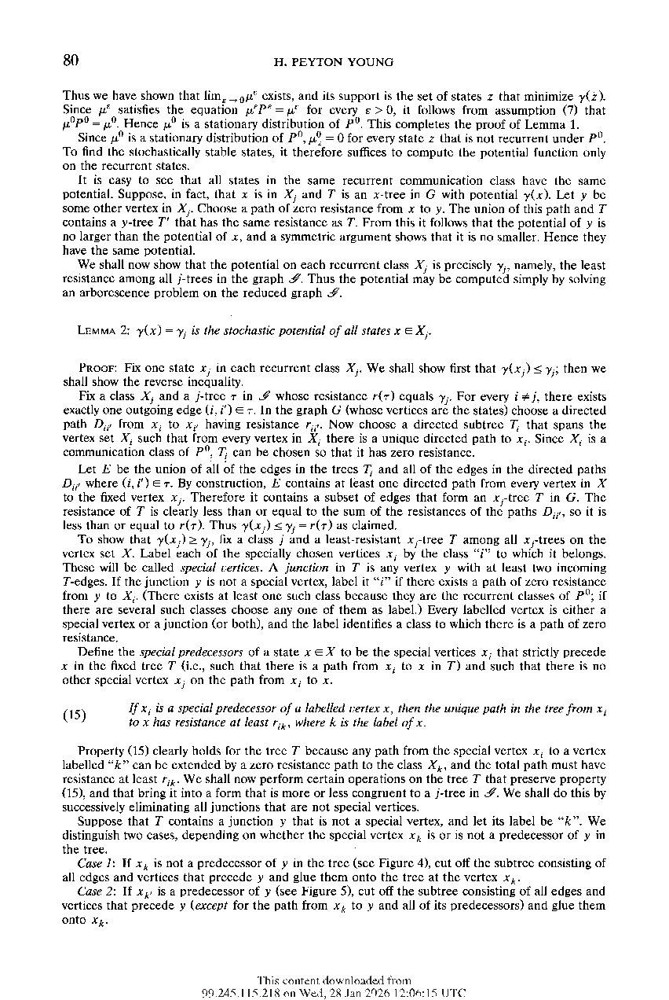

80 PEYTON YOUNG

Thus we have shown that urn6 exists, and its support is the set of states z that minimize y(z).

Since AE satisfies the equation = AE for every E > 0, it follows from assumption (7) that

,?p? = ,o. Hence ,u? is a stationary distribution of Po. This completes the proof of Lemma 1.

Since ,u? is a stationary distribution of Po, AO? = 0 for every state z that is not recurrent under Po.

To find the stochastically stable states, it therefore suffices to compute the potential function only

on the recurrent states.

It is easy to see that all states in the same recurrent communication class have the same

potential. Suppose, in fact, that x is in Xi and T is an x-tree in G with potential y(x). Let y be

some other vertex in X.. Choose a path of zero resistance from x to y. The union of this path and T

contains a y-tree T' that has the same resistance as T. From this it follows that the potential of y is

no larger than the potential of x, and a symmetric argument shows that it is no smaller. Hence they have the same potential.

We shall now show that the potential on each recurrent class Xj is precisely yj, namely, the least resistance among all j-trees in the graph 9. Thus the potential may be computed simply by solving

an arborescence problem on the reduced graph cO.

LEMMA 2: y(x) = yj is the stochastic potential of all states x E Xj.

PROOF: Fix one state xi in each recurrent class Xj. We shall show first that y(xj) < yj; then we

shall show the reverse inequality.

Fix a class Xj and a j-tree r in 9 whose resistance r(r) equals yj. For every i Aj, there exists

exactly one outgoing edge (i, i') E r. In the graph G (whose vertices are the states) choose a directed

path Dii, from xi to xi, having resistance rii,. Now choose a directed subtree Ti that spans the

vertex set Xi such that from every vertex in Xi there is a unique directed path to xi. Since Xi is a

communication class of Po, Ti can be chosen so that it has zero resistance. Let E be the union of all of the edges in the trees Ti and all of the edges in the directed paths

Dii, where (i, i') E r. By construction, E contains at least one directed path from every vertex in X

to the fixed vertex xi. Therefore it contains a subset of edges that form an x1-tree T in G. The

resistance of T is clearly less than or equal to the sum of the resistances of the paths Dii,, so it is

less than or equal to r(r). Thus y(xj) < yj = r(r) as claimed.

To show that y(xj) ? yj, fix a class j and a least-resistant xj-tree T among all xj-trees on the

vertex set X. Label each of the specially chosen vertices xi by the class "i" to which it belongs.

These will be called special vertices. A junction in T is any vertex y with at least two incoming

T-edges. If the junction y is not a special vertex, label it "i" if there exists a path of zero resistance

from y to Xi. (There exists at least one such class because they are the recurrent classes of PO; if

there are several such classes choose any one of them as label.) Every labelled vertex is either a

special vertex or a junction (or both), and the label identifies a class to which there is a path of zero

resistance.

Define the special predecessors of a state x E X to be the special vertices xi that strictly precede

x in the fixed tree T (i.e., such that there is a path from xi to x in T) and such that there is no

other special vertex xj on the path from xi to x.

###### (15) If xi is a special predecessor of a labelled vertex x, then the unique path in the tree from xito x has resistance at least rik, where k is the label of x.

Property (15) clearly holds for the tree T because any path from the special vertex xi to a vertex

labelled "k" can be extended by a zero resistance path to the class Xk, and the total path must have

resistance at least rik. We shall now perform certain operations on the tree T that preserve property (15), and that bring it into a form that is more or less congruent to a j-tree in 9. We shall do this by

successively eliminating all junctions that are not special vertices.

Suppose that T contains a junction y that is not a special vertex, and let its label be "k". We

distinguish two cases, depending on whether the special vertex Xk is or is not a predecessor of y in

the tree.

- Case 1: If Xk is not a predecessor of y in the tree (see Figure 4), cut off the subtree consisting of

all edges and vertices that precede y and glue them onto the tree at the vertex Xk.

- Case 2: If Xk, is a predecessor of y (see Figure 5), cut off the subtree consisting of all edges and

vertices that precede y (except for the path from Xk to y and all of its predecessors) and glue them

onto Xk.

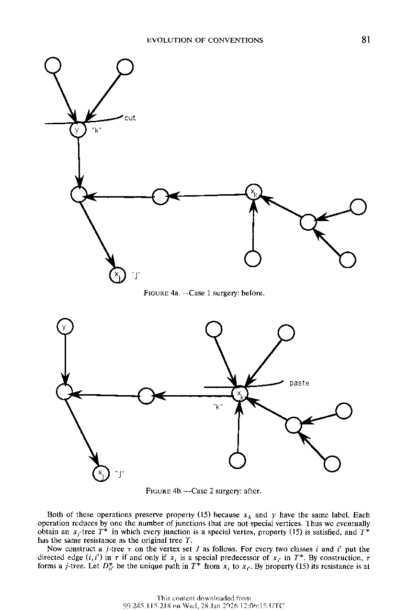

EVOLUTION OF CONVENTIONS 81

cut

- FIGURE 4a.-Case 1 surgery: before.

H ~~~~~~~~~~~~paste

- FIGURE 4b.-Case 2 surgery: after.

Both of these operations preserve property (15) because Xk and y have the same label. Each operation reduces by one the number of junctions that are not special vertices. Thus we eventually

obtain an xi-tree T* in which every junction is a special vertex, property (15) is satisfied, and T*

has the same resistance as the original tree T.

Now construct a j-tree r on the vertex set J as follows. For every two classes i and i' put the

directed edge (i, i') in r if and only if xi is a special predecessor of xi, in T*. By construction, r

forms a j-tree. Let D* be the unique path in T* from xi to xi,. By property (15) its resistance is at

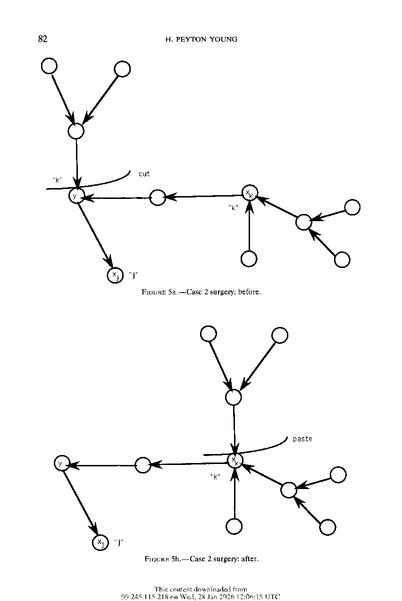

82 PEYTON YOUNG

ik cut

"k~~~~~~~~~~~~~~~k

## 0le)"I

- FIGURE 5a.-Case 2 surgery: before.

paste

- FIGURE 5b.-Case 2 surgery: after.

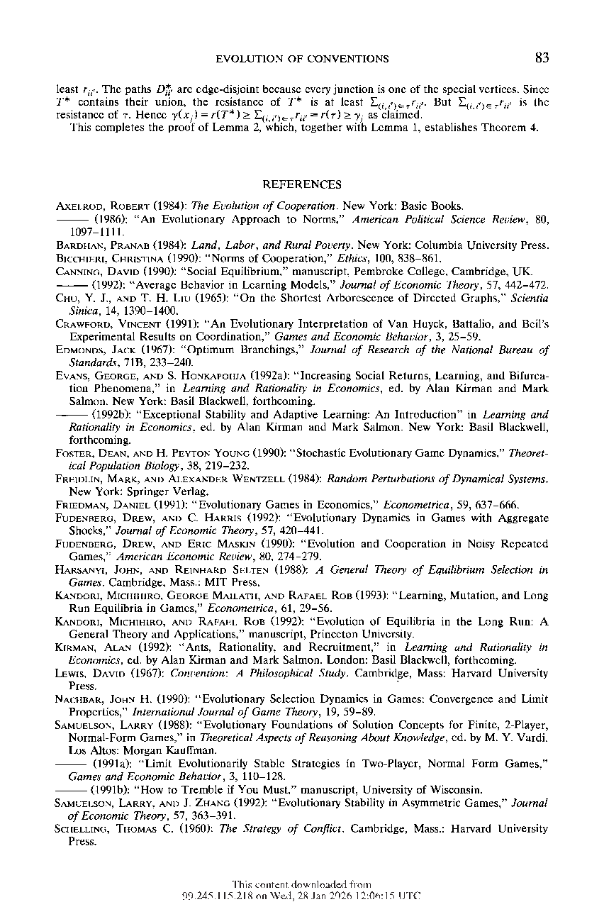

EVOLUTION OF CONVENTIONS 83

least rig. The paths W are edge-disjoint every junction is one of the special vertices. Since

T* contains their union, the resistance T* is at least E(i, i') e Trii But E(ii') ETrrii' is the resistance of T. Hence y(xj) = r(T*) 2 = r(r) 2 yj as claimed.

This completes the proof of Lemma 2, which, together with Lemma 1, establishes Theorem 4.

REFERENCES

AXELROD, ROBERT (1984): The Evolution of Cooperation. New York: Basic Books.

(1986): "An Evolutionary Approach to Norms," American Political Science Review, 80,

1097-1111.

BARDHAN, PRANAB (1984): Land, Labor, and Rural Poverty. New York: Columbia University Press.

BICCHIERI, CHRISTINA (1990): "Norms of Cooperation," Ethics, 100, 838-861.

CANNING, DAVID (1990): "Social Equilibrium," manuscript, Pembroke College, Cambridge, UK.

(1992): "Average Behavior in Learning Models," Journal of Economic Theory, 57, 442-472.

CHU, Y. J., AND T. H. LIu (1965): "On the Shortest Arborescence of Directed Graphs," Scientia

Sinica, 14, 1390-1400.

CRAWFORD, VINCENT (1991): "An Evolutionary Interpretation of Van Huyck, Battalio, and Beil's

Experimental Results on Coordination," Games and Economic Behavior, 3, 25-59.

EDMONDS, JACK (1967): "Optimum Branchings," Journal of Research of the National Bureau of

Standards, 71B, 233-240.

EVANS, GEORGE, AND S. HONKAPOHJA (1992a): "Increasing Social Returns, Learning, and Bifurcation Phenomena," in Learning and Rationality in Economics, ed. by Alan Kirman and Mark

Salmon. New York: Basil Blackwell, forthcoming.

(1992b): "Exceptional Stability and Adaptive Learning: An Introduction" in Learning and

Rationality in Economics, ed. by Alan Kirman and Mark Salmon. New York: Basil Blackwell,

forthcoming.

FOSTER, DEAN, AND H. PEYTON YOUNG (1990): "Stochastic Evolutionary Game Dynamics," Theoretical Population Biology, 38, 219-232.

FREIDLIN, MARK, AND ALEXANDER WENTZELL (1984): Random Perturbations of Dynamical Systems.

New York: Springer Verlag.

FRIEDMAN, DANIEL (1991): "Evolutionary Games in Economics," Econometrica, 59, 637-666.

FUDENBERG, DREW, AND C. HARRIS (1992): "Evolutionary Dynamics in Games with Aggregate

Shocks," Journal of Economic Theory, 57, 420-441.

FUDENBERG, DREW, AND ERIC MASKIN (1990): "Evolution and Cooperation in Noisy Repeated

Games," American Economic Review, 80, 274-279.

HARSANYI, JOHN, AND REINHARD SELTEN (1988): A General Theory of Equilibrium Selection in

Games. Cambridge, Mass.: MIT Press. KANDORI, MICHIHIRO, GEORGE MAILATH, AND RAFAEL ROB (1993): "Learning, Mutation, and Long Run Equilibria in Games," Econometrica, 61, 29-56. KANDORI, MICHIHIRO, AND RAFAEL ROB (1992): "Evolution of Equilibria in the Long Run: A General Theory and Applications," manuscript, Princeton University.

KIRMAN, ALAN (1992): "Ants, Rationality, and Recruitment," in Learning and Rationality in

Economics, ed. by Alan Kirman and Mark Salmon. London: Basil Blackwell, forthcoming. LEWIS, DAVID (1967): Convention: A Philosophical Study. Cambridge, Mass: Harvard University

Press.

NACHBAR, JOHN H. (1990): "Evolutionary Selection Dynamics in Games: Convergence and Limit

Properties," International Journal of Game Theory, 19, 59-89.

SAMUELSON, LARRY (1988): "Evolutionary Foundations of Solution Concepts for Finite, 2-Player, Normal-Form Games," in Theoretical Aspects of Reasoning About Knowledge, ed. by M. Y. Vardi. Los Altos: Morgan Kauffman.

- (1991a): "Limit Evolutionarily Stable Strategies in Two-Player, Normal Form Games,"

Games and Economic Behavior, 3, 110-128.

- (1991b): "How to Tremble if You Must," manuscript, University of Wisconsin.

SAMUELSON, LARRY, AND J. ZHANG (1992): "Evolutionary Stability in Asymmetric Games," Journal of Economic Theory, 57, 363-391. SCHELLING, THOMAS C. (1960): The Strategy of Conflict. Cambridge, Mass.: Harvard University

Press.

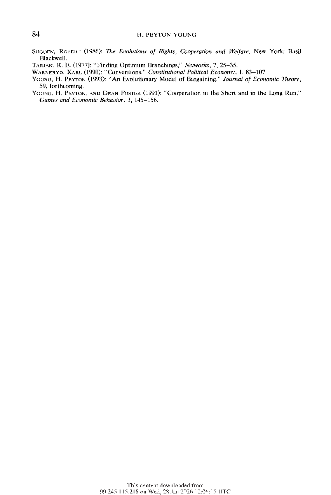

84 YOUNG

SUGDEN, ROBERT (1986): The Evolutions of Rights, Cooperation and Welfare. New York: Basil

Blackwell.

TARIAN, R. E. (1977): "Finding Optimum Branchings," Networks, 7, 25-35.

WARNERYD, KARL (1990): "Conventions," Constitutional Political Economy, 1, 83-107.

YOUNG, H. PEYTON (1993): "An Evolutionary Model of Bargaining," Journal of Economic Theory,

59, forthcoming.

YOUNG, H. PEYTON, AND DEAN FOSTER (1991): "Cooperation in the Short and in the Long Run,"

Games and Economic Behavior, 3, 145-156.

