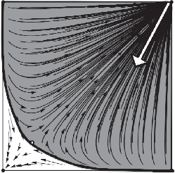
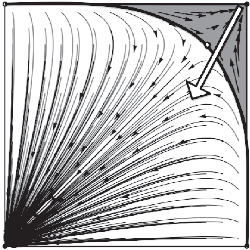

# 9

## Evolution and Revolution

Power concedes nothing without a demand.

Frederick Douglass

At this point in the book, I have argued for a number of things that might make the possibility of gender, race, and class egalitarianism seem unlikely.First,Ihavearguedthattheadoptionoftypesandtypingcanlead to efficiency when groups are faced with coordination problems. Second, I have argued that, in some cases, the adoption of types benefits all the individuals involved, not just those who end up at preferable outcomes. I’ve shown that under a number of modeling assumptions, these facts mean that types emerge spontaneously to solve coordination problems.

But, as mentioned, these sorts of solutions to coordination problems are often inequitable. Furthermore, as the second half of the book shows, types set the stage for inequity of a more serious sort to emerge. In particular, perniciously inequitable conventions emerge even without factors that we usually blame for them—such as bias or stereotype threat. They are simply the common end products of cultural evolutionary processes where everyone learns to do what is best for themselves.

In this chapter, I will look at a cluster of topics centered on the following question: what can be done about inequitable conventions of division between types? This is not a new question by any means, but the evolutionary framework used in this book does provide some new insights into it.

This discussion will be broken into two subparts. First, I will outline the social preconditions that must be in place in order for inequitable type-based conventions to arise at all. I’ll briefly discuss the possibility of eliminating these preconditions. As we will see, while there might be

The Origins of Unfairness: Social Categories and Cultural Evolution. Cailin O'Connor, Oxford University Press (2019). © Oxford University Press. DOI: 10.1093/oso/9780198789970.003.0010

Downloaded from https://academic.oup.com/book/32356/chapter/268620950 by University of Toronto Libraries user on 28 January 2026

evolution and revolution 195

some ways to minimize the features of groups that allow for type-based conventions, the likelihood of really eliminating these features seems low, especially given the observations from Part I of the book—that these features often have the potential to improve social coordination.

We will then move on to consider how one might go about moving groups from inequitable to equitable norms for division of resources. As mentioned in the last chapter, there is a sort of stickiness of convention, a persistence that resists environmental changes. This is because all the sortsofconventionsandnormsweareconcernedwithhereareequilibria. No one is personally incentivized to change given the state of the group. This does not mean that change is impossible, though. When individual behavior deviates, as a result of random exploration, or purposeful attempts to buck social norms, there is a chance that a group will be pushed out of the basin of attraction for the current convention, and into a new one. We would then expect the processes of cultural evolution to push the group towards a new pattern of behavior.

As I will point out, there are ways to make undesirable conventions less stable to these sorts of shocks by decreasing the sizes of their basins of attraction. This leads to a perhaps surprising observation: that the behaviors of a groupcan look just as inequitableas ever, while the stability of an inequitable norm is nonetheless eroded. Ultimately this erosion is useless, though, if no one actually does something different. We will look at how behaviors such as protest can act as the fulcrum that levers a population toward a new equilibrium.

Thisisnottheendofthestory,though.Socialdynamicalforcescanjust

- as easily carry groups back toward inequitable norms. Ultimately, I will present a picture in which social justice is an endless battle. The forces of cultural evolution can pull populations toward inequity, and combating these forces requires constant vigilance.1 Those concerned with equity, then, need to reconceptualize inequity not as a static state, but as part of a continual dynamical process. Not something to be solved, but something to keep solving.

1 Liam K. Bright, philosopher and Marxist, insists that this picture is similar to the idea of the ‘permanent revolution’ first introduced by Marx (see Marx and Engels (1975)). The similarity is that Marxists advocated a permanent state of revolutionary behavior and attitude for the proletariat.

Downloaded from https://academic.oup.com/book/32356/chapter/268620950 by University of Toronto Libraries user on 28 January 2026

### 9.1 Preconditions for Type-Based Conventions

Butler, in her work on gender as performance, wrote that “[i]f the ground of gender identity is the stylized repetition of acts through time, and not a seemingly seamless identity, then the possibilities of gender transformation are to be found in the arbitrary relation between such acts, in the possibility of a different sort of repeating, in the breaking or subversive repetitionofthatstyle”(Butler,1988,520).Theideathatgenderisnothing morethanaseriesofsocialactscontainsapowerfulpossibility—thatgender, and of course, gender inequity, could be dissolved if this performance just stopped. There are three sorts of behaviors in our models that allow for the emergence of inequity based on types—typing, social learning, and type-conditioning. In what follows, I will discuss the possibility of intervening on these factors to prevent the emergence of inequity.

In the models I have focused on, social learning and other forms of cultural change play a key role in the emergence of type-based conventions. In replicator dynamics models, because actors learn from their own types, they can evolve to employ different strategies from those of other types. But if actors learned from all types, this categorization by different strategies would not be possible. This suggests that if type-based social learning could be broken down, this should improve outcomes. Henrich and Boyd (2008) consider this possibility explicitly, and show that when actors do not learn from their own types, equitable, if inefficient, outcomes are more likely for actors playing complementary coordination games. But, as mentioned earlier, in models where actors do not engage in social learning, and instead learn individually, inequitable type-based conventions can also emerge (Young, 1993b). In societies where actors recognize types and engage in type-conditioning, members of different types exist in different environments and so individual learning, or rational reactions to their environment, or social learning can carry them to type-based conventions. Is it truly possible to expect that actors should not engage in behaviors that simply are their best strategic choices under the conditions they have observed? This seems like an unpromising place to intervene on the processes that lead to inequity.

In our models, removing typing—the ability of actors to differentiate each other into clear categories—also removes the possibility of typebased conventions. Without recognizable types, type-conditioning is not possible even if someone wants to do it. There are two sorts of ways this

Downloaded from https://academic.oup.com/book/32356/chapter/268620950 by University of Toronto Libraries user on 28 January 2026

preconditions for type-based conventions 197

canhappen.Oneistoactuallyremove,orallowactorstovary,thephysical markers that allow type recognition. Of course, when it comes to markers such as race and gender, this possibility is not particularly relevant.

The other way to stop typing is to somehow stop the process on the recognition side—so that actors no longer perceive different people as belonging to relevantly different types. It has been widely argued that gender and race are constructed.2 This means that gender and racial categories, or types, are socially created, although they clearly piggyback on biological markers. While the biological markers used for this construction are very difficult to change or remove, the social aspect of the construction presumably can be. Is it possible to actually stop people from noticing or caring about gender and racial categories? Of course, many have criticized those who attempt to “not see” or dissolve race and gender (Butler, 1988). Doing so means also ignoring the fact that these social categories are currently associated with massive social inequities. It seems a tricky (and unpromising) line to walk to both try to stop the recognition of types for current interaction, while recognizing their importance to historical disadvantage and somehow also trying to rectify or account for this disadvantage in current decision-making. In addition,

- as I argue in Part I of the book, categories like gender seem to emerge for functional reasons. Even if we were somehow able to eliminate gender recognition, this does not remove the need to use social categories for coordination purposes. As a result, we might expect the re-emergence of social categories for coordination.

Another precondition for the emergence of type-based conventions (and one that seems more promising to push on) is type-conditioning. As addressed in Chapter 2, type-conditioning comes naturally to humans. This does not mean, however, that it is inevitable. There are two sorts of ways to stop type-conditioning, one internal and one external. The internalwayinvolvesincentivizing,orconvincing,actorstodecidetostop treatingmembersofdifferenttypesdifferentlyincaseswherethisinvolves discrimination. This is more plausible when it comes to explicit forms of type-conditioning.Weknow,though,thatpeoplealsohaveimplicitbiases which result in type-conditioning that they are not consciously aware

2 For work on social construction of gender see, for example, Butler (2004, 2011b); Fenstermaker and West (2002). For work on social construction of race see Du Bois (1906); Jeffers (2013); Omi and Winant (2014). Haslanger (2000) discusses both sorts of identities.

Downloaded from https://academic.oup.com/book/32356/chapter/268620950 by University of Toronto Libraries user on 28 January 2026

of (Greenwald and Banaji, 1995). Empirical work, however, indicates that it is possible to reduce the effects of implicit bias in a number of ways. Establishing communal norms against behavior that results from such biases, and making community members aware of these norms, can reduce the behavior. Making people aware that implicit bias occurs reduces it. And giving people time to make choices more deliberately in situations where they may be biased is effective in reducing its impact. (Lee, 2016; Hofmann et al., 2005; Hopkins, 2006).

The second sort of way to stop type-conditioning is externallythrough explicit rules, norms, or laws preventing type-conditioning from influencing those it is directed against. These sorts of rules are common in our society—title IX in secondary education and blind review in academia, for example. In the US there are a host of laws to prevent discrimination against women, people of color, the elderly, pregnant people, andthosewithdisabilities.Whiletheserulesandlawsmaymissinequities occurring in small, day-to-day interactions, they are an important tool to employ against type-conditioning.3

One lesson from the models in this book, however, is that simple processes of cultural evolution should lead to the emergence and reemergence of inequitable conventions. Types and type-conditioning arise spontaneously under the right strategic conditions. Once this happens, inequity can emerge as well. While we can study and regulate particular instances of discrimination and inequity, if such instances arise spontaneously under ubiquitous social conditions, such explicit regulations may be temporary fixes on an ever-evolving problem.

On the other hand, it is clear that even in the last hundred years there have been massive changes in the kind and level of type-based conventionsin,forexample,theUnitedStates.Thereisalsocross-cultural evidence of conventionality as far as the strength of typing and typeconditioning. For example, the Mbuti of Africa have traditionally not had words for man, woman, boy, or girl, have de-emphasized gender differences in their rituals, and have had little division of labor by gender. In contrast, the Mundurucu Indians of central Brazil strongly divide

3 To give a little example of an accidentally successful rule—in academic disciplines like math, author order is determined alphabetically. This disciplinary rule means that in math, unlike many other fields, women are as likely to hold prestigious first author positions as men (West et al., 2013).

Downloaded from https://academic.oup.com/book/32356/chapter/268620950 by University of Toronto Libraries user on 28 January 2026

economic roles, have an antagonistic relationship between genders, and have highly different lives including separate residences (Oakley, 2015). This indicates that functioning societies can do perfectly well with lower levels of typing and type-conditioning, and that this lower level is psychologicallyachievableforhumans.Additionally,resourcedistributionvaries cross-culturally from highly inegalitarian to more egalitarian. Highly inequitable divisions are not inevitable. We need not despair. In the next part of the chapter we will address, in particular, how a group can move from one sort of convention to another.

### 9.2 Convention and Norm Change

When it comes to resource division, there is often an equitable option—a fair division, or something close to it. We know, however, that inequitable conventions of division are likely to arise. This raises the question: how do we move from less to more equitable conventions?

Social movement theory is a cross-disciplinary area of study that looks

- at social mobilization. Of course, not all social mobilization involves attempts to change inequitable norms of division between types, but this is, of course, a recurring theme in social movements—consider the women’s suffrage movements, labor/workers’ movements, the civil rights movement, feminist movements, and, more recently, the Black Lives Matter movement.4

There are (at least) two levels of focus that one might employ in thinking about such social movements. The first treats individuals as the units of rationality and behavioral choice. The second treats groups involved in social movements as the units of rationality and choice. Early work on social movements maintained focus on this second level. How do groups act to achieve their collective interests? In 1965 Mancur Olson published The Logic of Collective Action. This work criticized the grouplevel focus of previous social movement theories, such as Marxism, by pointing out that groups involved in joint action often suffer from public goods problems (Olson, 2009). A public goods problem occurs when a group of people generate a good that all members can benefit from. The

4 The gay rights and trans rights movements are less clearly about division of resources, though they are about inequity.

Downloaded from https://academic.oup.com/book/32356/chapter/268620950 by University of Toronto Libraries user on 28 January 2026

problem is that for any individual, it is preferable to avoid doing the work or paying costs to create the good if they can benefit from it nonetheless. When it comes to a social movement, say a protest for equal legal rights, each member of the oppressed class would like to benefit from those rights, but under some conditions will be disincentivized from protesting by the costs in time, risk of punishment, etc., especially if others will do this unpleasant work.5

More recent collective action theorists analyzing social movements have been highly critical of those who ignore the individual level for this reason (Lichbach, 1998; Opp, 2009).6 They are right to think that this levelofanalysisiskeytoafullpictureofsocialmovement.Inwhatfollows, I will nonetheless focus on the group level in thinking about convention change when it comes to inegalitarian divisions between groups. The idea is not that understanding how groups manage to engage in social movements, given public goods problems and other such conundrums, is unimportant. Rather this discussion will table these issues and ask, what are the strategic situations under which collective action will be more or less easy, and more or less effective? And, in what ways does collective action shift the broader strategic structure of a population?

To tackle this problem, it will be necessary to pull apart the concepts of norm and convention. In Chapter 1 I made clear that, for the purposes of this book, they should not be understood as coextensive, in contrast to some previous authors. Conventions, for our purposes, are patterns of behavior that mimic equilibria in coordination games. (Remember, I claimed that these are conventions, not that all conventions are well modeled by such equilibria.) Some conventions, but not necessarily all, acquire varying degrees of normative force.

#### 9.2.1 Conventions

Even when social conventions are well represented by equilibria in a game, and so exhibit the sort of stability that equilibria entail, some are relatively easy to change. For example, September 3, 1967 was Sweden’s

- 5 Subsequent social movement theorists focusing on rational choice have discussed

solutions to this, and related problems, at length (Roemer, 1985; Lichbach, 1998; Opp, 2009; Chong, 2014). Philosopher Margaret Gilbert attempts to resolve such problems by appeal to joint commitment in groups of actors (Gilbert, 2006).

- 6 Opp (2009) argues that a “macro–micro” approach, which looks at both levels of

organization, and causal links between them, is necessary for a thorough theory of social movement.

Downloaded from https://academic.oup.com/book/32356/chapter/268620950 by University of Toronto Libraries user on 28 January 2026

famous “H-day” when the country switched from left- to right-handside driving. This equilibrium was preferred because it allowed for better coordination with nearby countries.

Things are not always so simple, though. The correlative coordination game that represents the Swedish scenario is one where actors have generally similar preferences over the possible equilibria. This facilitated a situation in which a large majority of citizens were willing to make and interested in making a change. Of course, the change itself was highly non trivial, and caused quite a bit of consternation, but generating a country-wide consensus that it would happen was at least possible. The sorts of inequitable equilibria that are well represented by the Nash demand game are another matter. Every equilibrium in the Nash demand gameisPareto-efficient,meaningthatforeveryotherpossibleequilibrium increasing the payoff for one player will decrease it for another. This means that if populations with types are engaged in conventions of this sort, at least one side should resist change to some other possible convention.

In thinking about how actors can create change in situations like thiswhere there will not be widespread agreement about which convention to adopt—we can employ the evolutionary framework we have been using. As Young (2015) points out, when conventions change, it often happens quickly rather than slowly: “Once a crucial threshold is crossed and a sufficient number of people have made the change, positive feedback reinforces the new way of doing things, and the transition is completed rapidly” (363). Young describes “punctuated equilibria” as a key feature of such dynamics—long periods of stability are interspersed with rapid periods of change (Young, 2001).7

Unsurprisingly, this picture fits well with Young’s framework for modeling conventions. Forces of social and individual learning, absent other factors, will continue to maintain populations at a coordination

7 For example, during the period when foot binding was the practice in China, women were incentivized to bind their feet in order to marry. Boys were incentivized to marry girls with bound feet because bound feet supposedly promoted fidelity, and were a sign of social success. Despite a number of edicts prohibiting foot binding, it persisted until a campaign convincing individual families to pledge both to not bind girls’ feet and to refuse to marry their sons to girls with bound feet. This simultaneously changed expectations on both sides of the interaction, and led to a swift social shift away from the practice. This also echoes insights from Breen and Cooke (2005) who use game theoretic models to understand the persistence of gendered division of labor. They argue that a large proportion of women and men must simultaneously change their behaviors around division of labor.

Downloaded from https://academic.oup.com/book/32356/chapter/268620950 by University of Toronto Libraries user on 28 January 2026

convention. Populations stay at an equilibrium until a crucial number of individuals simultaneously try non-conventional behavior, owing either to chance deviations or some coordinated effort. This experimentation can move the entire population into the basin of attraction for a new equilibrium, which it then evolves toward and which remains stable until another such random event. We can adopt this framework to help us think about changes in the sorts of conventions we are concerned withgroups are generally kept stable at equilibria by social evolutionary forces, but shocks can lead to change.

This picture means that the size of a basin of attraction around an equilibrium will be very important. An equilibrium with a large zone of attraction around it will be more stable than one with a small buffer. Figure9.1illustratestheideajustpresented—thatsocialconventionswith larger basins of attraction may be harder to change than others. Imagine a population is at the coordination equilibrium represented by the top right corner of the phase diagram. Now suppose that for whatever reason, a number of members of the population switch behaviors, as represented by the white arrow. The population shown in diagram (a) will still be in the basin of attraction for the original equilibrium, which is relatively large. As a result, this change will not be expected to upset the current convention. The population in diagram (b), undergoing the same change, willnowbeinthebasinofattractionfortheotherequilibrium,andabsent other forces should be expected to evolve to it.

A B

- A
- B

(a)

A B

- A
- B

(b)

Figure 9.1 Phase diagrams for two populations. In the first, the top right equilibrium is harder to escape

Downloaded from https://academic.oup.com/book/32356/chapter/268620950 by University of Toronto Libraries user on 28 January 2026

How do such changes occur though? Young’s framework suggests that sometimes they are the result of a random shock, and surely some sorts of convention change reflect this. When it comes to inequity, though, shocks are not typically random, but generated by members of social movements who take action to move populations out of a basin of attraction for a coordination equilibrium. Bowles and Naidu (2006) and Hwang et al. (2014), for example, consider models very similar to those explored by Young and collaborators, but where actors’ deviations tend towards equilibria that they prefer. They refer to this sort of intentional error, first introduced by Bowles (2004), as “collective action shocks”.8

#### 9.2.1.1 moral preferences

If basins of attraction matter to social change, that means that payoffs matter too. As we have seen throughout Part II of this book, the details of payoffs to actors in a strategic situation will determine the basins of attraction for various equilibria.

One way to change payoffs of others is to change their preferences, for example, by altering their ethical beliefs. Many social justice movements attempt to do something like this by making it clear to more people in a society that certain norms or behaviors are damaging to others. (Haslanger (2017), for example, emphasizes the importance of critiquing cultural ideology in changing oppressive systems.) Because humans do, in fact, have other-regarding preferences, this can change their effective payoffs in a game.9 Figure 9.2 (a) shows a Nash demand game. In (b) is a similar game, but where actors feel badly taking advantage of others, which drops their payoff when they successfully demand High of an opponent. In this second game, Low vs. High and High vs. Low are not equilibria. Instead, the only pure strategy equilibrium is Med vs. Med.

A population undergoing cultural evolution at an equilibrium that is disrupted in this way will evolve away from that state because it will

- 8 As they point out, some experimental work has found that players make mistakes in

just this self-serving way (Lim and Neary, 2016; Mäs and Nax, 2016).

- 9 It is beyond the purview of this book to discuss how such other-regarding preferences

evolve. For us, it is enough to observe that they exist in humans. For more on this topic, see work on the indirect evolutionary approach which models the evolution of preferences (Guth, 1995).¨

Downloaded from https://academic.oup.com/book/32356/chapter/268620950 by University of Toronto Libraries user on 28 January 2026

Player 2

- (a)

| |Low|Med|High|
|---|---|---|---|
|Low|3, 3|3, 5|3, 4|
|Med|5, 3|5, 5|0, 0|
|High|4, 3|0, 0|0, 0|

Player 1

- (b) Player 2

| |Low|Med|High|
|---|---|---|---|
|Low|3, 3|3, 5|3, 7|
|Med|5, 3|5, 5|0, 0|
|High|7, 3|0, 0|0, 0|

Player 1

- Figure 9.2 A Nash demand game where actors come to feel badly when making High demands of another player

| |Low|Med|High|
|---|---|---|---|
|Low|1, 1|1, 5|1, 9|
|Med|5, 1|5, 5|0, 0|
|High|9, 1|0, 0|0, 0|

Player 2

Player 1

- (a)

| |Low|Med|High|
|---|---|---|---|
|Low|1, 1|1, 5|1, 6|
|Med|5, 1|5, 5|0, 0|
|High|6, 1|0, 0|0, 0|

Player 2

Player 1

- (b)

- Figure 9.3 A Nash demand game where actors come to feel badly when making High demands of another player, but not enough to disrupt the pure strategy equilibria

no longer constitute a rest point. In this particular case, the population should then move toward the only remaining pure Nash equilibriumMed vs. Med.

If actors do not have strong other-regarding preferences, then moral arguments may not shift their preferences enough to change the equilibria of the underlying strategic scenario. But even small amounts of moral pressure may decrease the stability of such equilibria. Figure 9.3 demonstrates this. This figure is similar to Figure 9.2, but for a Nash demand game with more disparate demands for High and Low. In this game, the same payoff shift is not enough to disrupt the equilibrium. This shift will make the basins of attraction for the inequitable equilibria

Downloaded from https://academic.oup.com/book/32356/chapter/268620950 by University of Toronto Libraries user on 28 January 2026

smaller, though. A surprising take-away from this observation is that moraleducation,evenifitproceedsslowly,andseemsnottobeimpacting socialconventions,isstillworthwhile.Thestabilityofaconventioncanbe eroded, setting the stage for future change long before much behavioral change is observed. Under such a scenario, inequitable behavior may be preserved for some stretch of time before a perhaps small population shock moves a group into another basin of attraction and toward equitable behavior.

We should be a bit careful here, though. In this interpretation, actors are still receiving high material payoffs when they demand High against a Low opponent, but do not actually enjoy this outcome. If we assume a dynamics where actors copy group members with material success, this internal preference shift should not make any change. Someone who got rich taking advantage of others might be unhappy because they are a jerk, but others in deciding how to act will see only the success. If we assume, on the other hand, some sort of best response by actors, or individual learning based on their perceived payoffs, the equilibrium should be disrupted. In other words, the potential success of moral education in a cultural evolutionary context will strongly depend on how actors are adopting behaviors.

One further thing to note about this sort of shift in preferences is that empirically it is clear that it does not always translate to anything. In particular, this sort of situation is amenable to actors who have stated and conscious preferences for equity, and egalitarian divisions, but who do not necessarily recognize inequitable divisions for what they are.10 Such actors mayhold an internalmoralstance,andreapthebenefits ofexternal high payoffs without recognizing the hypocrisy in their position.

#### 9.2.1.2 protest

Suppose that moral education has decreased the stability of some inequitable equilibrium. How does a population go about escaping it? As mentioned, this requires at least someone to actually change behavior.

10 This is somewhat related to the Marxist idea of false consciousness, where members of one class mislead others as to the level of exploitation they suffer, or, more generally, cases where strategic actors are not aware of the inequitable situation they are in (Eagleton, 1991). In the cases I am interested in, members of both groups may be misled as to what the norms of division are.

Downloaded from https://academic.oup.com/book/32356/chapter/268620950 by University of Toronto Libraries user on 28 January 2026

Otherwise, the population stays at the equilibrium. Social protest can play this role.

Sometimes actors simply change behaviors in a way that moves one side toward a new convention. For example, one type can start making a higher demand in a situation that is well modeled by a Nash demand game.Thismeansthateveryonewillstarttoreachthedisagreementpoint, and to receive poor payoffs. However, in the right sort of dynamical situation, this sort of change will move the population out of the basin of attraction of the current convention, and into the basin of attraction for a new one. This means that the forces of social learning and cultural evolutionshoulddrivetheothersidetobehaviorsthatgeneratemorepayoffs for them given their new social environment—ones consistent with a more equitable equilibrium. This is the sort of social movement modeled in Bowles (2004); Bowles and Naidu (2006); Hwang et al. (2014), where actors usually best respond to another population, but sometimes err in the direction of their preferred equilibrium. As Hwang et al. (2014) point out, their models correspond to protests such as sit-ins, employed during the civil rights movement. These involved members of one type simply taking actions that they were normatively barred from, but that consist in makingagreater“demand,”asregardsresourcedistribution.Inthecaseof thecivilrightsmovement,behavioralshiftsbyblackpeopleledtocomplementary behavioral shifts by white people including the desegregation of public establishments.Bowles and Naidu(2006) pointto a similarpattern in South Africa during the end of apartheid. Widespread strikes meant that both poor black workers and wealthy white business owners were receiving very poor payoffs. This led business owners to capitulate by making lower demands, corresponding to higher wage offerings.

Those involved in social protests can also change payoffs for another type in a way that might shift equilibria by taking actions that deliberately lower others’ payoffs, with the implication being that such actions will stop once conventions change. This will involve the same sort of change to payoffs as we saw in Figures 9.2 and 9.3. In other words, protest, like moral education, can disrupt an inequitable equilibrium, or just make the basins of attraction for it smaller. For this type of social protest to work, of course, members of one type have to effectively lower the payoffs of many members of the other type. Good examples of behavior that

- seem to fit this second scenario are things like the suffragette movement in Britain, where suffragettes planted bombs, destroyed the home of a

Downloaded from https://academic.oup.com/book/32356/chapter/268620950 by University of Toronto Libraries user on 28 January 2026

parliamentarian,andgenerallydisruptednormalsocialfunction.In1957, railway workers in Japan sat on the tracks of over 300 stations, halting the trains.11The apartheid South Africa and civil rights movement examples discussed above also fit with this sort of case in that members of the movements engaged in public protests that generally disrupted social function.

#### 9.2.1.3 rebounding

In the last two subsections, I analyzed the ways in which typical actions from social movements can be understood in a social dynamical framework. The models from Chapters 5 and 6 tell us something more, though. Suppose that a social movement succeeds in gaining some sort of more equitable arrangement for members of a group. But suppose that this groupcontinuesto be disempoweredeconomically,politically,orsocially.

Although equity has been won in some arena, or for now, the basin of attraction for the equitable equilibrium should still be relatively small. This is because power, remember, increases the likelihood that inequitable conventions emerge. The powerful group will continue to have higher disagreement points, higher outside options, and higher background payoffs. If there is a minority/majority split, the majority will continue to be in the majority. For these reasons, random shifts can easily carry the population back to inequity. This point complements one made by Tilly (1998), who argues that eradicating racist attitudes or behaviors cannot alone eradicate inequity when social structures support it. Haslanger (2015a) argues that eradicating implicit bias is not expected to create durable change as long as oppressive structures remain in place.

We might also see something like this in a case where there is a more long-term, stabler equitable convention. A political movement could erodethestabilityofsuchaconventionlongbeforebehavioralchangesare

- seen, meaning that once some small set of people decides to move toward a more inequitable arrangement, equity can be unseated relatively easily.

#### 9.2.2 Norms

To this point in the chapter, I have focused on ways to change coordination conventions. In such cases, when populations move outside the

11 This example is from Schelling (1960).

Downloaded from https://academic.oup.com/book/32356/chapter/268620950 by University of Toronto Libraries user on 28 January 2026

basins of attraction for an equilibrium, under assumptions of social and individual learning they should move toward another equilibrium. As outlined, there are ways to change the basins of attraction for various equilibria in a coordination situation to make it more likely that this occurs. When conventions gain normative force, though, things can be slightly different.

Norms involve a belief that one ought to behave in a certain way.12 Bicchieri defines a norm as a behavioral rule for a situation where a sufficiently large portion of a population, 1) know the rule and apply it appropriately, and 2) prefer to conform to the rule on the condition that eithera) theybelieve enoughotherswillconformorb) theybelieve others expect them to conform or b’) they believe others may sanction them if they fail to conform (Bicchieri, 2005, 11). The first condition she labels as contingency. The second condition she labels as conditional preference.

Bicchieri and Mercier (2014) think of norms as self-perpetuating, but thereisanimportantdistinctiontodrawbetweendifferentsortsofnorms. In some cases, norms enforce and promote behavior that is also stabilized by the underlying strategic situation. Conventions of coordination that become normative fall under this heading. If everyone is following a convention,otherswishtodosoaswellbecausedoingsoisbestforindividual payoff. In other cases, norms develop to keep groups of people away from equilibrium behavior in the underlying strategic situation. When it comes to social altruism, for example, norms promote individually costly, but socially beneficial behavior. Bicchieri (2005) points out that in such cases social expectations, and punishment for violators, can transform such situations into coordination games. Because social punishment will result from altruism failures, it comes to be in an actor’s best interest to be an altruist. But this does not change the fact that underlying forces do not support the continued normative behavior. In these cases, norms should be easier to erode. If expectations of conformance are removed,

12 These beliefs need not be about behaviors well modeled by equilibria in games, although these are the norms we focus on. They need not correspond to regularly carriedout patterns of behavior. Bicchieri (2005) points out, for example, that many norms concern behaviors not taken, (“do not touch a stranger’s hair”), or behaviors that group members will attempt to avoid by avoiding the conditions under which the norm must be met. The Ik of Uganda, she points out, using research from Turnbull (1987), avoid strong norms of reciprocation bypatchingroofs atnightsothatnoone elsewhowandersbywilloffertohelp. These observations strengthen the claim that norms and conventions should be untangled, for clearly some norms do not start with behavioral regularities.

Downloaded from https://academic.oup.com/book/32356/chapter/268620950 by University of Toronto Libraries user on 28 January 2026

actors should revert to equilibrium behavior owing to social evolutionary processes.

Bicchieri and Mercier (2014) discuss methods for changing undesirable norms, such as female genital cutting. They focus on the role of expectations in norm change. Because norms involve both expectations thatotherswilladheretonorms,andexpectationsthatotherswilllikewise expect adherence(andsometimespunishdeviance),atricky,but key,part of such a shift is to change expectations all at once.13

How does this framework apply to social movements and attempts to shift conventions of the sort we are interested in here? When inequitable conventions gain normative force, it is the case not just that actors are

- at an equilibrium, but that they also believe they ought to remain at that equilibrium, and (on Bicchieri’s picture) believe that others believe they ought to remain at that equilibrium. In the case of inequity, stated moral norms go against inequitable divisions. However, as I mentioned in the last section, those adhering to inequitable conventions may believe that they are in fact behaving equitably. In a case like this, the key is to change beliefs about what equity consists in, and what people are actually doing. If these beliefs are successfully changed, then norms should actually help push society toward equitable conventions.

• • •

While social movements involve actors who must solve public goods games to coordinate their action, it is also important to consider at a higher level what sorts of group actions will be successful in changing inequitable conventions and when. Our cultural evolutionary framework provides a few insights here. First, the fact that many conventions are equilibria means that actual behavioral change will be necessary to unseat them. Someone will have to actually do something different, or else the equilibrium will remain. But, there are ways to make an equilibrium more or less stable with regard to behavior change. Moral education can erode an equilibrium long before change actually happens, as can protest that works to decrease payoff for a certain equilibrium. When it comes to

13 For this reason, these authors emphasize the importance of small-group discussion, including deliberation and argumentation, and then active spread of plans generated in this discussion to simultaneously convince a large portion of a group that a norm change is happening. This sort of discussion, note, falls under the realm of social movement theory at the lower level.

Downloaded from https://academic.oup.com/book/32356/chapter/268620950 by University of Toronto Libraries user on 28 January 2026

conventions with normative force, more needs to happen. In particular, people need to change their beliefs about what they ought to be doing, rather than just to be in a strategic situation where it benefits them to learn a new pattern of behavior.

Of course, this picture where groups can move from one equilibrium to another is two-sided. While it tells us that there is real possibility of unseating inequitable equilibria, the reverse is also true. If social conditions are such that equitable equilibria have small basins of attraction—as whenonegroupismorepowerful,ormorenumerous—itwillberelatively easy to end up in an inequitable arrangement. Even a seemingly stable equitableconventionmay be erodedby belief and preference changes that make a reversion to inequity possible.

Moreover, modeling results from this book suggest time and again that the conditions needed to generate inequitable conventions and norms are remarkably minimal ones. These are conditions we should expect to hold in our workplaces, academic communities, homes, and societies more broadly. The take-away for those interested in promoting equity is a new way of thinking about what equity and inequity are. Thaddeus Stevens once said, “I know it is easy to protect the interests of the rich and powerful; but it is a great labour to guard the rights of the poor and downtrodden—it is the eternal labour of Sisyphus, forever to be renewed” (Du Bois, 2017, 314). Equity is not something to achieve and be done with. The social processes leading to inequity are too basic, and require preconditions that are too ubiquitous. Instead, equity is a state we must keep seeking in an ever-evolving process that naturally generates inequities.

Downloaded from https://academic.oup.com/book/32356/chapter/268620950 by University of Toronto Libraries user on 28 January 2026

