# 6

## The Cultural Red Queen and the Cultural Red King

According to the Red Queen hypothesis in biology, it is better to evolve quickly. Van Valen (1973), who first described the effect, named it after a quote from Lewis Carroll’s Through the Looking Glass where the Red Queen says to Alice, “Now, here, you see, it takes all the running you can do, to keep in the same place” (Carroll, 1917, 46). In a predatorprey interaction, for example, one species might gain an advantage by quicklyevolvingtorunfasterthantheother.Inparasite-hostinteractions, likewise, there is a benefit in evolving quickly to either take advantage of a host, or avoid parasitism.

Counterintuitively, Bergstrom and Lachmann (2003) use evolutionary game theory to show that in mutualistic interactions a species can, in some situations, actually obtain a benefit by evolving more slowly. They call this the “Red King Effect.” To explain this effect, it’s useful to appeal to a rational-choice scenario introduced by Schelling (1960). Suppose two people (you and Dwayne Johnson) are playing the chicken version of hawk–dove. One way to win this contest is to throw your steering wheel out the window, or to visibly make yourself unable to change strategies. We can predict that any sensible opponent will choose to swerve should you do so. Under the Red King effect, we can think of a fast-evolving species as swerving in evolutionary time. They evolve toward a strategy thatyieldshigherpayoffsintheshortterm,butultimatelyallowstheother species to take advantage.1Alternatively, as Bergstrom and Lachmann (2003) show, and Gokhale and Traulsen (2012) and Gao et al. (2015)

1 Thanks to Jean-Paul Carvalho for this connection to Schelling.

The Origins of Unfairness: Social Categories and Cultural Evolution. Cailin O'Connor, Oxford University Press (2019). © Oxford University Press. DOI: 10.1093/oso/9780198789970.003.0007

Downloaded from https://academic.oup.com/book/32356/chapter/268620019 by University of Toronto Libraries user on 28 January 2026

outline in detail, sometimes in mutualistic interactions a fast-evolving species gains an advantage because they quickly evolve toward strategies that garner higher payoffs in the end. They term this alternative scenario a Red Queen effect.

The goal of this chapter will be to outline, in detail, how these effects can occur in a cultural context rather than a biological one. When cultural groups evolve, or adapt, at different rates, or more generally show asymmetric levels of reactivity toward one an other, we can observe a cultural Red King or Red Queen as a result of this asymmetry (Bruner, 2017). On the face of it, this might not seem like a situation that will emerge commonly in the real world. Why would members of one social category evolve faster than another?

There are actually several important situations where such an asymmetry is expected. The first was identified by Bruner (2017), who makes the important observation that when a minority group interacts with a majority group, minority types tend to meet out-group members much more often than majority types do. As a result, he argues, the minority group will learn to interact with the majority more quickly. Another such asymmetry (as Justin Bruner notes in his dissertation work) has to do with differences in what we might broadly label as institutional memory for different types. Young (1993b) shows that types with more information about previous bargaining interactions can gain an advantage in the emergence of bargaining norms. And similarly Gallo (2014) finds that groups of actors who are more tightly networked, and so see more information about past interactions of their neighbors, can gain a bargaining advantage. These results are deeply related to the cultural Red King effect because they are created by differences in the reactivity of the two groups. Finally, I’ll show how one last operationalization of power—higher background payoffs for one group—can potentially yield advantages for the powerful group via a cultural Red King effect.

The set of results discussed in this chapter complement those in the last by filling out the scenarios under which one social group is expected to end up at an advantaged bargaining convention. In a way, we can see these two sets of results as exploring asymmetries between groups in the two main elements of our evolutionary game theoretic models. The last chapter looked at asymmetries in the games played by two types. This chapter looks at asymmetries in the dynamics, or the learning situation

Downloaded from https://academic.oup.com/book/32356/chapter/268620019 by University of Toronto Libraries user on 28 January 2026

of the types.2 Although, there are, as discussed, many more complicated aspects of discrimination and inequity, these two realms will treat the most important causal factors of inequity in our simplified modeling framework.

At the end of this chapter, I will present models that make use of the results from both the previous chapter and the current one to show further how the dynamics of inequity can impact real-world populations. In particular, I will show how in groups with intersectional identities the cultural Red King effect and various power effects can combine to create serious disadvantage for intersectional types. As we argue in O’Connor et al. (2017), these models can provide specific hypotheses as to the emergence of intersectional disadvantage.

### 6.1 The Red King and the Red Queen

It will be useful to start by gaining a better sense of the Red King and Red Queen effects and how they work. This section will be on the technical side, so some readers may wish to skip it.

The first thing we’ll want to understand is the conditions under which a Red King/Red Queen can even occur. Under these effects one species, or in our cultural interpretation one type, will gain an advantage in that its members will be more likely to end up at a preferred convention than members of the other. This will only be possible in a strategic situation where there are different preferred conventions for the two types, or a game with multiple equilibria and at least some conflict of interest between players. Bergstrom and Lachmann (2003) explore a general version of a two-player, two-strategy game with this character. Figure 6.1 shows the payoff table of the game they consider.3 Notice that it corresponds to the exact class of game we have been considering in this book. When x < 1, we have a leader–follower game, when x = 1, we have a version of the two-player Nash demand game, and when 1 < x < 2, we have hawk–dove. In addition to these two-strategy games, versions of the

- 2 Things are not actually this simple and, in the last section of this chapter, we’ll look at

a case where payoffs impact dynamical speed.

- 3 They actually look at a correlative version of the game. Because they consider two

species who interact only with the other, the difference does not matter. Since we will look at a cultural population where members of different types can interact with both in- and out-group members, I use the complementary version.

Downloaded from https://academic.oup.com/book/32356/chapter/268620019 by University of Toronto Libraries user on 28 January 2026

Player 1

Player 2

| |A|B|
|---|---|---|
|A|X, X|1, 2|
|B|2, 1|0, 0|

Figure 6.1 A general game where we can potentially observe a Red King/Queen effect

Player 1

Player 2

| |Low|High|
|---|---|---|
|Low|4, 4|4, 6|
|High|6, 4|0, 0|

Figure 6.2 A Nash demand game with demands 4 and 6

Nash demand game with any number of demands will also have the right character for the Red King/Red Queen to potentially occur—there will be multiple equilibria and conflicts of interest between players over them.

So, now we know that the sorts of strategic situations we are considering in this book are exactly those where the Red King/Red Queen effects have the potential to impact evolutionary processes. Since this part of the book is primarily about understanding inequitable resource divisionsbetweentypes,we’llfocus,though,onhowthiseffectcanimpact emerging bargaining conventions in particular. To do so, let’s start by looking at the two-strategy Nash demand game shown in Figure 6.2.

As we know, when two types evolve to play this game there are two possible outcomes—type one demands High and type two Low or vice versa.Underthestandardmodel,thesetwooutcomesareequallylikely,or have equal basins of attraction under the replicator dynamics. Figure 6.3 shows the phase diagram for this model with complete symmetry for the two types. The equilibria, remember, are represented by the dark circles at the top right and bottom left corners of the diagram. This diagram adds a darker region corresponding to the basin of attraction for the top right rest point, and a light region for the bottom left rest point. The top right region is the one where population one ultimately gains an advantage by demanding High. In the bottom left region, on the other hand, the dynamics move to the outcome where population two demands High instead. The black line between the two basins of attraction represents the separatrix, or the divide between them, which will be important to subsequent discussion.

Downloaded from https://academic.oup.com/book/32356/chapter/268620019 by University of Toronto Libraries user on 28 January 2026

High

Low Low

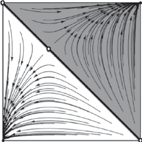

High

- Figure 6.3 Phase diagram for two populations playing the two-strategy Nash demand game

(a) m = 3 (b) m = 1/3

High

High High

High

Low

Low Low

Low

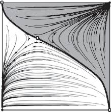

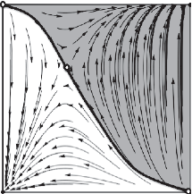

- Figure 6.4 Phase diagrams for two populations playing a Nash demand game where one population evolves m times as quickly as the other. We see a Red King effect

The Red King and Red Queen effects in this game occur when evolutionary speed advantages one of two evolving populations in terms of their likelihood of ultimately demanding High. To see how this works in general, we can simply speed up evolution for one side versus the other by addingamultipliermtothereplicatorequationforpopulationone.When m = 1, then, both sides evolve at the same rate. When m > 1, population one evolves faster than population two, and when 0 ≤ m < 1, population two evolves faster. Figure 6.4 shows what happens when m = 3 and when m = 1/3.

Downloaded from https://academic.oup.com/book/32356/chapter/268620019 by University of Toronto Libraries user on 28 January 2026

Let’s consider Figure 6.4(a), where m = 3, first. As we can see, the separatrix between the two basins of attraction is no longer a straight line. Instead it snakes to the left and to the right. The reason for this is that the increased evolutionary speed of population one stretches the trajectories ofpopulationchangeinthex-direction.Asaresult,someareasofthestate space that would have gone to the top right corner now go to the bottom left, and vice versa. Importantly though, there is an asymmetry in how the speed change affects the two basins of attraction. The one for the bottom left is now larger than the one for the top right. This means that now more population starting points move to the outcome where population two demands High. In other words, the slow evolving population has gained an advantage in terms of likelihood of ending up at the preferred equilibrium. This is the Red King effect.

If we look at Figure 6.4 (b), the situation reverses. Now population two evolves more quickly, stretching the trajectories of the population in the y-direction. This, again, changes the separatrix, but now so that the top rightequilibriumhasalargerbasinofattraction.Again,weseeaRedKing effect where the more slowly evolving population (this time population one) is more likely to end up demanding High.

Noticethatthelocationoftheunstableinteriorrestpoint—represented by an empty dot in the diagram—limits the degree to which speed can affect outcomes in these models. On one side of the interior rest point, speed in one population will make one equilibrium more likely, and on the other side of the interior rest point, speed will make the other equilibrium more likely. For the entire state space, this balancing effect means that the basins of attraction for one equilibrium can only get so large. (This is unlike some other models we’ve looked at, where changing payoffs could increase the basins of attraction for one outcome indefinitely.) Figure 6.5 shows phase diagrams for this model as m increases from 2 to 100. As is clear, even as m grows very large, the strength of the Red King effect is bounded. (Though, as we’ll see, this bound is not robust across modeling choices.)4

What about the Red Queen effect? The location of the interior rest point also determines whether speed provides an advantage or a disadvantage to a population. In the case just described, learning more quickly

4 In particular, suppose that at the interior rest point population two is at 2/3. Then the biggest the basin of attraction for one equilibrium can get is 2/3 of the state space.

Downloaded from https://academic.oup.com/book/32356/chapter/268620019 by University of Toronto Libraries user on 28 January 2026

High High

Low Low Low

Low

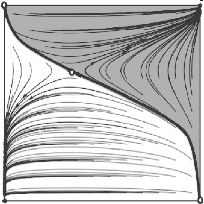

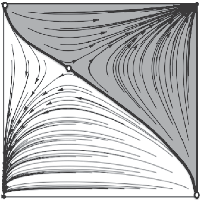

Low

High

(a) m = 2 (b) m = 4

High

High

Low Low

Low Low

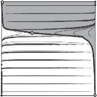

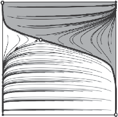

High

High

(c) m = 10 (d) m = 100

- Figure 6.5 Phase diagrams for two populations playing a Nash demand game where one population evolves m times as quickly as the other. As m increases, the Red King grows stronger, but is bounded

takes the fast population to the worse equilibrium. But suppose instead that we have a Nash demand game where the two demands are 2 and 8.

- Figure 6.6 shows the phase diagram for this model when m = 1 and when m = 3. If we look at (a) we see that when m = 1, as with the last game, the basins of attraction are exactly equal. But notice that the interior rest point is shifted toward the bottom right of the phase diagram. Now, when m=3,theseparatrixcurvesjustlikebefore,stretchedalongthex-axis,but this curvature means that the top right basin of attraction gets larger than the one for the bottom left. Now population one, the faster population, is more likely to end up demanding High as a result of their speed, and the slower population two is more likely to end up demanding Low.

So what does all this tell us about the real-world populations? Not muchyet,butintherestofthechapterIwillusethetheoreticalframework just laid out to explain how the cultural Red King/Red Queen effect

Downloaded from https://academic.oup.com/book/32356/chapter/268620019 by University of Toronto Libraries user on 28 January 2026

Low Low Low

High Low High

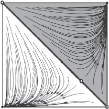

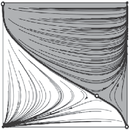

High High

(a) m = 1 (b) m = 3

Figure 6.6 Phase diagrams for two populations playing a Nash demand game whereonepopulationevolves mtimesasquicklyastheother.WeseeaRedQueen effect

can impact the emergence of actual bargaining conventions. As we will see, when it comes to bargaining there is particular reason to think the cultural Red King effect is especially important, and this has impacts for groups with minority status, and groups without access to institutional memory.

### 6.2 Minorities and the Red King/Red Queen

To this point in the book, in looking at our highly simplified models with two types, I have always assumed that the types are equally prevalent. As I briefly mentioned at the beginning of this chapter, though, Bruner (2017) shows that relaxing this assumption can have surprising effects on the outcomes of evolutionary models. Of course models where one type is in the majority and one in the minority correspond to many real-world situations. In businesses and in academic communities, for example, it is often the case that one gender is in the minority. In the same situations, and also more broadly within any culture, there are almost always some racial/cultural/religious minority groups.

The important observation for our exploration here, is that minority/majority status creates asymmetric learning environments for those of different types. Suppose, for example, that you are part of a company that is 90% white and 10% Latinx. Suppose further that, as in our models, you condition your learning and behavior based on the type of your interac-

Downloaded from https://academic.oup.com/book/32356/chapter/268620019 by University of Toronto Libraries user on 28 January 2026

tive partner. If you interact with others in your company approximately randomly, and you are Latinx, this means that you will meet out-group members about 90% of the time, and in-group members only 10% of the time. Now suppose you are white. Under the same conditions, you will meet in-group members about 90% of the time, and the out-group about 10% of the time. In other words, Latinx agents will meet their outgroup 9 times as often as white agents will, and vice versa with respect to the in-group. This, of course, impacts how quickly the two groups learn to interact with each other. For Latinx agents, the out-group is extremely important to them from a strategic standpoint, as out-group interactions make up 90% of their payoffs. For white agents, the Latinx group is relatively unimportant. This means that we can see a cultural Red King/Red Queen effect emerge solely as a result of the minority status of a group. Group size alone can act as the asymmetry that leads to disadvantage as a result of the social dynamics of bargaining.

Let’s explore this in more detail. In minority/majority models of the Red King/Red Queen, we now no longer need a speed multiplier, m, for one side. Instead, we have a variable, pi, that represents the prevalence of each type. Let’s assume that p1 ≥ p2, and that p1 + p2 = 1, or that there are only two types in our population and p1 is in the majority. We can generate a version of the replicator equations for such a population that looks just like the two-type mixing equation, except that the payoffs for each type are weighted by how often they meet members of the two types. (SeetheAppendixformore.) Asin theexample above, this meansthatthe behaviors of the out-group will more significantly impact the payoffs of minority types, and they will more quickly learn to deal with out-group members.5

Consider a population playing a three-strategy Nash demand game with a fair outcome and two unfair equilibria. Suppose that we have a minority and majority group learning bargaining conventions. It won’t be possible to show the phase diagrams for this model, because there are too many strategies, but Figure 6.7 shows proportions of outcomes when the Low demand is 4 and High is 6.6

- 5 For more on this equation and for the minority/majority effect generally see Bruner

- (2017); O’Connor and Bruner (2017).

- 6 These results, like the rest in this section, are from 10k runs of simulations at each

parameter value using the discrete time replicator dynamics.

Downloaded from https://academic.oup.com/book/32356/chapter/268620019 by University of Toronto Libraries user on 28 January 2026

The Cultural Red King and the Evolution of Bargaining 0.6

| | | | | | |
|---|---|---|---|---|---|
| | | | | | |
| | | | | | |
| | | | | | |
| | | | | | |
| | | | | | |

0.5

Basins of Attraction

0.4

0.3

0.2

0.1

0.5 0.6 0.7 0.8 0.9 Majority Size

|Majority Low Majority Med Majority High  |
|---|

Figure 6.7 Basins of attraction for two types playing the Nash demand game with a minority group

As we can see from this figure, increasing p1, the size of the majority population, impacts the sizes of the basins of attraction for the three outcomes. This is for just the reason outlined in the last section—the minority type evolves more quickly and this shifts the separatrices between the basins of attraction. Now that we’re considering a Nash demand game with three strategies, there are three basins of attraction whose sizes change. First, the proportion of simulations that go to the fair outcome decreases. Second, the proportion of outcomes where the majority type discriminates by demanding High increases considerably. And last, the proportion of outcomes where the minority type demands High drops to nearly 0. When the majority type makes up 90% of the population, the most probable outcome is that they end up discriminating.

Inthelastchapter,Ipointedoutthattheexplanationofinequityoffered there rests on minimal assumptions about human psychology. The results just presented provide a similar explanation for minority disadvantage in particular. Again, we can ignore the possibility of out-group bias, implicit bias, etc. Again, we can assume that members of two types are completely identical with respect to abilities, preferences, etc. Inequity emerges endogenously in the model, and furthermore the simple fact of

Downloaded from https://academic.oup.com/book/32356/chapter/268620019 by University of Toronto Libraries user on 28 January 2026

minority status alone leads to a disadvantage as a result of the dynamics of interaction.

In order to see whether group size alone might really cause such an effectamongrealpeople,inMohsenietal.(2018)wedidahumansubjects experiment. We separated lab participants into two groups and had them play a version of the Nash demand game over the course of many rounds with randomly chosen out-group partners. We found that those in the minority group were significantly more likely to demand Low, and those in the majority significantly more likely to demand High. We also found that this discrepancy arose over the course of the experiment. In other words, subjects learned this behavior. Importantly, we did not give the subjects any information about the groups they were in. We did not even tell them they were in groups at all! This might sound like an odd choice, but we wanted to let the minority/majority learning dynamic, and not any expectations on the part of our subjects, do all the work. This result is underpowered, but combined with the modeling results described in this chapter it helps provide evidence that the cultural Red King might truly influence bargaining behavior.

#### 6.2.1 The cultural Red Queen

In Nash demand games, we can also see a cultural Red Queen effect. For the game with three demands, this happens for value of the Low demand, L < 3 (approximately). Again, this switch between the two effects occurs because of the locations of interior rest points in the model, but we can also give a more intuitive explanation. When L is relatively high, it tends to be better for a population to choose Low at the beginning of simulation because Low generates a decent payoff and is less risky than more aggressive choices. The fast evolving population then tends to move toward Low and ends up eventually at a disadvantage. When L is small enough, although it is less risky, it still tends to yield higher payoffs to make high demands at the beginning of simulation, meaning that fast evolving populations learn to do so and eventually gain an advantage.

Figure 6.8 shows outcomes for the model where L = 2 and H = 8. Here we see a cultural Red Queen effect. As the size of p1 grows, the fair outcome becomes less prevalent, and the outcome where the small population demands High becomes more prevalent. Notice, though, that the strength of the cultural Red Queen is relatively small compared to the cultural Red King in the last model. This is because when the Low

Downloaded from https://academic.oup.com/book/32356/chapter/268620019 by University of Toronto Libraries user on 28 January 2026

The Cultural Red Queen and the Evolution of Bargaining

0.8 0.7 0.6 0.5 0.4 0.3 0.2 0.1

| | | | | | |
|---|---|---|---|---|---|
| | | | | | |
| | | | | | |
| | | | | | |
| | | | | | |
| | | | | | |
| | | | | | |
| | | | | | |

Basins of Attraction

0.5 0.6 0.7 0.8 0.9 Majority Size

|Majority Low Majority Med Majority High  |
|---|

- Figure 6.8 Basins of attraction for two types playing the Nash demand game with a minority group

and High demands are more disparate, remember, bargaining models are more likely to evolve toward the fair demand. For this model, even when the minority group is very small, the fair demand remains quite likely to emerge, and so the Red Queen has relatively little impact. When the majority type makes up 90% of the population here, the fair demand is still the most likely one to emerge by far.

What about Nash demand games with a finer partition of demands? Let’s consider one more model, this time of a population with two types evolving to play a game with demands 1, 3, 5, 7, and 9. With finer demands we again see a cultural Red Queen so that minority groups get an advantage. Figure 6.9 shows outcomes for simulations of this model. I use a bar graph here rather than a line graph to make the prevalences of the five possible equilibria more clear. Lighter areas represent outcomes where the majority is advantaged. As we can see, when the majority gets larger, the outcomes where its members are advantaged become less likely. In Nash demand games with even finer partitions—nine possible demands, or nineteen—the same slight Red Queen is observed. For these games, there is on average an advantage at the beginning of simulation to making higher demands, and so the small, fast evolving group tends to end up better off.

Downloaded from https://academic.oup.com/book/32356/chapter/268620019 by University of Toronto Libraries user on 28 January 2026

1

The Cultural Red Queen in a Five Demand NDG

0.8

Basins of Attraction

0.6

0.4

0.2

0

0.5 0.6 0.7 Majority Size

0.8 0.9

|Majority 9 Majority 7 Majority 5 Majority 3 Majority 1  |
|---|

- Figure 6.9 Basins of attraction for two types playing the Nash demand game with a minority group

Thislastobservation—thattheRedQueeneffectoccursinmodelswith a finer partition of demands—might lead one to believe that this is the more significant effect in a cultural bargaining scenario. Or one might conclude that because different bargaining games yield different effects, generally these models will not have much explanatory/predictive power when it comes to the emergence of bargaining norms. In the next two subsections I will explain why these conclusions are overly hasty, and why the cultural Red King effect in particular has the potential to significantly impact bargaining conventions in the real world.

#### 6.2.2 Starting places

One important target arena for cultural Red King/Red Queen effect models is the workplace. There are two reasons for this. First, these effects are expected when there are minority/majority populations, and in many workplaces this is indeed the case when it comes to gender/race. Second, when gender and racial minority groups enter traditionally male- or white-dominated workforces, or when men enter traditionally femaledominated workforces, initially the two populations are very skewed with respect to size. Almost the entire population consists of one gender or

Downloaded from https://academic.oup.com/book/32356/chapter/268620019 by University of Toronto Libraries user on 28 January 2026

race, and only a very small fraction consists of the other. This means that these groups start off in the situations best represented by the most extreme minority/majority models. And notice that once bargaining conventions are established, the addition of further minority types will not be expected to change things, since the populations are already at equilibrium. In other words, bargaining norms are solidified in a situation, typically, with the strongest possible Red King/Red Queen effects. (These sort of conditions will also apply when a new immigrant group enters a society—another important target for cultural Red King/Red Queen models.)

There is something more we can say about the conditions under which thesenormsemerge. Whilethereare strongdifferences across workplaces as to the level of discrimination against minority groups, indicating that differentworkplacesdevelopdifferentconventionsforthisbehavior,none of these processes take place in a vacuum. In our replicator dynamics models, it has been the case to this point that population starting points are selected randomly, and then outcomes over these are measured. In other words, it is equally likely that simulations start with lots of minority types demanding High, or lots of majority types doing so. In the real world,workplacedynamicsemergewithinaculturalcontextwhere,often, minority groups are already being discriminated against.

Suppose that we consider models where we do not select population starting points equiprobably over the entire state space, but instead where it is more likely that we select starting points from the portion of the state space where the majority group discriminates. This reflects an assumption that actors are drawn from a larger population where many already follow discriminatory conventions, and that they transfer their learned behaviors to the new context.7 Under this assumption the relatively quick adaptation of a minority group will always be detrimental to them. We see a cultural Red King in these cases, even if the strategic structure of the interaction would lend itself to a Red Queen (O’Connor and Bruner, 2017; O’Connor, 2017a)

To make this claim more clear, consider Figure 6.10, which shows the phase diagrams from Figure 6.6. This is the two-strategy Nash demand

7 Relatedly, Bicchieri (2005) elaborates how, when presented with a new interactive scenario, humans attempt to draw analogies, and use existing cultural scripts to coordinate behavior. These scripts include conditioned behavior based on gender and race.

Downloaded from https://academic.oup.com/book/32356/chapter/268620019 by University of Toronto Libraries user on 28 January 2026

High High

Low Low

Low Low

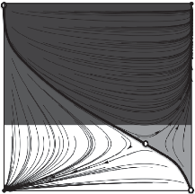

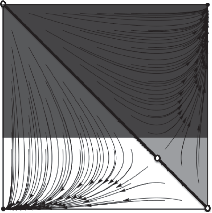

High High

(a) m = 1 (b) m = 3

- Figure 6.10 Phase diagrams for two populations playing a Nash demand game. With restricted starting points, a general Red Queen can translate to a Red King

game with L = 2 where we see a Red Queen effect. Imagine, though, that populations only start in the area of the phase diagram that is not shaded out. (This is the area where the larger population tends to be demanding High.) While there is a Red Queen effect over the entire space, for this limited section there is a Red King effect. The smaller the minority, the more likely they are to end up demanding Low.

This claim makes intuitive sense when it comes to minority/majority scenarios. If a minority population is reacting to a majority that is likely to make strong demands of its members, and they react quickly, then they tend to move towards accommodation. If they were less reactive, the other side might update to accommodate their demands instead. Whenever conventions of bargaining emerge within a larger context of discrimination, then minority status should always lead to disadvantage. The Red King is expected to prevail.8

As I argue in O’Connor (2017a), when actors display even minimal in-group preferences, we should expect the cultural Red King to occur quite generally. Suppose that a minority and majority group develop bargaining norms in a society, and suppose further that each side shows some tendency to discriminate against their out-group. (Notice that now we appeal to the possibility of psychological in-group favoritism, which

8 Of course, if our sub-population is drawn from a larger group where the minority type tends to demand High, and the majority Low, we should again expect a Red Queen. Swift minority responses will tend to recreate existing social patterns.

Downloaded from https://academic.oup.com/book/32356/chapter/268620019 by University of Toronto Libraries user on 28 January 2026

Low

Low High Low Low

High

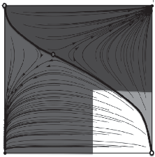

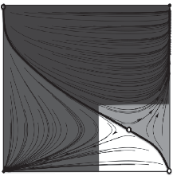

High High

(a) L = 2 (b) L = 4

- Figure 6.11 Phase diagrams for two populations playing a Nash demand game. If actors tend to display in-group preference, the cultural Red King is strengthened

has heretofore been ignored.) In other words, population starting points tend to be in the area of the phase diagram where both sides often demand High. Again, in this scenario minority groups will tend to be disadvantaged by dint of the cultural Red King. Figure 6.11 drives this home.Thefirstfigure(a)showsaphasediagramforaNashdemandgame where L = 2 and there is a Red Queen, the second (b) for a game where L = 4 and there is a Red King. If populations start in the portion of the state space where they both discriminate against the out-group (the area that is not shaded out), there is a Red King for both models. Again, this makes intuitive sense. The fact that one side is more reactive means that they will be more likely to cave if both sides are making high demands.

These observations about the context in which the cultural Red King/Red Queen occur are the first part of the story behind why the Red King, rather than the Red Queen, is expected to shape the emergence of bargaining conventions. In the next section, I will fill in this claim, while also giving a robustness check for the cultural Red King/Red Queen effects.

#### 6.2.3 Robustness and risk aversion

Throughout the book, I’ve appealed to models developed by Peyton Young, especially those from Axtell et al. (2000), to provide a robustness check on the results I’ve presented. In their model, remember, instead of infinite populations, deterministic dynamics, and cultural imitation/learning, we assume finite populations, stochastic dynamics, and

Downloaded from https://academic.oup.com/book/32356/chapter/268620019 by University of Toronto Libraries user on 28 January 2026

boundedly rational best response. And yet, for a number of important results, the outcomes of these two sets of models are very qualitatively similar. As I will now show, the cultural Red King/Red Queen can be reproduced in this set of models (O’Connor, 2017a). Changing the numbers of agents interacting on either side shifts outcomes, and in just the ways we’d expect given the replicator dynamic results. As I will also show, and perhaps more importantly, this modeling framework allows us to investigate the influence of a well-established economic phenomenonrisk aversion—on our results. As we will see, when agents display risk aversion, the Red King becomes significantly more important.

Consider a model with N agents of two types. Let’s call the proportion of type one p1. Each round, two agents are randomly chosen to interact. Each agent has a finite memory of past interaction with each of the two types.Theychooseastrategythatwouldhavegeneratedthehighestpayoff if played in each previous interaction that they remember.

Over time, agents in these models head toward absorbing states, or conventions, that correspond to the equilibria of the model—types make fair demands, or else compatible but unfair demands of each other.9 When types are of equal sizes, each is equally likely to gain an advantage. When one type is larger, however, we observe cultural Red King/Red Queen effects just as before. Again, in these scenarios, the minority type meets majority members more often than the reverse. In this model, the minority types are then updating their majority memories much more quickly than vice versa. As a result their strategies change more quickly. (See O’Connor (2017a) for a more in-depth presentation of these results.)

So the cultural Red King/Red Queen is robust to significantly different modeling choices. This can increase our confidence that these effects may trulyimpacttherealworld.And,asIwillnowshow,thissetofmodelsalso allows us to incorporate new assumptions, and, as a result, to deepen our understanding of these effects.

#### 6.2.3.1 risk aversion

Young (1993b), in a similar model of the emergence of bargaining norms, assumes that his agents display risk aversion. This means that the value they place on a good decreases over each unit of it they receive. If given

9 Moving away from the Young framework, I assume that the probability of erring for agents is 0, so that models reach and stay at absorbing states.

Downloaded from https://academic.oup.com/book/32356/chapter/268620019 by University of Toronto Libraries user on 28 January 2026

a choice to simply receive x units of some good, then, or to engage in a lottery with an expected outcome of x + , there will be positive values of for which an agent will pick the sure thing even though it has a smaller expected payoff.10 Risk aversion is a common assumption from economics since it reflects the actual preferences of humans under many circumstances (Kahneman and Tversky, 1984).

Let us add to the models just described an assumption that agents have risk-averse preferences. In choosing their best responses to their finite memories, they show preference for smaller, sure outcomes over larger riskierones.11 ThischangesignificantlyimpactstheRedKing/RedQueen effects in these models.

Consider a model with nine demands ranging from one to nine. Just as under the replicator dynamics, this model displays a cultural Red Queen effect. As p1 gets larger and larger, it becomes increasingly likely that members of the type in the majority end up making lower demands. Figure 6.12 shows these results. Notice that as p1 gets larger, we see the lighter patches expand slightly, reflecting a greater likelihood of disadvantage for the majority group.12

Once we add risk aversion, however, the results flip. Now, as type one becomes more prevalent, they are also more likely to end up making high demands. Figure 6.13 shows results from the model with risk-averse preferences. As we can see, it is now increasingly likely that the majority gains an advantage as their numbers expand. When p1 = .9 the majority group discriminates more than 60% of the time, and the minority group discriminates in only about 15% of simulations.

- 10 An example can perhaps make clear why this is an intuitive preference. Suppose you

were offered either $1000 or a 50% chance to win $2001. While the expected payoff of the second offer is slightly higher, you would still be quite reasonable to take the guaranteed $1000. Kahneman and Tversky (1984) detail at length the conditions under which people tend to display risk-averse or risk-seeking choices.

- 11 This is done by adding a concave utility function. I choose u(x) = 3ln(x + 1) for the

simulations shown because it respects the 0 payoff point, is concave, and is monotonically increasing, but not too steep. To give a sense of how this influences preferences, individuals with such a utility function will be indifferent between receiving a payoff of five for sure, and a 75% chance of getting a payoff of ten. An individual with no such function would, obviously, be indifferent between receiving five and a 50% chance of ten. Other functions with these properties might just as well have been chosen.

- 12 Results are from 10k runs of simulation of these models, measuring outcomes once

they have settled into a stable absorbing state.

Downloaded from https://academic.oup.com/book/32356/chapter/268620019 by University of Toronto Libraries user on 28 January 2026

- 0.8
- 1

Proportions of Outcomes

0.6

0.4

0.2

The Cultural Red Queen Effect, No Risk Aversion

0

0.5 0.6 0.7 0.8 0.9 Majority Size

|Majority 9 Majority 8 Majority 7 Majority 6 Majority 5 Majority 4 Majority 3 Majority 2 Majority 1  |
|---|

- Figure 6.12 Basins of attraction for two types playing the Nash demand game with a minority group

The Cultural Red King Effect, Risk Aversion

Proportion of Outcomes

0

0.2

0.4

0.6

- 0.8
- 1

0.5 0.6 0.7 0.8 0.9 Majority Size

|Majority 9 Majority 8 Majority 7 Majority 6 Majority 5 Majority 4 Majority 3 Majority 2 Majority 1  |
|---|

- Figure 6.13 Basins of attraction for two types playing the Nash demand game with a minority group

Downloaded from https://academic.oup.com/book/32356/chapter/268620019 by University of Toronto Libraries user on 28 January 2026

So what do these results tell us? Inasmuch as actors display risk-averse preferences, the cultural Red King effect should disadvantage minority groups with respect to emerging bargaining conventions. The intuitive explanationhereisthatriskaversionmakeslowdemandsmorepreferable to all agents because low demands guarantee a small, dependable payoff while high demands present a risk of getting the disagreement point. Although every actor is now more drawn toward low demands, minority groups react more swiftly and in doing so create a scenario where majority types can then take advantage by making high demands. This same reasoning applies to other versions of the model—those with fewer demands, or more, or other levels of risk aversion—in general risk-averse tendencies strengthen the cultural Red King and weaken the cultural Red Queen, meaning that minority groups are the ones who tend to end up disadvantaged.13

There are a few reasons to care about this finding, in particular, in the case of minority/majority interactions. Guiso and Paiella (2008) show that individuals with more assets are less risk averse than those with fewer, and that respondents who expect to be under future risk are more risk averse. In other words, the cultural Red King effect might be particularly strong at the intersection of poverty and minority status. When disadvantaged minority groups interact with less disadvantaged majority groups, the cultural Red King should be stronger. When a financially secure minority group interacts with a disadvantaged majority, we would expect the effect to be lessened.

To sum up, the cultural Red King effect has real potential to disadvantageminoritygroupswithrespecttotheemergenceofbargainingconven-

13 There is a set of results from Bowles and Naidu (2006) and Hwang et al. (2014) yielding an opposite finding—that when it comes to preferred conventions of division, actors in a larger social class are disadvantaged. In their models, the disadvantage is generated by the fact that actors tend to err in their own favor, and small classes of actors are more likely to do so in a way that shifts a convention to one they prefer—essentially the small numbers make a coordinated shift of a significant proportion of them more probable. (Note that this is not a cultural Red Queen, because reactiveness has nothing to do with the asymmetry.) They employ myopic best-response dynamics with inertia, representing a case where each round every agent revises their strategies with some probability to play a best response to the other population. Bruner (2017), however, finds that in models with this dynamic the culturalRedKingdoesnotarise.Becausethesameportionofeachpopulationbestresponds at every time step, they are equally reactive to each other. In reality, a small group may find it hard to shift the behaviors of a large one under these conditions because the large group is relatively un-reactive.

Downloaded from https://academic.oup.com/book/32356/chapter/268620019 by University of Toronto Libraries user on 28 January 2026

tions solely by dint of their minority status. Several realistic conditionsthe existence of discriminatory norms, risk aversion, especially in disadvantaged groups, and in-group preference—exacerbate this effect.

There are actually a few more results contributing to robustness of this claim. As I will outline in the next chapter, in Rubin and O’Connor

- (2018) we find something similar to the cultural Red King in agentbased network bargaining models. Bruner (2017) in his original work shows that the effect is robust across several further dynamics, and that positive assortment with in-group members does not disrupt the effects. InO’ConnorandBruner(2017)weshowhowtheeffectoccursevenwhen actorshaveoutsideoptions.Thisperhapssurprisingsetoffindingsmeans that besides the usual problems with bias that minority groups face, they are at further risk of disadvantage from solely dynamical effects.

#### 6.2.4 Doubling down

There is one more observation to make about minority/majority models before continuing. Computer scientist Karen Petrie has pointed out that if men and women each make equal numbers of sexist remarks to the other gender, the number of remarks one man or woman receives scales exponentially with the gender ratio. So, for example, if the gender ratio is 1 : 2 women to men, women will receive 4 times as many sexist remarks

- as men. If this gender ratio goes up to 1 : 5, women receive 25 times as many sexist remarks.

This so-called “Petrie multiplier” is somewhat analogous to a further disadvantage that minority groups undergo in the types of models we have just been exploring. A minority/majority asymmetry creates not just different learning environments for those in different types, but also different interactive environments once bargaining norms have developed (O’Connor and Bruner, 2017). Return to the example of a company that is 90% white and 10% Latinx. If a norm develops between types that disadvantages Latinx people, then in 90% of interactions they will end up demanding Low. If a norm develops that disadvantages whites, then they will only receive the Low demand in 10% of their interactions. In other words, a disadvantaged bargaining convention is especially damaging to those in minority groups because they meet the out-group so regularly. Of course, this asymmetry also means that minority types who end up at an advantaged convention reap more significant rewards as a result.

Downloaded from https://academic.oup.com/book/32356/chapter/268620019 by University of Toronto Libraries user on 28 January 2026

### 6.3 Institutional Memory

Imagine a situation where two types of agents learn to bargain, but where one side has better access to what we might call institutional memory. In particular, they are able to find out more about the past bargaining experiences of their in-group. This sort of situation might hold in the real world if one group is better networked—they have access, for instance, to social clubs where they share information about their past bargaining experiences, or have old-boy mentoring networks to transfer information about past interaction. As Hwang et al. (2014) point out for the case of household bargaining, “men who can publicly fraternize with other men have an informational advantage vis-a-vis women confined to domestic roles and family networks” (34).

Young (1993b) argues that in a situation like this, the type with more information should have an advantage with respect to bargaining conventions. His model differs slightly from the ones I just explored. Each agent does not have a private memory, but rather obtains a random sample of the last m bargaining interactions that have occurred. This means that in each round agents best respond to what they have seen happen to others as well as to themselves. When Young analyzes this modelforthestochasticallystableequilibrium,hepredictsthatactorswill arrive at the fair demand between groups. But, if members of one group have a longer institutional memory, this prediction shifts. The longer the memory of one side (compared to the other), the more resource they get

- at the equilibrium. Gallo (2014) provides a very similar proof, but where the difference in memory results from network structure specifically. He looks at situations where members of one group are more tightly networked, and, as a result, get larger samples of past interactions from their neighbors to react to. In this context, network density provides an advantagetoagroupwithrespecttothepredictedbargainingconvention. BowlesandNaidu(2006)andHwangetal.(2014)lookatmodelsofactors who engage in a different best-response dynamic and who play what they calla“contractgame”—basicallyacoordinationgamewhereoneoutcome is equitable, and the other inequitable. Again, they find that information provides an advantage. In their case, when one side can observe a greater portion of the other type, they are more likely to end up favored by convention.

Downloaded from https://academic.oup.com/book/32356/chapter/268620019 by University of Toronto Libraries user on 28 January 2026

power and learning 155

Why do we see these results? Why should memory length or network density matter with regard to which side gets more? These results, in fact, are a sort of cultural Red King effect. In all three cases, the fact that one side sees more makes them less reactive, and less likely to change strategies quickly. As Hwang et al. (2014) put it, “a larger scope of visionamongthewelloffreducestheirresponsivenesstotheidiosyncratic play of the poor” (6). To make this clearer, imagine two agents in the Young and Gallo type models, one with a memory of a single interaction and one with memories of ten interactions. The agent with the single memory will always best respond to whatever she last experienced, and so could flip strategies every round if she meets different interactive partners. The agent with ten memories maintains some consistency over rounds. A single interaction will probably not impact their best response. Because both Young and Gallo assume that their actors have risk-averse preferences,thesidethatislessreactive—theonewithlongerinstitutional memory—thengainsanadvantage.Thereactivesidebecomesmorelikely to flip toward low demands than the better networked agents and then to eventually end up making low demands at the emergent convention.14 (In the Bowles and Naidu (2006); Hwang et al. (2014) case because actors err in their own favor there is always an advantage to being unresponsive to the other side.)

### 6.4 Power and Learning

In the last chapter, I discussed at length how power can advantage members of a social group with respect to bargaining conventions. In Bruner and O’Connor (2015) we instantiate power in one more way that I have not yet discussed. This is because this last instantiation of power in fact works via a Red Queen/Red King effect.

Supposethattwogroupsbargain,butthatforonegroupthisbargaining scenarioisjustoneofmanythattheyengagein.Orsupposethattheytend to have payoffs coming in from another source—land holdings, or a trust fund, or a cushy job. The idea is that for one group the bargain is their

14 See O’Connor (2017a) for a more in-depth discussion of the connection between these results and the cultural Red King effect.

Downloaded from https://academic.oup.com/book/32356/chapter/268620019 by University of Toronto Libraries user on 28 January 2026

Player 1

Player 2

| |Low|Med|High|
|---|---|---|---|
|Low|4+b, 4|4+b, 5|4+b, 6|
|Med|5+b, 4|5+b, 5|0+b, 0|
|High|6+b, 4|0+b, 0|0+b, 0|

Figure 6.14 Payoff table for a Nash demand game with background payoffs for one actor

only source of payoff, while for the other it is a relatively unimportant interaction. A natural target for a model like this is bargaining between landholders and sharecroppers, or between genders when one gender tends to make more money. Figure 6.14 shows a payoff table representing this scenario. Here b is the extra background payoff to the more powerful side.

This addition impacts how quickly one side learns to interact with the other. The intuition is that because the interaction is less important or less salient to members of the more powerful class, they are less quick to update their strategies. And, in particular, this change to the payoff table can induce a cultural Red King/Red Queen effect in just the way that minority status, or asymmetries in institutional memory, can. The takeaway is that inasmuch as reactivity of a type is impacted by their economic empowerment, they may gain a bargaining advantage via this difference.

### 6.5 Intersectional Oppression

This chapter and the last one have dealt with the evolution of the second sortofinequity,whereonegroupexploitsanother.Inparticular,theyhave tackled the various ways in which differences between groups can lead to an advantage for one side as far as bargaining conventions go. As we have seen, power, operationalized in multiple ways (note that we can include networking and institutional memory under this broad heading as well) and also majority status can lead to advantage for a particular group. Now I will use these effects to explore what sorts of inequity can happen at the intersection of social groups when individuals have multiple aspects to their social identity.

The inspiration for this exploration comes from intersectionality theorists who argue that understanding inequity via binary social categories

Downloaded from https://academic.oup.com/book/32356/chapter/268620019 by University of Toronto Libraries user on 28 January 2026

is short-sighted. As they point out, we sometimes have to look at the intersections of demographic categories to understand oppression. For instance, the effect that being a black woman has on one’s expected salary might not be a simple combination of the effects that being a woman and being black have on one’s salary. As Collins and Chepp (2013) put it, “the first core idea of intersectional knowledge projects stresses that systems of power ... cannot be understood in isolationfrom oneanother; instead systems of power intersect and coproduce one another to result in unequal material realities and the distinctive social experiences that characterize them” (60). One strong theme of intersectional research is the observation that sometimes disadvantage for those who share two intersecting disadvantaged identities is non-additive. In other words, this disadvantage is more than the sum of its parts.

This raises a series of questions. Can we model special intersectional inequity using the framework developed in this book? What patterns do these effects follow? Do those in multiple disadvantaged social categories experience particular inequity as a result of intersectional effects? In O’Connor et al. (2017), Liam Kofi Bright, Justin Bruner, and I set out to answer these questions, and, in doing so, to provide a general methodological contribution to the more empirically minded areas of intersectionality theory. (For more on these methodological contributions, see the original paper). Our paper looks at a number of scenarios in which intersectional disadvantage can arise in evolutionary bargaining models. Here, I will discuss just one model that illustrates why those with intersecting disadvantaged social identities may be especially disadvantaged. To be clear, we by no means think our simplified models will capture all the social features relevant to intersectional oppression, and the question, again, is how far we can get with relatively minimal conditions.15

Imagine a population with two dimensions of personal identity that are relevant to bargaining interactions—gender and race. Suppose in

15 Hoffmann (2006) considers a model where actors with multiple social identity markers evolvetoplayhawk–dove.Heconsiderssituationswhereactorshaveuptosevendimensions of identity that are relevant to interaction. In his models, actors generalize their learned responses over all the categories that an opponent belongs to, so that an interaction with a black man will be used to learn about all black people and all men. This is slightly different from the models we employ, but also involves potential for intersectional disadvantage (though he does not identify his models as applying to this area of theory).

Downloaded from https://academic.oup.com/book/32356/chapter/268620019 by University of Toronto Libraries user on 28 January 2026

WhiteBlack

Race

Men Women

Gender

- Figure 6.15 A population with two dimensions of demographic category, gender and race

particular that this population has equal proportions of men and women, and a white majority and black minority. Figure 6.15 shows a representation of this population. As we can see, these two intersecting aspects of identity generate four types in the population: white men, black men, white women, and black women.

Now imagine the following scenario. (This will be slightly jerry-rigged, but I will explain why momentarily.) Actors bargain in two arenas—in the workplace, they bargain for their level of compensation and at home theybargainoverwhatproportionofthiscompensationtheykeepcontrol of. Further suppose that in the workplace race is a more salient social category. Actors tend to pay attention to race and condition behavior on it when choosing how to bargain. In the home, on the other hand, gender is the more salient social category. This scenario generates two interrelated processes where bargaining conventions emerge. Conventions emerge for cross-racial bargaining in the workplace, and simultaneously emerge between genders in the home.

One might point out that this set-up seems to deny the fundamental thesis of intersectionality theory—that various aspects of identity cannot simply be detangled for the purposes of understanding inequity. We

Downloaded from https://academic.oup.com/book/32356/chapter/268620019 by University of Toronto Libraries user on 28 January 2026

could instead look at a model where there are simply four intersectional types and bargaining conventions emerge between all of them. Indeed in O’Connor et al. (2017) we do so, and find that the smallest intersectional types can be especially disadvantaged by the cultural Red King. Here I focus on this two-arena model because it will allow us to easily compare two scenarios, one which assumes a less robust level of intersectional identity, and one which assumes a more robust level. As we show, as the intersectional assumptions grow more robust, the inequity between advantaged and disadvantaged intersectional types increases.

Assume actors play a Nash demand game with two strategies. In these two-arena models, this generates four possible joint evolutionary outcomes. In the workplace either white people or black people demand High and at home either men or women demand High, so a joint outcome would be, for example, that black people and women demand High. When the types are symmetric, each of these joint outcomes arises equally often. But let’s add the possibility of a majority/minority split in the workplace, and a power imbalance in the home. In particular, let’s consider a model with demands of 4 and 6, where p1, the proportion of white people, varies from .5 to .99, and where the disagreement point for menvariesfrom0to3.9(butisalways0forwomen).Thesechangesmean thattherearetwopossiblesourcesofdisadvantageforsocialgroups.Black people are disadvantaged in the workforce as a result of the cultural Red King, and women are disadvantaged in the home as the result of a power imbalance.

As we’ve said, for the purposes of type-conditioning race matters in the workforce and gender at home. For the model with weaker intersectional assumptions let’s also assume that for the purposes of social imitation the same is true. People imitate those of their own race in the workplace and their own gender in the home, but do not pay attention to their intersectional categories. This means that the outcomes of this model are simply a combination of the outcomes of two separate models of bargaining. (That is, the two processes take place entirely independently.)

- Figure 6.16 shows results from this model. I only focus on a small subset of the parameter space to give an idea of what happens when both the minority disadvantage and the power disadvantage increase. On the x-

axis, both p1, proportion of whites, and the disagreement point for men increase.Eachdatapointshowsbasinsofattractionforthefouroutcomes. As we can see, there is particular disadvantage for black women. They

Downloaded from https://academic.oup.com/book/32356/chapter/268620019 by University of Toronto Libraries user on 28 January 2026

Power, the Cultural Red King, and Weak Intersectionality

1 0.9 0.8 0.7 0.6 0.5 0.4 0.3 0.2 0.1

Basins of Attraction

0

.5, 0 .6, 1 .7, 2 .8, 3 .9, 3.9 p1, Disagreement Point for Men

|Whites High, Men High Whites High, Women High  Blacks High, Men High Blacks High, Women High|
|---|

- Figure 6.16 Basins of attraction for actors with four intersectional types playing a Nash demand game

are most likely to end up demanding Low in the workplace and in the home, so jointly they are most likely to end up demanding Low in both places. White men, in contrast, are particularly advantaged by their intersectional identity.

In this case, although the evolutionary processes occur separately, we still see a special intersectional disadvantage that is more than the sum of the two processes because the payoffs from the actors are determined by what happens at work and at home. For instance, at the most extreme parameter values for disadvantage (where p1 = .99 and the disagreement point for men is 3.9) on average over all runs of simulation white men receive payoffs of 3.22, white women 2.24, black men 2.68, and black women 1.86. If we considered just the disadvantage that black people face in the workplace, or just the disadvantage women face in the home, we would miss this particular disadvantage for black women. If we studied overall disadvantage we would find that black people make less than whites on average (2.27 versus 2.73), and that women make less than men (2.05 versus 2.95), but we would have to study black women in particular to capture their level of disadvantage.

Now let’s look at a second model. Suppose that instead of choosing role models from their binary types in each arena of interaction, actors now imitate only those of their intersectional types in both arenas. That is, black men imitate only black men at work, even though their status

Downloaded from https://academic.oup.com/book/32356/chapter/268620019 by University of Toronto Libraries user on 28 January 2026

Power, the Cultural Red King, and Stronger Intersectionality

1 0.9 0.8 0.7 0.6 0.5 0.4 0.3 0.2 0.1

Basins of Attraction

0

.5, 0 .6, 1 .7, 2 .8, 3 .9, 3.9

p1, Disagreement Point for Men

|Whites High, Men High Whites High, Women High  Blacks High, Men High Blacks High, Women High|
|---|

- Figure 6.17 Basins of attraction for actors with four intersectional types playing a Nash demand game

as men is irrelevant for bargaining interactions in this case. Figure 6.17 showsresultsforthismodel.Weseeasimilarpatterntothelastmodel,but with a more dramatic difference between the outcomes for advantaged and disadvantaged types. In this case, whites and men demand High in nearly 80% of simulations, compared to 63% of the time in the previous simulations. This is a direct result of the stronger intersectional assumptions. Because actors only imitate their own intersectional type, the size differential between the types is more significant, leading to a stronger cultural Red King effect.

As with all the models investigated in the last two chapters, intersectional disadvantage arises here as a result of agents who type-condition and learn to behave in their own best interest. Again, we can explain intersectional oppression via solely dynamical effects (even though there is little reason to think that these explanations capture the full picture in real-world populations). Again, it takes very little to generate special disadvantage for intersectional groups compared to their binary social groups.

• • •

Thischapterwrapsupthemainbodyofourdiscussionofthedynamics ofperniciousinequity.In particular,weexploredtheeffectsthatreactivity differences can have on the emergence of bargaining norms. As we saw,

Downloaded from https://academic.oup.com/book/32356/chapter/268620019 by University of Toronto Libraries user on 28 January 2026

one of the most important implications of this set of results is with regard to minority populations. In bargaining scenarios, the cultural Red King can lead to bargaining disadvantage by virtue simply of minority status and absent any other asymmetries between groups. Besides minority status, this same sort of disadvantage can arise for groups that lack institutional memory, or who are more economically insecure with respect to background payoffs. We also explored some more specific applications of these models. As we showed in O’Connor et al. (2017), special intersectional disadvantage can arise in these models as a result of dynamics. In the next chapter, we will turn to a slightly different question—once the sort of inequitable conventions we have been addressing arise, how does this impact interactive choices?

Downloaded from https://academic.oup.com/book/32356/chapter/268620019 by University of Toronto Libraries user on 28 January 2026

