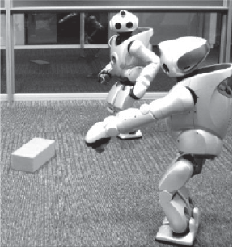
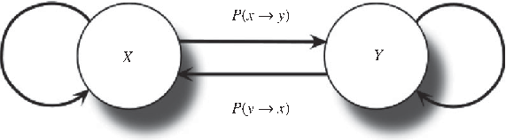
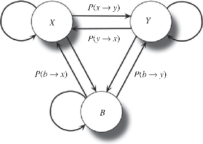
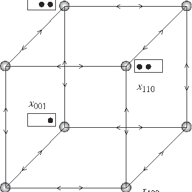
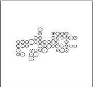
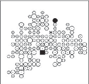
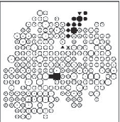
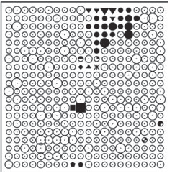

J. R. Soc. Interface (2010) 7, 1647–1664

doi:10.1098/rsif.2010.0110 Published online 30 June 2010

REVIEW

# Diversity, competition, extinction: the ecophysics of language change

## Ricard V. Sole´1,2,3,*, Bernat Corominas-Murtra1 and Jordi Fortuny4

1ICREA-Complex Systems Laboratory, Parc de Recerca Biome`dica de Barcelona, Universitat Pompeu Fabra, Dr Aiguader 88, 08003 Barcelona, Spain 2Santa Fe Institute, 1399 Hyde Park Road, NM 87501, USA 3Institut de Biologia Evolutiva, CSIC-UPF, Passeig Marı´tim de la Barceloneta, 37-49, 08003 Barcelona, Spain 4Centre de Lingu¨´ıstica Teo`rica, Facultat de Lletres, Edifici B, Universitat Auto`noma de Barcelona, 08193 Bellaterra, Spain

As indicated early by Charles Darwin, languages behave and change very much like living species. They display high diversity, differentiate in space and time, emerge and disappear. A large body of literature has explored the role of information exchanges and communicative constraints in groups of agents under selective scenarios. These models have been very helpful in providing a rationale on how complex forms of communication emerge under evolutionary pressures. However, other patterns of large-scale organization can be described using mathematical methods ignoring communicative traits. These approaches consider shorter time scales and have been developed by exploiting both theoretical ecology and statistical physics methods. The models are reviewed here and include extinction, invasion, origination, spatial organization, coexistence and diversity as key concepts and are very simple in their defining rules. Such simplicity is used in order to catch the most fundamental laws of organization and those universal ingredients responsible for qualitative traits. The similarities between observed and predicted patterns indicate that an ecological theory of language is emerging, supporting (on a quantitative basis) its ecological nature, although key differences are also present. Here, we critically review some recent advances and outline their implications and limitations as well as highlight problems for future research.

Keywords: language dynamics; extinction; diversity; competition; phase transitions

both global (Cavalli-Sforza et al. 1988; Cavalli-Sforza 2002) and local (see Lansing et al. (2007) and references therein) population scales. As is the case with biodiversity estimates too, the actual language diversity is unknown, and estimates fluctuate up to around 10 000 different spoken languages. Needless to say, another element to consider is the internal diversity displayed by languages themselves, where—like subspeciesdialects abound.

1. INTRODUCTION

Languages and species share some remarkable commonalities. Such similarities did not escape the attention of Charles Darwin, who mentioned them a number of times in writings and letters (see Whitfield 2008). In The Descent of Man, Darwin explicitly says:

The formation of different languages and of distinct species, and the proofs that both have been developed through a gradual process, are curiously parallel. (Darwin 1871)

Languages also display geographical variation: as occurs with species, they become more and more different under the presence of physical barriers. They come to life, as species appear by speciation. They also become extinct, and language extinction has become a major problem for our cultural heritage: as for endangered species, many languages are also on the verge of disappearance (Crystal 2000; Dalby 2003; Sutherland 2003; Mufwene 2004). Languages die with their last speaker: Crystal mentions the example of Ole Stig

Languages indeed behave as some kind of living species (Mufwene 2001; Pagel 2009). They exhibit a large diversity: it is estimated that around 6000 different languages exist today in our modern world (Krauss 1992; McWhorter 2001; Nettle & Romaine 2002). Languages and genes are known to be correlated at

*Author for correspondence (ricard.sole@upf.edu). Andersen, a researcher looking in 1992 for the last

Received 26 February 2010 Accepted 9 June 2010 1647 This journal is # 2010 The Royal Society

speaker of the West Caucasian language Ubuh. In the words of Andersen:

(The Ubuh) .. . died at day break, October 8th 1992, when the last speaker, Tevfik Esenc¸, passed away. I happened to arrive in his village that very same day, without appointment, to interview the Last Speaker, only to learn that he had died just a couple of hours earlier.

Crystal (2000)

This story dramatically illustrates the last breath of any extinct language. It dies as soon as its last speaker dies (or stops using it). It is also interesting to observe that the extinction risk and its correlation with geographical distribution is shared by both species and languages (Sutherland 2003).

Language change involves both evolutionary and ecological time scales. Most theoretical studies deal with large-scale evolution: how languages emerge and become shaped by natural selection (Bickerton 1990; Hawkins & Gell-Mann 1992; Deacon 1997; Parisi 1997; Cangelosi & Parisi 1998; Nowak & Krakauer 1999; Pinker 2000; Cangelosi 2001; Hauser et al. 2002; Kirby 2002; Wray 2002; Brighton et al. 2005; Kosmidis et al. 2005, 2006; Baxter et al. 2006; Szamado & Szathmary 2006; Floreano et al. 2007; Oudeyer & Kaplan 2007; Lipson 2007; Christiansen & Chater 2008; Chater et al. 2009; Nolfi & Mirolli 2010). But languages also display changes within the short time scale of one or a few human generations. Actually, a great deal of what will happen to languages in the future is deeply related to their ecological nature. Demographic growth, the dominant role of cities in social and economic organization and globalization dynamics will largely shape the world’s languages (Graddol 2004).

Languages evolve under centuries of accumulated modifications (this is well illustrated by written texts; see Howe et al. (2001) and Bennett et al. (2003)) and undergo evolutionary bursts (Atkinson et al. 2008). On short time scales they can be described in terms of ecological systems. These rapid modifications affect language diversity, their internal differentiation and even their survival. Different studies using the perspective of statistical physics (Nettle 1999a–c; Benedetto et al. 2002; Ke et al. 2002, 2008; Stauffer & Schulze 2005; Wang & Minett 2005; Loreto & Steels 2007; de Oliveira et al. 2008; Zanette 2008) have been able to cope with these phenomena, showing that the basic trends of language dynamics share remarkable similarities with the spatiotemporal behaviour of complex ecosystems.

We will consider different levels of language organization, from words to languages as abstract entities. The models reviewed here explore the conditions under which words or languages can survive or disappear. The time scale is ecological; therefore, we assume that in short time scales the dynamics of change does not affect the structure of language itself and thus evolutionary models are not considered. Moreover, we do not intend to quantitatively reproduce observed patterns, although the predictions of the models can be tested in many cases from real data. Instead,

the models we revise try to capture the logic of the underlying processes in a qualitative fashion. These models follow the spirit of statistical physics in trying to reduce the system’s complexity to its bare bones. They provide a powerful approximation that allows us to see global patterns that might not depend on the intrinsic nature of the components involved. They also help in highlighting the differences. As will be discussed below, languages also exhibit marked departures from ecological traits.

This review critically examines a set of models of increasing complexity. Specifically, we review recent advances within the fields of statistical physics and theoretical ecology relative to a better understanding of language dynamics. We begin with a very simple model describing word propagation within a population. Next, the effects and consequences of competition among linguistic variants, with special attention to those scenarios leading to language extinction. This is expanded by considering alternative scenarios allowing language coexistence to occur, either through bilingualism or spatial and social segregation. Although spatial coexistence under local competition is shared with ecosystems, bilingualism belongs to a different class of phenomenon. All these models involve a small number of interacting languages. The final part of the review deals with language diversity in space and time. Both a simple model of multi-lingual communities and available data on scaling laws in language diversity are presented. Once again, striking similarities and strong differences are found. A synthesis of these ideas and open problems is presented at the end, together with a table comparing language and the ecosystem’s properties.

2. LEXICAL DIFFUSION

The potential set of words used by a speaker’s community is listed in dictionaries (Miller 1991). They capture a given time snapshot of the available vocabulary, but in reality speakers use only part of the possible words: many are technical and thus used only by a given group and many are seldom used. Many words are actually extinct, since no one is using them. On the other hand, it is also true that dictionaries do not include all words used by the community and also that new words are likely to be created constantly within populations and their origins have been sometimes recorded (Chantrell 2002). Many of them are new uses of previous words or recombinations and sometimes they come from technology. One of the challenges of current theories of language dynamics is understanding how words originate, change and spread within and between populations, eventually being fixed or extinct. In this context, the appearance of a new word has been compared with a mutation (Cavalli-Sforza & Feldman 1981).

As occurs with mutational events in standard population genetics, new words or sounds can disappear, randomly fluctuate or become fixed. In this context, the idea that words, grammatical constructions or sounds can spread through a given population was originally formulated by William Wang. This was proposed

1.0

(a) (b)

word fails word propagates

0.8

frequency of word,Wi

0.6

0.4

0.4

0.3

xi

0.2

0.2

0.1

0

5 10 15 20 25 time

1 2 3 4

0

Ri

Figure 1. (a) Bifurcations in word learning dynamics: using a simple model of epidemic spreading of words, two different regimes are present. If the rate of word learning exceeds 1 (i.e. Ri . 1), a stable fraction of the population will use it. If not, then a welldefined threshold is found (a phase transition) leading to word extinction. The inset shows an example of the logistic (S-shaped) growth curve for Ri ¼ 1.5 and xi(0) ¼ 0.01. (b) Lexical diffusion also occurs in so-called naming games among artificial agents where words are generated, communicated and eventually shared by artificial, embodied agents such as robots (picture courtesy of Luc Steels). As common words get shared, a common vocabulary is generated and eventually stabilized. The dynamics of these exchanges also follows an S-shaped pattern.

in order to explain how lexical diffusion (i.e. the spread across the lexicon) occurs (Wang 1969). Such a process requires the diffusion of the innovation from speaker to speaker (Wang & Minett 2005).

2.1. Logistic spreading

A very first modelling approximation to lexical diffusion in populations should account for the spread of words as a consequence of learning processes (Shen 1997; Wang et al. 2004; Wang & Minett 2005). Such a model should be able to establish the conditions favouring word fixation. As a first approximation, let us assume that each item is incorporated independently (Shen 1997; Nowak et al. 2000). If xi indicates the fraction of the population knowing the word Wi, the population dynamics of such a word reads

dxi dt ¼ Rixið1 xiÞ   xi; ð2:1Þ with i ¼ 1, ... , n. The first term on the right-hand side of equation (2.1) introduces the way words are learned. The second deals with deaths of individuals at a fixed rate (here normalized to 1). The way words are learned involves a nonlinear term where the interactions between those individuals knowing Wi (a fraction xi) and those ignoring it (a fraction 1 2 xi) are present. The parameter Ri introduces the rate at which learning takes place.

Two possible equilibrium points are allowed,

obtained from dxi/dt ¼ 0. The first is xi* ¼ 0 and the second is

xi ¼ 1

1 Ri

: ð2:2Þ

The first corresponds to the extinction of Wi (or its inability to propagate) whereas the second involves a

stable population knowing Wi. The stability of these fixed points is determined by the sign of

lðxi Þ ¼

@xi @xi x

: ð2:3Þ

i

If l(x*) , 0 the point is stable and will be unstable otherwise (Kaplan & Glass 1995; Strogatz 2001).

The larger the value of Ri, the higher the number of individuals using the word. We can see that, for a word to be maintained in the population lexicon, we require the following inequality to be fulfilled:

Ri . 1: ð2:4Þ

This means that there is a threshold in the rate of word propagation to sustain a stable population. By displaying the stable population x* against Ri (figure 1a) we observe a well-defined phase transition phenomenon: a sharp change occurs at Ric ¼ 1, the critical point separating the two possible phases. The subcritical phase Ri , 1 will inevitably lead to the loss of the word.

The dynamical pattern displayed by a successful propagating word follows a so-called S-shaped curve (see Niyogi (2006) and references therein concerning the gradualness and abruptness of linguistic change). This can be easily seen by integrating the previous model. Let us first note that the original equation (2.1) can be re-written as a logistic one, namely

dxi dt ¼ ðRi 1Þxi 1

xi xi

; ð2:5Þ

which, for an initial condition xi(0) at t ¼ 0, gives a solution

xið0ÞeðRi 1Þt 1 þ xið0ÞðeðRi 1Þt 1Þ

xiðtÞ ¼

: ð2:6Þ

This curve is known to increase exponentially at low population values, describing a scenario where words rapidly propagate, followed by a slow down as the number of potential learners decays. The accelerated, exponential growth has been dubbed the snowball effect (Wang & Minett 2005) and such curves have been fitted to available data (Wang 1969). Therefore, a central property of linguistic change, namely its gradualness, can be derived as an epiphenomenon from the dynamical patterns of successful propagation in the case of lexical diffusion. A further issue would be to explore whether the gradualness of grammatical (phonological, morphological and syntactical) change can be derived from equations similar to those that model the diffusion of words. It must be noted, from a different perspective, that the logistic trajectory of linguistic change may be favoured by ‘the underlying dynamics of individual learners’, as argued by Niyogi (2006, p. 167).

The previous toy model of word dynamics within populations is an oversimplification, but it illustrates fairly well a key aspect of language dynamics, which is also observed in ecology (Sole´ & Bascompte 2006): thresholds exist and play a role (Nowak & Krakauer 1999). They remind us that, beyond the gradual nature of change that we perceive through our lives (mainly affecting the lexicon), sudden changes are also likely to occur. An important aspect not taken explicitly into account by the previous model is the process of word generation and modification. Words are originated within populations through different types of processes. They also become incorporated by invasion from foreign languages. Once again, the processes of word invasion and origination recapitulate somehow the mechanisms of change in biological populations.

eventually decay (Ogura 1993). An interesting extension of this problem could take into account both positive and negative interactions. In this way, not only facilitation (as given by the positive interactions) but also competition would be considered. In other words, it seems reasonable to think that some words should be incompatible with others. This actually matches the problem of species invasion and assembly in multi-species communities (Levins 1968; Case 1990, 1991; Sole´ et al. 2002). For an exotic species invading a given community to succeed, some community-level constraints need to be satisfied. It would be interesting to see whether similar rules apply to the ups and downs of word spreading.

As in the previous subsection, it seems fair to us to pose the question of whether or not grammatical change can be modelled using equations similar to those explored in the study of lexical diffusion. As to multi-dimensional diffusion, it may be worth considering in future research whether the diffusion of a grammatical object such as a morphological paradigm or a syntactic structure can be described with an equation analogous to equation (2.7). It is also worth noting the existence of implicational universals (Greenberg 1963), which have the shape given a grammatical property x in a language L, we always find a property y in L, as well as the cross-linguistic observation that certain properties tend to entail other properties with overwhelmingly greater than chance frequency, to put it in Greenberg’s famous words. That is, crosslinguistic grammatical change cannot be perfectly mapped into a pure diffusion process: certain properties entail or tend to entail the presence or absence of certain properties, as some words may favour or ban the existence of others.

2.2. Multi-dimensional diffusion

Several modifications and extensions of the previous model have been suggested (Wang et al. 2004). They include considering multiple words involved in the diffusion process. This scenario would take into account the idea that words interact among them in multiple ways, and their diffusion can be constrained or enhanced by these interactions (Wang & Minett 2005). The resulting model describes the dynamics of a given novelty xi and its previous form yi (these can correspond to two words or sounds). Assuming conservation of their relative abundances, i.e. xi þ yi ¼ 1, it is possible to show that a set of equations

dxi dt ¼ ð1 xiÞ aiixi þ XN

" aijxj# ð2:7Þ

j=i

with i, j ¼ 1, .. . , N, describes the lexical diffusion process. The matrix elements aij introduce the coupling rate between a pair (i, j) of words. It is interpreted as the rate at which adoption of the new word i is induced by the frequency of other novel forms of word j. As it is formulated, the stable states are all given by xi* ¼ 1 and thus (not surprisingly) there is no place for extinction of the novelty, although there exists some evidence for such a scenario, where new items spread initially but

2.3. Naming games

A related problem which also involves the generation and spread of words is the so-called naming game. The original formulation and implementation of this problem was proposed by Luc Steels as a model for the emergence of a shared vocabulary within a population of agents (Steels 2001, 2003, 2005; see also Nolfi & Mirolli 2010). Originally, this approach involved communication between two embodied communicating agents. These agents (figure 1b) are able to visually identify objects from their environment and assign them to randomly generated names, which are then sent to the other agent in a speaker–hearer kind of interaction. Exchanges receive a pay-off every time the same word is used by both agents to name a given object. This is done by means of a trial and error process where failures are common at the beginning, as a common lexicon slowly emerges. Specifically, the set of rules are:

— The speaker selects an object.

— The speaker chooses a word describing the object from its inventory of word–object pairs. If it does not have a word then it invents one for the object. The speaker transmits the word–object pair to the listener.

— If the listener has the word–object pair then the transmission is a success. Both agents remove all other words describing the object from their inventory and keep only the single common word.

— If the listener does not have the word–object pair, then the listener will add this new word to its inventory. And this is recorded as a failure.

Eventually, a shared, stable repertoire gets fixed. The basic rules can be easily mapped into a toy model (the naming game model) involving many agents, by using a statistical physics approach (Baronchelli et al. 2006, 2008). Both hardware and simulated implementations display an S-shaped growth of the vocabulary, although interesting differences arise when we take into account spatial effects and the pattern of relations between agents, describable as a complex network (Steels & McIntyre 1999; Dall’Asta et al. 2006; Lu et al. 2008; Liu et al. 2009).

3. COMPETITION AND EXTINCTION

Languages are spoken by individuals, and the number of speakers provides a measure of language breadth. Because of both economic and social factors, a given language can become more efficient than others in recruiting new users and as a consequence it can reach a larger fraction or even exclude the second language, which becomes extinct.1 This replacement would be a consequence of competition, one of the most essential components of ecological dynamics, which can be applied to language dynamics too. Early models of two-species competition define the basic formal scenario where species interactions under limited resources occur (Case 1999). The standard model is provided by the classical Lotka–Volterra equations, namely

and

dx dt ¼ m1xð1 x b12yÞ ð3:1Þ

dy dt ¼ m2yð1 y b21xÞ; ð3:2Þ where x and y indicate the (normalized) populations of competing species, mi indicates their (per capita) growth rates and the coefficients bij are the rates of interspecific competition. We can see that for bij ¼ 0 two independent logistic equations would be obtained, whereas for non-zero competition two possible scenarios are at work.

Understanding language competition dynamics is clearly important: if the exclusion scenario is also at work, then competition can imply extinction. Moreover, theoretical models can help in defining useful strategies for language preservation and revitalization (Fishman 1991, 2001). Steady language decline has been observed in some cases, when population records of speakers are available. This is illustrated in figure 2, where the decay over time of four different languages is depicted.

1Species and languages also become extinct under external events (such as asteroid impacts or climate change). Sudden death of a language can occur owing to a volcanic eruption killing the small population of speakers or (more often) as a consequence of genocide (Nettle & Romaine 2002).

All these languages were used by a minority of speakers, competing with a dominant tongue that was gradually adopted by speakers as the less used ones were abandoned. This type of increasing return is common in economics, where positive feedbacks and amplification phenomena are common (Arthur 1994).

A simple model was proposed by Abrams and Strogatz (AS), which has been shown to provide a rationale for the shape of language decay (Abrams & Strogatz 2003; Stauffer et al. 2007). The model is based on the assumption that two languages are competing for a given population of potential speakers (the limiting resource) where we will indicate as x and y the relative frequency of each population (assuming that individuals are monolinguals, see below). The dynamics is governed by the following differential equation:

dx dt ¼ yPa;s½y ! x xPa;s½x ! y ; ð3:3Þ

where it is assumed that Pa,s[x ! y] ¼ 0 if x ¼ 0 and also constant population (x þ y ¼ 1). The transition probabilities depend on two parameters. The specific model reads

dx dt ¼ sð1 xÞxa  ð1 sÞxð1 xÞa; ð3:4Þ

where the s parameter indicates the so-called social status of the language. Two extreme equilibrium states are easily found after imposing dx/dt ¼ 0. These are x* ¼ 0 (zero population) and x* ¼ 1 (all speakers use the language). In our case, the stability criterion gives l(0) ¼ s 2 1 , 0 and l(1) ¼ 2s , 0 and thus both are stable attractors.

Together with the exclusion points x ¼ 0 and 1, there is a third equilibrium point, which can be obtained from

sx a 1 ¼ ð1 x Þa 1ð1 sÞ; ð3:5Þ and, after some algebra, one finds that

x ¼ 1 þ

s 1 s

1=a 1 1

: ð3:6Þ

Given the stable character of the other two fixed points, x* can only be unstable and thus no coexistence is allowed.

The model has been used to fit available data on language decay (figure 2) and assumes a scenario of minority languages competing with widely used majority tongues. One clear implication of the stability analysis is that the extinction of one of the competing solutions is inevitable. The social parameter will influence which language will become extinct. Nonetheless, linguistic diversification seems unavoidable: the language that succeeds in the competition situation will become more and more diverse as it extends through time and space, and it may end up yielding mutually unintelligible linguistic variants.

The AS model does not take into account that it is probable that a fraction of individuals (under some circumstances) will become bilingual. This might not seem so relevant, but bilingualism actually introduces a very

1 – P(x → y) 1 – P(y → x)

- P(x → y)
- P(y → x)

X Y

(a) (b)

1.0

s = 0.33 s = 0.26

0.8

minority speakers

0.6

0.4

0.2

0

1900 1950 2000

1950 2000

(c) (d)

1.0

s = 0.46

s = 0.40

0.8

minority speakers

0.6

0.4

s = 0.43

0.2

0

1900 1950 2000 1900 1950 2000

year

year

Figure 2. The dynamics of language death. Here four different cases are represented: (a) Scottish Gaelic, (b) Quechua in Huanuco, Peru, (c) Welsh in Monmouthshire, Wales, and (d) Welsh in all of Wales, from historical data (filled squares) and a single modern census (open circles). Fitted curves show solutions of the Abrams–Strogatz model (schematically indicated in the upper plot). Redrawn from Abrams & Strogatz (2003).

interesting ingredient to our view of language change, to be outlined in the next section.

4. COEXISTENCE AND BILINGUALISM

The previous model is simplified in many respects. By considering human populations as homogeneous systems, geographical effects and some idiosyncrasies of human language (not shared with ecosystems) are ignored. Spatial effects will be explored in the next section. Here we concentrate on a special property of human communities, namely the presence of individuals who are grammatically and communicatively competent in more than one language. Actually, a large fraction of humankind uses more than one tongue for communication. Historical reasons and the influence of modern invasions by languages such as English makes multi-lingualism an important ingredient to take into account.

The AS model can be easily expanded (figure 3a) by assuming that two languages are present but bilingual speakers are also allowed (Mira & Paredes 2005; Castello´ et al. 2006; see also Minett & Wang 2008).

The basic idea behind this approach is that the presence of bilingual speakers makes language coexistence likely to occur, provided that the two languages are close enough to each other. In this picture, three variables are used: as in the AS model, x and y will be the fraction of speakers using languages X and Y. Moreover, a third group B using both languages has a size b in such a way that x þ y þ b ¼ 1. Transitions are defined in similar ways (figure 3a). For example, changes in x would result from a kinetic equation,

dx dt ¼ yP½y ! x  þ bP½b ! x

x Pð ½x ! y  þ P½x ! b Þ; ð4:1Þ

and the constant population constraint allows the model to be defined in terms of just two coupled equations, namely

dx dt ¼ cðð1 xÞð1 kÞsxð1 yÞa xð1 sxÞð1 xÞaÞ

ð4:2Þ

- (a)
- (b)

- P(x → y)

P(b → y)

- P(y → x)

X Y

P(b → x)

B

1.0

Galician

0.8

fraction of speakers

0.6

0.4

bilingual

0.2

Castilian

0

1875 1900 1925 1950 1975 year

Figure 3. Dynamics of language use under the presence of bilingual speakers. (a) Here three types of speakers are considered. (b) The fraction of speakers versus time in Galicia (north western Spain). The smooth curves (modified after Mira & Paredes 2005) are the results of fitting a modified AS model (see text).

and

dy dt ¼ cðð1 yÞð1 kÞð1 sxÞð1 xÞa ysxð1 yÞaÞ;

ð4:3Þ

where k[ [0, 1] is a new parameter measuring the degree of similarity among languages and the status of the languages is now indicated as sx and sy ¼ 1 2 sx, respectively. The k parameter provides a measure of the likelihood that two single-language speakers can communicate with each other. It also affects the probability that a monolingual speaker becomes bilingual. We can easily check that the model reduces to the AS scenario for k¼ b ¼ 0.

Available data from language change in Northern Spain (Mira & Paredes 2005) provide a test of this model. Here the two languages are Castilian and Galician, both derived from Latin. These languages allow a relatively good mutual understanding and parameters are easily estimated. For this dataset, a best fit was obtained using a ¼ 1.5, s(Galician) ¼ 0.26, c ¼ 0.1 and k¼ 0.8. As we can see, the apparent decline of

Galician is actually a consequence of a simultaneous increase of Castilian monolinguals and bilinguals.

We should be aware of the overestimation of the role of the kparameter as a measure of the probability that a monolingual speaker becomes bilingual, since kis only an indicator of the degree of similarity among languages, and neglects the role of their social status. It is worth noting that many bilingual scenarios involve two highly differentiated languages, such as Basque and Castilian in northern Spain or Amazigh and Arabic in northern Africa.

How probable is it that the bilingual scenario will be relevant in the future? Recent model approaches suggest that maintaining a bilingual society necessarily requires the maintenance of status as a control parameter (Chapel et al. 2010). On the one hand, preserving language diversity in a globalized world will need active efforts when small populations of speakers are involved. But, on the other hand, we must also take into account current demographic trends (Graddol 2004), which will need to be incorporated into future models of language change. Against early predictions suggesting the dominant role of English as an exclusive language, the future looks multi-lingual. Different languages are gaining relevance as their social and economic status improves. Moreover, other interesting tendencies start to develop as some languages (such as English, Portuguese or Dutch) spread beyond their original geographic domains. They not only become mutualistic (as a bilingual speaker acquires a higher social status) but can also develop internal differentiation. We should expect in the future to see the emergence of (perhaps unintelligible) dialects of English, as happened with Latin.

5. SPATIAL DYNAMICS

The exclusion point resulting from the Lotka–Volterra equation and related models (such as AS’s model) implies that strong competition leads to diversity reduction. Within the context of population dynamics, such a result was challenged under the introduction of spatial degrees of freedom (Sole´ et al. 1993; see also Sole´ & Bascompte (2006) for a review of results). Spatial dynamics involves two basic components. One is the reaction term, describing how populations interact (for example the equations described above). The second describes how populations move through space. It is well known that space is responsible for the emergence of qualitative changes in dynamical patterns (Turing 1952; Murray 1989; Bascompte & Sole´ 2000; Dieckmann et al. 2000). Competition under spatial structure generates a completely novel result: since exclusion depends on initial conditions, the two potential attractors can be (locally) possible. Starting from random initial conditions, different species or languages can exclude each other at different locations.

The extension of the AS model to space was performed by Patriarca & Leppa¨nen (2004), who used a reaction–diffusion framework. The model considers the local dynamics of the normalized densities of speakers using a given language at each point r in space. If

fx(r, t) and fy(r, t) indicate the local densities of x and y at a given point and time, they read

@fxðr;tÞ

@t ¼ Fðfx;fyÞ þ Dxr2fxðr;tÞ ð5:1Þ and

@fyðr;tÞ @t

Fðfx;fyÞ þ Dyr2fyðr;tÞ; ð5:2Þ

where F(fx, fy) is just the AS equation for the local densities

Fðfx;fyÞ ¼ sxfyfax syfxfay; ð5:3Þ

where sx, sy indicate the status of each language. The Di’s on the right-hand side of the equation are the so-called diffusion coefficients associated with the spreading process.

The previous equations can be numerically integrated (Dieckmann et al. 2000). We will illustrate this by using a one-dimensional spatial system (the generalization to two dimensions is straightforward). First, we discretize @f/@t as follows:

@fxðr;tÞ @t

fðr;t þ DtÞ   fðr;tÞ Dt

; ð5:4Þ

whereristhelocalpositionintheone-dimensionaldomain Z ¼ [0,L] and Dt some characteristic time scale. Similarly, the discretization of the diffusion term is made as follows:

@2fxðr;tÞ @r2

fðr þ Dr;tÞ þ fðr Dr;tÞ   2fðr;tÞ Dr2

; ð5:5Þ

Dr being the corresponding characteristic spatial scale. Using these definitions, we obtain an equation for the time evolution of fx(r, t),

D

fxðr;t þ DtÞ ¼ fxðr;tÞ þ Fðfx;fyÞ þ

Dr2 ðfðr þ Dr;tÞ þfðr Dr;tÞ   2fðr;tÞÞ Dt:

Additionally, boundaries are to be included. These allow the impact of finite size effects and geography on the dynamics and equilibrium states to be defined. The reasonable assumption is to use zero-flux (von Neumann) boundary conditions, namely

@fxðr;tÞ

@fxðr;tÞ

@r r¼L ¼ 0: ð5:6Þ

@r r¼0 ¼

In terms of our discretization, we would have fx(0,t) 2 fx(Dr, t) ¼ 0 and fx(L, t) 2 fx(L 2 Dr, t) ¼ 0.

The dynamics starts with two populations of speakers located in two different domains Zx and Zy (so that ZZy < Zy). This is shown in figure 4a, where we display the initial condition. If we label as Nmx and Nmy the total populations of speakers in each domain m¼ 1,2, at a given domain Zm we would have

NimðtÞ ¼ ð

fiðr;tÞdr; ð5:7Þ

Zm

starting from Ni ¼ 12 following a Gaussian shape (see Patriarca & Leppa¨nen 2004). As the dynamics

- (a)
- (b)
- (c)

0.20

0.15

φx φ

φy

0.10

0.05

0

0.20

0.15

φ

0.10

φx φy

0.05

0

0.20

0.15

φ

0.10

0.05

φx φy

0 5 10 15 20 25 30 35 40 45 50

spatial location (r)

Figure 4. Spatial segregation of languages over time. Here we use the discretized equations of two competing languages in order to calculate their population of speakers (relative frequency) over time. We start in (a) from two segregated populations of speakers, each in a different domain and having a Gaussian shape, with Nx(0) ¼ Ny(0) ¼ 12, a¼ 1.3 and status parameters fixed to sx ¼ 1 sy ¼ 0.55. As we can see (see text), although locally there is exclusion of one language, globally both languages coexist. As time proceeds (b, c) the spatial distribution converges to a homogeneous state where each language survives in each domain. Here t(b) ¼ 103 and tc ¼ 104.

proceeds, we can observe a tendency towards maintaining the spatial segregation. Each language ‘wins’ in its initial domain, and eventually both reach a homogeneous steady state within such a domain. Generalizations to heterogeneous domains reveal that the previous patterns can be affected by both historical events and spatial inhomogeneities (Patriarca & Heinsalu 2008). However, the main message from this

approach is robust and completely related to models of competing populations in ecology (Sole´ et al. 1993; Sole´ & Bascompte 2006). In summary, this tells us that the effects of spatial degrees of freedom on language dynamics play an important role in favouring a coexistence scenario.

Space slows down the effects of competitive interactions, effectively reducing competition at the local scale. Moreover, the role of diffusion (dispersal) on competition dynamics allows well-defined domains to be created where given languages or species have replaced others. In this context, it is clear that the increasing connectivity of our world due to globalization has made it easier to reduce the potential impact of geography in the propagation of languages or epidemics (Buchanan 2003). Although we do live on a twodimensional surface, the world has certainly changed and spatial constraints have been strongly reduced.

6. STRING MODELS OF LANGUAGE CHANGE

As already mentioned in §2, a collection of words provides the first definition of a language in terms of its lexicon. This of course ignores a crucial component of language: words interact in non-random ways and higher order levels of organization should be taken into account. However, as occurs with some theoretical models of diverse ecosystems (Sole´ & Bascompte 2006), some relevant problems such as diversity and its maintenance can be properly addressed by ignoring interactions. Following this picture, we consider in this section the lexical component of language viewed as a bag of words and how a set of languages competing for a given population of speakers can evolve towards a single, dominant tongue or instead a diverse set of coexisting languages.

A fruitful toy model of language change is provided by the string approximation (Stauffer et al. 2006; Zanette 2008). In this approach, each language Li is treated as a binary string, i.e. Li ¼ (S1i, S2i, ... , SLi ) of length L. Here Sji [f0,1g and, as defined, a finite but very large set of potential languages exists. Specifically, a set of languages L is defined, namely

L ¼ fL1;L2;. ..;LMg; ð6:1Þ

with M ¼ 2L. These languages can be located as the vertices of a hypercube, as shown in figure 5 for L ¼ 3. Nodes (languages) are linked through arrows (in both directions) indicating that two connected languages differ in a single bit. This is a very small-sized system. As L increases, a combinatorial explosion of potential strings takes place.

6.1. Mean field model

A given language Li is shared by a population of speakers, to be indicated as xi, and such that the total population of speakers using any language is normalized (i.e.

i xi ¼ 1). A mean field model for this class of description has been presented by Damian Zanette, using a number of simplifications that allow the qualitative behaviour of competing and mutating

P

x011 x111

x010

x110 x001

x101

x000 x100

Figure 5. String language model. Here a given set of elements defines a language. Each (possible) language is defined by a string of n bits (here L ¼ 3) and thus 2L possible languages are present in the hypercube. The two types of elements are indicated as filled (1) and empty (0) circles, respectively.

languages to be understood (Zanette 2008). A few basic assumptions are made in order to construct the model. First, a simple fitness function f(x) is defined. This function measures the likelihood of abandoning a language. This is a decreasing function of x, and such that f(0) ¼ 1 and f(1) ¼ 0. Different choices are possible, including for example 1 2 x, 1 2 x2 or (1 2 x)2. On the other hand, mutations are also included: a given language can change if individuals modify some of their bits.

The mean field model considers the time evolution of populations assuming no spatial interactions. If we indicate x ¼ (x1, ... , xM), the basic equations will be described in terms of two components,

dxi dt

AiðxÞ   MiðxÞ; ð6:2Þ

where both language abandonment Ai(x) and mutation Mi(x) are introduced. Specifically, the following choices are made:

AiðxÞ ¼ rxiðkfl fðxiÞÞ; ð6:3Þ

for the population dynamics of change owing to abandonment. This is a replicator equation, where the speed of growth is defined by the difference between average fitness kfl, namely

kfl ¼ XN j¼1

fðxjÞxj; ð6:4Þ

and the actual fitness f(xi) of the i-language. Here ris the recruitment rate (assumed to be equal in all languages). What this fitness function introduces is a multiplicative effect: the more speakers who use a given language, the more probable that they keep using it and others join the same group. Conversely, if a given language is rare, its speakers might easily shift to some other, more common, language.

(a)

(b) (e)

1.0

0.4

0.8

0.6

Φ()Φ()xx

*x

0.3

0.4

language diversity

0.2

mutation rate

0

0.1 0.2 0.3 0.4 0.5 0 0.5 1.0

0.2

μ/ρ

x

(c)

(d)

1.0

0.8

0.1

0.6

Φ()x

monolanguage

0.4

0.2

0

0

0.2 0.4 0.6 0.8 1.0 growth rate

–0.5 0 0.5 1.0 –0.5 0 0.5 1.0

x

x

- Figure 6. Phase transitions as bifurcations in Zanette’s mean field model of supersymmetric language competition. In (a) we show the bifurcation diagram using m/ras the control parameter. Once we cross the critical point, a sharp transition occurs from monolanguage to language diversity. This transition can be visualized using the potential function F(x), whose minima correspond to possible equilibrium points. Here we use r¼ 1 with (b) m¼ 0.1, (c) m¼ 0.2 and (d) m¼ 0.3. In (e) we also plot the phase diagram using the (r, m) parameter space.

The second term includes all possible flows between ‘neighbouring’ languages. It is defined as

L XN j¼1

XN

Wji!: ð6:5Þ

m

Wijxj xi

MiðxÞ ¼

j¼1

In this sum, we introduce the transition rates Wij of mutating from language Li to language Lj and vice versa. Only single mutations are allowed, and thus

Wij ¼ 1 if the Hamming distance D(Li, Lj) is exactly

1. More precisely, if

DðLi;LjÞ ¼ XL k¼1

jSki Skjj ¼ 1: ð6:6Þ

In other words, only nearest-neighbour movements through the hypercube are allowed. In summary, A(x) provides a description of competitive interactions whereas M(x) gives the contribution of small changes in the string composition. The background ‘mutation’ rate m is weighted by the matrix coefficients Wij associated with the likelihood that each specific change will occur.

This model is a general description of the bit string approximation to language dynamics. However, the general solution cannot be found and we need to analyse simpler cases. An example is provided in the next section. Although the assumptions are rather strong, numerical models with more relaxed assumptions seem to confirm the basic results reported below.

6.2. Supersymmetric scenario

A solvable limit case with obvious interest to our discussion considers a population where a single language has a population x whereas all others have a small, identical size, i.e. xi ¼ (1 2 x)/(N 2 1). The main objective of defining such a supersymmetric model is making the previous system of equations collapse into a single

differential equation, which we can then analyse. In particular, we want to determine when the x ¼ 0 state will be observed, meaning that no single dominant language is stable.

We have the normalization condition, now defined by XN

xj ¼ x þ MX1 j¼1

1 x N 1 ¼ 1 ð6:7Þ

j¼1

(where we choose x to be the Mth population, without loss of generality). In this case the average fitness reads

kfl ¼ fðxÞx þ MX1 j¼1

1 x N 1

1 x N 1

: ð6:8Þ

f

Using the special linear case f(x) ¼ 1 x, we obtain

1 x N 1

AðxÞ ¼ rxð1 xÞ x

: ð6:9Þ

The second term is easy to obtain: since x has (as any other language) exactly L nearest neighbours, and given the symmetry of our system, we have

m

BðxÞ ¼

L

1 x N 1

L

xL ¼  m

Nx 1 N 1

: ð6:10Þ

And the final equation for x is, thus, for the large-N limit (i.e. when N 1)

dx dt ¼ rx2ð1 xÞ   mx: ð6:11Þ

This equation describes an interesting scenario where growth is not logistic, as happened with our previous model of word propagation. As we can see, the first term on the right-hand side involves a quadratic component, indicating a self-reinforcing phenomenon. This type of model is typical of systems exhibiting cooperative interactions and an important characteristic is its

hyperbolic dynamics: instead of an exponential-like approximation to the equilibrium state, a very fast approach takes place.

The model has three equilibrium points: (i) the extinction state, x* ¼ 0, where the large language disappears and (ii) two fixed points, x*+, defined as

- 1
- 2

x+ ¼

1 + ffiffiffiffiffiffiffiffiffiffiffiffiffiffi1

s !: ð6:12Þ

4m r

As we can see, these two fixed points exist provided that m, mc ¼ r/4. Since three fixed points coexist in this domain of parameter space, and the trivial one (x* ¼ 0) is stable, the other two points, namely x*2 and x*þ, must be unstable and stable, respectively. If m, mc, the upper branch x*þ, corresponding to a monolingual solution, is stable.

In figure 3a we illustrate these results by means of the bifurcation diagram using r¼ 1 and different values of m. In terms of the potential function we have

dx dt

@FmðxÞ @x

; ð6:13Þ

(A(x) 2 B(x))dx, which for our system reads

where Fm(x) ¼ 2

Ð

FmðxÞ ¼  r

x3 3 þ

x4

x2 2

: ð6:14Þ

4 þ m

In figure 5a–d three examples of this potential are shown, where we can see that the location of the equilibrium point is shifted from the monolanguage state to the diverse state as m is tuned. The corresponding phases in the (r, m) parameter space are shown in figure 5.

It is interesting to see that this model and its phase transition are somewhat connected to the error threshold problem associated with the dynamics of RNA viruses (Eigen et al. 1987; Domingo et al. 1995; Adami 1998; Sole´ & Goodwin 2001). For a single language to maintain its dominant position, it must be efficient in recruiting and keeping speakers. But it also needs to keep heterogeneity (resulting from ‘mutations’) at a reasonably low level. If changes go beyond a given threshold, there is a runaway effect that eventually pushes the system into a variety of coexisting sub-languages. An error threshold is thus at work, but in this case the transition is of first order. This result would indicate that, provided that a source of change is active and beyond threshold, the emergence of multiple unintelligible tongues should be expected.

String models of this type capture only one layer of word complexity. Perhaps future models will consider ways of introducing further internal layers of organization described in terms of superstrings. Such superstring models should be able to introduce semantics, phonology and other key features that are known to be relevant. An example in this direction is provided by models of the emergence of linguistic categories (Puglisi et al. 2008).

7. GLOBAL PATTERNS AND SCALING LAWS

Tracking the relative importance of languages and in particular their likelihood of becoming extinct requires having the appropriate censuses of number of speakers using each language. The statistical patterns displayed by languages in their spatial and demographic dimensions provide further clues for the presence of non-trivial links between language and ecology (Nettle 1998; Pagel & Mace 2004; Pagel 2009). These patterns also provide a large-scale picture of languages, not restricted to small geographical domains or countries. In this section we consider two such statistical patterns. It is important to note that, strictly speaking, this problem involves both ecological and evolutionary time scales. In a given ecosystem, the succession process leading to a mature, diverse community can be described in terms of ecological dynamics. At this level, invasion and network species interactions are both relevant. However, the composition of the local pool of species is the outcome of evolutionary dynamics.

Some spatial models of language change have been presented in order to explain the results shown below (see de Oliveira et al. 2006, 2008). The close correlation between species diversity and language richness, as reported by different studies (Mace & Pagel 1995; Moore et al. 2002; Gaston 2005), suggests that some rules of organization might be common. As an example, a large-scale study of correlations among biological species and cultural and linguistic diversity in Africa (Moore et al. 2002) revealed that one-third of language richness can be explained on the basis of environmental factors. These included rainfall and productivity, which were shown to affect the distributions of both species and languages. However, there are also important differences that need an explanation.

7.1. Species–area relations

One of the universal laws of ecological organization is the so-called species–area relation (Rosenzweig 1995). It establishes that the diversity D (measured as the number of different species) in a given area A follows a power law

D Az; ð7:1Þ

where the exponent z typically varies from z ¼ 0.1 to 0.45. Interestingly, languages seem to follow similar trends. They exhibit an enormous diversity, strongly tied to geographical constraints. As is the case with species distributions, languages and their evolution are shaped by the presence of physical barriers, population sizes and contingencies of many kinds. In this context, differences are also clear: speciation in ecosystems can take place without the presence of physical barriers, whereas some type of population isolation seems necessary for one language to yield two different languages, i.e. two linguistic variants that are not fully interintelligible. On the other hand, there is a continuous drift in both species and languages that makes them change. A second difference involves the way extinction occurs. Species become extinct once the last of its

language diversity,D

- 102
- 103

0.41

10

- 0.1
- 1

1 10 102 103 104 105 106 107 108 area (km2)

- Figure 7. Scaling law in the distribution of language diversity D as a function of area. The best fit to the power law D Az is shown. Redrawn from Gomes et al. (1999).

members is gone. Languages become extinct too once they are not used anymore, even if a language’s native speakers are still alive (Dalby 2003).

Studies of geographical patterns of language distribution reveal complex phenomena at multiple scales. As an example, it was shown that they also display a diversity–area scaling law, with z ¼ 0.41+0.03 (Gomes et al. 1999). In figure 7 we show the results of this analysis for a compilation listing more than 6700 languages spoken in 228 countries. The power-law fit is very good and spans over almost six decades (with a deviation for areas smaller than 30 km2; Gomes et al. 1999). Similar results are obtained by using population size N instead of areas. In this case, it was shown that the new power law reads

D Nn; ð7:2Þ

with n ¼ 0.50+0.04. However, a close inspection of data reveals the impact of other forces acting on language diversity. An example is the contrast between Europe and New Guinea (see Diamond (1997) and references therein). The former has 107 km2 and includes 63 languages, whereas the latter, with only less than one-tenth of Europe’s surface, contains around 103 different languages. The singularity of New Guinea has been carefully analysed by many authors. Take, for example, Papua New Guinea, which contains just 0.1 per cent of the world’s population but more than 13 per cent of the world’s languages. It is geographically an extremely irregular landscape, which creates multiple opportunities for isolation. Moreover, 80 per cent of its land is covered by rainforests. Additionally, food production is continuous, with no food shortages and a good yield. Bilingualism is widespread, with most speakers of the dominant Tok Pisin also speaking some local language (being exposed to several). Given the high yields of food harvest together with biogeographical constraints, there has been little incentive to create large-scale trade. A consequence of such a scenario is a dynamic equilibrium far from language homogenization (see Nettle & Romaine 2002 for a review).

The species–area relation has been explained in a number of ways through models of population dynamics on two-dimensional domains. Beyond their differences, these models share the presence of stochastic dynamics involving multiplicative processes. In ecology, such processes are characterized by positive and negative demographical responses proportional to the current populations involved: a larger population will be more likely to increase, but also more likely to suffer the attack of a given parasite (and thus experience a rapid decline). Within language, the rich-gets-richer effect is obvious, whereas there is no equivalent for the negative effects of ‘parasitic’ languages.

- 7.2. Language richness laws

A different measure of language diversity involves the language richness among different countries. If N(D) is the frequency of countries with D different languages each, we can plot the cumulative distribution N . (D), defined as

N.ðDÞ ¼ ð1 D

NðDÞ dD: ð7:3Þ

The resulting plot is rather interesting (figure 8a): the distribution follows a two-regime scaling behaviour, i.e.

N.ðDÞ D b; ð7:4Þ

with b¼ 0.6 for 6 , D , 60 and b¼ 1.1 for 60 , D , 700. What is revealed from this plot? The first domain has an associated power law with a small exponent (here N(D) D 1.6): many countries have a small language diversity. But once we cross a given threshold D 60 the decay becomes faster. One possible interpretation is that countries with a very large diversity will find it more difficult to preserve their unity under the social differentiation associated with ethnic diversity (Gomes et al. 1999).

A related distribution is given by the number of languages nL(N) with a population size of N speakers. In figure 8b we display a log–log plot of the dataset (after binning) which shows a log-normal behaviour, with an enhanced number of small-sized languages. This pattern (as well as the scaling with area) is reproduced by a simple model presented below.

- 7.3. Language diversity model

A simple spatial model has been proposed in de Oliveira et al. (2008) as an extension of previous work (de Oliveira et al. 2006; see also Silva & de Oliveira 2008). The model combines a stochastic cellular automaton approach with non-local rules and a bit-string implementation. Starting from an empty lattice V of L L sites, each site (i, j) [ V is characterized by a random number 1 Kij M (with uniform distribution) representing the maximum population of speakers achievable by the language occupying it (the carrying capacity). Only one language Li can be present at a given site and (as in §6) is represented by a string Li ¼ (S1i, S2i, ... , SLi ) of length L. A seed L1 is located at t ¼ 0 at a given site (a, b), thus having a population Kab.

(a) 103

high diversity

−0.6

cumulative distribution

102

−1.1

10

low diversity

1

1 10 102 103 diversity (no. of languages)

(b)

no. of languages,nL

1 102 104 106 108 no. of speakers, N

(c)

T = 50 T = 150 T = 250 end

Figure 8. Scaling laws in language diversity. (a) Here we plot the cumulative distribution of languages using the number of countries with a language diversity greater than D. Redrawn from Gomes et al. (1999). The marked area indicates the domain of language-rich countries, whose distribution is steeper than the low-diversity domain. (b) Distribution of languages having N speakers. Here the dataset for languages is compared with a simulation using a specific set of parameters (see de Oliveira et al. 2008). Although different parameter sets give different curves, the qualitative behaviour is always the same (open circles, real data; filled circles, simulation). (c) Four snapshots of a model of language diversity dynamics on a two-dimensional lattice (adapted from de Oliveira et al. 2008). Here each symbol type indicates one given language, whereas its size indicates the local population allowed. As time proceeds, mutations arise and new languages emerge and spread (see text).

Now dispersal to nearest neighbours in the lattice occurs, favouring the spread towards sites having higher Kij. Moreover, at a given site the given language Lk can change (mutate) to a new one with a probability mk ¼ a/f(Lk). Here f(Lk) is the fitness associated with Lk, here chosen as

fðLkÞ ¼ X

KijuðLði;jÞ;LkÞ; ð7:5Þ

i;j

with u(m, n) ¼ 1 if m ¼ n and zero otherwise. In other words, the fitness considers the total occupation of the lattice (in terms of speakers), and the likelihood of a language to mutate is thus size-dependent following an inverse law. In this way, we incorporate the wellknown fact that the impact of mutations favours genetic drift. The previous rules allow a diverse set of languages to expand and eventually occupy the whole lattice. An example is shown in figure 8b for a small (L ¼ 50) lattice. We can see how languages emerge and spread around, generating monolingual patches.

In spite of its simplicity and strong assumptions, the model is able to capture several qualitative properties of both spatial and statistical power laws, similar to those presented above (de Oliveira et al. 2006, 2008). In some sense, we can conclude that the observed commonalities point towards shared system-level properties. This

conclusion is partially true: the process of ecosystem building can be understood in terms of a spatial colonization of available patches. Each patch offers a given range of conditions that make it more or less suitable for the colonizer to persist. If colonization occurs locally, nearest patches will be occupied by best-fit competitors.2 In an ecological-like model, non-local colonization events will occur owing to the introduction of species from the regional pool (see Sole´ et al. 2002), but these events can also be interpreted as speciations. Perhaps the most obvious difference with ecological models is the assumption of a fitness trait that involves the whole population of the species. Such a non-local effect seems reasonable to assume when thinking of language as a vehicle of economic influence. Larger communities of speakers are likely to be much more efficient in further expanding.

8. DISCUSSION

Language dynamics has attracted the attention of physicists, computer scientists and theoretical biologists

2In fact two opposite strategies can be observed in nature, particularly when looking at the colonization of habitat by plants, which can invest either in a few, well-protected seeds or in many, small ones. In the second case, most of the seeds will fail to survive.

Table 1. A comparative list of features relating the organization and change of languages and species. The list of mechanisms is not exhaustive: it considers only mainstream phenomena. Some parallelisms between languages and species should be considered carefully. Although small invasions have a deep impact on an ecosystem’s organization, this factor rarely has a remarkable effect within large linguistic communities. This is arguably related to the tendency that an invading language displays both a low demographic weight and a low social status. It is also interesting to observe that mutualism, i.e. a cooperative strategy for survival that benefits two or more species, is completely absent in language dynamics. On the contrary, multi-lingualism as well as diglossia and related phenomena—see text—are features exclusive to language. Finally, we emphasize that analogies to food webs are difficult to define in the study of language contact. However, some kind of network abstraction to represent the socio-cultural relations among languages or communities of speakers is conceivable.

species languages

nature classes of living beings community-shared codes separation based on lack of interbreeding unintelligibility origination genetic/geographic isolation geographic barriers extinction causes competition external events competition/external events abundance two-regime scaling scaling law intermediate forms subspecies dialects spatial distribution species–area law language–area scaling change through time gradual þ punctuated gradual þ punctuated effects of small invasion very important rare mutualism very important no multi-lingualism no very important network structure yes no

alike as a challenging problem of complexity (Gomes et al. 1999; Smith 2002; Brighton et al. 2005; Stauffer & Schulze 2005; Steels 2005; Baxter et al. 2006; Kosmidis et al. 2006; Lieberman et al. 2007; Gong et al. 2008; Schulze et al. 2008; Zanette 2008; Cattuto et al. 2009). Language makes us a cooperative species and has been crucial to our evolutionary success. It pervades all aspects of human society. Its complexity is extraordinary and it would be easy to conclude that any modelling effort will end in failure. However, as is the case with many other complex systems, important features of language structure and dynamics can be captured by means of simple models. The fact that we live in the midst of a rapid globalization process makes the development of such models an important task.

In this work, we have explored the application of several methods from nonlinear dynamics and statistical physics to different aspects of language dynamics. Many of the above-described models can be interpreted also in the light of ecological dynamics, generally taking species instead of languages. In this last section we shall discuss the scope of such an analogy, focusing our attention on some basic similarities and differences between linguistics and ecology. Some of these are summarized in table 1. Some differences are obvious. Species are embedded within complex ecosystems defining networks of species interactions (Montoya et al. 2006). Such webs are the architecture of ecological organization. Although one could define a matrix of language–language interaction in terms of dominance relations of some sort, the equivalence would be weak. Similarly, some dynamical processes known to play important roles in ecology are absent in language dynamics. A dramatic example is provided by the impact of small invasions of alien species introduced in a given ecosystem. Very often, the invaders expand rapidly and trigger the collapse of the whole community. A small group of humans using a foreign

language would not succeed to propagate within a much larger community of speakers, unless a huge assymetry among the social status is at work.

One of the most important links between languages and species is strongly tied to the concept of species and its similarity with language. As is well known, a group of organisms is said to constitute a species when they are capable of interbreeding and they are separated from another group also capable of interbreeding with which they cannot interbreed. A community is said to possess a language when their members can communicate with each other efficiently using linguistic signs and they cannot communicate with a different community which possesses a different language. These two concepts are known to be problematic: there is, for instance, variation in the degree of success of hybridization between two species and in the degree of mutual understanding between two languages. As for linguistic variants, it is not uncommon that members of community A understand the linguistic variant of community B better than the members of B understand the linguistic variant of A, and quite often the decision of whether two linguistic variants constitute a language or a dialect is not guided by the interintelligibility criterion but by political reasons. Therefore, the boundaries among groups of organisms and among linguistic variants as to interbreeding and interintelligibility are fuzzy. Both languages and species constitute continua where the relative degree of interintelligibility and interbreeding vary substantially depending on how close two languages or species are on the continuum.

Competition is also a crucial concept to understand both ecological and language dynamics. Whereas species in contact may compete for limited resources, languages in contact may compete for the number of speakers. Since languages are not constituted of individuals, but they are abstract systems (codes) shared by a

community, it may seem that languages compete for the number of speakers only in a metaphorical sense. However, it is remarkable that the competition among languages and the competition among species can be mathematically modelled using similar methods. At this point, it is necessary to take into consideration the importance of the role of a given language as a social status parameter in language competition, provided that different languages may distribute differently in society, but not different species in an ecosystem. Moreover, competition among different languages in contact can be materialized in many different ways, depending on how a given culture conceives mono/multi-lingualism.

Although the ecological metaphor of language dynamics fits well with several important features, there are a number of important linguistic phenomena which have no equivalent in ecology. Some members of a community may be bilingual or multi-lingual, i.e. they may possess not only the traditional language of the community (namely, their mother tongue), but also other languages or dialects. Indeed, some members of a community may use different languages or dialects in different social spheres, a phenomenon called diglossia. It is also worth noting that, when speakers of multiple languages have to communicate and do not have the chance to learn each other’s language, they develop a simplified code, a pidgin, which may increase its degree of complexity over the years. However, when a group of children are exposed to a pidgin at the age when they acquire a language, they transform it into a full complex language, a creole (DeGraff (1999) and references therein). In this context, although some parallels have been traced between creolization and genetic hybridization in plants (Croft 2000) they do not seem well supported or even properly defined.

Another related and remarkable linguistic idiosyncracy is the emergence of new languages ex nihilo. This is the case of the Nicaraguan sign language (Kegl et al. 1999) which spontaneously developed among deaf school children in western Nicaragua over a short period of time once deaf individuals (until then growing essentially isolated) could start communicating with each other. Starting from a very limited number of signs and unable to learn Spanish, it was found that the group rapidly developed a grammar, which became a complex language at the second ‘generation’, as soon as the next group of children learned it from the first one. A similar situation was analysed for the Al-Sayyid Bedouin sign language, which has arisen in the last 70 years within an isolated community (Sandler et al. 2005). This type of phenomenon highlights the role of the cognitive dimension of language, which makes it far more flexible than species behaviour. Indeed, nothing similar to multi-linguism, diglossia or the appearance of new languages (pidgins and creoles) is attested in non-linguistic ecological systems. Modelling such phenomena is still an open challenge.

In sum, as suggested by Darwin, both languages and ecosystems share some of their crucial features. These include spreading dynamics, the presence of dramatic thresholds and the role of space in favouring heterogeneity. In the language context, this space-driven enrichment can be interpreted in other ways than

physical space, such as social distance. It is also true, however, that a close inspection of both systems reveals some no less interesting differences, particularly those related to the flexibility of individuals in acquiring several languages or the social, cultural or political factors that constantly interfere in linguistic phenomena. Future efforts towards a theory of language change might help us to understand our origins as a complex, social species and the future of language diversity.

We thank Guy Montag and the members of the Complex Systems Lab for useful discussions. This work has been supported by NWO research project Dependency in Universal Grammar, the Spanish MCIN Theoretical Linguistics 2009SGR1079 (JF), the James S. McDonnell Foundation (BCM) and by the Santa Fe Institute (RS).

### REFERENCES

Abrams, D. M. & Strogatz, S. H. 2003 Modelling the dynamics of language death. Nature 424, 900. (doi:10.1038/424900a) Adami, C. 1998 Introduction to artificial life. New York, NY:

Springer.

Arthur, B. 1994 Increasing returns and path dependence in the economy. Ann Arbor, MI: Michigan University Press.

Atkinson, Q. D., Meade, A., Venditti, C., Greenhill, S. J. & Pagel, M. 2008 Languages evolve in punctuational bursts. Science 319, 588–588. (doi:10.1126/science.1149683)

Baronchelli, A., Felici, M., Caglioti, C., Loreto, V. & Steels, L. 2006 Sharp transition towards shared vocabularies in multi-agent systems. J. Stat. Mech. P06014.

Baronchelli, A., Loreto, V. & Steels, L. 2008 In-depth analysis of the Naming game dynamics: the homogeneous mixing case. Int. J. Mod. Phys. C 19, 785–801. (doi:10.1142/ S0129183108012522)

Bascompte, J. & Sole´, R. V. 2000 Rethinking complexity: modelling spatiotemporal dynamics in ecology. Trends Ecol. Evol. 10, 361–366. (doi:10.1016/S0169-5347(00)89134-X) Baxter, G. J., Blythe, R. A., Croft, W. W. & McKane, A. J. 2006 Utterance selection model of language change. Phys. Rev. E 73, 046118. (doi:10.1103/PhysRevE.73.046118)

Benedetto, D., Caglioti, E. & Loreto, V. 2002 Language trees and zipping. Phys. Rev. Lett. 88, 048702. (doi:10.1103/ PhysRevLett.88.048702)

Bennett, C. H., Li, M. & Ma, B. 2003 Chain letters and evolutionary histories. Sci. Am. 288, 76–81. (doi:10. 1038/scientificamerican0603-76)

Bickerton, D. 1990 Language and species. Chicago, IL: Chicago University Press.

Brighton, H., Smith, K. & Kirby, S. 2005 Language as an evolutionary system. Phys. Life Rev. 2, 177–226. (doi:10. 1016/j.plrev.2005.06.001)

Buchanan, M. 2003 Nexus: small worlds and the groundbreaking theory of networks. New York, NY: Norton.

Cangelosi, A. 2001 Evolution of communication and language using signals, symbols, and words. IEEE Trans. Evol. Comp. 5, 93–101. (doi:10.1109/4235.918429)

Cangelosi, A. & Parisi, D. 1998 Emergence of language in an evolving population of neural networks. Connect. Sci. 10, 83–97. (doi:10.1080/095400998116512)

- Case, T. J. 1990 Invasion resistance arises in strongly interacting species-rich model competition communities. Proc. Natl Acad. Sci. USA 87, 9610–9614. (doi:10.1073/pnas.87.24.9610)
- Case, T. J. 1991 Invasion resistance, species build-up and community collapse in metapopulation models with interspecies competition. Biol. J. Linn. Soc. 42, 239–266. (doi:10.1111/j.1095-8312.1991.tb00562.x)

Case, T. J. 1999 An illustrated guide to theoretical ecology. New York, NY: Oxford University Press.

Castello´, X., Eguiluz, V. & San Miguel, M. 2006 Ordering dynamics with two non-excluding options: bilingualism in language competition. New J. Phys. 8, 308. (doi:10. 1088/1367-2630/8/12/308)

Cattuto, C., Barrat, A., Baldassarri, A., Schehr, G. & Loreto, V. 2009 Collective dynamics of social annotation. Proc. Natl Acad. Sci. USA 106, 10 511–10 515. (doi:10.1073/ pnas.0901136106)

Cavalli-Sforza, L. 2002 Genes, people and language. Berkeley, CA: California University Press.

Cavalli-Sforza, L. L. & Feldman, M. W. 1981 Cultural transmission and evolution. Princeton NJ: Princeton University Press.

Cavalli-Sforza, L. L., Piazza, A., Menozzi, P. & Mountain, J. 1988 Reconstruction of human evolution: bringing together genetic, archaeological, and linguistic data. Proc. Natl Acad. Sci. USA 85, 6002–6006. (doi:10.1073/ pnas.85.16.6002)

Chantrell, G. 2002. The Oxford dictionary of word histories. Oxford, UK: Oxford University Press.

Chapel, L., Castello´, X., Bernard, C., Deffuant, G., Eguiluz, V., Martin, S. & San Miguel, M. 2010 Viability and resilience of languages in competition. PLoS ONE 5, e8681. (doi:10.1371 journal.pone.0008681)

Chater, N., Reali, F. & Christiansen, M. H. 2009 Restrictions on biological adaptation in language evolution. Proc. Natl Acad. Sci. USA 106, 1015–1020. (doi:10.1073/pnas. 0807191106)

Christiansen, M. H. & Chater, N. 2008. Language as shaped by the brain. Behav Brain Sci. 31, 489–509. Croft, W. 2000 Explaining language change. An evolutionary approach. London, UK: Longman. Crystal, D. 2000 Language death. Cambridge, UK: Cambridge University Press. Dalby, A. 2003 Language in danger. New York, NY: Columbia University Press.

Dall’Asta, L., Baronchelli, A., Barrat, A. & Loreto, V. 2006 Nonequilibrium dynamics of language games on complex networks. Phys. Rev. E 74, 036105. (doi:10.1103/PhysRevE.74.036105)

Darwin, C. 1871 The descent of man, and selection in relation to sex, p. 450. London, UK: John Murray. Deacon, T. W. 1997 The symbolic species: the co-evolution of language and brain. New York, NY: Norton.

DeGraff, M. 1999 Language creation and language change: creolization, diachrony and development. Cambridge, MA: MIT Press.

de Oliveira, V. M., Gomes, M. A. F. & Tsang, I. R. 2006 Theoretical model for the evolution of the linguistic diversity. Physica A 361, 361–370. (doi:10.1016/j.physa. 2005.06.069)

de Oliveira, P., Stauffer, D., Wichmann, S. & Moss de Oliveira, S. 2008 A computer simulation of language families. J. Linguistics 44, 659–675.

Diamond, J. 1997 The language steamrollers. Nature 389, 544–546. (doi:10.1038/39184)

Dieckmann, U., Law, R. & Metz, J. A. J. (eds) 2000 The geometry of ecological interactions: simplifying spatial complexity. Cambridge, UK: Cambridge University Press. Domingo, E., Holland, J. J., Biebricher, C. & Eigen, M 1995 Quasispecies: the concept and the word. In Molecular evolution of the viruses (eds A. Gibbs, C. Calisher & F. Garcia-Arenal). Cambridge, UK: Cambridge University Press.

Eigen, M., McCaskill, J. & Schuster, P. 1987 The molecular quasispecies. Adv. Chem. Phys. 75, 149–263. (doi:10. 1002/9780470141243.ch4)

Fishman, J. A. 1991 Reversing language shift: theoretical and empirical foundations of assistance to threatened languages. Clevedon, UK: Multilingual Matters.

Fishman, J. A. (ed) 2001 Can threatened languages be saved? Reversing language shift, revisited: a 21st century perspective. Clevedon, UK: Multilingual Matters.

Floreano, D., Mitri, S., Magnenat, S. & Keller, L. 2007 Evolutionary conditions for the emergence of communication in robots. Curr. Biol. 17, 514–519. (doi:10.1016/j. cub.2007.01.058)

Gaston, K. J. 2005 Biodiversity and extinction: species and people. Progr. Phys. Geogr. 29, 239247. (doi:10.1191/ 0309133305pp445pr)

Gomes, M. A. F. et al. 1999 Scaling relations for diversity of languages. Physica A 271, 489–495. (doi:10.1016 S03784371(99)00249-6)

Gong, T., Minett, J. W. & Wang, W. S.-Y. 2008 Exploring social structure effect on language evolution based on a computational model. Connect. Sci. 20, 135–153. (doi:10.1080/09540090802091941)

Graddol, D. 2004 The future of language. Science 303, 1329–1331. (doi:10.1126/science.1096546)

Greenberg, J. 1963 Some universals of grammar with particular reference to the order of meaningful elements. In Universals of language (ed. J. H. Greenberg). London, UK: MIT Press.

Hauser, M. D., Chomsky, N. & Fitch, W. T. 2002 The faculty of language: what is it, who has it and how did it evolve? Science 298, 1569–1579. (doi:10.1126/science.298.5598. 1569)

Hawkins, J. & Gell-Mann, M. 1992 The evolution of human languages. Boulder, CO: Westview Press.

Howe, C. J., Barbrook, A. C., Spencer, M., Robinson, P., Bordalejo, B. & Mooney, L. R. 2001 Manuscript evolution. Trends Genet. 17, 147–52. (doi:10.1016 S01689525(00)02210-1)

Kaplan, D. & Glass, L. 1995 Understanding nonlinear dynamics. New York, NY: Springer.

Ke, J., Minnett, J. W., Au, C.-P. & Wang, W. S.-Y. 2002 Self-organization and selection in the emergence of vocabulary. Complexity 7, 41–54. (doi:10.1002/cplx. 10030)

Ke, J., Gong, T. & Wang, W. S-Y. 2008 Language change and social networks. Commun. Comput. Phys. 2, 935–949. Kegl, J., Senghas, A. & Coppola, M. 1999 Creation through contact: language sign emergence and sign language change in Nicaragua. In Language creation and language change. creolization, diachrony, and development (ed. M. DeGraff). Cambridge, MA: MIT Press.

Kirby, S. 2002 Natural language from artificial life. Artif. Life 8, 185–215. (doi:10.1162/106454602320184248)

Kosmidis, K., Halley, J. M. & Argyrakis, P. 2005 Language evolution and population dynamics in a system of two interacting species. Physica A 353, 595–612. (doi:10. 1016/j.physa.2005.02.038)

Kosmidis, K., Kalampokis, A. & Argyrakis, P. 2006 Statistical mechanical approach to human language. Physica A 366, 495–502. (doi:10.1016/j.physa.2005.10.039)

Krauss, M. E. 1992 The world’s languages in crisis. Language 68, 4–10.

Lansing, J. S. et al. 2007 Coevolution of languages and genes on the island of Sumba, eastern Indonesia. Proc. Natl Acad. Sci. USA 104, 16 022–16 026. (doi:10.1073 pnas. 0704451104)

Levins, R. 1968 Evolution in changing environments. Princeton, NJ: Princeton University Press.

Lieberman, E., Michel, J.-B., Jackson, J., Tang, T. & Nowak, M. A. 2007 Quantifying the evolutionary dynamics of

language. Nature 449, 713–716. (doi:10.1038/ nature06137)

Lipson, H. 2007 Evolutionary robotics: emergence of communication. Curr. Biol. 17, R330–R332. (doi:10.1016/j. cub.2007.03.003)

Liu, R.-R., Jia, C.-X., Yang, H.-X. & Wang, B.-H. 2009 Naming game on small-world networks with geographical effects. Physica A 388, 3615–3620. (doi:10.1016/j.physa. 2009.05.007)

Loreto, V. & Steels, L. 2007 Emergence of language. Nat. Phys. 3, 1–2. (doi:10.1038 nphys770)

Lu, Q., Korniss, G. & Szymanski, B. K. 2008 Naming games in two-dimensional and small-world-connected random geometric networks. Phys. Rev. E Stat. Nonlin. Soft Matter Phys. 77, 016111. (doi:10.1103/PhysRevE.77.016111)

Mace, R. & Pagel, M. 1995 A latitudinal gradient in the density of human languages in North America. Proc. R. Soc. Lond. B 261, 117–121. (doi:10.1098 rspb.1995.0125)

McWhorter, J. 2001 The power of Babel: a natural history of language. New York, NY: Harper and Collins. Miller, G. A. 1991 The science of words. New York, NY: Scientific American Library/Freeman.

Minett, J. W. & Wang, W. S.-Y. 2008 Modelling endangered languages: the effects of bilingualism and social structure. Lingua 118, 19–45. (doi:10.1016/j. lingua.2007.04.001)

Mira, J. & Paredes, A. 2005 Interlinguistic simulation and language death dynamics. Europhys. Lett. 69, 1031–1034. (doi:10.1209/epl/i2004-10438-4)

Montoya, J. M., Pimm, S. L. & Sole´, R. V. 2006 Ecological networks and their fragility. Nature 442, 259–264. (doi:10.1038/nature04927)

Moore, J. L., Manne, L., Brooks, T., Burgess, N. D., Davies, R., Rahbek, C., Williams, P. & Balmford, A. 2002 The distribution of cultural and biological diversity in Africa. Proc. R. Soc. Lond. B 269, 1645–1653. (doi:10.1098/ rspb.2002.2075)

Mufwene, S. 2001 The ecology of language evolution. Cambridge, UK: Cambridge University Press.

Mufwene, S. 2004 Language birth and death. Annu. Rev. Anthropol. 33, 201–222. (doi:10.1146/annurev.anthro.33. 070203.143852)

Murray, J. 1989 Mathematical biology. New York, NY: Springer.

- Nettle, D. 1998 Explaining global patterns of language diversity. J. Anthropol. Archaeol. 17, 354–374. (doi:10.1006/ jaar.1998.0328)
- Nettle, D. 1999a Linguistic diversity. Oxford, UK: Oxford University Press.

- Nettle, D. 1999b Using social impact theory to simulate language change. Lingua 108, 95–117. (doi:10.1016/ S0024-3841(98)00046-1)
- Nettle, D. 1999c Is the rate of linguistic change constant? Lingua 108, 119–136. (doi:10.1016/S00243841(98)00047-3)

Nettle, D. & Romaine, S. 2002 Vanishing voices. The extinction of the world’s languages. Oxford UK: Oxford University Press.

Niyogi, P. 2006 The computational nature of language learning and evolution. Cambridge, MA: MIT Press.

Nolfi, S. & Mirolli, M. 2010 Evolving communication in embodied agents: assessment and open challenges. Berlin, Germany: Springer.

Nowak, M. A. & Krakauer, D. 1999 The evolution of language. Proc. Natl Acad. Sci. USA 96, 8028–8033. (doi:10.1073/pnas.96.14.8028)

Nowak, M. A., Plotkin, J. B. & Jansen, V. 2000 The evolution of syntactic communication. Nature 404, 495–498. (doi:10.1038/35006635)

Ogura, M. 1993 The development of periphrastic do in English: lexical diffusion in syntax. Diachronica 10, 51–85. Oudeyer, P.-Y. & Kaplan, F. 2007 Language evolution as a Darwinian process: computational studies. Cogn. Process. 8, 21–35.

Pagel, M. 2009 Human language as a culturally transmitted replicator. Nat. Rev. Genet. 10, 405–415. Pagel, M. & Mace, R. 2004 The cultural wealth of nations. Nature 428, 275–278. (doi:10.1038/428275a) Parisi, D. 1997 An artificial life approach to language. Brain Lang. 59, 121–146. (doi:10.1006 brln.1997.1815)

Patriarca, M. & Heinsalu, E. 2008 Influence of geography on language competition. Physica A 388, 174–186. (doi:10. 1016/j.physa.2008.09.034)

Patriarca, M. & Leppa¨nen, T. 2004 Modeling language competition. Physica A 338, 296–299. (doi:10.1016 j. physa.2004.02.056)

Pinker, S. 2000 Survival of the clearest. Nature 404, 441–442. (doi:10.1038/35006523)

Puglisi, A., Baronchelli, A. & Loreto, V. 2008 Cultural route to the emergence of linguistic categories. Proc. Natl Acad. Sci. USA 105, 7936–7940. (doi:10.1073/pnas. 0802485105)

Rosenzweig, M. L. 1995 Species diversity in space and time. Cambridge, UK: Cambridge University Press.

Sandler, W., Meir, I., Padden, C. & Aronoff, M. 2005 The emergence of grammar: systematic structure in a new language. Proc. Natl Acad. Sci. USA 102, 2661–2665. (doi:10.1073/pnas.0405448102)

Schulze, C., Stauffer, D. & Wichmann, S. 2008 Birth, survival and death of languages by Monte Carlo simulation. Commun. Comput. Phys. 3, 271–294.

Shen, Z.-W. 1997 Exploring the dynamic aspect of sound change. J. Chinese Linguist. Monograph Series Number 11.

Silva, E. J. S. & de Oliveira, V. M. 2008 Evolution of the linguistic diversity on correlated landscapes. Physica A 387, 5597–5601. (doi:10.1016/j.physa.2008.06.005)

Smith, K. 2002 The cultural evolution of communication in a population of neural networks. Connect. Sci. 14, 65–84. (doi:10.1080/09540090210164306)

Sole´, R. V. & Bascompte, J. 2006 Self-organization in complex ecosystems. Princeton, NJ: Princeton University Press. Sole´, R. V. & Goodwin, B. C. 2001 Signs of life: how complexity pervades biology. New York, NY: Basic Books.

Sole´, R. V., Bascompte, J. & Valls, J. 1993 Stability and complexity in spatially extended two-species competition. J. Theor. Biol. 159, 469–480. (doi:10.1016/S00225193(05)80691-5)

Sole´, R. V., Alonso, D. & McKane, A. 2002 Self-organized instability in complex ecosystems. Phil. Trans. R. Soc. Lond. B 357, 667–681. (doi:10.1098 rstb.2001.0992)

Stauffer, D. & Schulze, C. 2005 Microscopic and macroscopic simulation of competition between languages. Phys. Life Rev. 2, 89–116. (doi:10.1016/j.plrev.2005.03.001)

Stauffer, D., Schulze, C., Lima, F. W. S., Wichmann, S. & Solomon, S. 2006 Non-equilibrium and irreversible simulation of competition among languages. Physica A 371, 719–724. (doi:10.1016 j.physa.2006.03.045)

Stauffer, D., Castello, X., Eguiluz, V. N. & Miguel, M. S. 2007 Microscopic Abrams–Strogatz model of language competition. Physica A 374, 835–842. (doi:10.1016/j. physa.2006.07.036)

Steels, L. 2001 Language games for autonomous robots. IEEE Intel. Syst. 16, 16–22.

Steels, L. 2003 Evolving grounded communication for robots. Trends Cogn. Sci. 7, 308–312. (doi:10.1016/S13646613(03)00129-3)

Steels, L. 2005 The emergence and evolution of linguistic structure: from lexical to grammatical communication systems. Connect. Sci. 17, 213–230. (doi:10.1080/ 09540090500269088)

Steels, L. & McIntyre, A. 1999 Spatially distributed naming games. Adv. Complex Syst. 1, 301–323. (doi:10.1142/ S021952599800020X)

Strogatz, S. 2001 Nonlinear dynamics and chaos. New York, NY: Westview Press.

Sutherland, W. J. 2003 Parallel extinction risk and global distribution of languages and species. Nature 423, 276–279. (doi:10.1038/nature01607)

Szamado, S. & Szathmary, E. 2006 Selective scenarios for the emergence of natural language. Trends Ecol. Evol. 21, 555–61. (doi:10.1016/j.tree.2006.06.021)

Turing, A. 1952 The chemical basis of morphogenesis. Phil. Trans. R. Soc. B 237, 37–72. (doi:10.1098/rstb.1952.0012)

Wang, W. S.-Y. 1969 Competing change as a cause of residue. Language 45, 9–25. (doi:10.2307/411748)

Wang, W. S.-Y. & Minett, J. W. 2005 The invasion of language: emergence, change and death. Trends Ecol. Evol. 20, 263–269. (doi:10.1016/j.tree. 2005.03.001)

Wang, W. S.-Y., Ke, J. & Minett, J. W. 2004 Computational studies of language evolution. Lang. Ling. Monograph Series B 65–108.

Whitfield, J. 2008 Across the curious parallel of language and species evolution. PLoS Biol. 6, e186. (doi:10.1371/ journal.pbio.0060186)

Wray, M. A. (ed.) 2002 The transition to language. Oxford, UK: Oxford University Press.

Zanette, D. 2008 Analytical approach to bit string models of language evolution. Int. J. Mod. Phys. C. 19, 569–581. (doi:10.1142/S0129183108012340)

