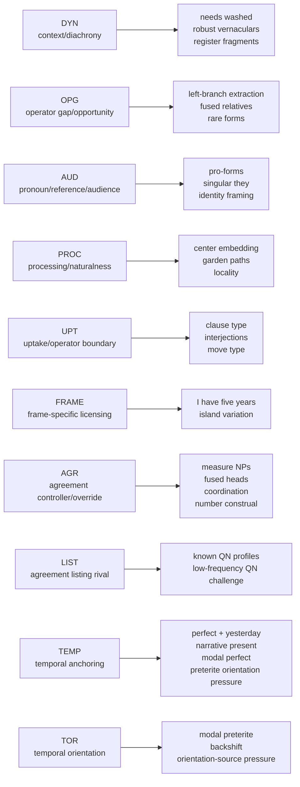
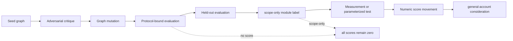
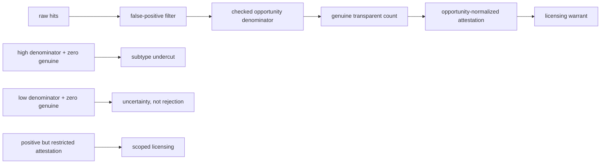
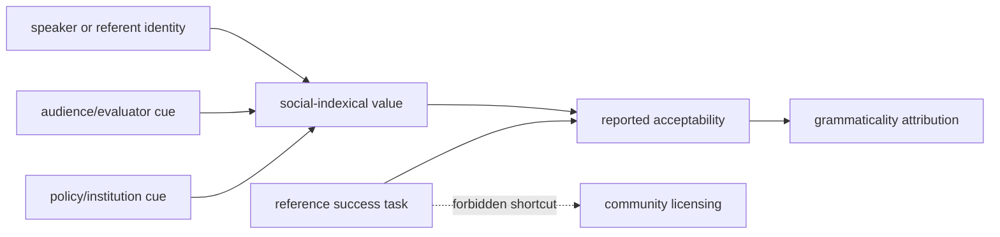
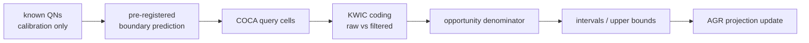

# State of the Evolutionary DAG Workbench

**Date:** 2026-06-09
**Status:** Internal state-of-search report
**Boundary:** This is not a theory paper, release note, or score authorization.

## Short Verdict

The workbench is now useful enough to visualize and write up internally. It has not discovered a
general theory of grammaticality. It has discovered a set of scoped modules, repeated pressure
points, plus one completed source-denominator lane that makes the next round less dependent on
expert judgment.

All numeric scores remain zero. Seven graphs currently have `scoped_module` labels backed by
protocol-bound or held-out `scope-only` evaluations. `TEMP` has now joined the candidate set as a
built-on temporal-anchor module without a scoped label. `TOR` is its unscored temporal-orientation
successor. The AGR lane now also has a deliberately collapsed construction-listing rival. The
strongest current result is division of labor plus sharper rival pressure, not a winner.

The next useful work is not more graph invention by default. It is to put the existing modules under
additional data pressure, especially through a pronoun/pro-form audience-reference task run, a
human judgment run for independent relative `whose`, the `AGR` COCA projection lane, or a fresh
held-out temporal test for `TOR`.

## Current Search Shape

This map should be read as a live partition of work, not as a taxonomy. The modules are useful
because each now has a reasonably sharp boundary:

| Module | Current scope | Stronger cases | Boundary |
|---|---|---|---|
| `DYN` | Context-indexed licensing, ideology, production, correction, and judgment over time | `needs-washed`, robust vernaculars, register fragments, frequent condemned forms | Not an operator-gap, processing, pronoun-reference, or agreement-controller account |
| `OPG` | Opportunity-normalized attestation, recoverability, preemption, operator gaps, and repair pressure | left-branch extraction, rare forms, fused relative constructions, fused-head NPs | Not a category-measurement, selection, agreement-controller, or diachronic account |
| `AUD` | Pronoun/pro-form reference tracking, personhood ascription, audience design, and social-indexical judgment channels | pronoun/pro-form personhood cases, singular `they` partly | Not a diachronic stabilization or general licensing account |
| `PROC` | Processing cost, recoverability, felt naturalness, task effects, and attribution perturbation | center embedding, garden paths, dependency locality, legalese partly | Not a licensing, agreement-feature, or production-feedback account |
| `UPT` | Update-role configuration, repertoire closedness, token innovability, stance, genre fit, and repair | clause type, interjection boundaries, duration-frame answer partly | Not a general social-indexical or operator-gap account |
| `FRAME` | Question-answer frame fit and construction-specific dependency licensing | `I have five years`, island construction variation | Not an opportunity/preemption or general temporal-anchor account |
| `AGR` | Controller identification, feature alignment, licensed override, notional basis, and retrieval-attractor salience | measure-NP agreement, fused determiner-head agreement, coordination and number-construal pressure | Not a category-analysis, pronoun/audience, diachronic, or general grammaticality account |
| `LIST` | Stored local agreement preferences in lexical or constructional frames | known QN/collective profiles after their distributions are observed | Not a controller/notional account; live rival whose pressure is low-frequency or novel QN generalization |
| `TEMP` | Temporal-anchor fit across tense/aspect, modal inference, current relevance, continuative intervals, experiential frames, and narrative perspective | perfect plus definite past time, continuative perfect, already plus yesterday, narrative present, modal perfect by now; modal and backshifted preterite partly | Held-out preterite-orientation tests are partial; mutation needs a temporal-orientation frame |
| `TOR` | Temporal orientation across deictic, narrative, report-supplied, modal-remote, and reference-time frames | modal-preterite and backshift pressure that partly broke `TEMP` | Built from those pressure cards; needs a fresh held-out temporal test before any scoped label |

## Evaluation Ladder

The ladder matters because the workbench has repeatedly become more credible when it refuses to
promote too early. A module can be real enough to retain as a scoped search object without earning a
numeric score. Numeric movement should wait for prediction paths and held-out data that are not just
the cards used to build the graph.

## What Has Stabilized

- The ontology is doing real work. It keeps `reported_acceptability`, `felt_naturalness_context`,
  `grammaticality_attribution`, `community_licensing`, `standard_language_ideology`, and
  `usage_frequency` apart.
- Edge profiles are now useful as prediction commitments, but only on activated paths. They should
  not be treated as a parameterized model yet.
- The discovery rule is doing useful anti-alignment work. A graph is not rewarded for reproducing
  OVMG, the operator-stratum paper, CGEL, or any other prior account.
- Held-out cards are now more informative than new seed cards, provided they carry source evidence,
  contrast cells, activated paths, and pass/fail conditions.
- The repeated pressure points are no longer vague: temporal anchoring now has a built-on `TEMP`
  candidate and a `TOR` orientation successor, while catenative complement subtypes,
  agreement-controller overrides,
  repair-neighbour distance, meaning priors, and audience/reference channels remain separate
  pressures.
- Number construal and realization have now been consolidated under `AGR` without adding a new
  construct: notional basis, controller identification, override pattern, feature alignment, and
  attractor salience remain sufficient for the current agreement bundle.
- `AGR` now has the first explicit COCA projection protocol. The decision is to improve on the
  Linguistic Transparency COCA pilot with discovery/confirmation separation, opportunity
  denominators, reproducible KWIC coding, uncertainty estimates, and search-error audit.
- `AGR` has beaten the simple surface-head-number baseline in checked cells, but that baseline is no
  longer the decision boundary. The live rival is construction-specific listing, now represented by
  `LIST`. The first direct-string low-frequency-QN discriminator was all-zero in COCA, so it is an
  inconclusive query-design result rather than evidence for either graph.
- `TEMP` has now received two held-out temporal/preterite-orientation tests. Both partly survive
  and jointly point to a temporal-orientation frame rather than a modal-remoteness-only repair.
  That repair is now represented in `TOR`, but `TOR` needs fresh held-out pressure before a scoped
  label.
- Comparative illusions now reinforce complementarity rather than mutation: category-analysis
  leakage belongs with `CAT`, repair distance with `RNR`/`INR`, and intended-meaning plausibility
  with `MPR`.

## Empirical Lanes

### Transparent-relative opportunity

The transparent-relative lane is the first completed source-denominator test of `OPG`, because it
distinguishes raw rarity from probative absence.

The design is specified in
`notes/transparent-relative-opportunity-measurement-design-2026-06-09.md`. Lane A is now recorded in
`notes/transparent-relative-opportunity-data-pass-2026-06-09.md`: attributional `call`-type contexts
show sampled positive scoped attestation, while `seem`/`appear` AP-transparent contexts show checked
zero genuine cases over a meaningful opportunity denominator. This moves the `OPG` held-out
prediction from `mixed` to `passed` for this lane only. Lane B is recorded in
`notes/independent-relative-whose-opportunity-lane-2026-06-09.md` as measurement readiness rather
than human evidence.

### Pronoun/pro-form audience and reference

The pronoun/pro-form lane is the best immediate test of `AUD`, because it separates reference
success, personhood ascription, audience design, policy/institutional framing, and reported
acceptability.

The point is not to ask whether a pronoun form is "really grammatical" in the abstract. The task
design in `notes/pronoun-audience-policy-task-design-2026-06-09.md` varies audience, policy frame,
speaker/referent identity, and reference success so the graph has to predict which channel changes.
If reference succeeds but acceptability shifts with audience or institutional frame, that supports
the audience/reference split. If reference failure drives the same judgments regardless of audience,
`AUD` is too social-indexical for the case.

### Agreement COCA projection

The agreement lane is the best first chance to move from structured survival toward actual
projection. The design in `notes/agreement-coca-projection-protocol-2026-06-09.md` uses known
number-transparent QN cases only for query calibration, then registers boundary targets such as
`bunch`, `majority`, `minority`, and possibly the `couple` sense split before inspecting the
confirmatory cells.

This lane borrows KWIC-filtering discipline from the Linguistic Transparency COCA pilot and
opportunity-funnel discipline from the English LBC paper. A pass would mean that notional basis,
controller identification, and override pattern predict filtered agreement realization better than
surface-head number and, next, construction-specific listing.

## What Not To Write Yet

This is not ready to be written as a general discovery result. In particular, do not yet claim:

- that one graph is the best account;
- that numeric scores measure evidential support;
- that relation profiles already derive predictions mechanically;
- that `scoped_module` labels are equivalent to empirical confirmation;
- that all CGEL cards have been systematically sampled;
- that the cards already form a balanced phenomenon corpus.

The defensible write-up is narrower: the workbench now has a controlled ontology, enforceable lint
rules, scoped modules, and two empirical lanes where it can start earning projective pressure.

## Next Moves

1. Run the pronoun/pro-form audience-reference task if data collection is available.
2. Run the independent-relative-`whose` human judgment task if data collection is available.
3. Redesign the AGR low-frequency-QN discriminator against the construction-listing rival; the first
   direct-string COCA tranche was too sparse.
4. Add evaluation-level prediction paths only where a card actually activates an edge path.
5. Keep numeric scores at zero until a held-out, source-backed evaluation proposes score movement
   through profiled paths.
6. Use visual summaries only at the module and evaluation-ladder level until graph-level prediction
   paths become load-bearing.
